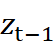

1 引言

2 文生图

3 后端

4 前端

5 数据库

[TOC]


# 基于AI的文生图的英语教育系统的设计与实现

# 摘要

目标：设计并实现一个基于图像生成技术的英语教育系统，利用文生图辅助学习者理解单词和句子。

方法：采用稳定扩散模型对学生输入的英语文本进行条件约束，生成与输入内容对应的高质量图像。

结果：开发了一个可用的Web系统，实现了从英语文本到相应图像的转换。通过直观的图像，有效地帮助用户理解词法和语法。

结论：

1.  成功应用AI技术辅助语言学习，实现图像生成。
2.  生成的图像清晰、细节丰富，提供多样化的教学内容。
3.  模块化架构设计可扩展且保证系统可靠性。
4.  安全机制保护数据和用户隐私。

意义：该系统可应用于学校的英语教学，提高教师教学效率和学生认知能力。利用图像辅助英语学习符合语言习得的本质，有助于提高应用能力。

关键词:文生图;稳定扩散模型;AI;图像生成;英语教育

## 翻译英文

# 1 引言

1 引 言 .................................................................................................................. 1
1.1 课题背景及意义 ........................................................................................ 1
1.2 研究现状 .................................................................................................... 2
1.3 困难及挑战 ................................................................................................ 3
1.4 本文研究内容及创新点 ............................................................................ 5
1.5 本文组织结构 ............................................................................................ 5

1.1 课题背景及意义
1.2 研究现状
1.3 困难及挑战
1.4 本文研究内容及创新点 
1.5 本文组织结构 

## 1.1 课题背景及意义

本章对基于AI的文生图的英语教育系统的设计与实现的背景进行简要分析，从而引出基于AI的文生图的英语教育系统的设计与实现的课题背景及其研究意义，结论是该课题是具有重要社会价值和科学价值的研究课题。

### 1.1.1 课题背景

英语是一门国际通用的语言，学习英语对于提高个人和国家的竞争力有着重要的意义。然而，传统的英语教育方式往往缺乏趣味性和效率，导致学习者难以掌握英语单词和句子的含义和用法。为了解决这一问题，基于AI的文生图的英语教育系统应运而生，它利用深度学习中的稳定扩散算法通过文字产生图片，让学习者能够直观地理解英语内容，并检验自己的学习效果。图画是一种直观生动的教学辅助工具，能够将抽象复杂的英语知识转化为形象简单的表达，从而加强学生对英语知识的理解和记忆，激发他们对英语学习的兴趣和积极性，提升学生的思维能力和英语理解能力[1]。该系统可广泛应用于学校的英语课堂，提高教师的教学效率和质量，激发学生对学习的兴趣和动力。

### 1.1.2 课题意义

在语言学习领域，有一种观点认为语言不能“学会”，只能“用会”。这里的“学会”是指有意识的学习，而“用会”则是指通过实践和使用来习得语言。这种观点强调了语言学习的实践性和程序性，认为语言学习不应该仅仅停留在理论学习和死记硬背的阶段，而应该通过大量的实践和使用来提高语言能力。

这种观点对于英语教育领域具有重要的启示意义。传统的英语教学方式往往过于强调语法和词汇的学习，而忽视了语言的实践性。学生在课堂上可能学到了大量的语法规则和词汇，但在实际的语言环境中却往往感到无所适从。这是因为他们没有足够的机会去“用”英语，去在实际的语境中理解和表达英语。

因此，本研究旨在设计和实现一个基于AI的英语教育系统，该系统使用深度学习中的稳定扩散算法通过文字产生图片，从而帮助用户更好地理解和记忆英语单词和句子。这种新型的教育工具有望在学校的英语课堂中得到广泛应用，提高学生的语言学习能力。通过这种方式，学生可以在理解和使用英语的过程中，自然而然地习得英语，而不是仅仅通过死记硬背来学习英语。这种教育方式更符合语言学习的本质，有助于提高学生的英语实际应用能力。

你是否支持英语退出主科地位，理由是什么？ - 叶峻峣的回答 - 知乎 https://www.zhihu.com/question/601478399/answer/3034224792

## 1.2 研究现状

### 1.2.1 教育领域

在当前的教育科技领域，人工智能的应用已经开始渗透到各个方面，包括个性化学习、智能辅导和自适应评估等。这些应用主要依赖于大数据和机器学习技术，通过分析学生的学习行为和成绩，为每个学生提供定制化的学习路径和教学策略。

然而，尽管AI在教育领域的应用已经取得了一些成果，但在利用AI技术进行图像生成以辅助语言学习的研究方面，还处于相对初级的阶段。目前，大多数的研究和应用系统还无法生成高质量的图片，或者不能准确地反映出输入文本的含义。

一些具有创新性的教育科技公司已经开始尝试将AI技术应用到语言学习中，墨墨背单词就是一个很好的例子。墨墨背单词可以根据用户的学习情况和记忆曲线，智能地调整复习计划，帮助用户更高效地记忆单词。然而，尽管墨墨背单词在个性化学习记忆方面算法做得很好，但它还没有利用AI技术生成图像来辅助语言学习。

因此，利用AI技术进行图像生成以辅助语言学习，无疑是一个具有巨大潜力的研究方向。如果能够成功地开发出这样的系统，不仅可以提高学生的语言学习效率，还可以为学生提供更丰富、更直观的学习体验。

### 1.2.2 文生图领域

王威等人 [6]采用了基于生成对抗网络（GAN[7]）的方法。他们在文中介绍了GAN的原理、发展历程、主要挑战和应用领域，并重点分析了GAN在文本图像合成任务中的研究进展和存在的问题。

段亚茹等[8]介绍了一种基于条件生成对抗网络（conditional GAN）的文本生成图像算法，利用注意力机制和多阶段生成网络来提高图像的质量和多样性。

Han Zhang[9]等提出了一种无需分类器的对比学习方法，用于扩散模型的文生图任务。该方法可以用一个模型来处理不同类型和长度的文本描述，并且生成效果更好更精确。提出了一种基于交叉注意力（cross-attention）的文本图像对齐（text-image alignment）机制，用于在每个扩散步骤中根据文本条件来引导图像生成。该机制可以有效地捕捉文本和图像之间的语义关系，并且避免了使用额外的分类器或者预训练模型。在多个公开数据集上进行了实验，包括COCO、CUB、WikiArt等，并且与其他先进的文生图模型进行了对比。实验结果表明，该方法可以生成高质量、高分辨率、高多样性和高语义保真度的图像，并且在各种评价指标上都取得了优异的性能。该论文是对文生图领域的一个重要贡献，它展示了无需分类器或者预训练模型就可以实现高效和准确的跨模态对齐和生成。该论文也为未来进一步探索对比学习和扩散模型在其他任务上的潜力提供了启示。

Gwanghyun Kimd等[10]的这篇论文提出了一种基于扩散模型和对比语言-图像预训练（CLIP）的文生图方法，可以实现鲁棒的零样本图像操作。该方法通过将扩散模型的潜变量与CLIP的特征空间对齐，可以从任意文本提示中生成或编辑图像。该方法主要有以下几个贡献：

(1)  提出了一种新颖的扩散模型和CLIP的结合方式：该方法使用一个编码器将扩散模型的潜变量映射到CLIP的特征空间，并使用一个解码器将其还原为图像。这样，扩散模型可以利用CLIP的跨模态语义对齐能力，从而实现更精确和自然的文生图效果。

(2)  提出了一种新颖的基于梯度下降的图像操作算法：该方法使用一个优化器来调整扩散模型的潜变量，使其与给定的文本提示更加相似。这样，可以在不改变原始图像结构和内容的情况下，实现细粒度和多样性的图像操作。

(3)  在多个数据集上展示了优异的性能：该方法在CelebA-HQ、FFHQ、LSUN等数据集上进行了实验，并与其他GAN反演和CLIP结合方法进行了对比。结果表明，该方法可以生成更高质量和更符合语义要求的图像，并且具有更强大和更稳定的泛化能力。

总之，该方法通过创新地结合两种强大且互补的技术，开拓了文生图领域新的可能性。

ERNIE-ViLG[11] 是一种统一的跨模态双向生成模型，可以实现图文互转的任务。它是由百度文心团队提出的，参数规模达到 100 亿，是目前为止全球最大规模中文跨模态生成模型。它基于条件生成对抗网络（conditional GAN）进行图文互转，而 ERNIE-ViLG 2.0[12] 基于扩散模型进行文图生成。

ERNIE-ViLG 2.0 引入了多源知识指引扩散模型学习，包括视觉、语言等知识，以提升对语义的精确理解。它在 MS-COCO 数据集上达到了零样本 FID 分数为 6.75 的最佳效果，并且在人类评估上显著优于其他模型。

## 1.3 困难及挑战

在构建基于AI的文生图英语教育系统的过程中，我面临着三个方面的挑战：技术、设计和数据管理。

### 1.3.1 技术

首先，技术方面主要涉及到文生图模型的算法的实现和优化。稳定扩散算法是一种复杂的深度学习算法，它需要大量的计算资源和精细的参数调整才能生成高质量的图片。如何有效地实现这种算法，并根据实际情况调整算法参数以提高图像生成的准确性和稳定性，是我们需要解决的重要技术问题。

### 1.3.2 网页的设计

其次，网页的设计也是关键之一。一个好的用户界面应该既简洁易用，又能满足用户的各种需求。我们需要设计一个对于用户友好的界面，使用户能够方便地输入文本并查看生成的图片。同时，我们还需要考虑如何设计系统的反馈机制，以帮助用户更好地理解和记忆英语单词和句子。

### 1.3.3 数据管理

最后，数据管理方面主要关于用户的输入历史记录的存储和查询。为了帮助用户回顾和复习，我们需要设计一个高效的数据管理系统，能够安全可靠地存储用户的输入历史记录，并提供方便的查询功能。这不仅需要我们掌握数据库管理的相关技术，还需要我们考虑如何保护用户的隐私和数据安全。


## 1.4 本文研究内容及创新点

本研究的主要内容包括：实现稳定扩散算法，生成与输入文本相对应的图片；选择服务器框架，设计实现用户友好、稳定的网站；存储和查询用户的输入历史记录。本研究的创新点在于，使用稳定扩散算法进行文生图，来构建一个英语教育系统。通过读取用户的输入，生成高质量的图片，准确地反映出输入文本的含义。

## 1.5 本文组织结构

第一章详细叙述了基于AI的文生图的英语教育系统的研究背景及其重要性，全面介绍了相关研究的现状，凸显了本文所涉及的难点和挑战，并强调了本研究的创新性。

第二章主要介绍了与稳定扩散模型相关的概念和技术知识。首先概述了生成模型，包括其特征、应用场景和优缺点。接下来重点阐述了稳定扩散模型的基本原理。首先介绍了扩散模型的基本思想，即通过逐渐去噪随机噪声来学习数据分布。然后详细介绍了前向扩散和反向扩散的过程。随后，介绍了潜在扩散模型在稳定扩散模型中的应用，包括使用变分自编码器将图像编码到潜在空间，以及使用U-Net结构作为噪声预测器来生成高质量的图像。还说明了条件引导如何通过文本编码和交叉注意力机制影响噪声预测器的输出，实现文本引导的图像生成。最后，概述了LoRA模型微调交叉注意力层来调整生成图像的样式，并分析了通过低秩分解减小模型大小的优势。

第三章阐述了系统后端所使用的技术框架。本系统后端采用了模块化的多层架构，实现了关注点分离和松散耦合，使用Spring Boot作为开发框架，通过自动配置、依赖注入和注解机制简化了配置、开发和代码维护，利用WebSocket技术实现匹配功能的解耦和低延迟，采用MyBatis Plus作为ORM框架简化了数据访问层代码，提供了丰富的分页、查询和SQL支持功能。

第四章说明了在项目的前端中应用的技术。Vue框架特别是Vue Router和Vuex的用途和好处，并且概括性地介绍了使用Bootstrap框架中的Web组件的优势。

第五章讨论了保障数据库安全的多个方面。采用基于JSON Web令牌的身份验证和授权机制，实现了轻量级无状态身份验证。通过加密存储密码、路由鉴权和数据过滤等手段，保护了密码信息，限制了未授权访问和数据泄露，确保了数据库安全和用户隐私。

# 2 文生图模型

本项目中使用的深度学习模型是稳定扩散模型，它是一种生成式模型，从潜在扩散模型改进而来。它在各种模型的基础上改进，演化成了一个能从文字产生高分辨率图像的生成模型，具有多种微调和任务转换的能力，对计算资源的需求较少。

## 生成式模型

[Generative model \- Wikipedia](https://en.wikipedia.org/wiki/Generative_model)

生成式模型是一种统计模型，它试图描述观察数据是如何生成的。在生成式模型中，我们试图学习数据的联合概率分布，并基于这个分布生成新的样本。这种模型可以用来生成随机实例，因此被称为“生成式”。

生成式模型的一个关键特性是，它们不仅可以用于分类，还可以用于生成新的数据样本。这使得生成式模型在许多领域都有广泛的应用，包括但不限于：

1.  图像生成：生成式模型可以用于生成新的图像。例如，变分自编码器（VAEs）和生成对抗网络（GANs）就是用于图像生成的生成式模型。
2.  自然语言处理：在自然语言处理中，生成式模型可以用于生成文本。例如，GPT-3和GPT-2就是用于生成文本的生成式模型。
3.  音频生成：生成式模型也可以用于生成音频。例如，Jukebox就是一个用于生成音乐的生成式模型。
4.  数据增强：在机器学习中，生成式模型可以用于数据增强，即生成新的训练样本，以增加训练数据的多样性。

生成式模型的一个主要优点是，它们可以生成与现有数据相似的新数据。然而，它们也有一些缺点，例如，生成的数据可能不完全符合实际数据的分布，或者模型的训练可能需要大量的计算资源。

## 文生图模型的发展现状

近来，DALL-E-2、Mid-Journey、Stability.ai等平台以其令人惊叹的图像生成能力和文本提示而在 AI 产品中脱颖而出。而所有这些平台都有一个共同点，它们都采用了一种称为扩散（Diffusion）的生成式深度学习模型。然而，在扩散模型成为全球现象之前，还有一类被广泛讨论的生成模型称为生成对抗网络（GAN）。GAN在 AI 社区非常流行，并因其图像生成功能而引起媒体的关注。


## 不同种类模型对比

下面我们通过对比两种不同的文生图模型来展示模型间的区别和它们的优缺点。

[實作理解Diffusion Model: 來自DDPM的簡化概念 \| by Jia\-Yau Shiau \| AI Blog TW \| Jun, 2022 \| Medium \| AI Blog TW](https://medium.com/ai-blog-tw/%E9%82%8A%E5%AF%A6%E4%BD%9C%E9%82%8A%E5%AD%B8%E7%BF%92diffusion-model-%E5%BE%9Eddpm%E7%9A%84%E7%B0%A1%E5%8C%96%E6%A6%82%E5%BF%B5%E7%90%86%E8%A7%A3-4c565a1c09c)

[Comparison between Diffusion Models vs GANs \(Generative Adversarial Networks\) \- MLK \- Machine Learning Knowledge](https://machinelearningknowledge.ai/comparison-between-diffusion-models-vs-gans-generative-adversarial-networks/)

### 扩散模型

扩散模型是一种生成模型，它使用概率过程将数据从简单分布转换为更复杂的目标分布。它通过迭代地改进初始随机分布来逐步去噪数据，并最终生成真实的数据样本。这个在每个步骤中去噪数据的过程被称为“扩散”。

扩散模型在数学上最有趣的地方在于巧妙地利用了马尔可夫链和可计算的分布，同时展现了生成建模中通常需要权衡的两个特征：可计算性和灵活性。简单来说，就是算法的复杂度和模型的表达能力之间的平衡，在概率生成模型中，这两个特征经常是相互对立的。

扩散模型的优点如下：

1.   它们可以生成具有详细特征的高质量清晰数据样本。
2.   它们使用最大似然估计进行训练，这是一个很好理解的优化问题。
3.   它们可用于生成图像和音频。

扩散模型的缺点如下：

1.   训练扩散模型是一个缓慢且计算量大的过程。
2.   它们需要大量数据才能进行有效培训。
3.   整个采样过程需要经过较长的马尔可夫链，这导致了较长的计算时间。尽管后续出现了一些加速方法，但总体而言，扩散模型仍然比一般的生成对抗网络（GAN）慢。

### 生成对抗网络模型


GAN（生成对抗网络）是一种巧妙的机器学习算法，它以特定的方式使用神经网络。

在数据集上进行训练后，它们就能够生成类似于样本的新例子。将生成式算法训练在由数百万张人脸照片组成的数据集上，它将能够生成新的逼真人脸。

许多机器学习算法需要监督，就像在教室里教学生一样。我们必须告诉它们数据代表什么，并告诉它们答案是否正确。GAN不需要监督，它可以自我学习。GAN由生成器和判别器两个神经网络组成。生成器尝试创建合成数据，而判别器通过将其与真实世界数据进行比较来区分这些合成数据。在训练过程中，生成器改进其生成逼真的假数据的能力，判别器提高其识别合成的假数据的成功率。

生成器每次成功欺骗判别器时都会获得奖励。判别器每次没有被欺骗时都会获得奖励。通过反复迭代，两个网络都会得到改进，以最大化这些奖励。由此产生的内部竞赛使得第一个网络变得非常擅长生成与训练集无法区分的输出。

GAN的优点包括：

1.   GAN可以合成高质量的数据，包括图像和音频。
2.   GAN的训练速度相对较快，并且可以使用各种损失函数，如Wasserstein损失和铰链损失函数。

GAN的缺点包括：

1.   训练GAN是一项困难的任务，因为生成器和判别器可能会陷入局部最小值。
2.   GAN对超参数的选择敏感，例如学习率和批量大小。
3.   它们还会遭受所谓的模式坍塌问题，即生成器只产生一小部分数据，其多样性不如真实世界数据。

### 两者对比

对两者进行了简要概述后，让我们逐点比较扩散模型与GAN：

1.  训练方法：GAN由两个神经网络组成，生成器合成逼真的假数据，而判别器试图识别真实数据和假数据。经过多次迭代，生成器开始生成高质量逼真的假数据以欺骗判别器。另一方面，扩散模型以随机噪声数据开始，经过多次迭代，不断去噪数据以生成高质量的合成数据。
2.  训练失败：GAN在训练过程中存在无法收敛的情况，因为生成器或判别器网络可能会陷入局部最小值。而扩散模型通常使用最大似然估计进行训练，通常能够较好地收敛。
3.  参数调优：GAN具有各种超参数，用于控制学习率、训练轮数、生成器和判别器损失之间的平衡等。调整GAN的超参数可能是一个具有挑战性和耗时的过程。而扩散模型具有较少的超参数，并且在训练过程中相对容易调优。
4.  生成数据的质量：虽然扩散模型和GAN都可以生成高质量样本，但扩散模型在生成清晰和详细特征方面更出色。然而，GAN可能会遭受模式坍塌问题，即生成器网络无法生成多样性逼真的数据。
5.  应用领域：GAN和扩散模型在图像、音频和视频生成、数据增强、图像修复等领域都有广泛的应用。

### 结论

基于AI的文生图的英语教育系统可以广泛应用于学校的英语课堂，提高教师的教学效率和质量，同时激发学生的学习兴趣和动力。通过利用扩散模型生成清晰和详细特征的图像，该系统能够增强学生对英语知识的理解和记忆，提高学生的思维能力和英语理解能力。相比之下，使用GAN可能会面临模式坍塌的问题，无法生成多样性逼真的数据，这不利于提供丰富多样的教学内容。

因此，基于AI的文生图的英语教育系统选择使用扩散模型而不是GAN，以提供高质量、直观且形象化的英语学习体验，同时激发学生的学习动力和兴趣。


## 扩散模型

机器学习中的扩散模型，也称为扩散概率模型，是一类利用变分估计训练的马尔可夫链模型。其目标在于对数据集的潜在结构进行建模，通过对数据点在潜在空间中的扩散过程进行学习。在计算机视觉领域，扩散模型被用于训练神经网络以去噪受高斯噪声影响的图像。通用的扩散模型框架在计算机视觉中有多个应用，包括去噪扩散概率模型、噪声条件得分网络和随机微分方程。该模型于2015年提出，受到非平衡态热力学的启发。

扩散模型可用于多种任务，如图像去噪、图像修复、超分辨率成像和图像生成等。例如，通过对自然图像的扩散过程进行反向训练，可以从随机噪声图像逐步生成新的自然图像。一个近期的例子是OpenAI在2022年4月13日发布的文生图模型DALL-E 2，它使用扩散模型作为模型的先验解释器和生成最终图像的解码器。

### 数学原理

[[2011.13456\] Score-Based Generative Modeling through Stochastic Differential Equations (arxiv.org)](https://arxiv.org/abs/2011.13456)

让 `𝑥` 代表一张图，令 `𝑝(𝑥)` 为在所有可能图像上的概率分布。我们实际上对 `𝑝(𝑥)` 本身不感兴趣，而对 `∇𝑥ln𝑝(𝑥)` 感兴趣。这有两个效果：

-   我们不再需要标准化 `𝑝(𝑥)`，而是可以用任何 `𝑝~(𝑥)=𝐶𝑝(𝑥)`，其中 `𝐶=∫𝑝~(𝑥)𝑑𝑥 > 0` 是任意常数，我们不需要去关心它。
-   我们正在比较 `𝑝(𝑥)` 的邻居 `𝑝(𝑥+𝑑𝑥)`，通过 `𝑝(𝑥)𝑝(𝑥+𝑑𝑥)=𝑒−⟨∇𝑥ln𝑝,𝑑𝑥⟩` 令分数函数为 `𝑠(𝑥):=∇𝑥ln𝑝(𝑥)`，然后考虑我们能对 `𝑠(𝑥)` 做什么。

实际上， `𝑠(𝑥)` 允许我们用随机梯度朗之万动力学从 `𝑝(𝑥)` 中取样，这本质上是马尔可夫链蒙特卡洛的无限小版本。

## 稳定扩散模型的原理

[使用 🧨 扩散器进行稳定扩散](https://huggingface.co/blog/stable_diffusion)

### 潜在扩散模型

引自选题报告“1.1.1 潜在扩散模型”

潜在扩散模型[2]（LDMs）是一种有效的生成模型，可用于高分辨率图像的合成。它们通过逐渐去噪一个正态分布变量来学习数据分布p(x)，这对应于学习长度为T的固定马尔可夫链的反向过程。本文介绍了LDMs的基本原理、优点和应用。

LDMs是一种基于扩散模型（Diffusion Models[3]）的生成模型，其核心思想是通过逐渐去噪一个正态分布变量来学习数据分布p(x)。具体而言，LDMs通过将初始噪声传递到一系列扩散步骤中，每个步骤都会将噪声转换为，并且每个步骤都会引入一些随机性。最终，我们可以得到一个样本，其中g表示一个神经网络。

相比于其他生成模型，LDMs具有以下优点：对高分辨率图像进行处理，实现多种任务（如无条件图像合成、修复、超分辨率等），并显著降低计算和推理成本。

除了图像合成之外，LDMs还可以应用于其他领域：利用LDMs从噪声信号中重建出清晰的语音，实现语音增强、语音转换、语音风格迁移；通过逐渐转换源语言，实现机器翻译、文本摘要、文本风格迁移等任务；从潜在空间中利用LDMs生成复杂的三维形状，达到形状插值、多模态生成、单视图重建等目的。

[CompVis/stable\-diffusion: A latent text\-to\-image diffusion model](https://github.com/CompVis/stable-diffusion)中提到的论文

#### 优点

1.  潜空间扩散模型(latent diffusion models)通过在较低维的潜在空间而不是高维的像素空间中进行操作，提供了一种更加高效地训练去噪扩散概率模型(diffusion probabilistic models) 的方法。
2.  这使得能以显著降低的计算成本训练扩散模型，同时达到与直接在像素空间训练的模型相当甚至更好的图像合成质量。
3.  这使得训练扩散模型的计算成本大大降低，同时相比于与直接在像素空间训练的模型，该方法生成了相当甚至更好的图像。
4.  引入了基于交叉注意力(cross-attention)的条件机制，使潜在扩散模型可以应用于各种图像合成任务，如文本到图像的生成。
5.  所提出的潜在扩散模型在无条件和有条件图像合成任务中实现了最先进或具有竞争力的结果，同时需要的计算资源大大减少。


### 稳定扩散模型的训练方式

Stable Diffusion 是一个从文本生成图像的潜在扩散模型。它使用了LAION-5B数据库的512x512像素图像的一个子集进行训练。通过稳定性人工智能（Stability AI）的计算资源捐赠和LAION的支持完成了训练过程。模型采用了扩散模型的训练方法，并结合冻结的CLIP ViT-L/14文本编码器对模型进行条件约束。训练过程中，采用了扩散和去噪自编码器的迭代过程来生成与文本提示相匹配的图像。

模型的架构包括一个860M参数的 U-Net 模型用于图像生成，以及一个123M参数的文本编码器用于处理文本提示。模型设计轻量化，可在至少具备10GB VRAM的GPU上高效运行。通过冻结的CLIP ViT-L/14文本编码器，为图像生成过程提供了必要的条件约束。

训练过程中，模型通过迭代地扩散和去噪潜空间表示来生成高质量的图像。扩散过程逐步改进生成的图像，减少噪声并增强细节。通过文本编码器的条件约束，模型确保生成的图像与给定的文本提示相一致。

训练过程使用LAION-5B数据库的子集，在Stability AI提供的计算资源和LAION的支持下进行。利用扩散模型和冻结的文本编码器进行训练，可以在减少模型复杂性和保留图像细节之间取得平衡。Stable Diffusion模型在文本到图像合成、图像修复、无条件图像生成和超分辨率等任务中取得了最先进的性能。

[CompVis/stable\-diffusion: A latent text\-to\-image diffusion model](https://github.com/CompVis/stable-diffusion)

[\[2112\.10752\] High\-Resolution Image Synthesis with Latent Diffusion Models](https://arxiv.org/abs/2112.10752)

[【Stable Diffusion】 论文解读1 Abstract_哔哩哔哩_bilibili](https://www.bilibili.com/video/BV1CG411V7jt/?spm_id_from=333.788&vd_source=187217104dfd0bc027cc65f8420627b0)

##### U-Net

[没有你就无法拼出扩散 \| 通过 Sairam Sundaresan \| 迈向数据科学](https://towardsdatascience.com/you-cant-spell-diffusion-without-u-60635f569579)

[U\-Net: Convolutional Networks for Biomedical Image Segmentation](https://arxiv.org/abs/1505.04597v1)

U-Net 是一种卷积神经网络，初衷是为了解决生物医学图像方面的问题，后来也被广泛的应用在语义分割的各个方向，比如卫星图像分割，工业瑕疵检测等。

在上文“稳定扩散模型的训练方式”中提到了U-Net。

U-Net 是这个图像生成模型的核心构建块之一。下面是一个简化的解释。在稳定扩散中，U-Net将编码后的文本（将纯文本处理成可理解的格式）和嘈杂的数值数组作为输入。经过多次迭代，它从接收到的嘈杂数组中产生一个包含可成像信息的数组。然后，U-Net的输出由另一个被称为解码器的网络使用，以创建我们所看到的输出图片。

###### U-Net 架构

U-Net架构中的收缩路径用于捕获上下文信息和扩张路径用于实现精确定位，它采用了从收缩路径复制和拼接特征图的策略。

U-Net架构包括以下组成部分：

收缩路径（左侧）：遵循典型的卷积网络架构，通过重复的卷积、ReLU和最大池化进行降采样。特征通道的数量在每个降采样步骤中翻倍。

扩张路径（右侧）：使用上采样后与收缩路径的特征进行拼接。扩张路径具有更多的特征通道，从而能够传播上下文信息。

卷积操作没有填充，因此输出比输入小。这样可以对大尺寸输入图像进行平铺处理。

在某些部分，特征图从收缩路径复制并与扩张路径中的上采样特征图进行拼接。在图中，这些部分显示为与箭头相连的白色方框。这种复制和拼接使网络能够基于低层和高层特征精确定位对象。

在最后一层，1x1的卷积将64维特征向量映射到所需的类别数量。


U-Net的输入是一张图像，输出则是另一张图像。更具体地说，给定下方左边的图像，U-Net会生成右边的图像。


这个任务被称为语义分割。给定一张图像，将每个像素分配到所属的类别。

###### 理解U-Net

这个神经网络的结构呈U字形。而这种对称性是有原因的：U字形的前半部分将输入图像缩小，并在每个阶段从中提取有意义的信息（称为特征）。它通过使用卷积神经网络的基本构建块来实现这一点——卷积层、池化层和激活层。U字形的后半部分则反转了这个过程，将中间结果（称为特征图）扩展到越来越大的尺寸，直到最终输出与输入图像的尺寸相同。为了实现这一点，除了池化层和激活层外，它还使用了一种称为转置卷积的层。

现在，可以用“卷积网络 + 卷积网络的镜像 = U-Net”表示U-Net的过程，但架构中的灰色箭头并没有体现在这个等式中。灰色箭头将 U-Net 网络的前半部分与后半部分连接起来，它们有助于数据的生成过程。

它们帮助模型的后半部分猜测缺失的像素可能是什么。在U-Net的前半部分，模型拥有完整的图像信息。每一层都会缩小图像，并在将其传递到下一层之前有效地删除之前可用的原始信息。

网络的后半部分面临的困难任务是将小图像（特征图）扩展回与网络接收到的原始图像相同的大小。但是，在不知道要填充到扩展区域的内容的情况下，如果有上下文信息，这样做会更容易。这个上下文信息来自于灰色箭头的传递。

### 扩散过程

[How does Stable Diffusion work? \- Stable Diffusion Art](https://stable-diffusion-art.com/how-stable-diffusion-work/)

[扩散模型是如何工作的：从零开始的数学原理 \| HK\-SHAO](https://shao.fun/blog/w/how-diffusion-models-work.html#stable-diffusion-%E6%BD%9C%E5%9C%A8%E6%89%A9%E6%95%A3%E6%A8%A1%E5%9E%8B)

Stable Diffusion属于一类称为扩散模型（diffusion model）的深度学习模型。它们是生成模型，这意味着它们的目的是生成类似于它们训练数据的新数据。对于Stable Diffusion来说，数据就是图像。


扩散模型在数学方面看起来很像物理学中的扩散现象。假设训练了一个只有两种图像的扩散模型：猫和狗。在下图中，左边的两个山峰代表猫和狗这两组图像。以下是两组图像的深度学习模型图

>   当一张与数学和深度学习相关的图中出现"SDE"和"Probability Flow ODE"时，它们通常指的是随机微分方程（Stochastic Differential Equation）和概率流动常微分方程（Probability Flow Ordinary Differential Equation）。
>
>   随机微分方程（SDE）描述了包含随机性的连续动态系统，其中随机项用以模拟系统中的不确定性和随机变动。SDE在深度学习和概率建模中具有重要的应用，尤其在生成模型和强化学习中。
>
>   概率流动常微分方程（Probability Flow ODE）是一种描述概率分布动态演化的常微分方程。它通过在ODE的右侧引入概率流动项来模拟随时间变化的概率分布。Probability Flow ODE常用于生成模型中，用于建模数据的生成过程和概率分布的演化。
>
>   这种图通常被称为数学模型图或深度学习模型图。它们用于可视化数学模型或深度学习模型的结构、方程和流程，有助于理解模型的内部机制和数学原理。这样的图通常包含节点、边和符号，用于表示数学方程、变量、操作和数据流动等信息

[\[2011\.13456\] Score\-Based Generative Modeling through Stochastic Differential Equations](https://arxiv.org/abs/2011.13456)


#### 前向扩散(Forward diffusion)

前向扩散将一张照片变成噪声。前向扩散过程向训练图像添加噪声，逐渐将其变成一个无特征的噪声图像。前向过程会将任何猫或狗的图像变成噪声图像。最终的噪声图片中，根本无法分辨它们最初是狗还是猫。就像一滴墨水滴进一杯水里。墨滴在水中扩散。几分钟后，它会随机分布在整个水中。你再也分不清它最初是落在中心还是边缘附近。

下面是一个进行前向扩散的图像示例。猫的图像变成随机的噪音图像。


#### 反向扩散（Reverse diffusion）

如果我们有能力将扩散逆转，我们将看到墨滴最初添加的位置。


从嘈杂、无意义的图像开始，反向扩散恢复了猫或狗的图像。这是主要思想。从技术上讲，每个扩散过程都有两部分：（1）漂移或定向运动和（2）随机运动。反向扩散向猫或狗的图像漂移，但两者之间没有任何变化。这就是为什么结果可以是猫或狗。

#### 训练过程

为了反向扩散，需要知道图像中添加了多少噪声。答案是教神经网络**模型来预测增加的噪声**。它被称为Stable Diffusion中的**噪声预测因子（noise predictor）**，是一个U-Net模型（后面将详细说明）。训练过程如下。

1.  选择一个训练图像，例如猫的照片。
2.  生成随机噪声图像。
3.  通过将此噪声图像添加到一定数量的步骤来损坏训练图像。
4.  训练噪声预测器告诉我们添加了多少噪声。这是通过调整其权重并向其显示正确答案来完成的。


训练后，能得到一个噪声预测器，能够估计添加到图像中的噪声。

### 扩散模型的训练

#### 逆转扩散

扩散模型的训练使用了噪声预测器：首先**生成一个完全随机的图像，并要求噪声预测器告诉我们噪声**。然后，我们从原始图像中减去这个估计的噪声。重复此过程几次。你会得到一只猫或狗的图像。


目前，图像生成是**无条件的**。也就是说，目前的模型还不能控制生成的图片的内容是猫还是狗。

### 稳定扩散模型的原理

上述扩散过程是在图像空间中进行的。它在计算上非常缓慢，用户将无法在任何单个 GPU 上运行，更不用说笔记本电脑上的 GPU 。

图像空间所含有的数据量是巨大的。例如，具有三个颜色通道（红、绿、蓝）的 512×512 图像是一个 786,432 维空间。Google 的[Imagen](https://imagen.research.google/)和 Open AI 的[DALL-E](https://openai.com/dall-e-2/)等扩散模型都在像素空间中。他们使用了一些技巧来使模型运行地更加迅速，但仍然不够快速。

#### 潜在扩散模型

Stable Diffusion 的诞生解决了速度问题。它是一种潜在扩散模型。对比以往模型直接在高维图像空间中操作，SD首先将图像压缩到潜在空间中，使得潜在空间小了 48 倍，因此它获得了处理更少数据的好处，这也导致它生成图像要快得多。

#### 变分自动编码器

Stable Diffusion 是使用一种称为变分自动编码器（ VAE ）的技术完成的。这正是在使用Stable Diffusion时设置的后缀为 vae 文件的内容，稍后会详细说明。

变分自动编码器 (VAE) 神经网络有两部分：(1) 编码器和 (2) 解码器。编码器将图像压缩为潜在空间中的低维表示。解码器从潜在空间中恢复图像。


Stable Diffusion 模型的潜在空间为 4x64x64，比图像像素空间小 48 倍。上文所有正向和反向扩散实际上都是在潜在空间中完成的。

因此在训练期间，它不会生成噪声图像，而是在潜在空间（潜在噪声）中生成随机张量。它不是用噪声破坏图像，而是用潜在噪声破坏图像在潜在空间中的表示。这样做的原因是它更快，因为潜在空间的数据量更小。

.vae 后缀的文件在 Stable Diffusion v1 中用于改善眼睛和面部。它们就是变分自动编码器的解码器。通过进一步微调解码器，模型可以绘制更精细的细节。例如：

你可能意识到我之前提到的并不完全正确。将图像压缩到潜在空间中*确实会*丢失信息，因为原始 VAE 无法恢复细节。相反，VAE 解码器负责绘制精细的细节。

#### 图像分辨率

图像分辨率反映在潜像张量的大小上。仅对于 512×512 图像，潜像的大小为 4x64x64。对于 768×512 的肖像图像，它是 4x96x64。这就是为什么需要更长和更多的 VRAM 才能生成更大的图像。

由于 Stable Diffusion v1 在 512×512 图像上进行了微调，因此生成大于 512×512 的图像可能会导致重复的对象，例如，在本来想画一个人的图里可能出现重复的头。


#### 压缩到潜在空间的合理性

在不丢失信息的情况下，变分自动编码器可以将图像压缩到更小的潜在空间中。自然图像不是随机的。它们具有很高的规律性：一张脸遵循眼睛、鼻子、脸颊和嘴巴之间的特定空间关系。一个人有两条腿，遵循了一定的规律。自然图像可以很容易地压缩到更小的潜在空间中而不会丢失任何信息。这在机器学习中被称为[流形假设](https://en.wikipedia.org/wiki/Manifold_hypothesis)。

#### 稳定扩散模型中的反向扩散原理

以下是 Stable Diffusion 中潜在反向扩散的工作原理，如果用伪代码可以表述为

```python
# 生成随机潜在空间矩阵
latent_matrix = generate_random_latent_matrix()

# 设置采样步骤数
num_steps = 10

# 循环进行噪声预测和减去噪声的步骤
for step in range(num_steps):
    # 噪声预测器估计潜在矩阵的噪声
    noise = noise_predictor(latent_matrix)
    
    # 从潜在矩阵中减去估计的噪声
    latent_matrix -= noise

# 使用VAE的解码器将潜在矩阵转换为最终图像
final_image = decoder(latent_matrix)

```

```flow
st=>start: Start
e=>end: End

gen_latent_matrix=>operation: Generate random latent_matrix
set_num_steps=>operation: Set num_steps to 10

for_loop=>operation: For step in range(num_steps)
condition=>condition: Is step < num_steps?
estimate_noise=>operation: Estimate noise
subtract_noise=>operation: Subtract noise
decode_image=>operation: Decode latent_matrix to image

st->gen_latent_matrix->set_num_steps->for_loop->condition
condition(yes)->estimate_noise->subtract_noise->for_loop
condition(no)->decode_image->e
```


### 条件引导

没有文本的提示，稳定扩散模型就无法实现文本到图像的转换。你将只会得到一张猫或狗的图像，没有任何控制的方式。这就是条件引导的目的：通过控制噪声预测器，以便图像中减去预测的噪声后，给出我们想要的结果。

#### 文本到图像

这就是条件引导发挥作用的地方。条件引导的目的是通过约束噪声预测器，以便在从图像中减去预测的噪声后得到我们所期望的结果。它通过引入文本提示来对图像生成的过程进行条件控制，使我们能够控制生成的图像。


"Photo of a dog"的令牌和嵌入如下：

```python
# modify prompt to check tokens 
prompt = "Photo of a dog"

tokens = clip.tokenize(prompt)
with torch.no_grad():
    embeddings = model.encode_text(tokens.cuda()).float()
print("text tokens:")
print(tokens)
print("text tokens size:", tokens.shape)
print("Embeddings size:", embeddings.shape )
```

输出结果如下

```
text tokens:
tensor([[49406,  1125,   539,   320,  1929, 49407,     0,     0,     0,     0,
             0,     0,     0,     0,     0,     0,     0,     0,     0,     0,
             0,     0,     0,     0,     0,     0,     0,     0,     0,     0,
             0,     0,     0,     0,     0,     0,     0,     0,     0,     0,
             0,     0,     0,     0,     0,     0,     0,     0,     0,     0,
             0,     0,     0,     0,     0,     0,     0,     0,     0,     0,
             0,     0,     0,     0,     0,     0,     0,     0,     0,     0,
             0,     0,     0,     0,     0,     0,     0]], dtype=torch.int32)
text tokens size: torch.Size([1, 77])
Embeddings size: torch.Size([1, 768])
```

##### 分词器


文本提示首先由[CLIP 分词器](https://huggingface.co/docs/transformers/model_doc/clip)**进行分词**。CLIP 是 Open AI 开发的深度学习模型，用于生成任何图像的文本描述。在项目中使用的 Stable Diffusion v1.5 使用 CLIP 的分词器。

**标记化**是计算机理解单词的方式。我们人类可以阅读文字，但计算机只能阅读数字。这就是文本提示中的单词首先转换为数字的原因。

分词器只能分词它在训练中看到的单词。例如，CLIP 模型中训练过“cat”和“girl”，但没有训练过“catgirl”。Tokenizer 会将单词“catgirl”分解为两个标记“cat”和“girl”。所以，一个词对于计算机来说，并不总是意味着一个令牌。

另一个细则是空格字符也是令牌的一部分。在上面的例子中，短语“cat girl”产生了两个标记“cat”和“[space]girl”。这些令牌与“catgirl”产生的令牌不同，“catgirl”是“cat”和“girl”（海滩前没有空格）。

稳定扩散模型仅限于在提示中使用 75 个标记，和 75 个单词不一样，但是可以采用某种巧妙的方式(SDwebui)，在某种程度上绕过了这个限制。

##### 嵌入

Stable diffusion v1 使用了 Open AI 的 ViT-L/14 Clip 模型。嵌入是一个 768 维的向量，每个标记都有自己独特的嵌入向量。嵌入由 CLIP 模型固定，这在训练过程中被学习得到。

为什么我们需要嵌入？因为一些单词彼此之间密切相关，我们希望利用这些信息。例如，"man"、"gentleman" 和 "guy" 的嵌入几乎相同，因为它们可以互换使用。莫奈、马奈和德加都以印象派的风格绘画，但方式各不相同。这些名字具有相近但不完全相同的嵌入。

这与我们讨论过的使用关键词触发样式的嵌入是相同的。嵌入可以产生奇妙的效果。科学家们已经证明，找到合适的嵌入可以触发任意对象和样式，这是一种称为文本反演的微调技术。

##### 将嵌入向量提供给噪声预测器

在将嵌入向量提供给噪声预测器之前，嵌入向量需要经过文本转换器进一步处理。转换器就像是一个通用的适配器，用于进行条件引导。在这种情况下，它的输入是文本嵌入向量，但也可以是其他内容，比如类别标签、图像和深度图等。转换器不仅进一步处理数据，还提供了一种包含不同条件引导方式的机制。

##### 交叉注意力

文本转换器的输出在整个 U-Net 中被噪声预测器多次使用。U-Net 通过交叉注意力机制来消耗它。这就是提示与图像相遇的地方。

以““A girl with brown hair”为例，稳定扩散将“brown”和“hair”这两个词配对在一起（在提示中进行自注意力），以生成一个有棕色头发的女孩，而不是一个穿着棕色衬衣的女孩。然后，它利用这个信息来引导反向扩散朝着包含棕色头发的图像发展。

超网络是一种用于微调稳定扩散模型的技术，它利用交叉注意力网络来插入样式。LoRA 模型通过修改交叉注意力模块的权重来改变样式。仅仅修改这个模块就可以微调稳定扩散模型，这说明这个模块有多么重要。

##### 文本到图像

在文本到图像的过程中，提供一个文本输入给稳定扩散模型，它会返回一张图像。

第一步，稳定扩散在潜在空间中生成一个随机张量。可以通过设置随机数生成器的种子来控制这个张量。如果将种子设置为特定的值，将始终得到相同的随机张量。下图这就是在潜在空间中的图像。但目前它只是一片噪声。


第二步，噪声预测器 U-Net 接受潜在的噪声图像和文本提示作为输入，并预测潜在空间中的噪声（一个 4x64x64 的张量）。


第三步，从潜在图像中减去潜在的噪声。这将成为您的新潜在图像。


第二步和第三步会重复进行一定数量的采样步骤，例如重复 20 次。

第四步，最后，VAE 的解码器将潜在图像转换回像素空间。这就是在运行稳定扩散后获得的图像。


下面四张图展示了一张图片在四个个采样步骤中的演变方式。


##### 噪声进度表

图像从嘈杂逐渐变得清晰的过程中，模型试图在每个采样步骤中得到预期的噪声，这被称为噪声进度表。以下是一个示例。


我们可以选择在每个步骤中减去相同数量的噪声，或在开始阶段减去更多噪声。采样器在每个步骤中减去恰好足够的噪声，以达到下一步中预期的噪声水平。这就是图像逐步演化的过程。


### 放大算法

## CLIP

[Stable diffusion喂饭级基础知识教程 第三期:什么是Clip跳过层\_哔哩哔哩\_bilibili](https://www.bilibili.com/video/BV12s4y1K7EU/?vd_source=28e49de18bfed672b91b86f966b4aead)

## 变分自动编码器

### 简介

变分自动编码器（Variational Autoencoder，VAE）是一种生成模型，它使用概率编码器和解码器网络来学习输入数据的潜在表示。VAE的主要目标是学习输入数据的潜在表示，然后使用这些表示来生成新的、与输入数据类似的数据。

**历史**

变分自动编码器的概念最早在2013年由Diederik P Kingma和Max Welling提出。他们的论文《Auto-Encoding Variational Bayes》是第一篇详细介绍VAE的论文，该论文在机器学习领域产生了深远影响。

**作用**

VAE的主要作用是学习输入数据的潜在表示，并使用这些表示来生成新的、与输入数据类似的数据。VAE的编码器网络将输入数据编码为潜在表示，而解码器网络则将这些潜在表示解码为新的数据。VAE的特点是它的编码器和解码器网络都是概率性的，这意味着它们的输出是随机的，而不是确定的。

**应用场景**

VAE在许多应用中都有广泛的使用，包括：

1.  **图像生成**：VAE可以用于生成新的图像，这在计算机视觉和艺术领域有广泛的应用。
2.  **异常检测**：VAE可以用于检测数据中的异常，因为异常数据的潜在表示通常与正常数据的潜在表示有显著的差异。
3.  **推荐系统**：VAE可以用于推荐系统，通过学习用户的行为模式，VAE可以生成与用户兴趣相符的推荐。
4.  **自然语言处理**：VAE也可以用于自然语言处理，例如生成新的文本或对文本进行情感分析。
5.  **药物发现**：在生物医学领域，VAE可以用于药物发现，通过学习已知药物的化学结构，VAE可以生成可能具有药物活性的新化合物。

### 和稳定扩散模型配合使用

VAE是变分自编码器（Variational Autoencoder）的缩写。它是神经网络模型的一部分，用于将图像编码和解码到较小的潜在空间，以实现更快的计算。一般不需要安装VAE文件来运行稳定扩散模型，无论您使用的是v1、v2还是自定义模型，都已经具有默认的VAE。

当用户说在稳定扩散模型使用VAE时，他们指的是使用改进版的VAE。这发生在模型训练者使用额外的数据对模型的VAE部分进行了进一步的微调。他们不会发布一个完全新的模型，而是只发布已经更新的小的变分自编码器。

通常来说，使用不同的VAE效果很微小。改进的VAE可以更好地从潜在空间解码图像。细节恢复得更好，有助于渲染眼睛和文字等需要保留所有细节的部分。

Stability AI发布了两个经过精细调整的VAE解码器变种，分别是EMA和MSE（指数移动平均和均方误差是衡量自编码器性能的指标）。

下面是它们的比较结果：


根据Stability对256×256像素图像的评估，EMA生成的图像更加清晰，而MSE生成的图像则更加平滑。（这与我的个人测试结果相吻合。）

根据对512×512像素图像使用Stable Diffusion v1.4和v1.5进行的测试，在一些图像中眼睛的呈现有很好的改进，尤其是当面部较小的时候。

## 对模型的微调

### VAE

[stabilityai/sd\-vae\-ft\-ema · Hugging Face](https://huggingface.co/stabilityai/sd-vae-ft-ema#visual)

### LoRA

LoRA模型，也称为低秩自适应模型，是一种用于对稳定扩散模型进行微调的训练技术。

LoRA 能通过优化适应过程中密集层的秩分解矩阵来间接训练神经网络中的某些密集层，同时保持预训练的权重冻结，如图所示。该论文的作者原本使用该模型来微调像 GPT 这样的大语言模型，以GPT-3 175B为例，作者展示了当完整秩（即图中的 d）高达 12288 时，非常低的秩就足够了，使LoRA在存储和计算效率上都具备优势。如下图所示：


#### LoRA模型在文生图领域的应用

LoRA解决了个人电脑中使用文生图领域面临的一个问题：由于 Stable Diffusion 模型占用的空间过大，导致本地存储空间迅速填满，难以在个人电脑上使用多种模型。

与Dreambooth和文本反转等其他训练技术不同，LoRA在文件大小和训练能力之间取得了平衡的折衷。Dreambooth生成的模型文件较大，介于 2 到 7 GB之间，而文本反转的文件相对较小，约为100 KB，而LoRA模型则在文件大小上介于两者之间，大小范围在 2 到 200 MB之间，同时保证了一定的训练效果。

#### 原理

LoRA模型不能单独使用，它们需要与模型检查点文件（checkpoint）一起使用。

LoRA模型文件之所以能够更小，尽管需要存储相同数量的权重，是因为LoRA采用了一个技巧，即将一个矩阵分解为两个低秩矩阵。通过这种方式，LoRA模型只需存储较少的数据。

在公式中，$W$表示原始模型的权重，$W'$表示微调后的模型的权重。$\Delta W$是模型的残差微调参数。LoRA尝试仅微调模型的“残差”，而不是整个模型的权重：即微调$\Delta W$而不是 $W$。
$$
W' = W + \Delta W
$$
其中，进一步将  $\Delta W$ 分解为低秩矩阵：$\Delta W = A B^T $，其中 $A, \in \mathbb{R}^{n \times d}, B \in \mathbb{R}^{m \times d}, d << n$。这是LoRA的关键思想。然后，通过微调 A 和 B 而不是 W 实现调整模型的目的。最终，由于 A 和 B 远小于 W，将得到一个非常小的模型。


 LoRA 通过对交叉注意力层进行微小的修改来调整样式，这些层是稳定扩散模型中图像和提示相交的关键部分。研究人员发现，对模型的这一特定部分进行微调足以实现良好的训练结果。在稳定扩散模型的架构中，交叉注意力层由图片中黄色组件表示。


图片来自[High\-Resolution Image Synthesis with Latent Diffusion Models](https://arxiv.org/abs/2112.10752)

交叉注意力层的权重被排列成矩阵形式，LoRA模型通过将其权重添加到这些矩阵中来进行微调。

假设模型具有 1000 行和 2000 列的矩阵。这意味着模型文件中需要存储 2000000 个数字（1000 x 2000）。LoRA将该矩阵分解为一个 1000 行 2 列的矩阵和一个 2 行 2000 列的矩阵。这样只需要存储 6000个数字（1000 x 2 + 2 x 2000），相比之下减少了333倍，所以 LoRA 模型的大小相比大模型要小得多。


# 3 后端

## 架构

项目架构符合单一职责、开闭原则和依赖倒置原则这三大设计原则，提高了系统的可扩展性、灵活性和可维护性。此外，由于各层之间的明确边界和高度的独立性，每个层都可以进行独立的单元测试，从而提高了测试覆盖率。

以下是后端的类图：


### 模块化设计

该项目采用按层分离的架构，将功能按层分解，每个层仅负责特定的职责，例如Controller层、Service层和Mapper层。这种模块化设计使得系统具有清晰的结构和明确的责任分配，符合单一职责原则(SRP)：将功能按层分离,每个层仅涉及一项职责

Controller层：处理请求、响应，处理HTTP请求，符合隔离接口(separation of interface)原则，Service层:管理业务规则、业务流程,符合隔离方式(separation of implementation)原则

如 AddController.java

```java
@RestController
public class AddController {
    @Autowired
    private AddService addService;

    @PostMapping("/user/bot/add/")
    public Map<String, String> add(@RequestParam Map<String, String> data) {
        return addService.add(data);
    }  
}
```

对应的

```java
@Service
public class AddServiceImpl implements AddService {

    @Override
    public Map<String, String> add(Map<String, String> data) {
       // 业务逻辑
       ... 
       botMapper.insert(bot);
       ...
    }
}
```


Mapper层：管理数据存储、提取等数据库操作,符合隔离存储(separation of storage)原则


### 松散耦合

通过依赖倒置原则(DIP)和接口抽象，高层模块与低层模块之间的依赖关系减少，实现了松散耦合。例如，高层模块仅依赖于抽象的接口或类，而不依赖于具体的实现细节。这种松散耦合的设计提高了系统的灵活性，使得各个模块可以独立进行开发和修改。


### 独立测试

由于各个层之间的明确边界和模块化的设计，每个层都可以进行独立的单元测试。这种独立测试的能力有助于提高测试覆盖率，确保每个模块的功能和逻辑正确性，同时减少了对其他模块的依赖性，提高了测试效率。


### 可维护性和可扩展性

该项目的架构设计遵循开闭原则(OCP)，通过模块化和松散耦合的设计，使得系统具有良好的可维护性和可扩展性。例如，新增一个数据库表只需要在Mapper层进行扩展，而不需要修改其他层的代码。这种设计能够降低修改的风险，并且方便系统的扩展和维护。


架构优势：

1.  模块化设计：该架构通过将系统划分为不同的层，实现了关注点分离。每个层都专注于特定的功能或职责，使得系统的各个部分能够独立开发、测试和维护。这种模块化设计提供了更高的可重用性和可扩展性。
2.  松散耦合：不同层之间通过定义清晰的接口和协议进行通信，而不直接依赖于具体的实现细节。这种松散耦合的架构风格降低了各个层之间的依赖性，使得系统更易于维护和演化。同时，松散耦合也提高了代码的可测试性和可维护性。
3.  独立测试：由于每个层都具有清晰的职责和接口，因此可以轻松地对每个层进行独立的单元测试和集成测试。这种独立测试的能力使得开发人员能够更加自信地验证每个层的正确性和性能，并提供更高的代码质量和系统稳定性。
4.  可维护性和可扩展性：通过将系统划分为不同的层，架构提供了更好的代码组织和结构，使得代码的修改和扩展更加容易。每个层都可以独立地进行修改和扩展，而不会对其他层产生意外的影响。这种可维护性和可扩展性使得系统能够适应不断变化的需求和业务规则。

这种架构的优势可以被视为一种优秀的软件设计原则的应用，包括模块化设计、低耦合性、单一职责原则和开闭原则。这些优势提供了一个可靠、可测试和可扩展的软件架构，有助于提高开发效率、减少维护成本，并增强系统的稳定性和可靠性。

## Spring Boot框架

我选择了Spring Boot作为系统开发框架。Spring Boot是一个基于Spring框架的轻量级、快速开发、易部署的微服务架构。它具有以下几个优点：

(1)  它可以提高系统开发效率和运行性能。Spring Boot提供了许多自动配置和依赖管理功能，使得开发者无需编写冗余代码或配置文件，只需关注业务逻辑即可。同时，它也支持嵌入式服务器（如Tomcat、Jetty等），使得系统无需额外部署环境就能运行。

(2)  它可以方便地集成各种依赖。例如Maven和Gradle等构建工具，可以轻松管理项目的依赖库。同时，Spring Boot还提供了丰富的扩展库和插件，方便集成常用的功能模块，如数据库访问、消息队列、安全认证等。

(3) 它具有良好的可维护性和扩展性。Spring Boot采用了模块化的设计理念，将系统按照功能拆分为多个模块，使得代码结构清晰、易于理解和维护。同时，它支持面向接口的编程，通过依赖注入和AOP等机制实现松耦合，方便进行功能扩展和代码重用。

(4) 它有一个活跃的社区和广泛的文档支持。Spring Boot是由Spring社区维护和支持的开源项目，拥有庞大的开发者社区和丰富的文档资源。开发者可以通过官方文档、在线教程、论坛等途径获取帮助和解决问题。

(5)  将用户之间的匹配逻辑分解为多个独立的服务，提高可扩展性和可维护性。

### 注解机制

在项目中，我大量使用了Spring Boot的注解机制来实现相关功能。

Spring Boot的注解机制为开发者提供了许多便利，包括：

1.  简化配置：通过使用注解，开发者可以通过配置类或方法来实现特定功能，而无需手动编写大量的XML配置文件。这简化了配置的过程，并减少了冗余的代码。
2.  易于理解和维护：注解可以直接标识在类、方法或字段上，提供了更直观的方式来描述代码的用途和作用。这使得代码更易于理解和维护，减少了阅读和理解复杂配置的困难。
3.  自动化处理：Spring Boot的注解机制与自动配置紧密结合，可以自动根据注解配置应用程序的相关设置。例如，通过使用`@EnableAutoConfiguration`注解，Spring Boot可以根据项目的依赖自动配置所需的组件和功能。
4.  依赖注入：Spring Boot的注解机制支持依赖注入，可以方便地将依赖对象注入到需要使用它们的地方。通过使用`@Autowired`注解，开发者可以在需要的地方注入所需的依赖，简化了对象之间的关系管理。
5.  增强灵活性：通过使用注解，开发者可以根据需求来定制和扩展功能。Spring Boot提供了许多注解，如`@RequestMapping`、`@RestController`等，可以灵活地定义和配置请求映射、RESTful API等。

Spring Boot的注解机制简化了配置和开发过程，提高了代码的可读性和可维护性，同时也增强了灵活性和扩展性。通过合理使用注解，我能更加高效地开发网站。

## WebSocket协议

项目采用WebSocket技术来实现在线匹配功能，其中WebSocketServer类负责处理传入的WebSocket连接。使用WebSocket具有以下优势：

1.  实现实时通信：WebSocket允许服务器主动向客户端推送信息，实现实时的双向通信。这使得我们能够实现实时对战功能，例如在开始匹配时服务器主动推送游戏开始的消息，对战过程中推送玩家移动的消息，以及最后的结束消息包括结果。在接收到WebSocket消息时，我们可以根据不同的事件进行处理，实现相应的功能。

如下代码在接收到WebSocket消息时,处理不同的事件:


```java
socket.onmessage = msg => {
  const data = JSON.parse(msg.data);  
  if (data.event === "start-matching") { // 匹配成功      
    // ...      
  } else if(data.event === "generating") {
    // ...
  } 
}
```

2.   解耦客户端与服务器：WebSocket服务器只负责推送消息，不需要关心具体的客户端是哪一个。在WebSocketServer类中，我们通过用户ID将其映射到相应的WebSocketServer实例，从而实现了客户端与服务器的解耦。

3.   高效利用资源：WebSocket连接仅在需要推送消息时建立，当没有消息需要推送时，连接处于空闲状态，从而高效地利用了资源。

4.   低延迟：WebSocket的性能优于传统的轮询技术，实现了更低的延迟。这对于实时对战功能至关重要。

综上所述，WebSocket实现的匹配机制具有以下优点：实现了实时通信、解耦了客户端与服务器端代码、高效利用资源以及低延迟。充分利用这些WebSocket的优势，我们成功实现了对战功能。此技术也被广泛应用于其他主流在线对战系统中。

## MyBatis-Plus

在本项目中,我们采用了MyBatis-Plus框架作为数据持久层的解决方案。如代码所示:

```java    
// BotMapper.java 
@Mapper
public interface BotMapper extends BaseMapper<Bot> {

}

// 在 AddServiceImpl.java 中    
@Autowired
private BotMapper botMapper;
    
botMapper.insert(bot);
```

MyBatis-Plus是基于MyBatis的一个扩展框架，它继承了MyBatis的所有特性，并提供了许多额外的优势。具体优点如下：

1.  简化CRUD操作：通过内置的通用Mapper接口，无需手动编写SQL语句即可实现基本的增删改查功能。
2.  强化查询功能：提供丰富的QueryWrapper类，方便构建查询条件，使查询操作更加灵活和便捷。
3.  分页功能：提供简单易用的分页插件，支持物理分页和内存分页，满足各种分页需求。
4.  性能优化：支持SQL注入器、批量插入等功能，减少与数据库的交互次数，提升系统性能。
5.  自定义SQL支持：除了提供通用的CRUD操作，还允许开发人员编写自定义的SQL语句，满足特定的业务需求。
6.  插件扩展：提供插件机制，支持开发人员自定义插件扩展框架，灵活扩展框架的功能。

综上所述，MyBatis-Plus在提供MyBatis原生特性的基础上，进一步丰富了功能，提高了开发效率和降低了开发难度，因此我们选择采用该框架。


# 4 前端

项目中，为了实现前端Web界面的快速开发，我选用了Vue框架作为项目前端的框架，并使用BootStrap框架中的Web组建搭建用户所使用的网页。

以下是前端UML图：


## Vue框架

### 框架简介

Vue框架是一种用于构建用户界面的现代化JavaScript框架。它的主要作用是帮助开发者构建响应式、可组合和高效的Web应用程序。

Vue框架的核心思想是通过将应用程序划分为组件化的方式来构建用户界面。每个组件都包含自己的模板、逻辑和样式，可以独立地进行开发、测试和维护。这种组件化的思想使得开发者可以更好地组织和管理复杂的应用程序，并且可以实现组件的重用。

Vue框架采用了响应式的数据绑定机制，当数据发生变化时，相关的视图会自动更新。这使得开发者可以轻松地实现数据和视图之间的同步，提高了开发效率。同时，Vue框架还提供了一套简洁而灵活的指令和组件系统，使开发者能够快速构建交互式的用户界面。

除此之外，Vue框架还注重易学易用的特点，它提供了清晰简洁的API文档和丰富的官方资源，使得开发者可以快速上手并进行开发。同时，Vue框架还具有高性能和轻量级的特点，可以在浏览器中快速加载和运行，提供流畅的用户体验。

总之，Vue框架通过组件化、响应式和易用性等特点，使得开发者能够更加高效地构建出优雅、可维护和灵活的Web应用程序。

### Vue Router

项目中使用 Vue Router 来实现路由导航,主要有以下优势:

1. 实现单页面应用 (SPA)

通过 Vue Router，我们可以实现只有一个完整的页面，并在此页面内展示不同的视图组件，这就形成了单页应用。

2. 可配置的路由

在 router/index.js 中使用vue router，以根据 URL 映射到不同的组件。


```js
const routes = [
  {
    path: "/",
    name: "home",
    redirect: "/pk/" 
  },  
  {
    path: "/pk/",      
    name: "pk_index",
    component: PkIndexView  
  },
]
```

3. 路由参数

在 URL 中加上参数,映射到路由。

```js
{
  path: "/bot/:id",   
  component: BotView   
}
```

4. 嵌套路由

定义嵌套的子路由。


```js 
routes: [
  {
    path: "/user",
    component: UserLayout,
    children: [
      {
        path: "bot",
        component: UserBot 
      }  
    ]
  }
]
```

5. 路由钩子  

在 router/index.js 中定义全局路由钩子,监听路由跳转。

如其中实现的鉴权跳转:

```js
router.beforeEach((to, from, next) => {
  // ... 
  next();
})
```

6. 命名路由

我们可以给路由加上名字,在组件中使用 `router-link` 导航。

```html
<router-link :to="{ name: 'bot', params: {id: 1}}">Detail</router-link>
```

综上所述，使用 Vue Router实现的单页面路由导航，充分利用了前端路由的优势,提高了项目的可维护性和用户体验。本项目使用 Vue Router ，实现了一致性的路由导航方式，极大简化了编码量。

### Vuex

项目中使用Vuex来管理状态,主要有以下优势:

1.  统一的状态管理

整个应用的状态集中存储在Vuex中,各组件通过访问 Vuex 来获取和修改状态,而不是通过其他共享方式。这样可以统一的管理和调试状态。

2.   易于跟踪状态变化

Vuex 会监听每个 mutation,并把它们序列化为一个由开发者可观察的时间数组。开发者可以借助这样的功能在调试时实现类似"时间倒转"的功能。

3.   单向数据流

Vuex 通过 mutation 来改变状态,这样可以方便调试。这是Vuex 所倡导的单向数据流的最佳实践。

4.   整个应用的state都保存在一个地方

项目中需要共享数据时,将其保存在 Vuex 中,而不是每个组件内部。这样能更好地控制数据流向。

5.   解决组件间通信问题

父组件通过改变 Vuex 状态间接改变子组件,而不需要经过 props 和 event。

在store/user.js中：


```js
state: {
  id: "",
  username: "",
  photo: "",
  token: ""
}

// LoginView.vue
store.dispatch("login") // 触发 action 登录

// NavBar.vue
{{ $store.state.user.username }} // 从 vuex 读取状态
```

尽管登录操作在 LoginView 中,但是 login 成功后username 会保存在 Vuex 中,导航栏NavBar 就可以读取到最新的状态。

总的来说,通过 Vuex 统一管理状态,可以减少 props 和事件的传值、简化组件间通信。

综上所述,Vuex的作用主要体现在：统一的状态管理、易于追踪状态变化、单向数据流、组件间通信。


## BootStrap框架

Bootstrap框架是一个流行的前端开发框架，旨在帮助开发者快速构建响应式、移动优先的Web界面。

Bootstrap框架的主要作用是提供一套可重用的组件、样式和工具，使开发者能够轻松地创建现代化的Web界面。它包含了丰富的CSS样式和JavaScript插件，涵盖了各种常见的Web组件，如导航栏、按钮、表单、卡片、模态框等，同时还提供了栅格系统和响应式布局，使得页面能够适应不同的屏幕大小和设备。

Bootstrap框架的核心思想是提供一致性和可定制性。它通过一套统一的设计原则和样式规范，使得开发者能够快速搭建具有一致外观和交互方式的界面。同时，Bootstrap框架也非常灵活，提供了丰富的自定义选项和样式扩展机制，开发者可以根据自己的需求进行定制和扩展。

Bootstrap框架注重响应式设计，即使在不同的设备和屏幕尺寸下，页面也能够提供一致的用户体验。它使用栅格系统来实现灵活的布局，通过对页面进行分栏和响应式断点的设置，使得页面能够自动适应不同的屏幕大小，并具有良好的可读性和导航性。

此外，Bootstrap框架还注重易用性和可访问性。它提供了清晰的文档和丰富的示例代码，使得开发者能够快速上手并使用框架。同时，Bootstrap框架也遵循Web标准和无障碍性要求，确保页面能够被各种设备和用户访问。

Bootstrap框架通过提供一致性、可定制性和响应式设计等特点，使得开发者能够快速构建具有现代化外观和良好用户体验的Web界面。它的简洁易用和丰富的组件库，使得开发者能够更高效地开发和维护Web应用程序。

# 5 数据库

## 数据库设计

| Column      | Data Type | Description                            |
| ----------- | --------- | -------------------------------------- |
| id          | INTEGER   | 主键，自增                             |
| userId      | INTEGER   | 用户ID                                 |
| title       | VARCHAR   | 标题                                   |
| description | VARCHAR   | 描述                                   |
| content     | VARCHAR   | 内容                                   |
| rating      | INTEGER   | 评分                                   |
| createtime  | DATETIME  | 创建时间，格式为 "yyyy-MM-dd HH:mm:ss" |
| modifytime  | DATETIME  | 修改时间，格式为 "yyyy-MM-dd HH:mm:ss" |
| image       | BLOB      | 图片，存储为字节数组形式               |

| 用户ID      |          |                                        |
| ----------- | -------- | -------------------------------------- |
| title       | VARCHAR  | 标题                                   |
| description | VARCHAR  | 描述                                   |
| content     | VARCHAR  | 内容                                   |
| rating      | INTEGER  | 评分                                   |
| createtime  | DATETIME | 创建时间，格式为 "yyyy-MM-dd HH:mm:ss" |
| modifytime  | DATETIME | 修改时间，格式为 "yyyy-MM-dd HH:mm:ss" |
| image       | BLOB     | 图片，存储为字节数组形式               |

| Column Name | Data Type | Description                                              |
| ----------- | --------- | -------------------------------------------------------- |
| id          | Integer   | 主键，自增                                               |
| userId      | Integer   | User ID                                                  |
| title       | String    | Title of the Bot                                         |
| description | String    | Description of the Bot                                   |
| content     | String    | Content of the Bot                                       |
| rating      | Integer   | Rating of the Bot                                        |
| createtime  | Date      | Creation time, formatted as yyyy-MM-dd HH:mm:ss          |
| modifytime  | Date      | Last modification time, formatted as yyyy-MM-dd HH:mm:ss |
| image       | byte[]    | Byte array to store image data                           |

| 代码     | 含义   |
| -------- | ------ |
| user     | 用户   |
| id       | 主键   |
| username | 用户名 |
| password | 密码   |
| photo    | 头像   |


| 代码        | 含义                 |
| ----------- | -------------------- |
| bot         | 机器人               |
| id          | 主键                 |
| user_id     | 外键，关联用户表的id |
| title       | 机器人标题           |
| description | 机器人描述           |
| content     | 机器人代码           |
| rating      | 评分                 |
| createtime  | 创建时间             |
| modifytime  | 修改时间             |

## 数据库安全


安全需求和身份验证机制在系统中至关重要。通过确保用户数据的保护和系统的安全性，这些机制可以防止未授权访问和数据泄露，确保只有合法用户能够访问系统的敏感信息和功能。安全需求和身份验证机制为用户提供了可信赖的学习环境，同时为系统运行提供了稳定和可靠的基础。

### 基于JSON Web令牌的身份验证和授权机制

在用户登录后，后端会返回一个 JWT 令牌。前端会将这个令牌存储在 localStorage 中。在需要身份验证和授权的 API 请求中,前端会在请求头中携带这个 JWT 令牌。后端会验证这个令牌的合法性,只有合法的令牌才能访问对应接口，否则只能访问404页面。

代码中可以看到，在调用需要需要身份验证和授权的 API 时,前端都会带上 Authorization 头:

```js
headers: {
  Authorization: "Bearer " + store.state.user.token,
}
```

#### JWT的优点

1.   轻量级和无状态：JWT令牌是一种轻量级的身份验证机制，由于令牌本身包含了用户的身份信息和权限，因此不需要在服务器端存储会话信息，实现了无状态的身份验证。
2.   可扩展性：JWT令牌可以通过自定义的声明来扩展，以满足特定的项目需求。这使得项目能够灵活地使用不同的声明来存储额外的用户信息或其他相关信息。
3.   安全性：JWT令牌使用签名来保证令牌的完整性和真实性，防止被篡改。通过合理的密钥管理和算法选择，可以提供高度的安全性。

#### JwtAuthenticationTokenFilter的优点

1.   验证性能：JwtAuthenticationTokenFilter利用JWT令牌对传入的请求进行验证，无需频繁查询数据库或其他存储介质，提高了验证的性能和响应速度。
2.   简化开发：通过使用JwtAuthenticationTokenFilter，开发人员可以方便地集成和使用JWT令牌机制，减少了重复的开发工作和代码编写量。
3.   定制性：JwtAuthenticationTokenFilter可以根据项目需求进行定制和扩展，例如添加额外的验证逻辑或处理特定的业务需求。

### 在路由层面进行鉴权

在项目的 router/index.js 文件中，我们定义了一个路由前置守卫，用于在进入特定路由之前进行鉴权校验：

```flow
st=>start: Start
op1=>operation: Check to.meta.requestAuth
cond1=>condition: true or false?
op2=>operation: Check !store.state.user.is_login
cond2=>condition: true or false?
op3=>operation: Execute next({ name: 'user_account_login' })
e1=>end: End
op4=>operation: Execute next()
e2=>end: End

st->op1->cond1
cond1(yes)->op2->cond2
cond1(no)->op4->e2
cond2(yes)->op4->e2
cond2(no)->op3->e1
```


```json
router.beforeEach((to, from, next) => {
  if (to.meta.requestAuth && !store.state.user.is_login) {
    next({ name: 'user_account_login' });
  } else {
    next();
  }
})
```

通过路由的 meta 字段来定义是否需要进行鉴权。如果需要鉴权但用户未登录，则会重定向到登录页面。

同时，在 App.vue 文件中，我们使用` <router-view>  `标签来渲染路由视图，这样只有经过授权的用户才能访问对应的路由和页面。

通过以上的实现方式，我们可以确保只有在用户登录后才能调用需要鉴权的 API 接口，只有在用户登录后才能访问需要鉴权的路由和页面，这样的安排旨在确保只有合法用户才能访问系统敏感信息和功能。


### 防止密码泄露

#### 后端密码加密存储

##### Spring Security

###### Spring Security的优点

1.   身份验证和授权：Spring Security提供了一套强大的身份验证和授权机制，可以帮助项目实现安全的用户认证和授权功能。
2.   集成性：Spring Security与Spring框架紧密集成，能够无缝地与其他Spring组件和功能进行集成，提供全面的安全解决方案。

###### BCrypt 算法

BCryptPasswordEncoder 是 Spring Security 提供的一个密码编码器,使用 BCrypt 算法对明文密码进行加密。

在用户注册或登录时,前端提交的密码并非明文密码,而是经过 BCrypt 算法加密后的密码。

如在 RegisterServiceImpl 类中:

```java
String encodedPassword = passwordEncoder.encode(password);
User user = new User(null, username, encodedPassword, photo);
userMapper.insert(user);
```

passwordEncoder 是一个 BCryptPasswordEncoder 实例,它会对明文密码使用 BCrypt 加密算法来编码。这样,存储在数据库中的密码就是经过加密的密码哈希值,而不是明文密码。

BCryptPasswordEncoder 相对于其他加密算法具有以下优势：

1.   不需要掌握复杂的加密算法细节，使用简便。
2.   自动选择适当的迭代次数和 salt 程度，提供高度的安全性。
3.   可同时用于新密码的加密和现有密码的升级。

#### 后端不返回存储的密码

在后端,我们从数据库查询用户时并不会返回查询出的密码。

如在 InfoServiceImpl 类中:

```js
map.put("id", user.getId().toString());
map.put("username", user.getUsername());
map.put("photo", user.getPhoto());
return map;
```

我们返回的用户信息中并不包含 password 字段。

这样,即使管理员查看接口返回的数据，也看不到密码信息，用户也能更加放心地使用我们的系统。

#### 前后端通过比较哈希鉴权

前端提交的密码经过 Bcrypt 加密后，与数据库中存储的密码哈希进行比较。

在 LoginServiceImpl 类中的实现如下：

```java
String encodedPassword = passwordEncoder.encode(password);
boolean matches = passwordEncoder.matches(submittedPassword, storedPassword);
```

只有当两者匹配时，用户才能成功登录。

通过这种方式，即使管理员能够查看前端提交的密码，也无法获得明文密码。Bcrypt 加密算法的特性保证了密码的安全性，使得密码在存储和比较过程中都是加密的状态。这种安全性机制有效地保护了用户密码的隐私和保密性。

# 结论

综上所述,本研究设计实现了基于稳定扩散模型的英语教育系统。该系统能够从文字生成高质量的图象,帮助用户更好地理解英语单词和句子。核心创新点在于:

1.  使用稳定扩散模型进行文生图,生成清晰且富有细节特征的图像,有助于提供丰富多样的教学内容。
2.  通过条件约束,可以控制生成的图象内容来切合具体的英语教育需求。
3.  模块化的架构设计具有良好的可扩展性和可维护性。
4.  安全机制的完善有效保护数据和用户隐私。

本研究还存在局限性:

1.  稳定扩散模型在生成大图面时存在误差较大问题,需要进一步优化参数。
2.  前后端缺少大量的单元测试保证代码稳定性。
3.  系统尚未实现高可用部署,需要进一步完善。

未来工作可以从以下方面提升系统:

1.   继续优化深度模型,提高生成图像的质量和效率;
2.   增加单元测试保障代码质量;
3.   设计高可用架构提升抗风险能力。

综上所述,本研究设计的基于AI的文生图的英语教育系统,能够为学生提供直观和生动的学习体验,有助于提高学生的英语理解能力和思维能力。

# 致谢

时光匆匆，四年在北京科技大学的宝贵时光已逝。这段时间的点滴成长成为我心中难以磨灭的记忆。我在学识积累和生活经验上都取得了长足的进步，这得益于老师的指导和同学的陪伴。在即将完成毕业论文之际，我要衷心感谢指导我老师、帮助我的同学以及支持我的家人。

首先，我要感谢北京科技大学的屈微老师。屈微老师是我毕业设计的校内指导老师，对论文写作和答辩技巧给予了很大帮助。

其次，我要感谢计算机与通信工程学院的王国萃老师，在论文撰写期间给予了极大的鼓励和帮助。每当我遇到困难时，他们都能及时解答并给予耐心指导，让我顺利解决各种难题，完成毕业设计。

最后，我要感谢我的母校北京科技大学计算机与通信工程学院的各位老师的培养和指导，感谢参与我毕业论文评审和答辩的老师们付出的时间和精力，感谢所有曾经帮助或关心过我的人。

毕业论文的完成也意味着大学生活的结束，我们将各奔东西。愿各自的梦想永远延续，如花一样绚烂，如华一样繁华。

