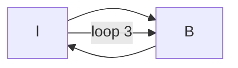

# 潜在扩散模型

潜在扩散模型由两个主要组成部分构成：

自编码器。本文使用感知损失和对抗损失的组合对自编码器进行训练。自编码器将高分辨率输入图像映射到较低维度的潜在空间，同时保持感知等效性。

扩散模型。扩散模型经过训练，以在自编码器提供的潜在空间中生成样本。它使用了一种时间条件下的U-Net神经网络架构。

为了使扩散模型在不同输入上有条件，本文引入了交叉注意机制。该机制可以将不同的模态输入（如文本）编码为表示形式，然后将其馈送到扩散模型的U-Net中。

具体来说，本文描述了以下内容：

如何在自编码器中实现感知损失和对抗损失（方程式25）

如何在自编码器提供的潜在空间中训练扩散模型（方程式2）

交叉注意机制如何对条件输入（如文本）进行编码，并将其馈送到扩散模型的U-Net结构中（方程式18-24）

时间条件下的U-Net作为扩散模型的神经网络架构

该方法成功地用于实现条件图像合成任务，如文本到图像、布局到图像等。

