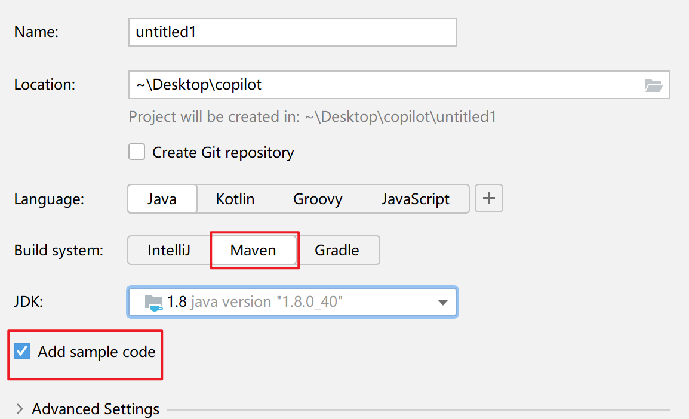

# Stable diffusion API

## 主要参考

webui官方

[API · AUTOMATIC1111/stable\-diffusion\-webui Wiki](https://github.com/AUTOMATIC1111/stable-diffusion-webui/wiki/API)

>   如何使用java 访问 stable diffusion webui 的api
>
>   
>
>   您可以使用Java的HttpURLConnection类或Apache HttpClient来访问Stable Diffusion WebUI的API。您需要使用API密钥进行身份验证，该密钥可以在Stable Diffusion WebUI中生成。以下是一个使用Java HttpURLConnection类的示例代码：
>
>   ```java
>   import java.net.HttpURLConnection;
>   import java.net.URL;
>   import java.io.BufferedReader;
>   import java.io.InputStreamReader;
>   
>   public class HttpURLConnectionExample {
>       public static void main(String[] args) {
>           try {
>               URL url = new URL("http://localhost:8080/api/v1/your-api-endpoint");
>               HttpURLConnection conn = (HttpURLConnection) url.openConnection();
>               conn.setRequestMethod("GET");
>               conn.setRequestProperty("Authorization", "Bearer your-api-key");
>   
>               BufferedReader br = new BufferedReader(new InputStreamReader(
>                       (conn.getInputStream())));
>   
>               String output;
>               System.out.println("Output from Server .... \n");
>               while ((output = br.readLine()) != null) {
>                   System.out.println(output);
>               }
>   
>               conn.disconnect();
>   
>           } catch (Exception e) {
>               e.printStackTrace();
>           }
>       }
>   }
>   ```
>
>   请注意，您需要将“your-api-endpoint”替换为您要访问的API端点，将“your-api-key”替换为您的API密钥。¹
>
>   源: 与必应的对话， 2023/4/21
>   (1) 新手向，Stable Diffusion API 接口，在本地调用 - CSDN博客. https://blog.csdn.net/qq_36645932/article/details/130183786.
>   (2) 如何远程访问家里电脑上部署的Stable diffusion? - 知乎. https://zhuanlan.zhihu.com/p/611459573.
>   (3) 庖丁解牛 Stable-diffusion-webui 插件拓展及依赖汇总 - 知乎. https://zhuanlan.zhihu.com/p/579538165.

[新手向，Stable Diffusion API 接口，在本地调用_CYO126的博客-CSDN博客](https://blog.csdn.net/qq_36645932/article/details/130183786)


根据教程，打开API界面


[FastAPI - Swagger UI (seetacloud.com)](http://region-3.seetacloud.com:xxxxx/docs#/default/text2imgapi_sdapi_v1_txt2img_post)


## 将API返回的Respond Body打印出来

[Anyone using the stable\-diffusion\-webui repo by automatic1111 as an API? : r/StableDiffusion](https://www.reddit.com/r/StableDiffusion/comments/xxfx1b/anyone_using_the_stablediffusionwebui_repo_by/)

>   ***\* Update \****
>
>   For anyone else who finds this, this has been natively added to AUTOMATIC repo.
>
>   In webui-user.bat
>
>   Change the line
>
>   ```
>   set COMMANDLINE_ARGS=
>   ```
>
>   to
>
>   ```
>   set COMMANDLINE_ARGS=--api
>   ```
>
>   Now you can `POST` to `http://127.0.0.1:7860/sdapi/v1/txt2img`
>
>   ```
>   ...
>   body: JSON.stringify(
>   {
>   prompt:"beautiful painting of a deer-headed man",
>   steps: 50,
>   sampler_index: "DDIM",
>   })
>   ```

询问ChatGpt如何转化成java

>   Person: 
>   - Now you can POST to http://127.0.0.1:7860/sdapi/v1/txt2img
>
>   ...
>   body: JSON.stringify(
>   {
>   prompt:"beautiful painting of a deer-headed man",
>   steps: 50,
>   sampler_index: "DDIM",
>   })
>
>   ChatGPT: 
>   - I'm sorry, but as an AI language model, I don't have the capability to make HTTP requests or POST data to a specific endpoint like [http://127.0.0.1:7860/sdapi/v1/txt2img](http://127.0.0.1:7860/sdapi/v1/txt2img) . My primary function is to generate human-like responses to your questions and provide information to the best of my knowledge based on the training data I have received. However, I can help you with any questions or concerns you may have regarding natural language processing or AI in general.
>
>   Person: 
>   - “Now you can POST to http://127.0.0.1:7860/sdapi/v1/txt2img
>
>   ...
>   body: JSON.stringify(
>   {
>   prompt:"beautiful painting of a deer-headed man",
>   steps: 50,
>   sampler_index: "DDIM",
>   })”如何使用java实现这个代码？
>
>   ChatGPT: 
>   - 这段代码涉及到了HTTP请求和JSON数据的处理，您可以使用Java中的HTTP客户端库和JSON库来实现这个代码。
>
>   以下是一个使用Java的HttpURLConnection和org.json库来发送HTTP POST请求的示例代码，您可以根据需要进行修改：
>
>   ```java
>   
>   import java.io.BufferedReader;
>   import java.io.DataOutputStream;
>   import java.io.InputStreamReader;
>   import java.net.HttpURLConnection;
>   import java.net.URL;
>   import org.json.JSONObject;
>   
>   public class Txt2ImgAPI {
>   
>       public static void main(String[] args) throws Exception {
>           
>           // 设置POST请求的URL和请求体数据
>           URL url = new URL("http://127.0.0.1:7860/sdapi/v1/txt2img");
>           JSONObject requestBody = new JSONObject();
>           requestBody.put("prompt", "beautiful painting of a deer-headed man");
>           requestBody.put("steps", 50);
>           requestBody.put("sampler_index", "DDIM");
>           
>           // 创建HttpURLConnection对象并设置请求方法和请求头
>           HttpURLConnection connection = (HttpURLConnection) url.openConnection();
>           connection.setRequestMethod("POST");
>           connection.setRequestProperty("Content-Type", "application/json");
>           connection.setDoOutput(true);
>           
>           // 将请求体数据写入请求流
>           DataOutputStream outputStream = new DataOutputStream(connection.getOutputStream());
>           outputStream.write(requestBody.toString().getBytes("UTF-8"));
>           outputStream.flush();
>           outputStream.close();
>           
>           // 获取响应数据
>           int responseCode = connection.getResponseCode();
>           BufferedReader bufferedReader = new BufferedReader(new InputStreamReader(connection.getInputStream()));
>           StringBuilder response = new StringBuilder();
>           String line;
>           while ((line = bufferedReader.readLine()) != null) {
>               response.append(line);
>           }
>           bufferedReader.close();
>           
>           // 打印响应数据
>           System.out.println("Response Code: " + responseCode);
>           System.out.println("Response Body: " + response.toString());
>       }
>   }
>   ```
>
>   
>
>   请注意，这个示例代码只是一个简单的实现，并没有考虑错误处理、连接超时等问题。在实际使用中，您需要根据需要进行修改和完善。

### 添加依赖

出现了一个报错 `java: 程序包org.json不存在` 。

>   Person: 
>   - java: 程序包org.json不存在
>
>   ChatGPT: 
>   - 您需要下载和添加org.json库到您的Java项目中，才能在您的Java代码中使用org.json库来处理JSON数据。
>
>   您可以通过以下步骤来下载和添加org.json库： 
>   1. 访问 [https://mvnrepository.com/artifact/org.json/json，找到最新版本的org.json库。](https://mvnrepository.com/artifact/org.json/json%EF%BC%8C%E6%89%BE%E5%88%B0%E6%9C%80%E6%96%B0%E7%89%88%E6%9C%AC%E7%9A%84org.json%E5%BA%93%E3%80%82)
>   2. 下载org.json库的JAR文件。
>   3. 将下载的JAR文件复制到您的Java项目中的“lib”目录下。
>   4. 在您的Java项目中的Eclipse或其他IDE中，右键单击项目，选择“Build Path” -> “Configure Build Path”。
>   5. 在“Libraries”选项卡中，选择“Add JARs”按钮，选择刚刚下载并添加到项目中的JAR文件。
>   6. 点击“OK”按钮以保存更改。
>
>   现在，您应该可以在您的Java代码中使用org.json库来处理JSON数据了。例如，您可以通过以下代码来创建一个JSON对象：
>
>   ```javascript
>   
>   import org.json.JSONObject;
>   
>   JSONObject json = new JSONObject();
>   json.put("name", "John");
>   json.put("age", 30);
>   json.put("city", "New York");
>   ```
>
>   
>
>   请注意，这只是一个简单的示例。在实际使用中，您需要根据需要使用更多的org.json库功能来处理JSON数据。

因为之前的Spring中使用了Maven库，所以这里也想用这个库来配置

>   Person: 
>   - 如果我想用maven的方式下载呢
>
>   ChatGPT: 
>   - 如果您使用Maven构建Java项目，那么您可以通过以下步骤来使用org.json库：
>   1. 在您的Maven项目的pom.xml文件中添加以下依赖：
>
>   ```php
>   
>   <dependency>
>       <groupId>org.json</groupId>
>       <artifactId>json</artifactId>
>       <version>20210307</version>
>   </dependency>
>   ```
>
>   
>
>   这将在您的Maven项目中自动下载并添加org.json库。
>   1. 在您的Java代码中导入org.json.JSONObject类，例如：
>
>   ```arduino
>   
>   import org.json.JSONObject;
>   ```
>
>
>   1. 然后，您可以使用org.json库中的JSONObject类来创建、解析和操作JSON对象，例如：
>
>   ```javascript
>   
>   JSONObject json = new JSONObject();
>   json.put("name", "John");
>   json.put("age", 30);
>   json.put("city", "New York");
>   ```
>
>   
>
>   这将创建一个包含三个键值对的JSON对象。
>
>   请注意，您需要在Maven项目的pom.xml文件中指定org.json库的版本号。在上面的例子中，我们指定的是org.json库的20210307版本。您可以根据需要使用其他版本号。
>
>   另外，请确保您的Maven项目已经正确配置了Maven中央仓库，以便Maven能够下载org.json库和其他依赖。
>
>   Person: 
>   - 在IDEA中，如何创建一个Maven项目
>
>   ChatGPT: 
>   - 在 IntelliJ IDEA 中创建一个 Maven 项目的步骤如下：
>   1. 打开 IntelliJ IDEA。如果是首次使用，可能需要安装 Maven 插件，可以在“Welcome to IntelliJ IDEA”对话框中点击“Configure” -> “Plugins”，然后搜索并安装 Maven 插件。
>   2. 在 IDEA 的欢迎页面中选择“Create New Project”，或者点击 File -> New -> Project 菜单。这会打开“New Project”向导。
>   3. 在“New Project”向导中选择“Maven”项目类型，然后点击“Next”按钮。
>   4. 在“New Project”向导中选择您的项目的 GroupId、ArtifactId 和 Version，然后点击“Next”按钮。例如，可以设置 GroupId 为“com.example”，ArtifactId 为“my-project”，Version 为“1.0-SNAPSHOT”。
>   5. 在“New Project”向导中选择项目的保存位置，然后点击“Next”按钮。
>   6. 在“New Project”向导中选择您需要使用的 Maven 管理器版本，然后点击“Next”按钮。
>   7. 在“New Project”向导中配置项目的名称和描述，然后点击“Finish”按钮。
>
>   完成以上步骤后，IntelliJ IDEA 将会自动创建一个 Maven 项目，并为您生成默认的 Maven 目录结构和 pom.xml 文件。您可以在 IDEA 的 Project 工具窗口中查看并编辑项目文件和代码。
>
>   请注意，以上步骤仅适用于创建一个空的 Maven 项目。如果您需要在现有项目中添加 Maven 支持，可以在 IDEA 的“File”菜单中选择“New” -> “Module from Existing Sources”，然后选择您的项目目录，并按照提示添加 Maven 支持。
>
>   Person: 
>   - 我已经创建了一个空的project，如何将该项目改为Maven项目
>
>   ChatGPT: 
>   - Something went wrong. If this issue persists please contact us through our help center at help.openai.com.

#### 创建一个使用Maven的空项目

配置大概是这样的



勾选Add sample code ，自动打印 Hello

#### 在pom.xml中加入依赖

在pom.xml中加入依赖并更新

```xml
<?xml version="1.0" encoding="UTF-8"?>
<project xmlns="http://maven.apache.org/POM/4.0.0"
         xmlns:xsi="http://www.w3.org/2001/XMLSchema-instance"
         xsi:schemaLocation="http://maven.apache.org/POM/4.0.0 http://maven.apache.org/xsd/maven-4.0.0.xsd">
    <modelVersion>4.0.0</modelVersion>

    <groupId>org.example</groupId>
    <artifactId>testApi</artifactId>
    <version>1.0-SNAPSHOT</version>

    <properties>
        <maven.compiler.source>8</maven.compiler.source>
        <maven.compiler.target>8</maven.compiler.target>
    </properties>

    <dependencies>
        <!-- https://mvnrepository.com/artifact/org.json/json -->
        <dependency>
            <groupId>org.json</groupId>
            <artifactId>json</artifactId>
            <version>20230227</version>
        </dependency>

    </dependencies>
</project>
```

### 成功运行

略加以修改

```java
package org.example;
import java.io.BufferedReader;
import java.io.DataOutputStream;
import java.io.InputStreamReader;
import java.net.HttpURLConnection;
import java.net.URL;
import org.json.JSONObject;

public class Main {
    public static void main(String[] args) throws Exception {
        System.out.println("Hello world!");
        // 设置POST请求的URL和请求体数据
        URL url = new URL("http://127.0.0.1:7860/sdapi/v1/txt2img");
        JSONObject requestBody = new JSONObject();
        requestBody.put("prompt", "beautiful painting of a deer-headed man");
        requestBody.put("steps", 50);
        requestBody.put("sampler_index", "DDIM");

        // 创建HttpURLConnection对象并设置请求方法和请求头
        HttpURLConnection connection = (HttpURLConnection) url.openConnection();
        connection.setRequestMethod("POST");
        connection.setRequestProperty("Content-Type", "application/json");
        connection.setDoOutput(true);

        // 将请求体数据写入请求流
        DataOutputStream outputStream = new DataOutputStream(connection.getOutputStream());
        outputStream.write(requestBody.toString().getBytes("UTF-8"));
        outputStream.flush();
        outputStream.close();

        // 获取响应数据
        int responseCode = connection.getResponseCode();
        BufferedReader bufferedReader = new BufferedReader(new InputStreamReader(connection.getInputStream()));
        StringBuilder response = new StringBuilder();
        String line;
        while ((line = bufferedReader.readLine()) != null) {
            response.append(line);
        }
        bufferedReader.close();

        // 打印响应数据
        System.out.println("Response Code: " + responseCode);
        System.out.println("Response Body: " + response.toString());
    }
}
```

得到报错，理所当然，本地没开sd。

### 连接SD-webui

这里以我在Autodl使用的服务为例子：[Stable Diffusion (seetacloud.com)](http://region-3.seetacloud.com:xxxxx/) 本地请改成http://127.0.0.1:xxxx/

```bash
Hello world!
Exception in thread "main" java.net.ConnectException: Connection refused: connect
```

加入

```bash
"D:\Program Files\Java\JDK8_64\bin\java.exe" -javaagent:D:\jetbrains_toolbox\apps\IDEA-U\ch-0\221.5921.22\lib\idea_rt.jar=1467:D:\jetbrains_toolbox\apps\IDEA-U\ch-0\221.5921.22\bin -Dfile.encoding=UTF-8 -classpath "D:\Program Files\Java\JDK8_64\jre\lib\charsets.jar;D:\Program Files\Java\JDK8_64\jre\lib\deploy.jar;D:\Program Files\Java\JDK8_64\jre\lib\ext\access-bridge-64.jar;D:\Program Files\Java\JDK8_64\jre\lib\ext\cldrdata.jar;D:\Program Files\Java\JDK8_64\jre\lib\ext\dnsns.jar;D:\Program Files\Java\JDK8_64\jre\lib\ext\jaccess.jar;D:\Program Files\Java\JDK8_64\jre\lib\ext\jfxrt.jar;D:\Program Files\Java\JDK8_64\jre\lib\ext\localedata.jar;D:\Program Files\Java\JDK8_64\jre\lib\ext\nashorn.jar;D:\Program Files\Java\JDK8_64\jre\lib\ext\sunec.jar;D:\Program Files\Java\JDK8_64\jre\lib\ext\sunjce_provider.jar;D:\Program Files\Java\JDK8_64\jre\lib\ext\sunmscapi.jar;D:\Program Files\Java\JDK8_64\jre\lib\ext\sunpkcs11.jar;D:\Program Files\Java\JDK8_64\jre\lib\ext\zipfs.jar;D:\Program Files\Java\JDK8_64\jre\lib\javaws.jar;D:\Program Files\Java\JDK8_64\jre\lib\jce.jar;D:\Program Files\Java\JDK8_64\jre\lib\jfr.jar;D:\Program Files\Java\JDK8_64\jre\lib\jfxswt.jar;D:\Program Files\Java\JDK8_64\jre\lib\jsse.jar;D:\Program Files\Java\JDK8_64\jre\lib\management-agent.jar;D:\Program Files\Java\JDK8_64\jre\lib\plugin.jar;D:\Program Files\Java\JDK8_64\jre\lib\resources.jar;D:\Program Files\Java\JDK8_64\jre\lib\rt.jar;C:\Users\Administrator\Desktop\copilot\testApi\target\classes;C:\Users\Administrator\.m2\repository\org\json\json\20230227\json-20230227.jar" org.example.Main
Hello world!
Response Code: 200
Response Body: {"images":["iVBORw........MoLUH36oKcG8ui+SxmF39+rxw+Xh4UBpIMzd1ZzPp9bV0zB45s9HGccJfVETFhYxTOwAvWo8+yJOSMRgAhSzYAVH780dgEqqawdEqSaqSGzqLq4ABGjuddWtsBq4bY8YMfamhIGfdHUI6Scl6qq2eskMBhG16Jsf2BBAmhBShEx4yArdTYO1Hgp9d0JR8+oKruZrsy6ibr0bQ3bACBgmiN0GGxgYmH5Z9TlsAHhDRFVQcSI0MBHDFH0idDFz6KrSNW4LqhY7Uws7l2/TaRMHxJjhxFu5We8S+nURjQMg2ky7ztwDHAkAoBvjILTzITrdtCq4FTLcBvShDY0DYzMlbHofRAf8Qn/bmlkHNIimPooaeTzI1wMl3tGuC2e4ymcIkbGk1ATOZ2FmJGtVeiMkaYic8/FpEd1uN0HtdiQBrNWnoSDR2un/AcbB1f/rfm+PAAAAAElFTkSuQmCC"],"parameters":{"enable_hr":false,"denoising_strength":0,"firstphase_width":0,"firstphase_height":0,"hr_scale":2.0,"hr_upscaler":null,"hr_second_pass_steps":0,"hr_resize_x":0,"hr_resize_y":0,"prompt":"beautiful painting of a deer-headed man","styles":null,"seed":-1,"subseed":-1,"subseed_strength":0,"seed_resize_from_h":-1,"seed_resize_from_w":-1,"sampler_name":null,"batch_size":1,"n_iter":1,"steps":50,"cfg_scale":7.0,"width":512,"height":512,"restore_faces":false,"tiling":false,"negative_prompt":null,"eta":null,"s_churn":0.0,"s_tmax":null,"s_tmin":0.0,"s_noise":1.0,"override_settings":null,"override_settings_restore_afterwards":true,"script_args":[],"sampler_index":"DDIM","script_name":null},"info":"{\"prompt\": \"beautiful painting of a deer-headed man\", \"all_prompts\": [\"beautiful painting of a deer-headed man\"], \"negative_prompt\": \"\", \"all_negative_prompts\": [\"\"], \"seed\": 592293223, \"all_seeds\": [592293223], \"subseed\": 1942469337, \"all_subseeds\": [1942469337], \"subseed_strength\": 0, \"width\": 512, \"height\": 512, \"sampler_name\": \"DDIM\", \"cfg_scale\": 7.0, \"steps\": 50, \"batch_size\": 1, \"restore_faces\": false, \"face_restoration_model\": null, \"sd_model_hash\": \"038ba203d8\", \"seed_resize_from_w\": -1, \"seed_resize_from_h\": -1, \"denoising_strength\": 0, \"extra_generation_params\": {}, \"index_of_first_image\": 0, \"infotexts\": [\"beautiful painting of a deer-headed man\\nSteps: 50, Sampler: DDIM, CFG scale: 7.0, Seed: 592293223, Size: 512x512, Model hash: 038ba203d8, Model: AbyssOrangeMix2_sfw, Seed resize from: -1x-1, Denoising strength: 0, Clip skip: 2, ENSD: 31337\"], \"styles\": [], \"job_timestamp\": \"20230421142108\", \"clip_skip\": 2, \"is_using_inpainting_conditioning\": false}"}

Process finished with exit code 0

```

更详细的修改见[FastAPI - Swagger UI (seetacloud.com)](http://region-3.seetacloud.com:xxxxx/docs#/default/text2imgapi_sdapi_v1_txt2img_post)

## 保存图片到本地

>   Person: 
>   -  。。。。。。对上述代码进行改良，将返回的响应体中的一个Base64编码的字符串使用Java的Base64解码器和javax.imageio库将Base64编码的字符串转换为PNG图片的示例代码
>
>   ChatGPT: 
>   - 好的，以下是将上述代码改良后的示例代码，其中将Base64编码的字符串解码为PNG图片并保存在本地：
>
>   ```java
>   
>   package org.example;
>   import java.io.BufferedReader;
>   import java.io.ByteArrayInputStream;
>   import java.io.DataOutputStream;
>   import java.io.File;
>   import java.io.FileOutputStream;
>   import java.io.InputStreamReader;
>   import java.net.HttpURLConnection;
>   import java.net.URL;
>   import java.util.Base64;
>   import javax.imageio.ImageIO;
>   import org.json.JSONObject;
>   
>   public class Main {
>       public static void main(String[] args) throws Exception {
>           // 设置POST请求的URL和请求体数据
>           URL url = new URL("http://region-3.seetacloud.com:xxxxx/sdapi/v1/txt2img");
>           JSONObject requestBody = new JSONObject();
>           requestBody.put("prompt", "beautiful painting of a deer-headed man");
>           requestBody.put("steps", 50);
>           requestBody.put("sampler_index", "DDIM");
>   
>           // 创建HttpURLConnection对象并设置请求方法和请求头
>           HttpURLConnection connection = (HttpURLConnection) url.openConnection();
>           connection.setRequestMethod("POST");
>           connection.setRequestProperty("Content-Type", "application/json");
>           connection.setDoOutput(true);
>   
>           // 将请求体数据写入请求流
>           DataOutputStream outputStream = new DataOutputStream(connection.getOutputStream());
>           outputStream.write(requestBody.toString().getBytes("UTF-8"));
>           outputStream.flush();
>           outputStream.close();
>   
>           // 获取响应数据
>           int responseCode = connection.getResponseCode();
>           BufferedReader bufferedReader = new BufferedReader(new InputStreamReader(connection.getInputStream()));
>           StringBuilder response = new StringBuilder();
>           String line;
>           while ((line = bufferedReader.readLine()) != null) {
>               response.append(line);
>           }
>           bufferedReader.close();
>   
>           // 解析响应数据中的Base64编码的字符串并将其转换为PNG图片
>           JSONObject jsonResponse = new JSONObject(response.toString());
>           String base64Image = jsonResponse.getJSONArray("images").getString(0);
>           byte[] imageBytes = Base64.getDecoder().decode(base64Image);
>           ByteArrayInputStream bis = new ByteArrayInputStream(imageBytes);
>           File output = new File("output.png");
>           FileOutputStream fos = new FileOutputStream(output);
>           fos.write(imageBytes);
>           fos.flush();
>           fos.close();
>   
>           // 打印响应数据和保存的文件路径
>           System.out.println("Response Code: " + responseCode);
>           System.out.println("Response Body: " + response.toString());
>           System.out.println("Image saved at " + output.getAbsolutePath());
>       }
>   }
>   ```
>
>   
>
>   请注意，这只是一个简单的示例。在实际使用中，您需要根据需要进行修改和完善。
>
>   Person: 
>   - 这个图片保存在哪了？那行代码能看出来？
>
>   ChatGPT: 
>   - 在上面的改良后的示例代码中，使用以下代码将Base64编码的字符串转换为PNG图片，并将其保存在本地：
>
>   ```scss
>   
>   byte[] imageBytes = Base64.getDecoder().decode(base64Image);
>   ByteArrayInputStream bis = new ByteArrayInputStream(imageBytes);
>   File output = new File("output.png");
>   FileOutputStream fos = new FileOutputStream(output);
>   fos.write(imageBytes);
>   fos.flush();
>   fos.close();
>   ```
>
>   
>
>   可以看到，将字节数组转换为 ByteArrayInputStream 对象后，使用 FileOutputStream 对象将字节数组写入 output.png 文件。在这里，output.png 是保存在本地磁盘的文件名。保存的位置取决于在运行程序时所指定的相对或绝对路径。
>
>   在这个示例中，由于没有指定具体路径，因此该文件将保存在程序运行时的当前工作目录下。您可以使用 `output.getAbsolutePath()` 方法获取保存的文件的绝对路径。

#### 更详细的参数

参考[API · AUTOMATIC1111/stable\-diffusion\-webui Wiki](https://github.com/AUTOMATIC1111/stable-diffusion-webui/wiki/API)中的方法

>   Person: 
>   - 如果想在上述代码中  "firstphase_width": 0,
>     "firstphase_height": 0, 创建HttpURLConnection对象并设置请求方法和请求头
>
>   ChatGPT: 
>   - 要在上述代码中添加 "firstphase_width": 0, "firstphase_height": 0, 到请求体中，只需要在创建 JSONObject 对象时添加这两个键值对即可：
>
>   ```javascript
>   
>   // 设置POST请求的URL和请求体数据
>   URL url = new URL("http://region-3.seetacloud.com:xxxxx/sdapi/v1/txt2img");
>   JSONObject requestBody = new JSONObject();
>   requestBody.put("prompt", "beautiful painting of a deer-headed man");
>   requestBody.put("steps", 50);
>   requestBody.put("sampler_index", "DDIM");
>   requestBody.put("firstphase_width", 0);
>   requestBody.put("firstphase_height", 0);
>   ```
>
>   
>
>   要在创建 HttpURLConnection 对象时设置请求方法和请求头，只需要在创建对象后调用相应的方法即可：
>
>   ```java
>   
>   // 创建HttpURLConnection对象并设置请求方法和请求头
>   HttpURLConnection connection = (HttpURLConnection) url.openConnection();
>   connection.setRequestMethod("POST");
>   connection.setRequestProperty("Content-Type", "application/json");
>   connection.setDoOutput(true);
>   ```
>
>   
>
>   在这里，setRequestMethod 方法设置请求方法为 POST，setRequestProperty 方法设置请求头的 Content-Type 字段为 application/json，setDoOutput 方法启用了 HttpURLConnection 对象的输出流，以便可以将请求体数据写入请求流中。
>
>   完整代码示例如下：
>
>   ```java
>   
>   package org.example;
>   import java.io.BufferedReader;
>   import java.io.ByteArrayInputStream;
>   import java.io.DataOutputStream;
>   import java.io.File;
>   import java.io.FileOutputStream;
>   import java.io.InputStreamReader;
>   import java.net.HttpURLConnection;
>   import java.net.URL;
>   import java.util.Base64;
>   import javax.imageio.ImageIO;
>   import org.json.JSONObject;
>   
>   public class Main {
>       public static void main(String[] args) throws Exception {
>           // 设置POST请求的URL和请求体数据
>           URL url = new URL("http://region-3.seetacloud.com:xxxxx/sdapi/v1/txt2img");
>           JSONObject requestBody = new JSONObject();
>           requestBody.put("prompt", "beautiful painting of a deer-headed man");
>           requestBody.put("steps", 50);
>           requestBody.put("sampler_index", "DDIM");
>           requestBody.put("firstphase_width", 0);
>           requestBody.put("firstphase_height", 0);
>   
>           // 创建HttpURLConnection对象并设置请求方法和请求头
>           HttpURLConnection connection = (HttpURLConnection) url.openConnection();
>           connection.setRequestMethod("POST");
>           connection.setRequestProperty("Content-Type", "application/json");
>           connection.setDoOutput(true);
>   
>           // 将请求体数据写入请求流
>           DataOutputStream outputStream = new DataOutputStream(connection.getOutputStream());
>           outputStream.write(requestBody.toString().getBytes("UTF-8"));
>           outputStream.flush();
>           outputStream.close();
>   
>           // 获取响应数据
>           int responseCode = connection.getResponseCode();
>           BufferedReader bufferedReader = new BufferedReader(new InputStreamReader(connection.getInputStream()));
>           StringBuilder response = new StringBuilder();
>           String line;
>           while ((line = bufferedReader.readLine()) != null) {
>               response.append(line);
>           }
>           bufferedReader.close();
>   
>           // 解析响应数据中的Base64编码的字符串并将其转换为PNG图片
>           JSONObject jsonResponse = new JSONObject(response.toString());
>           String base64Image = jsonResponse.getJSONArray("images").getString(0);
>           byte[] imageBytes = Base64.getDecoder().decode(base64Image);
>           ByteArrayInputStream bis = new ByteArrayInputStream(imageBytes);
>           File output = new File("output.png");
>           FileOutputStream fos = new FileOutputStream(output);
>           fos.write(imageBytes);
>           fos.flush();
>           fos.close();
>   
>           // 打印响应数据和保存的
>   ```