# IDEA activate

[IDEA拦截激活\(全版本适用 可更新\)\_哔哩哔哩\_bilibili](https://www.bilibili.com/video/BV1YG411s7j4?p=1&share_medium=iphone&share_plat=ios&share_source=COPY&share_tag=s_i&timestamp=1656401850&unique_k=i8iXuti&vd_source=4ed832873c3b70388cd7746abf15ce0a)

视频已炸

> 1.下载工具箱 2.安装IDEA 3.下载并替换插件参数 4.在工具箱配置IDEA的vm参数增加 5.启动程序输入激活码

> 在这推荐另一个白嫖方法，用toolbox安装之后再安装eap版
>
> 这个连付费插件都能拦截
>
> 在神key网站上有激活码的都能行
>
> 原理是插件和程序都是使用的JetBrains服务器，拦截后自然都可以

插件仓库地址：https://gitee.com/ja-netfilter/ja-netfilter 

疑似插件作者博客：[ja-netfilter 2022.1 配置_Resourceful!的博客-CSDN博客](https://blog.csdn.net/qq_44866828/article/details/122365934)

神key地址：https://3.jetbra.in 

版本在IDEA 2022.2以上增加(低于则无需，只用路径)： 

--add-opens=java.base/jdk.internal.org.objectweb.asm=ALL-UNNAMED 

--add-opens=java.base/jdk.internal.org.objectweb.asm.tree=ALL-UNNAMED

此方法适用于理论所有基于JAVA的产品如：JetBrains产品

这是相比于破解最有效的激话办法

## Download Toolbox App

[JetBrains: Essential tools for software developers and teams](https://www.jetbrains.com/)

最下面

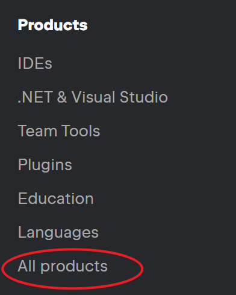

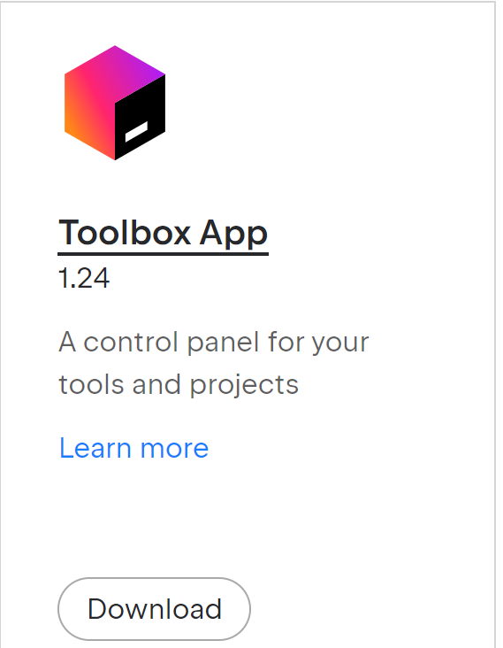

### Toolbox Settings

[请支持自定义Toolbox的安装位置 \(Support custom Toolbox installation location\) : TBX\-5327](https://youtrack.jetbrains.com/issue/TBX-5327/%E8%AF%B7%E6%94%AF%E6%8C%81%E8%87%AA%E5%AE%9A%E4%B9%89Toolbox%E7%9A%84%E5%AE%89%E8%A3%85%E4%BD%8D%E7%BD%AE-Support-custom-Toolbox-installation-location)

更改软件安装位置，关闭自动更新

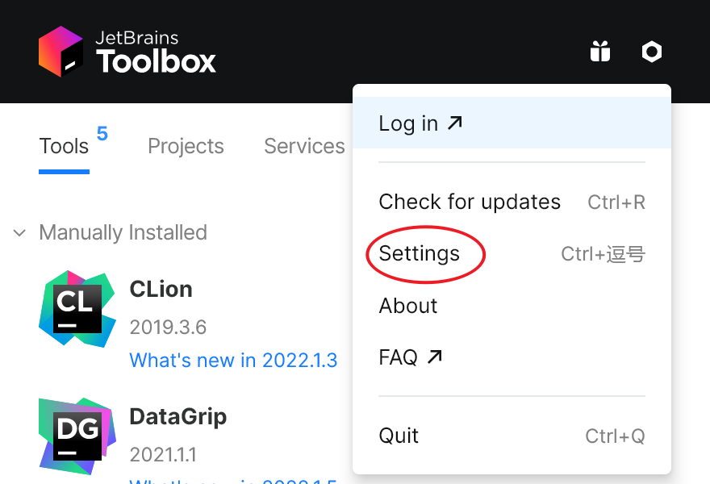

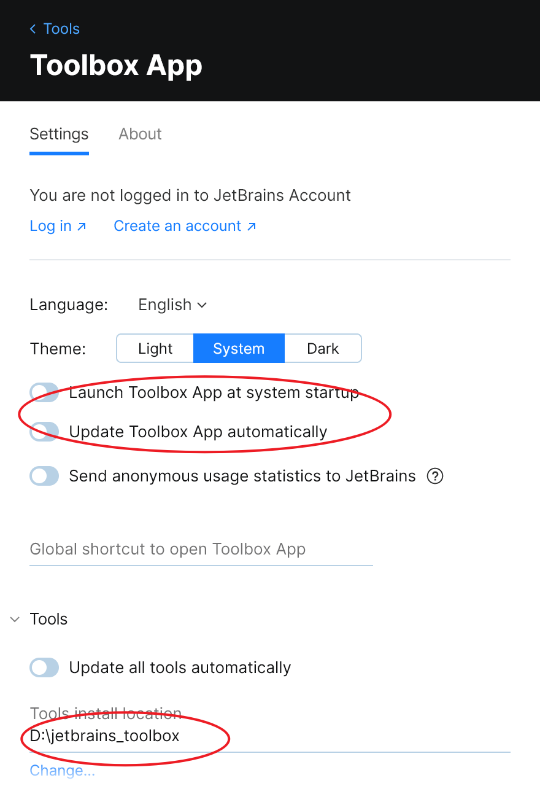

### Install IDEA

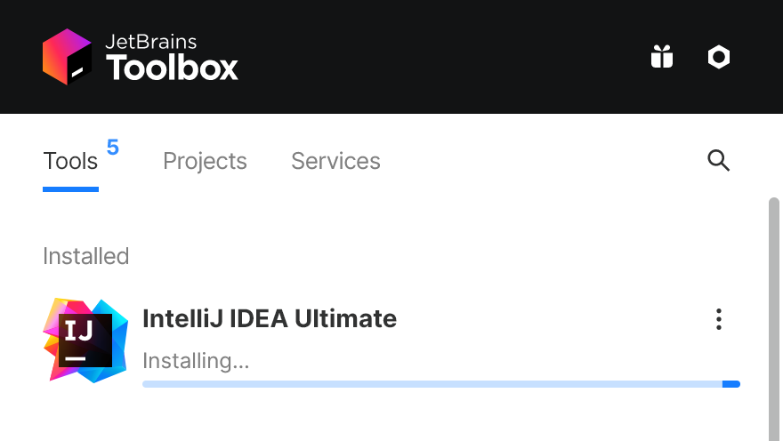

```
Missing essential plugin:
com.intellij(platform prefix:nul1)
Please reinstall IntelliJ IDEA from scratch.
```

[解决Missing essential plugin: com\.intellij \(platform prefix: null\) please reinstall intellij idea\_yangstar23的博客\-CSDN博客](https://blog.csdn.net/m0_51869692/article/details/124765549)

[Missing essential plugin: com\.intellij \(platform prefix: WebStorm\) Please reinstall WebStorm from scratch\. : WEB\-55054](https://youtrack.jetbrains.com/issue/WEB-55054/Missing-essential-plugin-comintellij-platform-prefix-WebStorm-Please-reinstall-WebStorm-from-scratch)

没找到 plugins 文件夹，我则将

```
C:\Users\Administrator\AppData\Roaming\JetBrains\IntelliJIdea2022.1
```

文件夹直接删掉

### IDEA Settings

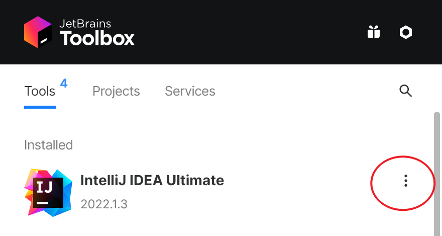

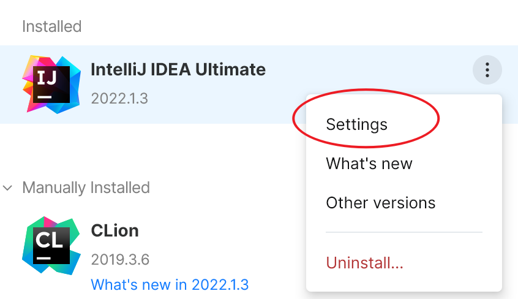

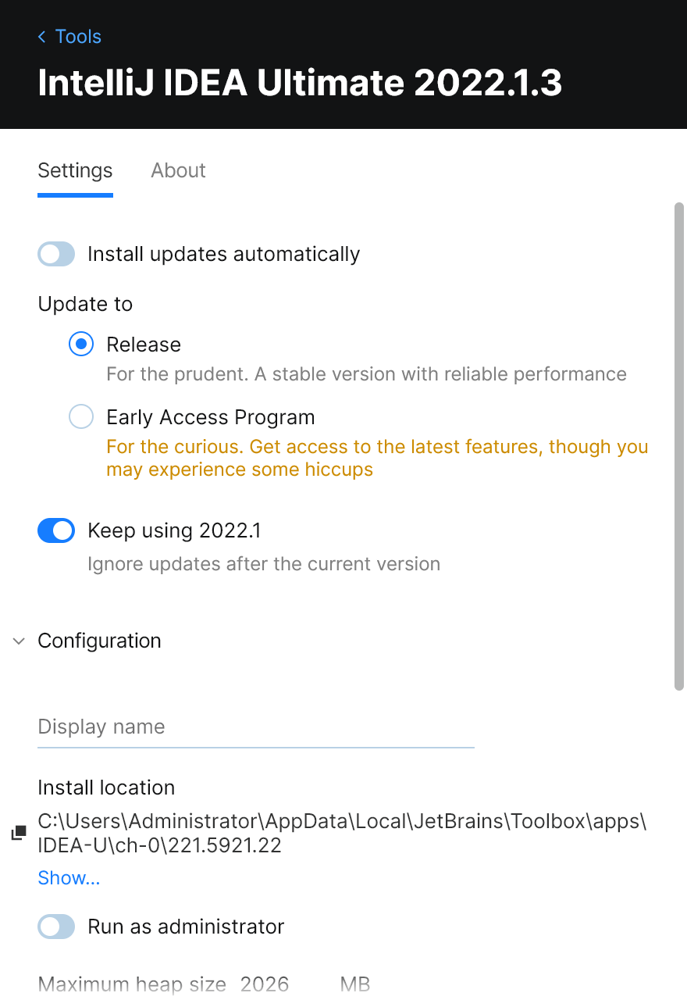

## 激活 IDEA

### ja\-netfilter

[ja\-netfilter: A Java Instrumentation Framework](https://gitee.com/ja-netfilter/ja-netfilter)


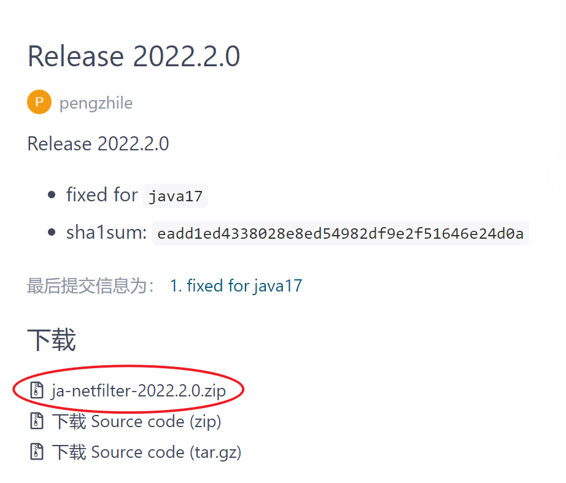

### 神key网站

[JETBRA\.IN CHECKER \| IPFS](https://3.jetbra.in/)


```
jetbra\config-jetbrains
```

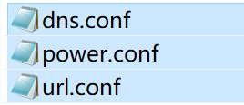

```
source\ja-netfilter\config
```

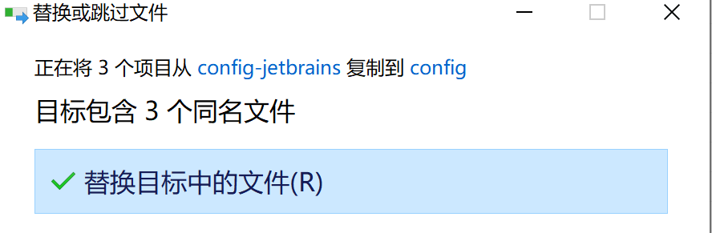

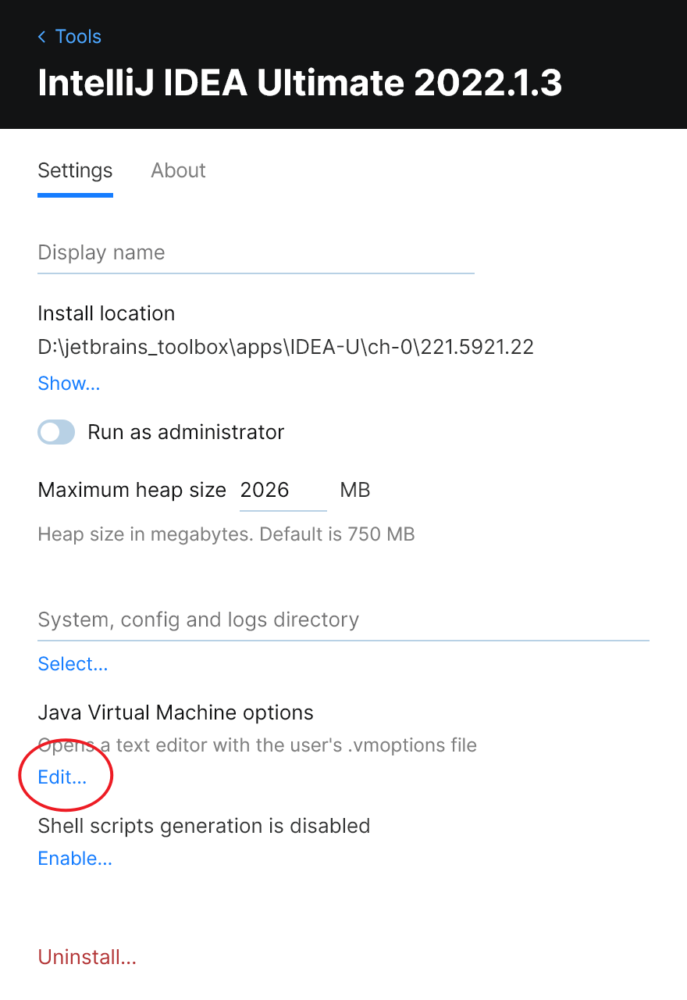

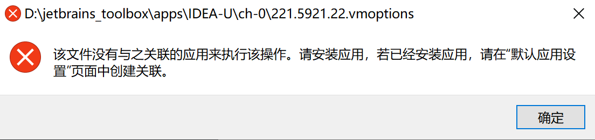

搜索框中搜索


按文件类型指定默认应用。。好像不能直接改啊，打开对应文件夹，手动用 VC 打开，

根据[ja\-netfilter：Java 检测框架](https://gitee.com/ja-netfilter/ja-netfilter)

> - 添加`-javaagent:/absolute/path/to/ja-netfilter.jar`参数（**更改为您的实际路径**）
>   - 作为`java`命令的参数添加。例如：`java -javaagent:/absolute/path/to/ja-netfilter.jar -jar executable_jar_file.jar`
>   - 一些应用程序支持`JVM Options file`，你可以添加为一行`JVM Options file`。
>   - **警告：不要放一些不必要的空白字符！**

参考[idea中设置JVM参数的两种方式\_天道酬勤的少年的博客\-CSDN博客\_idea jvm参数](https://blog.csdn.net/AttleeTao/article/details/108443547)，加上

```
-javaagent:D:\jetbrains_toolbox\ja-netfilter\ja-netfilter.jar
```

从[JETBRA\.IN CHECKER \| IPFS](https://3.jetbra.in/)中得到 IDEA 激活码。

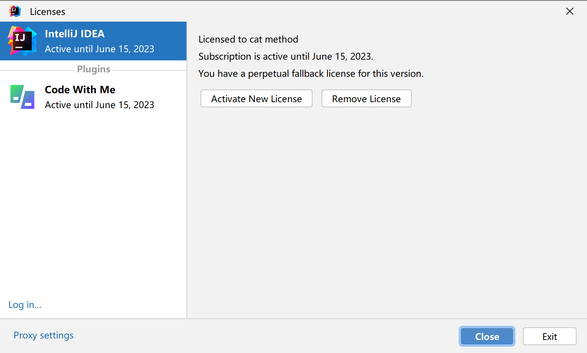

成功！