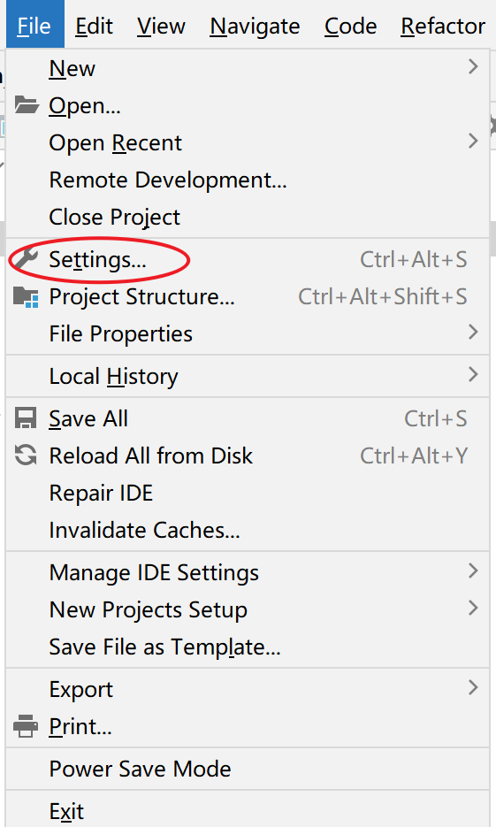
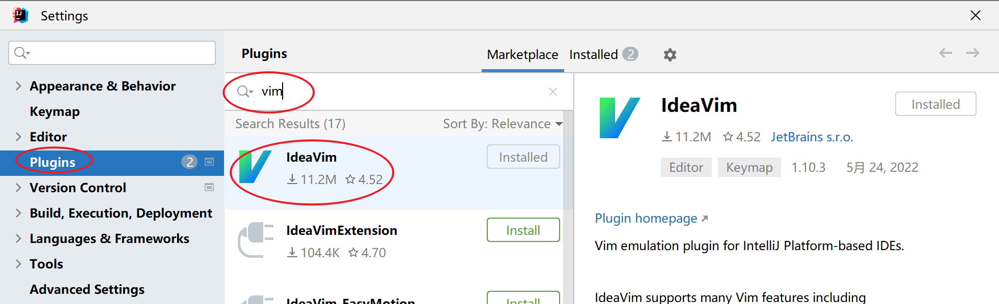
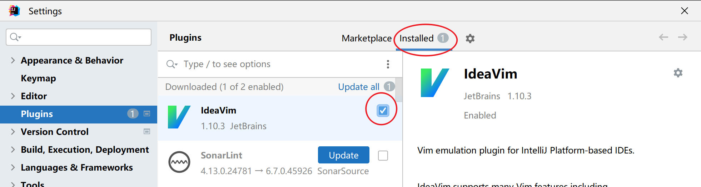
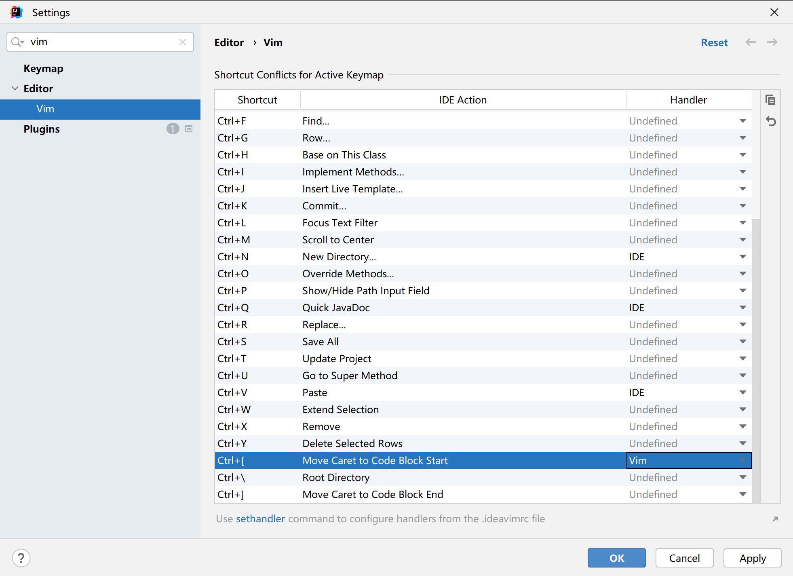

# IdeaVim

[Emulate Vim in IntelliJ IDEA \| IntelliJ IDEA](https://www.jetbrains.com/help/idea/using-product-as-the-vim-editor.html)

Can disable / enable / update plugins.

## Use some Ctrl in IDE Mode

