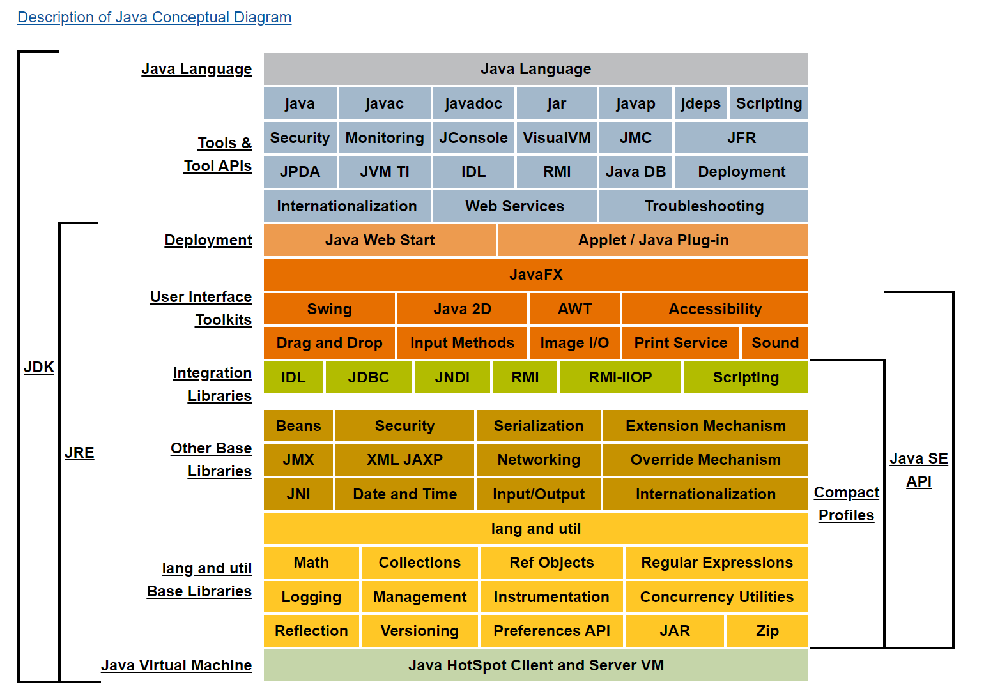
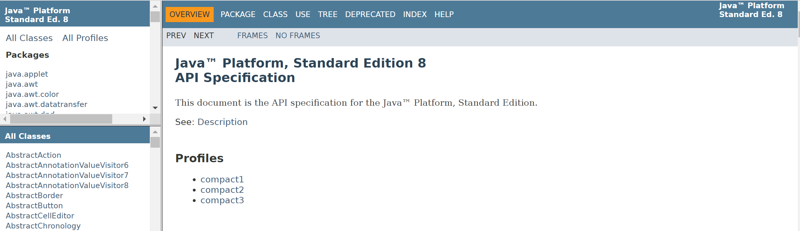

# document

## English

[Java Platform Standard Edition 8 Documentation](https://docs.oracle.com/javase/8/docs/index.html)



[Overview \(Java Platform SE 8 \)](https://docs.oracle.com/javase/8/docs/api/index.html)



## 中文

[在线文档\-jdk\-zh](https://tool.oschina.net/apidocs/apidoc?api=jdk-zh)

[Java 8 中文版 \- 在线API中文手册 \- 码工具](https://www.matools.com/api/java8)


## chatopt

### where should I look up java document?

You can find the Java documentation at the following website: https://docs.oracle.com/en/java/ This website contains the official Java documentation, which includes detailed information about the various classes and methods in the Java Standard Library, as well as tutorials and examples on how to use them. It is a valuable resource for learning about and working with Java.  

### How can i search a function like "system.out.print " in the above website?

To search for a specific function like `System.out.print` on the Java documentation website, you can use the search bar at the top of the page. Simply type in the name of the function you are looking for, and the search results will show you the relevant pages where the function is mentioned.

Alternatively, you can also use the navigation menu on the left side of the page to browse through the different packages and classes in the Java Standard Library. The `System` class is located in the `java.lang` package, so you can click on that package in the navigation menu to see a list of all the classes and interfaces it contains. From there, you can click on the `System` class to see its documentation, which will include information about the `out` field and the `print` method.

how can i search a function like "system.out.printf" in the https://docs.oracle.com/en/java?


### System.out.printf

To search for "System.out.printf" in the Oracle Java documentation, you can use the search function on the website. Here's how:

1.  Go to the Oracle Java documentation website: https://docs.oracle.com/en/java/
2.  In the top-right corner of the page, there is a search bar.
3.  Type "System.out.printf" (without the quotes) into the search bar and press Enter.
4.  This will bring up a list of search results. You can click on the first result, which should be for the `printf` method of the `PrintStream` class.

Alternatively, you can navigate to the `PrintStream` class documentation manually by following these steps:

1.  Go to the Oracle Java documentation website: https://docs.oracle.com/en/java/
2.  In the top menu, hover over the "Packages" tab and click on the "java.io" package.
3.  This will bring you to the documentation for the `java.io` package. Scroll down until you see the `PrintStream` class.
4.  Click on the `PrintStream` class to view its documentation. The `printf` method should be listed under the "Methods" section.

[PrintStream \(Java Platform SE 8 \)](https://docs.oracle.com/javase/8/docs/api/index.html)

## 数组

### 数组初始化

在 Java 8 中，可以通过以下方式来声明并初始化固定长度的数组：

```
javaCopy code// 声明并初始化一个长度为10的整型数组
int[] arr = new int[10];
```

上述代码将声明并初始化一个名为 `arr` 的整型数组，其长度为 `10`。在这个数组中，所有元素的默认值都是 `0`。

如果要在声明时同时初始化数组元素，可以使用以下方式：

```
javaCopy code// 声明并初始化一个长度为5的整型数组
int[] arr = {1, 2, 3, 4, 5};
```

上述代码将声明并初始化一个名为 `arr` 的整型数组，其长度为 `5`，并且数组中的元素分别为 `1`、`2`、`3`、`4` 和 `5`。

参考文档：[Java Tutorials - Arrays](https://docs.oracle.com/javase/tutorial/java/nutsandbolts/arrays.html)。

### Java 8 forEach遍历数组

1.  使用for-each循环遍历Java数组

使用Java 8中的forEach()方法时，可以结合使用for-each循环来遍历数组。下面是示例代码：

```
int[] numbers = {1, 2, 3, 4, 5};

for (int number : numbers) {
    System.out.println(number);
}
```

以上代码摘自Oracle官方Java教程中的for-each循环部分，链接如下：

[The for Statement \(The Java™ Tutorials > Learning the Java Language > Language Basics\)](https://docs.oracle.com/javase/tutorial/java/nutsandbolts/for.html)

## 字符串

### charAt

java中的chatAt函数作用以及命名由来


在Java中，charAt()函数用于获取字符串中指定位置的字符。该函数接受一个整数参数，表示要获取的字符在字符串中的索引位置，返回该位置上的字符。例如，下面的代码获取了字符串中第3个字符：

```
String str = "hello";
char c = str.charAt(2); // c的值为 'l'
```

函数名称 charAt() 中的 "char" 意为 "字符"，"At" 则表示 "在...位置"。因此，charAt() 函数的命名可以理解为 "获取在字符串中指定位置的字符"。该函数的命名与其他Java字符串函数（如substring()和length()）一样，都采用了类似的方式，简洁明了地描述了它的功能。

以上代码摘自 Oracle 官方 Java 文档中的 String 类文档，链接如下：

https://docs.oracle.com/en/java/javase/16/docs/api/java.base/java/lang/String.html