# idea

参考[黑马程序员全套Java教程_Java基础入门视频教程，零基础小白自学Java必备教程_哔哩哔哩_bilibili](https://www.bilibili.com/video/BV18J411W7cE?p=54&vd_source=4ed832873c3b70388cd7746abf15ce0a)

1. 创建一个空项目
2. 创建一个新模块
3. 在模块下的 src 下创建一个包
4. 在包下新建一个类
5. 在类中编写代码
6. 在 idea 中执行程序

## 1. 创建一个空项目

### 创建项目

### 选项为空

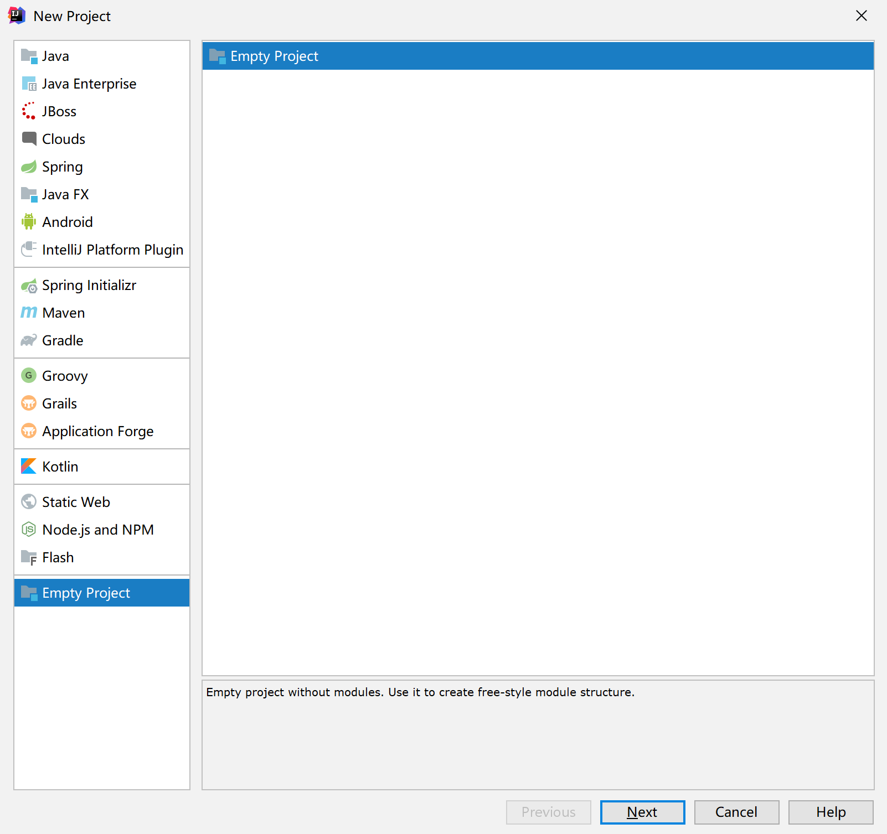

### 命名项目

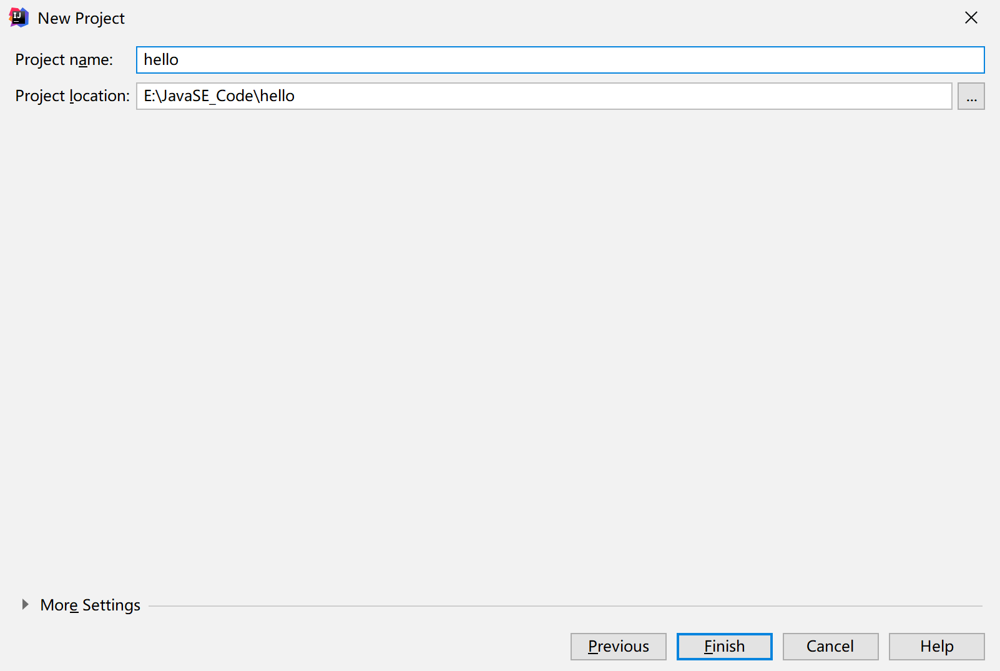

## 2. 创建一个新模块

### 创建模块

可直接在菜单中创建

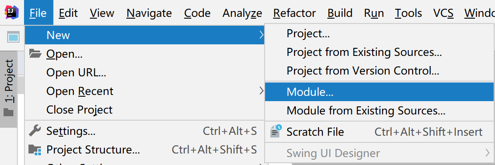

但是如果第一步正确完成会直接弹出

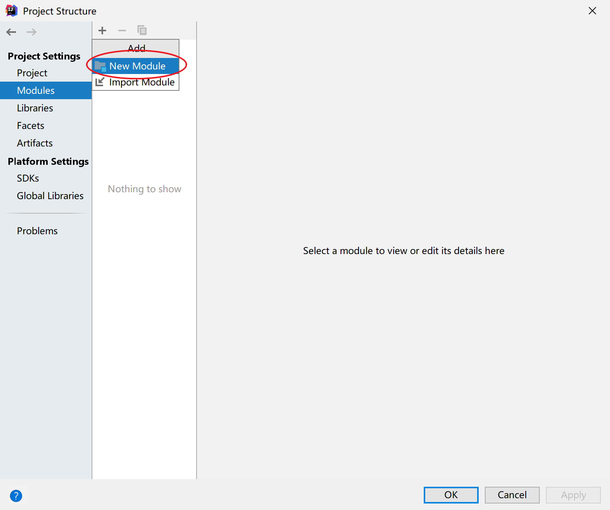

### 选择要导入的模块

选择 JDK 的安装路径

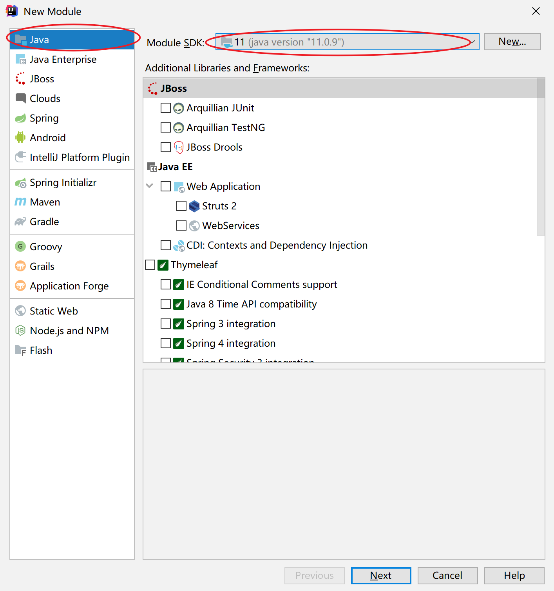

### 修改模块名称

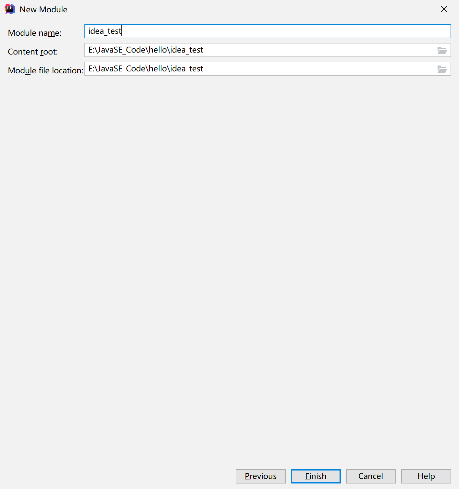

### 有了一个模块

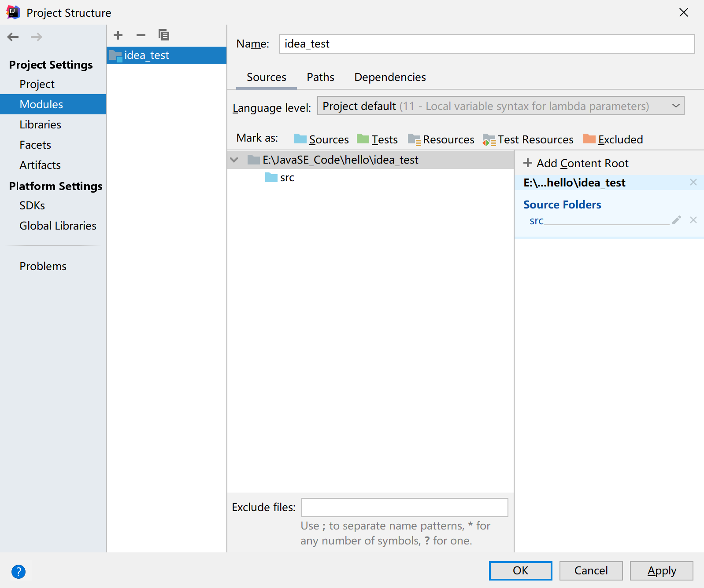

## 3. 在模块下的 src 下创建一个包

### 新建一个包

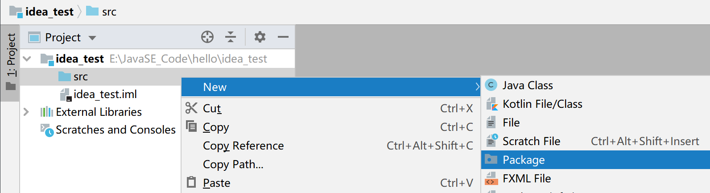

### 输入包名

## 4. 在包下新建一个类

### 新建类

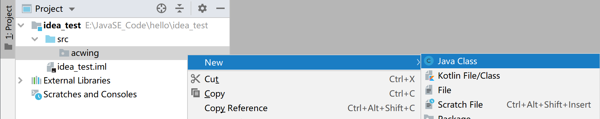

### 输入类名

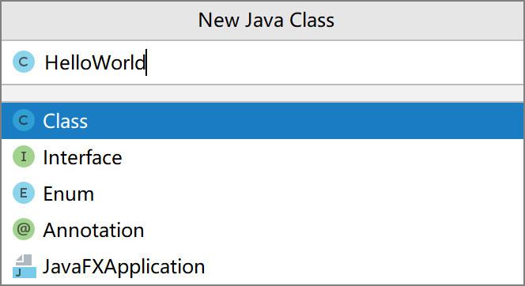

## 5. 在类中编写代码

可以使用 psvm 和 sout 快速生成：

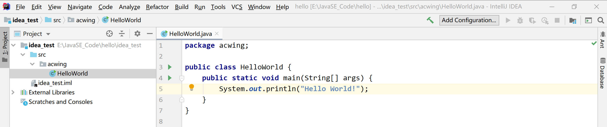

## 6. 在 idea 中执行程序

### 运行代码

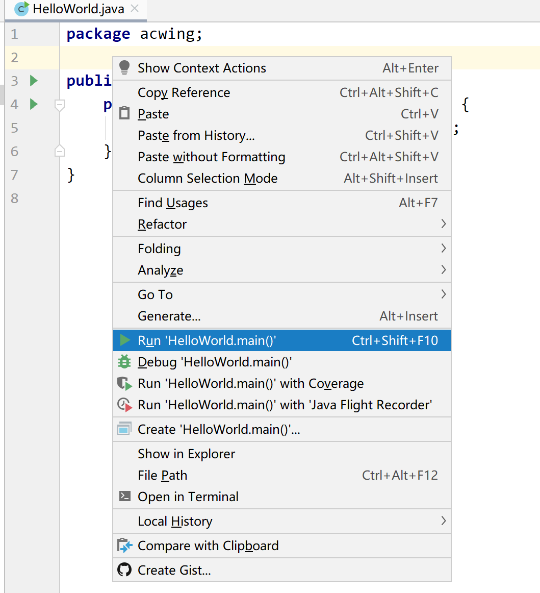

### 查看输出

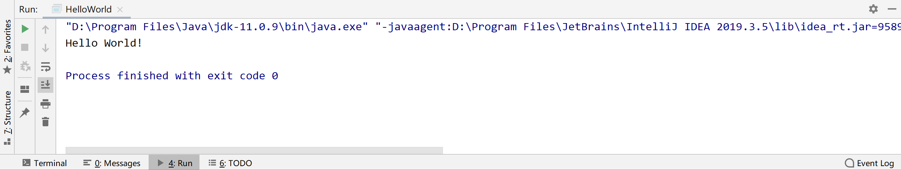

### 查看项目存放的路径

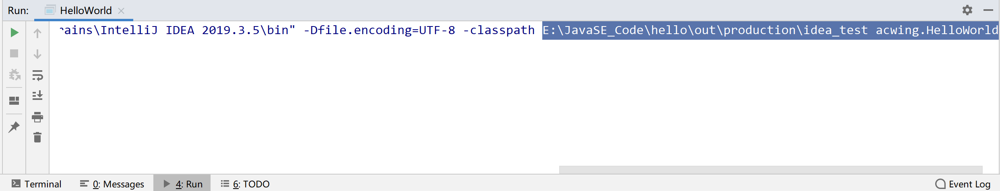