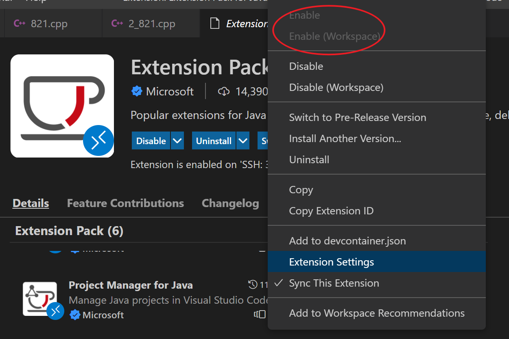
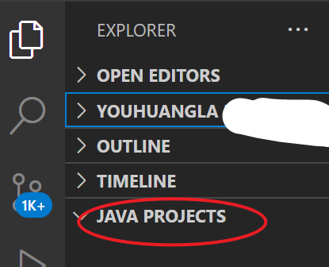
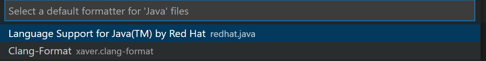
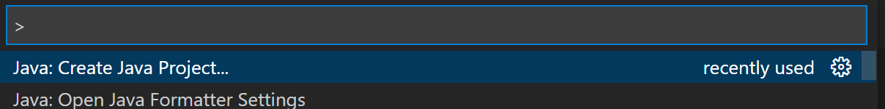
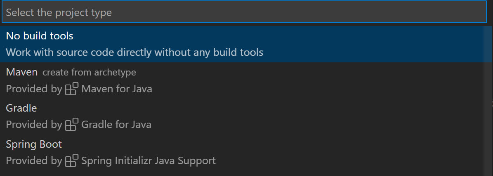
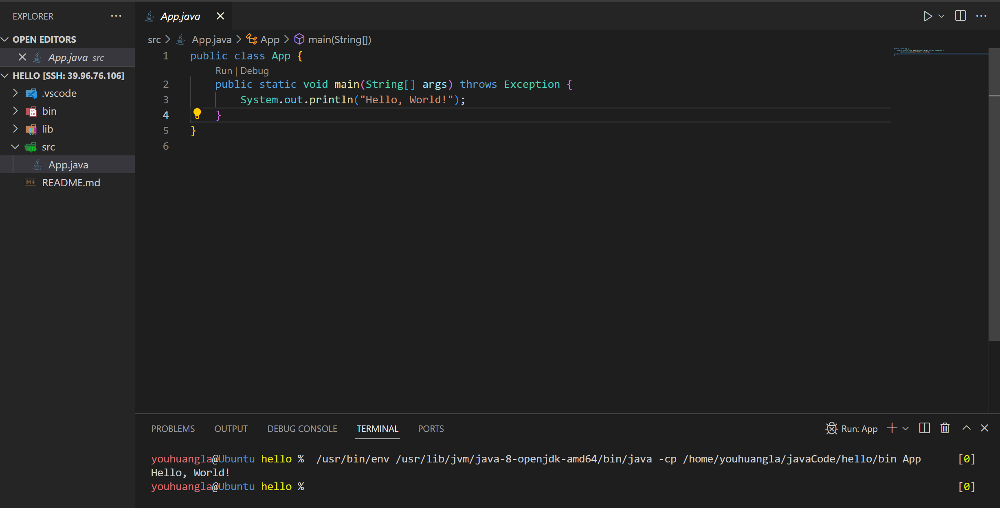

# Java in VsC on Ubuntu

## Install JDK1.8 on Ubuntu

[Installing Open JDK 8 on Debian or Ubuntu Systems \| Installing the JDK](https://docs.datastax.com/en/jdk-install/doc/jdk-install/installOpenJdkDeb.html)

1.  Update the repositories:

    ```bash
    sudo apt-get update
    ```

2.  Install OpenJDK:

    ```bash
    sudo apt-get install openjdk-8-jdk
    ```

    The latest JDK is installed.

3.  Verify the version of the JDK:

    ```bash
    java -version
    ```

```shell
youhuangla@Ubuntu ~ % java -version                                                                                                 [1]
openjdk version "1.8.0_342"
OpenJDK Runtime Environment (build 1.8.0_342-8u342-b07-0ubuntu1~18.04-b07)
OpenJDK 64-Bit Server VM (build 25.342-b07, mixed mode)
```

## VsCode

[Java in Visual Studio Code](https://code.visualstudio.com/docs/languages/java)

### Extension

#### Extension Pack for Java


By installing Extension Pack for Java, the following extensions are installed:

-   📦 Language Support for Java™ by Red Hat
    -   Code Navigation
    -   Auto Completion
    -   Refactoring
    -   Code Snippets
-   📦 Debugger for Java
    -   Debugging
-   📦 Test Runner for Java
    -   Run & Debug JUnit/TestNG Test Cases
-   📦 Maven for Java
    -   Project Scaffolding
    -   Custom Goals
-   📦 Project Manager for Java
    -   Manage Java projects, referenced libraries, resource files, packages, classes, and class members
-   📦 Visual Studio IntelliCode
    -   AI-assisted development
    -   Completion list ranked by AI

Must Enable the followint extension:

Maven for Java

Project Manager for Java



If `Project Manager for Java` is enable, you will find 



and can create a java project in **Command Palette** (Ctrl+Shift+P) .

#### Java formatting



### Create Project

[Getting Started with Java in Visual Studio Code](https://code.visualstudio.com/docs/java/java-tutorial)







## Edit .vimrc to add class name

```.vimrc
	if &filetype == 'java'
		call append(line(".")+6,"public class ".expand("%:r")." {")
		call append(line(".")+7,"	")
		call append(line(".")+8,"}")
	endif
```

