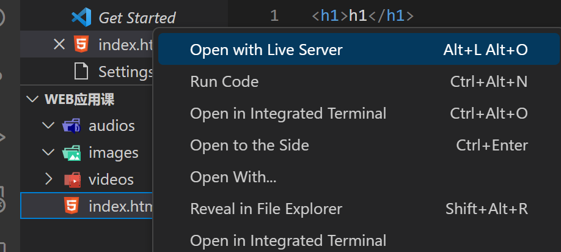
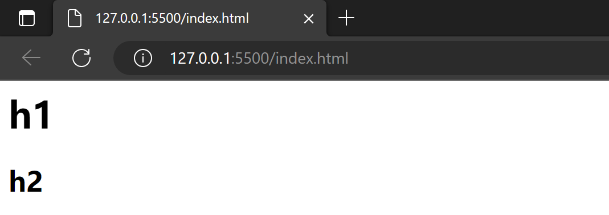
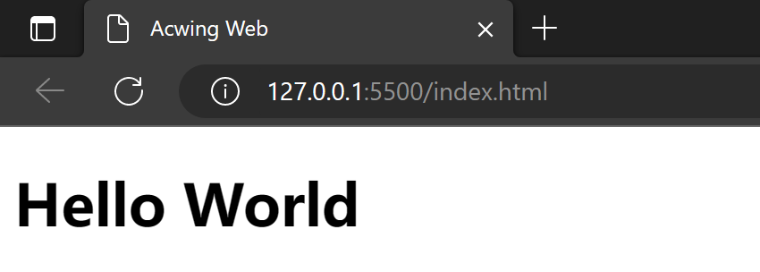
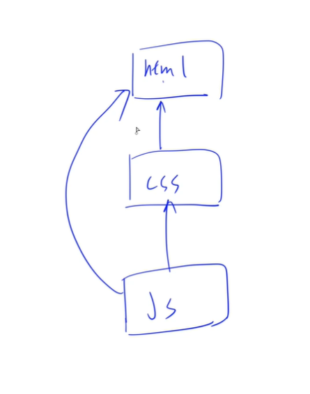

# Acwing JavaScript Document

## Reference

[MDN Web Docs (mozilla.org)](https://developer.mozilla.org/zh-CN/)

在里面搜索

在线交互式编译器

## VScode

### 安装

[1.1 vscode的安装与配置 - AcWing](https://www.acwing.com/file_system/file/content/whole/index/content/4078505/)

### 配置

#### 扩展

##### Live Server

```

Launch a development local Server with live reload feature for static & dynamic pages

```






##### Auto Rename Tag

```
Automatically rename paired HTML/XML tag, same as Visual Studio IDE does.
```

可以直接打 html 然后就有自动补全了

#### 设置

```json
"editor.formatOnSave": true

"editor.linkedEditing": true
```

第二个是提示我装的（

html 文件的一般结构

树：每个标签都是一个结点，

有开始、结束标签，两个标签之间就是子结点

## html基础标签


`title`  defines title in browser's Adress Bar. The content show in search website is `title` 's content.

```html
<!DOCTYPE html>

<html>

<head>
    <title>Acwing Web</title>
</head>

<body>
    <h1>Hello World</h1>
</body>

</html>

<html>

</html>
```


>   文本标签虽然很多，但大部分可看成是预定好样式的<div>和<span>。
>
>   以下内容如未著名来源请视作来自AcWing
>
>   作者：yxc
>   链接：https://www.acwing.com/file_system/file/content/whole/index/content/4084683/
>   来源：AcWing
>   著作权归作者所有。商业转载请联系作者获得授权，非商业转载请注明出处。
>
>   

### `<div>`标签

>   `<div>`元素 (或 HTML 文档分区元素) 是一个通用型的流内容容器，在不使用CSS的情况下，其对内容或布局没有任何影响。
>   其他块级标签例如：`<h1>, <p>, <pre>, <ul>, <ol>, <table>`。

### `<span>`标签

>   `<span> `元素是短语内容的通用行内容器，并没有任何特殊语义。可以使用它来编组元素以达到某种样式意图（通过使用类或者 Id 属性），或者这些元素有着共同的属性，比如lang。应该在没有其他合适的语义元素时才使用它。`<span> `与 `<div>` 元素很相似，但` <div>` 是一个 块元素 而 `<span>` 则是 行内元素
>
>   其他内联标签例如：`<i>, <b>, <del>, <ins>, <td>, <a>`。


>   Person: 
>   - div标签和span的区别
>
>   ChatGPT: 
>   - div和span是HTML中常用的两个容器元素，它们的区别如下： 
>   1. 标签类型不同：div是块级元素，而span是行内元素。 
>   2. 用途不同：div通常用于表示页面中的一个区块，可以用于布局和样式的控制，如设置背景色、边框等，而span通常用于包裹文本内容，用于设置文本的样式，如设置字体、颜色、加粗等。 
>   3. 默认宽度不同：div是块级元素，会默认占据一行的全部宽度，而span是行内元素，它的宽度通常是由它包含的内容决定的。 
>   4. 元素嵌套不同：div可以包含其他块级元素或行内元素，而span只能包含行内元素，不能包含块级元素。
>
>   总之，div和span的使用场景和目的不同，可以根据需要选择使用哪种元素。

大部分html标签会将空格和回车过滤掉

问题：当我们想展示代码，代码中的回车和空格如果用`<p>`存会很丑

解答：我们可以将标签换成`<pre>`

### img标签

导入图片

`    `

看到1.1 html 上的 1h左右


## CSS

>   Person: 
>   - css中比较重要的知识点
>
>   ChatGPT: 
>   - CSS（层叠样式表）是一种用于定义网页样式和布局的语言，其比较重要的知识点包括： 
>   1. 盒模型：CSS中的盒模型用于表示HTML元素的布局和尺寸。它包括元素的内容区域、内边距、边框和外边距。 
>   2. 布局：CSS提供了多种布局方式，包括浮动、定位、弹性盒子等。不同的布局方式适用于不同的场景，可以根据需要选择合适的方式。 
>   3. 选择器：CSS中的选择器用于选择需要设置样式的HTML元素。常见的选择器包括元素选择器、类选择器、ID选择器等，它们可以组合使用，以实现更精确的选择。 
>   4. 样式属性：CSS中的样式属性用于设置元素的样式，包括颜色、字体、背景、边框等。不同的样式属性可以实现不同的视觉效果，需要根据具体需求进行选择和设置。 
>   5. 响应式设计：响应式设计是一种常用的CSS技术，用于根据不同设备和屏幕尺寸自适应地调整网页布局和样式。它可以提高网页的用户体验和可访问性。
>
>   总之，CSS作为一种网页样式和布局的语言，涵盖了广泛的知识点，掌握这些知识点可以帮助开发者更好地设计和开发网页。


>   Person: 
>   - html、css、JavaScript的关系可以看成是由表层到里层逐渐递进吗？
>
>   ChatGPT: 
>   - HTML、CSS和JavaScript是Web开发中的三个基础技术，它们的关系可以类比为一个房屋结构的比喻。HTML可以看作是这个房子的结构框架，CSS则是房子的外观和装修，而JavaScript则是房子的各种交互和功能。
>
>   从表面上看，HTML、CSS和JavaScript确实有一定的递进关系。HTML负责网页的结构和内容，CSS负责网页的外观和样式，而JavaScript则负责网页的交互和功能，这些层次上下分明，从表面上看是逐层递进的。
>
>   但是，实际上这种递进关系并不是绝对的，它们之间的关系更像是互相交错、互相支持的。在实际开发中，HTML、CSS和JavaScript经常是同时使用的，它们相互配合，共同完成网页的设计和开发。
>
>   因此，虽然HTML、CSS和JavaScript有一定的递进关系，但是它们的实际关系更多地是相互交织、相互支持的，需要一起学习和应用


### 行内样式表（inline style sheet）

>   直接定义在标签的style属性中。
>
>   作用范围：仅对当前标签产生影响。
>   例如：
>
>   ``


### 内部样式表（internal style sheet）

>   定义在style标签中，通过选择器影响对应的标签。
>
>   作用范围：可以对同一个页面中的多个元素产生影响。

### 外部样式表（external style sheet）

>   定义在css样式文件中，通过选择器影响对应的标签。可以用link标签引入某些页面。
>
>   作用范围：可以对多个页面产生影响。

### 注释

>   注意不能使用`//`。
>   只有：
>
>   `/* 注释 */`

学到CSS课的30min

## JavaScript

### 1.1 JS的调用方式与执行顺序

#### 调用方式

>   Person: 
>   - ```html
>     <script type="module">
>     console.log("Hello World!");
>     </script>
>     ```
>
>   ChatGPT: 
>   - 这是一个使用ES6模块的JavaScript代码块，其中包含了一行代码console.log("Hello World!");用于在控制台输出"Hello World!"。`<script type="module">`是HTML中的一个标签，用于定义模块化的JavaScript代码块。在模块化的JavaScript中，代码被封装在模块中，可以通过导入和导出模块来实现代码的重用和组织。
>
>   console.log()是JavaScript中的一个函数，用于向控制台输出日志信息。在这里，它用于输出字符串"Hello World!"。
>
>   需要注意的是，使用ES6模块的JavaScript代码需要在支持ES6模块的浏览器中运行，否则会出现错误。同时，在HTML中使用ES6模块需要设置type属性为"module"，以告知浏览器这是一个模块化的JavaScript代码块。

##### export与import

>   HTML页面中的任意位置加上`<script type="module"></script>`标签即可。
>
>   常见使用方式有以下几种：
>
>   直接在`<script type="module"></script>`标签内写JS代码。
>   直接引入文件：`<script type="module" src="/static/js/index.js"></script>`。
>   将所需的代码通过import关键字引入到当前作用域。
>   例如：
>
>   /static/js/index.js文件中的内容为：
>
>   ```js
>   let name = "acwing";
>   
>   function print() {
>       console.log("Hello World!");
>   }
>   
>   export {
>       name,
>       print
>   }
>   ```
>
>   

export 中是暴露出去的

>   Person: 
>   - ```js
>       let name = "acwing";
>                   
>       function print() {
>           console.log("Hello World!");
>       }
>                   
>       export {
>           name,
>           print
>       } 
>       ```
>
>   - export作用
>
>   ChatGPT: 
>   - 在这段代码中，export用于导出模块的成员（变量、函数等），供其他模块使用。具体来说，它将name和print两个成员导出，以便其他模块可以通过导入的方式使用它们。
>
>   在JavaScript中，模块化的方式有很多种，而export和import是ES6模块化中最常用的两种语法。export用于将模块的成员导出，以便其他模块可以使用它们；而import用于导入其他模块的成员，以便在当前模块中使用它们。
>
>   在这段代码中，export { name, print }语句导出了name和print两个成员。其他模块可以使用以下语法导入这些成员：
>
>   ```python
>   import { name, print } from './example.js';
>   ```
>
>   
>
>   这里的"./example.js"是导出这些成员的模块路径，它可以是相对路径或绝对路径。导入这些成员后，就可以在当前模块中使用它们了，例如：
>
>   ```js
>   console.log(name); // 输出"acwing"
>   print(); // 输出"Hello World!"
>   ```


>   `<script type="module"></script>`中的内容为：
>
>   ```js
>   <script type="module">
>       import { name, print } from "/static/js/index.js";
>   
>       console.log(name);
>       print();
>   </script>
>   ```

##### type="module"

`type="module"`作用：限制变量的作用域

>   ChatGPT: 
>   - `type="module"`是HTML `<script>` 标签中的一个属性，用于指定当前脚本是一个ES6模块。当浏览器遇到`type="module"`属性时，会按照ES6模块的方式加载并解析脚本文件。这意味着在该脚本中可以使用ES6模块化的语法，如 `import` 和 `export`。
>
>   在上面的代码中，`<script type="module">`标签内的内容是一个ES6模块。`import { name, print } from "/static/js/index.js";`语句用于从指定路径导入 `index.js` 文件中导出的 `name` 和 `print` 变量/函数。导入成功后，该模块会输出 `name` 变量并执行 `print` 函数。
>
>   需要注意的是，`type="module"`属性只有在浏览器对应的版本中才能使用。在支持ES6模块的浏览器中，可以通过该属性引入模块，而在不支持的浏览器中，需要使用其他模块化方案或者polyfill来实现模块化。
>
>   Person: 
>   - type="module" 会限制作用域吗？
>
>   ChatGPT: 
>   - 是的，使用`type="module"`属性可以将模块的作用域限制在模块内部。这是ES6模块化的一个重要特性，它可以帮助开发者避免全局变量和函数的污染，提高代码的可维护性和可复用性。
>
>   具体来说，当浏览器遇到`type="module"`属性时，它会将模块的代码封装在一个单独的作用域中，避免变量和函数的命名冲突。模块内部定义的变量和函数只能在模块内部访问，其他模块无法访问。如果想要将模块的部分内容暴露给其他模块使用，可以使用`export`语法将其导出。
>
>   需要注意的是，`type="module"`属性限制了模块的作用域，因此在使用该属性时，需要注意模块之间的依赖关系和引用顺序，避免出现不必要的错误。另外，由于该属性只在支持ES6模块的浏览器中可用，因此在实际开发中需要根据目标浏览器的支持情况进行选择和兼容处理。

#### 执行顺序

Js没有明确的入口，从上到下逐次执行。

>   1.   类似于HTML与CSS，按从上到下的顺序执行；
>   2.   事件驱动执行

>   Person: 
>   - 如何深入理解JS的执行顺序？1.   类似于HTML与CSS，按从上到下的顺序执行；
>   2.   事件驱动执行
>
>   ChatGPT: 
>   - JavaScript的执行顺序相比HTML和CSS更加复杂，因为JavaScript是一门脚本语言，具有很多的特性和机制。深入理解JavaScript的执行顺序需要考虑以下几个方面： 
>   1. JavaScript的解释和执行是分开进行的。JavaScript代码首先会被解释器解释成抽象语法树（AST），然后再被执行。解释和执行是两个独立的过程，它们的顺序并不一定按照代码的编写顺序进行。 
>   2. JavaScript的执行是单线程的。JavaScript引擎只有一个主线程，所有的代码都在这个线程中执行。这意味着，JavaScript代码的执行是按照顺序进行的，一次只能执行一条语句。 
>   3. JavaScript的执行是基于事件循环的。JavaScript代码中的异步操作（例如网络请求、定时器等）并不会阻塞主线程的执行，而是通过事件循环机制等待异步操作完成后再进行回调执行。这就是常说的JavaScript的事件驱动执行。 
>   4. JavaScript的执行顺序还受到函数调用、作用域、变量提升等因素的影响。函数调用会将当前代码的执行顺序转移到被调用的函数中，函数执行完毕后再返回到原来的代码执行顺序；作用域和变量提升会影响变量的可见性和值的获取等问题。
>
>   因此，深入理解JavaScript的执行顺序需要对其底层机制和事件循环机制有一定的了解。同时，还需要注意JavaScript代码的异步操作和函数调用等因素对代码执行顺序的影响。

#### HTML, CSS, JavaScript三者之间的关系

1.   CSS控制HTML
2.   JavaScript控制HTML与CSS
3.   为了方便开发与维护，尽量按照上述顺序写代码。例如：不要在HTML中调用JavaScript中的函数。

箭头表示操纵（3.是去掉html操纵JS的那个箭头）：

第3条举例：3中的方法不利于维护，如果你有多个button(html)绑定了一个相同的函数，但是你如果想改变该函数，你就需要一个个改变。


### 1.2 变量与运算符

#### let与const

>   用来声明变量，作用范围为当前作用域。
>
>   -   let用来定义变量；
>   -   const用来定义常量；
>
>    例如：
>
>   ```js
>   let s = "acwing", x = 5;
>   
>   let d = {
>       name: "yxc",
>       age: 18,
>   }
>   
>   const n = 100;
>   
>   console.log(d['name'], d["age"], d.name)
>   ```
>
>   

定义字典的时候用`:`

赋值用`=`

#### 变量类型

>   -   number：数值变量，例如1, 2.5
>   -   string：字符串，例如"acwing", 'yxc'，单引号与双引号均可。字符串中的每个字符为只读类型。
>   -   boolean：布尔值，例如true, false
>   -   object：对象，类似于C++中的指针，例如[1, 2, 3]，{name: "yxc", age: 18}，null
>   -   undefined：未定义的变量
>
>   类似于Python，JavaScript中的变量类型可以动态变化。

常用的数据结构：list（列表、数组）、字典

#### 运算符

与C++、Python、Java类似，不同点：

-   `**`表示乘方
-   等于与不等于用`===`和`!==`

### 1.3 输入与输出

#### 输入

>   -   从HTML与用户的交互中输入信息，例如通过input、textarea等标签获取用户的键盘输入，通过click、hover等事件获取用户的鼠标输入。
>   -   通过Ajax与WebSocket从服务器端获取输入
>   -   标准输入，参考AcWing 1. A + B


>   Person: 
>   - 为什么web前端开发要最后写js？
>
>   ChatGPT: 
>   - 在Web前端开发中，通常会将HTML、CSS和JavaScript三者分开编写，其中JavaScript的代码通常会放在HTML文档的底部或引入的JS文件中。这是因为JavaScript对于网页的加载和渲染有一定的影响，放在HTML文档底部可以减少对页面的渲染和加载时间，提高页面的性能和用户体验。具体来说，以下是几个原因： 
>   1. 为了提高页面的加载速度和渲染效率。HTML文档是逐行解析的，如果JavaScript代码在HTML文档头部，浏览器会先解析JavaScript代码，这可能会导致页面出现加载和渲染的延迟。因此，将JavaScript代码放在HTML文档底部，可以使页面在加载和渲染时先展示出主要内容，让用户更快地看到页面内容。 
>   2. 为了提高代码的可维护性和可读性。将HTML、CSS和JavaScript分开编写可以使代码更加清晰和易于维护。这样可以使不同的开发者专注于自己擅长的领域，提高团队的协作效率。 
>   3. 为了方便代码的复用和管理。将JavaScript代码独立成为一个文件可以方便地在多个页面中重用，提高代码的复用性。同时，通过使用模块化的JavaScript代码，可以更好地管理和组织代码，使得代码更加清晰和易于维护。
>
>   需要注意的是，这并不是绝对的规则，具体的实践可能因项目的特点而有所不同。在实际开发中，需要根据项目的具体情况来决定JavaScript代码的位置和引入方式。


>   Person: 
>   - ```js
>     let input = document.querySlector(".input");
>     function main(){
>     	console.log(input);
>     	export default {
>     		main
>     	}
>     }
>     ```
>
>   ChatGPT: 
>   - 这段代码定义了一个变量`input`，并将其赋值为`document.querySlector(".input")`。该语句的作用是获取HTML文档中class为"input"的第一个元素，将其赋值给变量`input`。
>
>   接下来定义了一个函数`main`，该函数中调用了`console.log(input)`语句，用于在控制台输出变量`input`的值。
>
>   最后，使用`export default`语法将`main`函数导出为默认的模块成员。默认导出的意思是，该模块在导入时，会默认导入被导出的成员。比如，在另一个模块中，可以使用以下语法导入该模块的默认成员：
>
>   ```javascript
>   import myModule from './myModule.js';
>   ```
>
>   
>
>   这里的`myModule`就是上面代码中导出的默认成员，可以直接调用`myModule.main()`来执行`main`函数。
>
>   需要注意的是，`export default`只能导出一个默认成员，而且该成员不需要使用花括号包裹，可以直接在导入时指定名称。如果需要导出多个成员，可以使用`export { name1, name2, ... }`的方式，将它们作为命名成员导出。在导入时，需要使用花括号包裹成员名称，如`import { name1, name2 } from './myModule.js'`。


>   Person: 
>
>   - 
>
>   ```js
>   let input = document.querySelector(".input");
>   function main(){
>   	console.log(input);
>   }
>   
>   	export default {
>   		main
>   	}
>   ```
>
>   上面的代码位于/static/js/index.js
>
>   ```js
>   <script type="module">
>       import { main } from "/static/js/index.js";
>       main();
>   </script>
>   ```
>
>   ```html
>   <textarea class="input" name="" id="" cols="30" rows="10"></textarea>
>   ```
>
>   ChatGPT: 
>   - 这段代码定义了一个ES6模块，其中包含了一个`main`函数，并将该函数作为默认成员导出。`main`函数用于输出`input`变量，该变量表示获取到的HTML元素。
>
>   在`<script type="module">`标签中，使用`import { main } from "/static/js/index.js"`语句导入了`main`函数，并调用它来执行操作。由于`main`函数是默认成员，因此可以使用`import defaultMember from 'module-name'`语法导入。
>
>   在HTML代码中，定义了一个`textarea`元素，该元素具有`class="input"`属性，用于在JavaScript代码中获取该元素。由于`textarea`元素可以包含多行文本，因此在调用`console.log(input)`时，可能会输出多行信息。
>
>   需要注意的是，由于`input`变量表示获取到的HTML元素，因此在输出它时，会输出该元素的所有属性和内容。如果想要输出元素的特定属性或内容，可以使用相应的属性或方法，如`input.value`表示元素的值，`input.innerHTML`表示元素的HTML内容等等。
>
>   Person: 
>   - textarea元素作用
>
>   ChatGPT: 
>   - `<textarea>` 元素是一个 HTML 表单元素，用于在网页中创建一个文本输入区域，允许用户输入多行文本内容。
>
>   `<textarea>` 元素的主要作用是用于在表单中收集用户输入的文本内容。与 `<input>` 元素不同，`<textarea>` 元素允许用户输入多行文本，而不仅仅是单行文本。因此，`<textarea>` 元素通常用于需要用户输入大段文本内容的场景，如文章评论、文本编辑等。
>
>   `<textarea>` 元素也可以通过 `cols` 和 `rows` 属性来设置文本输入区域的宽度和高度。此外，可以使用 `name` 属性给文本输入区域命名，以便在表单提交时将其值发送到服务器。
>
>   示例：
>
>   ```html
>   
>   <form>
>     <label for="message">请输入您的留言:</label>
>     <textarea id="message" name="message" rows="5" cols="50"></textarea>
>     <br>
>     <button type="submit">提交</button>
>   </form>
>   ```
>
>   
>
>   在这个例子中，我们创建了一个文本输入区域，它具有一个 `id` 属性为 `message`，一个 `name` 属性为 `message`，并设置了它的 `rows` 和 `cols` 属性。当用户提交表单时，`<textarea>` 元素的值将被发送到服务器，可以通过使用表单处理器来处理它。

1:30h

### 1.4 判断语句


### 1.5 循环语句


### 1.6 对象


### 1.7 数组


### 1.8 函数

不需要明确返回值


### 1.9 类


### 1.10 事件


### 1.11 常用库

不需要背，学的时候查。

#### 1.11.1 jQuery

方便操控html标签、css属性。

##### 使用方式

##### 选择器

##### 事件

##### 元素的隐藏、展现

##### 元素的添加、删除

##### 对类的操作

##### 对css的操作

##### 对标签属性的操作

##### 对Html内容、文本的操作

##### 查找

##### ajax

#### 1.11.2 setTimeout与setInterval


#### 1.11.3 requestAnimationFrame


#### 1.11.4 Map与Set


#### 1.11.5 localStorage


#### 1.11.6 JSON


#### 1.11.7 日期


#### 1.11.8 WebSocket

#### 1.11.9 window

#### 1.11.10 canvas

