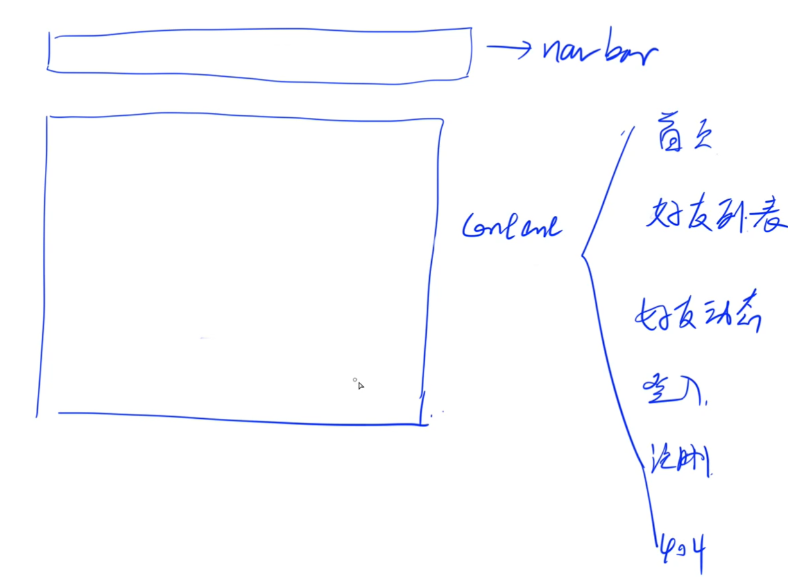

# Vue

[Vue.js - 渐进式 JavaScript 框架 | Vue.js (vuejs.org)](https://cn.vuejs.org/)

[SFC 语法定义 | Vue.js (vuejs.org)](https://cn.vuejs.org/api/sfc-spec.html#language-blocks)

>   **Claude\**应用\**** 
>
>   组件的三部分结构这部分文档详细介绍了三段式之间的关系:
>
>   -   template 定义组件的模板,包含组件的HTML结构
>   -   script 定义组件的行为,包含数据、方法、生命周期钩子等
>   -   style 定义组件的样式,包含CSS或其他预处理器的样式代码

