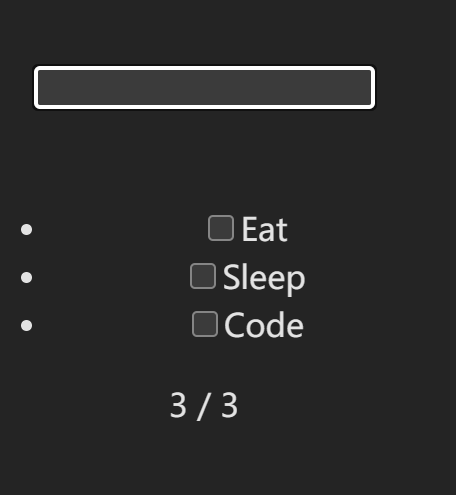

# Todolist_Demo_Vue3

## Env

进入 package.json 文件夹后

```
 npm run dev
```


>   PS E:\github\Todolist_Demo_Vue3> npm init @vitejs/app
>   npm WARN config global `--global`, `--local` are deprecated. Use `--location=global` instead.
>   Need to install the following packages:
>     @vitejs/create-app
>   Ok to proceed? (y)
>   npm WARN deprecated @vitejs/create-app@2.5.2: @vitejs/create-app has been moved to create-vite, please use 'npm create vite@latest' or 'yarn create vite' instead
>
>   @vitejs/create-app is deprecated, use npm init vite instead
>
>   C:\Users\Administrator\AppData\Local\npm-cache\_npx\9c7583f20b80c4d1\node_modules\@vitejs\create-app\index.js:43
>   require('create-vite')
>   ^
>
>   Error [ERR_REQUIRE_ESM]: require() of ES Module C:\Users\Administrator\AppData\Local\npm-cache\_npx\9c7583f20b80c4d1\node_modules\create-vite\index.js from C:\Users\Administrator\AppData\Local\npm-cache\_npx\9c7583f20b80c4d1\node_modules\@vitejs\create-app\index.js not supported.
>   C:\Users\Administrator\AppData\Local\npm-cache\_npx\9c7583f20b80c4d1\node_modules\create-vite\index.js is treated as an ES module 
>   file as it is a .js file whose nearest parent package.json contains "type": "module" which declares all .js files in that package 
>   scope as ES modules.
>   Instead rename C:\Users\Administrator\AppData\Local\npm-cache\_npx\9c7583f20b80c4d1\node_modules\create-vite\index.js to end in .cjs, change the requiring code to use dynamic import() which is available in all CommonJS modules, or change "type": "module" to "type": "commonjs" in C:\Users\Administrator\AppData\Local\npm-cache\_npx\9c7583f20b80c4d1\node_modules\create-vite\package.json to 
>   treat all .js files as CommonJS (using .mjs for all ES modules instead).
>
>       at Object.<anonymous> (C:\Users\Administrator\AppData\Local\npm-cache\_npx\9c7583f20b80c4d1\node_modules\@vitejs\create-app\index.js:43:1) {
>     code: 'ERR_REQUIRE_ESM'
>   }
>   npm ERR! code 1
>   npm ERR! path E:\github\Todolist_Demo_Vue3
>   npm ERR! command failed
>   npm ERR! command C:\WINDOWS\system32\cmd.exe /d /s /c create-app
>
>   npm ERR! A complete log of this run can be found in:
>   npm ERR!     C:\Users\Administrator\AppData\Local\npm-cache\_logs\2023-08-01T07_12_36_225Z-debug-0.log
>   PS E:\github\Todolist_Demo_Vue3> npm init vite       
>   npm WARN config global `--global`, `--local` are deprecated. Use `--location=global` instead.
>   Need to install the following packages:
>     create-vite
>   Ok to proceed? (y) y
>   √ Project name: ... Todolist_Demo_Vue3
>   √ Package name: ... todolist-demo-vue3
>   √ Select a framework: » Vue
>   √ Select a variant: » JavaScript
>
>   Scaffolding project in E:\github\Todolist_Demo_Vue3\Todolist_Demo_Vue3...
>
>   Done. Now run:
>
>     cd Todolist_Demo_Vue3
>     npm install
>     npm run dev
>
>   PS E:\github\Todolist_Demo_Vue3> cd .\Todolist_Demo_Vue3\
>   PS E:\github\Todolist_Demo_Vue3\Todolist_Demo_Vue3> npm install    
>   npm WARN config global `--global`, `--local` are deprecated. Use `--location=global` instead.
>   终止批处理操作吗(Y/N)? Y
>   PS E:\github\Todolist_Demo_Vue3\Todolist_Demo_Vue3> npm install
>   npm WARN config global `--global`, `--local` are deprecated. Use `--location=global` instead.
>
>   added 25 packages, and audited 26 packages in 27s
>
>   3 packages are looking for funding
>     run `npm fund` for details
>
>   found 0 vulnerabilities
>   PS E:\github\Todolist_Demo_Vue3\Todolist_Demo_Vue3> npm run dev
>   npm WARN config global `--global`, `--local` are deprecated. Use `--location=global` instead.
>
>   > todolist-demo-vue3@0.0.0 dev
>   > vite
>
>
>     VITE v4.4.7  ready in 865 ms
>
>     ➜  Local:   http://127.0.0.1:5173/
>     ➜  Network: use --host to expose
>     ➜  press h to show help


## 创建一个带有输入框的Vue组件

### 思想

jQuery时代的开发逻辑，就是我们先要找到目标元素，然后再进行对应的修改。

学习Vue.js,首先就要进行思想的升级，也就是说，不要再思考页面的元素怎么操作，而是要思考数据是怎么变化的。这就意味着，我们只需要操作数据，至于数据和页面的同步问题，Vue会帮我们处理。实际上，Vue让前端开发者能够专注数据本身的操作，而数据和页面的同步问题，则交由Vue来负责。

### Code

创建一个带有输入框的Vue组件，该字段根据用户输入在输入框外显示内容，并将其呈现在页面上。

[Create a Vue component with an input field that displays content abov… · youhuangla/Todolist\_Demo\_Vue3@29a31de](https://github.com/youhuangla/Todolist_Demo_Vue3/commit/29a31de8d38deae1b34d0015781870eb9d046fc1)

>   Person:
>
>   ```vue
>   <script src="https://unpkg.com/vue@next"></script>
>   <script>
>   import { VueElement } from 'vue';
>   
>   const App = {
>     data() {
>       return {
>         title: "",
>       }
>     }
>   }
>   VueElement.createApp(App).mount('#app');
>   </script>
>   
>   <template>
>     <div id="app">
>       <h2>
>         {{ title }}
>       </h2>
>     </div>
>   </template>
>   
>   <style scoped>
>   
>   </style>
>   <template>
>     <div id="app">
>       <h2>{{ title }}</h2>
>       <input type="text" v-model="title">
>     </div>
>   </template>
>   
>   <script setup>
>   import { ref } from 'vue';
>   
>   // 定义一个响应式数据
>   const title = ref('');
>   </script>
>   
>   <style>
>   /* 在这里定义组件的样式 */
>   </style>
>   
>   ```
>
>   解释以上代码
>
>   ChatGPT: 
>
>   - 这段代码是一个简单的 Vue 3 应用程序的示例，它用于创建一个包含一个标题和一个输入框的 Vue 组件，并在页面上渲染它。下面逐行解释代码：
>
>   ```html
>   
>   <div id="app">
>     <h2>{{ title }}</h2>
>     <input type="text" v-model="title">
>   </div>
>   ```
>
>
>   1. `<div id="app">...</div>`：在 HTML 页面中创建一个 `<div>` 元素，并给它设置了一个 `id` 属性为 "app"。这个 `id` 属性是为了标识该元素为 Vue 应用的挂载点，Vue 将会把模板渲染到这个挂载点上。 
>   2. `<h2>{{ title }}</h2>`：在上面的 `<div>` 元素内部，创建了一个 `<h2>` 标题元素，并使用了 Vue 的双花括号 `{{ }}` 语法来绑定数据。`{{ title }}` 表示将 Vue 实例中的 `title` 数据绑定到这个位置，从而将 `title` 数据的值显示在页面上。 
>   3. `<input type="text" v-model="title">`：又在 `<div>` 元素内部创建了一个输入框，使用了 Vue 的 `v-model` 指令。`v-model` 指令实现了数据的双向绑定，它将输入框的值绑定到 Vue 实例中的 `title` 数据，这意味着当用户在输入框中输入内容时，`title` 数据会自动更新，反之亦然。
>
>   接下来是 `<script>` 部分：
>
>   ```html
>   
>   <script src="https://unpkg.com/vue@next"></script>
>   <script>
>     const App = {
>       data() {
>         return {
>           title: "" // 定义一个数据
>         }
>       }
>     }
>   
>     // 启动应用
>     Vue.createApp(App).mount('#app')
>   </script>
>   ```
>
>
>   1. `<script src="https://unpkg.com/vue@next"></script>`：通过 `<script>` 标签引入 Vue.js 库。这里使用了 Vue 3 的版本，地址是 `https://unpkg.com/vue@next`。 
>   2. `const App = { ... }`：创建了一个名为 `App` 的对象，这个对象表示 Vue 组件的选项对象。在组件选项对象中，我们可以定义组件的数据、方法、生命周期钩子等等。 
>   3. `data() { ... }`：在组件选项对象中定义了一个 `data()` 方法，用于返回组件的数据。在这个例子中，返回了一个包含 `title` 属性的对象，初始值为空字符串。 
>   4. `Vue.createApp(App).mount('#app')`：创建一个 Vue 应用，并将 `App` 组件挂载到之前在 HTML 中设置的 `id` 为 "app" 的元素上。这样 Vue 就会将组件渲染到页面上，并实现数据的双向绑定。
>
>   以上代码是一个基本的 Vue 3 应用程序示例，它演示了 Vue 的数据绑定和双向绑定特性。在这个示例中，用户可以在输入框中输入内容，同时该内容会即时地显示在标题元素上。这是 Vue 3 的一个简单用法，用于快速搭建动态交互的页面。
>
>   
>
>   Person: 
>
>   - 直接在刚才的vite项目中，粘贴该段代码到App.vue中报错不能存在两个script
>
>   ChatGPT: 
>   - 是的，您在 Vite 项目的 App.vue 文件中不能直接粘贴完整的 `<script>` 标签，因为 App.vue 文件本身已经包含了一个 `<script>` 标签用于定义组件的逻辑。
>
>   在 Vite 项目中，每个 Vue 组件都有其自己的 `<script>` 部分，并且 Vite 使用单文件组件 (SFC) 的方式来组织代码。每个组件的 `<script>` 部分都包含了组件的配置和逻辑。
>
>   为了将您的代码集成到 Vite 项目中，您可以按照以下步骤进行操作： 
>   1. 打开 `App.vue` 文件，将您的组件模板和样式代码保留在 `<template>` 和 `<style>` 标签内。 
>   2. 将您的组件逻辑代码（JavaScript 部分）放在 `setup()` 函数内，而不是使用完整的 `<script>` 标签。`setup()` 函数是 Vue 3 中的组件选项，用于设置组件的逻辑和数据。
>
>   下面是修改后的 App.vue 文件的示例：
>
>   ```vue
>   
>   <template>
>     <div id="app">
>       <h2>{{ title }}</h2>
>       <input type="text" v-model="title">
>     </div>
>   </template>
>   
>   <script setup>
>   import { ref } from 'vue';
>   
>   // 定义一个响应式数据
>   const title = ref('');
>   </script>
>   
>   <style>
>   /* 在这里定义组件的样式 */
>   </style>
>   ```
>
>   
>
>   在上面的示例中，我们使用 `<script setup>` 语法将组件逻辑放在 `setup()` 函数内，使用 `import { ref } from 'vue'` 来引入 Vue 3 中的 `ref` 方法，用于创建响应式数据。
>
>   这样，您就可以将代码集成到 Vite 项目中，并在 `App.vue` 组件中实现您的需求。请确保按照 Vue 3 的语法来编写代码，以兼容 Vite 和 Vue 3 的最新特性。如果您遇到任何问题，可以随时向我咨询。
>
>   Person: 
>   - 很好，可以运行，原来的代码有什么问题？
>
>   ChatGPT: 
>   - 原来的代码在运行时报错是因为 Vite 使用了 Vue 3 的新的 `<script setup>` 语法，而您的代码使用了传统的 Vue 2 的 `<script>` 语法，这导致了语法不兼容。
>
>   具体问题出现在这里：
>
>   ```html
>   
>   <script>
>   const App = {
>     data() {
>       return {
>         title: "" // 定义一个数据
>       }
>     }
>   }
>   // 启动应用
>   Vue.createApp(App).mount('#app')
>   </script>
>   ```
>
>   
>
>   在 Vue 2 中，您的代码是合法的，并且可用于创建 Vue 2 的组件。在 Vue 2 中，您需要使用 `data()` 方法来定义组件的响应式数据。
>
>   但在 Vue 3 中，推荐使用新的 `<script setup>` 语法，它简化了组件的配置，并且更加强调函数式编程。使用 `<script setup>` 时，您不需要再显式地定义 `data()` 方法，而是可以在 `setup()` 函数内使用 `ref` 或其他响应式方法来创建响应式数据。
>
>   因此，当您直接将 Vue 2 的代码粘贴到 Vite 项目中，由于 Vue 3 中的新语法不支持旧的 `<script>` 语法，导致了报错。
>
>   解决方案是使用 `<script setup>` 语法，将组件的逻辑放在 `setup()` 函数内，并使用 `ref` 创建响应式数据，如我在之前的示例中所演示的那样。这样可以保持代码的兼容性，并在 Vue 3 中正常运行。


```vue
<template>
  <div id="app">
    <h2>{{ title }}</h2>
    <input type="text" v-model="title">
  </div>
  <ul>
    <li v-for="todo in todos">
      {{ todo }}
    </li>
  </ul>
</template>

<script setup>
import { ref } from 'vue';

// 定义一个响应式数据
const title = ref('');
const todos = ref(['Eat', 'Sleep', 'Code']);
</script>

<style>
/* 在这里定义组件的样式 */
</style>

```


[Init a Vite initial Project · youhuangla/Todolist\_Demo\_Vue3@efc71cf](https://github.com/youhuangla/Todolist_Demo_Vue3/commit/efc71cfe7774848451eb9ffe700f57df6a9fb1a2)


## v-for循环渲染清单页面

使用v-for循环打印一些可能在待办清单中的例子

[Use v\-for to loop to print some examples that might be in the todo list · youhuangla/Todolist\_Demo\_Vue3@9a58c04](https://github.com/youhuangla/Todolist_Demo_Vue3/commit/9a58c0471ac18e81faa2dd2ee926eee9a8ec4458)


### 输入一定字符后，v-for列表变长

>   Person: 
>   - 以下程序中，为什么输入达到一定字符数量后，下面的“Eat”等的列表长度也会变长？
>
>   
>
>
>   ChatGPT: 
>   - 根据提供的代码，当输入达到一定字符数量后，下面的"todos"列表长度也会变长，是因为这里使用了Vue的"v-for"指令将"todos"数组中的每个元素渲染为一个<li>元素。
>
>   当输入的内容与"todos"数组中的元素相匹配时，Vue会将匹配的元素添加到DOM中的<ul>中，因此"todos"列表长度会变长。
>
>   具体来说，代码中使用了Vue的响应式数据(ref)来定义一个双向绑定的输入框，即"v-model"指令绑定了"input"元素和"{{ title }}"，使得输入框的内容与"title"变量保持同步。
>
>   然后，通过"v-for"指令将"todos"数组中的每个元素渲染为一个<li>元素。由于初始时"todos"数组包含三个元素['Eat', 'Sleep', 'Code']，所以页面上会显示三个<li>元素，分别为"Eat"、"Sleep"和"Code"。
>
>   当你在输入框中输入的内容与"todos"数组中的元素相匹配时，例如输入"Eat"，Vue会将匹配的元素添加到DOM中的<ul>中，导致列表长度增加，页面会多出一个"Eat"的<li>元素。
>
>   因此，随着你输入的内容与"todos"数组中的元素匹配，下面的列表长度会变长。


## 处理用户交互

实现：用户增加清单列表中的内容

>   下一步，就是让用户敲回车的时候，能够让列表新增一条。采用Vue的思维，我们需要完成以下这几个步骤：
>
>   1．监听用户的输入。在监听中，如果判断到用户的输入是回车的时候，那就执行一个函数。
>
>   2．在执行的这个函数内部把 title追加到 todos最后面的位置，并且清空 title。

[User can add a list by keydown Enter · youhuangla/Todolist\_Demo\_Vue3@e44bc4e](https://github.com/youhuangla/Todolist_Demo_Vue3/commit/e44bc4eec8eb5a685702e4231fcef98fea651f16)


## 标记信息的显示

>   想实现标记清单中某一项是否完成的功能。但这却难住了小圣同学，因为从目前的代码设计上来看，我们的输入只能是字符串格式的内容。而我们想要实现的标记功能，却是把列表中的某一项，用灰色的字体背景和中划线来标记，以此表示这一条内容是已经完成的内容。
>
>   如果我们想实现这个功能，就需要对数据结构进行一下改造，把内容的数据类型，从简单的字符串类型改为对象。


[Change the data type of title from a string to an object literal · youhuangla/Todolist\_Demo\_Vue3@f578517](https://github.com/youhuangla/Todolist_Demo_Vue3/commit/f578517fd8cd14166c0de0a643038e3f23233464)

>   todos.value.push({title: title.value}); 这里{}的作用是？
>
>   ChatGPT: 在这里，`{title: title.value}`是一个对象字面量（Object Literal）。它的作用是创建一个新的JavaScript对象，并将`title.value`赋值给该对象的`title`属性。
>
>   让我们来解释这行代码的含义：
>
>   1. `todos.value.push(...)`: 这部分代码是将一个新的待办事项对象添加到`todos`数组中。
>
>   2. `{title: title.value}`: 这是一个对象字面量，表示一个新的JavaScript对象。它有一个`title`属性，其值是`title.value`的当前值。这个`title.value`是在Vue 3中由`ref`创建的响应式数据，它会跟踪在模板中对`title`的更新，并保持数据绑定。
>
>   当用户在输入框中输入内容时，`title.value`的值会随之更新。当用户执行添加待办事项的操作时，通过`{title: title.value}`创建的新对象会带有当前输入框的值，并被添加到`todos`数组中。这样，每次添加新的待办事项时，我们都会得到一个包含当前输入框的值的新对象，并将其加入到`todos`数组中，实现待办事项的动态更新。


[Add a properties 'done' to object literal, create a 'done' style to s… · youhuangla/Todolist\_Demo\_Vue3@20ce6e8](https://github.com/youhuangla/Todolist_Demo_Vue3/commit/20ce6e8930a91a54fc03abbe6c174f43ab110a9b)

>   Vue 中，冒号":" 开头的属性是用来传递数据的，这里的写法的意思就是根据 todo.done 来决定是否有 done 这个 class。

```vue
      <span :class="{ done: todo.done }">{{ todo.title }}</span>
```


[Change push argument 'done' to false · youhuangla/Todolist\_Demo\_Vue3@e23b630](https://github.com/youhuangla/Todolist_Demo_Vue3/commit/e23b6302696e33962a3ac403a1cb7a9cdaa78c51)

## 显示列表项目中未完成的项目的比例

[Show undone task percent · youhuangla/Todolist\_Demo\_Vue3@1f9cc3c](https://github.com/youhuangla/Todolist_Demo_Vue3/commit/1f9cc3c2a1eb0b25c08a8379751aa09c2eee6709)




### 使用计算属性

[Use computing properties to show undone percent · youhuangla/Todolist\_Demo\_Vue3@bd2909b](https://github.com/youhuangla/Todolist_Demo_Vue3/commit/bd2909badd0e01d5d22c84ccdeedbea5fe25d941)

## 实现“全选”按钮

[Imply 'Select All' · youhuangla/Todolist\_Demo\_Vue3@cc68d28](https://github.com/youhuangla/Todolist_Demo_Vue3/commit/cc68d285d9e7308d8b0275096c8960f90743bd78)


## 实现“清除”按钮

[Imply 'Clear' button · youhuangla/Todolist\_Demo\_Vue3@310baab](https://github.com/youhuangla/Todolist_Demo_Vue3/commit/310baabd71bc220f43dff7889878f7eefb8d6a92)

>   当 active 小于 all 的时候，我们显示清理按钮，也就是说，v-if 后面的值是 true 的时候，显示清理按钮，false 的时候不显示。


## 展示“无事可做”

[Show 'Nothing to do' · youhuangla/Todolist\_Demo\_Vue3@a9637a8](https://github.com/youhuangla/Todolist_Demo_Vue3/commit/a9637a8b55308f131d4a109119676605fa2a1203)


## 总结

>   /我们来总结一下小圣今天都学到了什么吧。入职第一天，小圣首先扭转了之前使用 jQuery时的开发思路，并且弄明白了 jQuery 和 Vue 开发思路的区别。从寻找 DOM 到数据驱动，这是前端开发的一次巨大的变革，也是小圣同学的第一个挑战。
>
>   其次就是对 Vue 的入门使用，我带你回顾一下今天做的这个清单应用：对于这个应用，首先我们要有输入框能输入文本，并且在输入框下方循环显示清单，我们用到了 v-model，v-for 这些功能。这些 v- 开头的属性都是 Vue 自带写法，我们通过{{}}包裹的形式显示数据。
>
>   然后我们想在用户输入完成后敲击回车新增一条数据，这就用到 @开头的几个属性，@keyup 和 @click 都是绑定对应的交互事件。最后，通过 computed，我们能对页面数据的显示进行优化。我们所需要关心的，就是数据的变化，这种思维方式会贯穿小圣的整个打怪升级之路。

## 作业

>   所有的操作状态一刷新就都没了，这个问题怎么解决呢？

[Store data to LocalStorage · youhuangla/Todolist\_Demo\_Vue3@68863a7](https://github.com/youhuangla/Todolist_Demo_Vue3/commit/68863a728fe0ef956f282db3a5c44a8a58983c5e)
