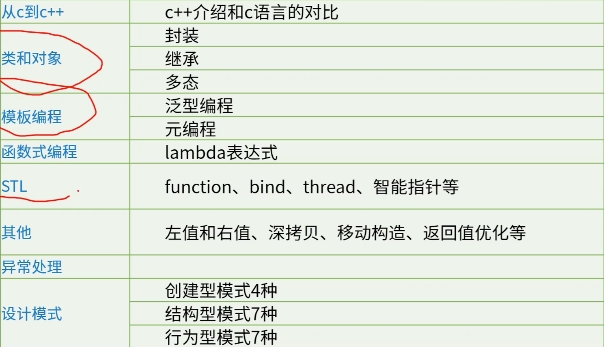
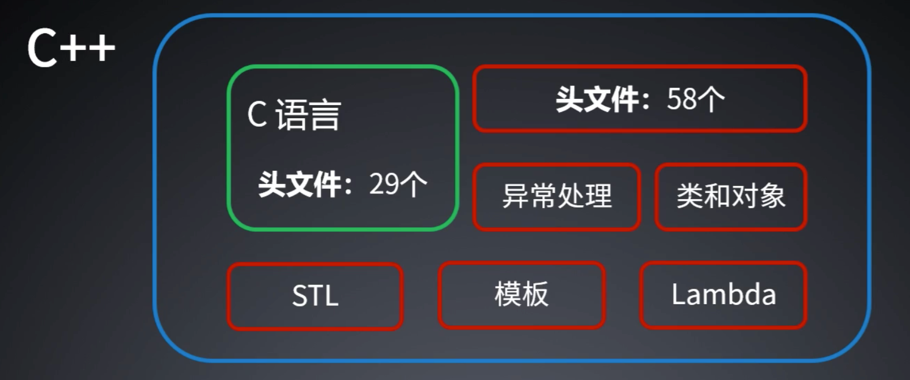

# s1.从C到C++

- 课程大纲



## C++介绍

### C with class

- Simula继承了类的概念
- Algol68运算符重载、引用以及在任何地方声明变量的能力
- Ada模板、名字空间
- 从Ada、Clu和ML取来了异常 
- BCPL获得了//注释

### C++介绍


- gcc中把图中的gnu换为g++



- 头文件变多了

- C++是C的超集

### C++11新特性

- auto关键字
- decltype关键字 
- nullptr字面值 
- constexpr关键字
- for (declaration: expression) 
- Lambda表达式
- initializer_list
- 标准库bind函数
- 智能指针shared＿ptr，unique＿ptr 
- 右值引用&&
- STL容器std::array,std::forward_list,std::unordered_map，std::unordered_set 

### C++14

- 拓展了lambda表达式，更加泛型：支持auto
- 拓展了类型推导至任意函数：C11只支持lambda返回类型的auto
- 弃用关键字[[deprecated]]

### C++17

- 拓展了constexpr至switch if等：C++11的constexpr函数只能包含一个表达式 

- typename 嵌套

- inline 内联变量 

- 模板参数推导

- 元组类 std::tuple：std::pair实现两个元素的组合，它实现多个类模板，std::variant表示一个类型安全的联合体。

- 引用包装器 std::reference_wrapper 

- 变长参数模板

- 结构化绑定（函数多值返回时用{}合成struct）

- 非类型模板参数可传入类的静态成员

- 在if和switch中可进行初始化

- 初始化（如struct）对象时，可用花括号进行对其成员进行赋值

- 简化多层命名空间的写法

- lambda表达式可捕获＊this的值，但this及其成员为只读

- 十六进制的单精度浮点数

- 继承与改写构造函数

- ```c++
   using B1::B1;//表示继承B1的构造函数
  ```

- 当模板参数为非类型时，可用auto自动推导类型

- 判断有没有包含某文件 has_include

### C++20

- concept用于声明具有特定约束条件的模板类型

  ```c++
  //声明一个数值类型的concept
  template<typename T>
  concept number = std::is_arithmetic<T>::value;
  ```

- 范围库（Range Library）
- 协程（Coroutines） 
- 模块（modules） 

### 编程范式

1. 面向过程

2. 面向对象

3. 泛型

4. 函数式

### C与C++对比

- C++：对象
- C：过程

## STL

### queue

- queue 类：队列
- 头文件：queue 
- 命名空间：std
- 声明：queue<data_type> q;

| operations   | Member functions |
| ------------ | ---------------- |
| 队首元素     | q.front()        |
| 队尾元素     | q.back()         |
| 队列判空     | q.empty()        |
| 入队         | q.push()         |
| 出队         | q.pop()          |
| 队列元素数量 | q.size()         |

### string

- 头文件：string
- 命名空间：std
- 声明：string s1;

| expression  | operations |
| ----------- | ---------- |
| s1 == s2    | 字符串判等 |
| s1 < s2     | 字典序小于 |
| s1 > s2     | 字典序大于 |
| s1 += s2    | 字符串连接 |
| s1.length() | 字符串长度 |

#### length与strlen

- length的时间复杂度是O(1)
- C语言strlen的时间复杂度是O(n)

```c++
/*************************************************************************
        > File Name: string.cpp
        > Author:
        > Mail:
        > Created Time: Mon 16 Aug 2021 11:18:23 AM CST
 ************************************************************************/

#include <iostream>
#include <string>
#include <cstring>
using namespace std;

int main() {
    string s1, s2;
    s1 = "gbdfads";//7
    s2 = "fdafaffaf";//
    cout << (s1 == s2) << endl;
    cout << (s1 > s2) << endl;
    cout << (s1 < s2) << endl;

    cout << s1[1] << endl;
    s1[1] = '!';//1
    s1[7] = '@';//2
    //s1[14] = '#';//3 s1[14] can be assign a value as stl will alloc double space.

    cout << s1 << " size = " << s1.size() << endl;

    s1 += "123456";
    cout << s1 << " size = " << s1.length() << endl;

    int n = 100000;
    while (n--) {
        s1 += "kkb";
    }

    n = 100000;
    while(n--) {
        s1.length();
    }

    clock_t begin, end;

    begin = clock();
    n = 100000;
    while(n--) {
        s1.c_str();
    }
    end = clock();
    cout << "cpp length() time = " << end - begin << endl;

    begin = clock();
    n = 100000;
    while(n--) {
        s1.c_str();
    }
    end = clock();
    cout << "c c_str() time = " << end - begin << endl;

    return 0;
}
```

- 事实上，经过编译器优化，两者测得的相差不大

```bash
youhuangla@Ubuntu s1 % ./a.out                                                                                      [0]
0
1
0
b
g!dfads size = 7
g!dfads123456 size = 13
cpp length() time = 271
c c_str() time = 271
```

#### hash_map

- 哈希表
- 非标准：不在std中
- 实现：红黑树
- 有默认的hash函数
- 头文件：<hash_map>/<ext/hash_map>
- 命名空间：__gnu_cxx
- 声明：hash_map<key_type, value_type, hash_func>
- 类似数组，但是可以用string做key，key里可以放负数和小数

| func           | operation                                  |
| -------------- | ------------------------------------------ |
| h.find(key)    | 判断某个key是否在hash_map中                |
| h[key] = value | 将value存在key位上                         |
| h[key]         | 访问key值对应的value                       |
| h.begin()      | 哈希表的起始位置                           |
| h.end()        | 哈希表的结束位置，指向最后一个元素的下一位 |

```c++
/*************************************************************************
        > File Name: map.cpp
        > Author:
        > Mail:
        > Created Time: Sat 21 Aug 2021 09:05:26 AM CST
 ************************************************************************/

#include <iostream>
#include <map>
using namespace std;
int main() {
    map<int, int> hashmap;//红黑树
    hashmap[0] = 32;
    hashmap[-89] = 213;
    hashmap[-76] = 453;
    hashmap[90] = 231;
    hashmap[1089] = 45434;
    for (auto it : hashmap) {
        cout << " key = " << it.first << " value = " << it.second << endl;
    }
    printf("\n");
    for (auto it  = hashmap.begin(); it != hashmap.end(); it++) {
        cout << " key = " << it->first << " value = " << it->second << endl;
    }
    printf("\n");
    for (map<int, int>::iterator it  = hashmap.begin(); it != hashmap.end(); it++) {
        cout << " key = " << it->first << " value = " << it->second << endl;
    }
    printf("\n");
    for (map<int, int>::reverse_iterator it  = hashmap.rbegin(); it != hashmap.rend(); it++) {
        //可以直接用auto关键字，前面声明类型不用写那么多
        cout << " key = " << it->first << " value = " << it->second << endl;
    }
    return 0;
}
```

- 可以看出是从小到大遍历的，如果是map<string, int>，则按ascii码顺序遍历

```bash
youhuangla@Ubuntu s1 % ./a.out                                                                                      [0]
 key = -89 value = 213
 key = -76 value = 453
 key = 0 value = 32
 key = 90 value = 231
 key = 1089 value = 45434

 key = -89 value = 213
 key = -76 value = 453
 key = 0 value = 32
 key = 90 value = 231
 key = 1089 value = 45434

 key = -89 value = 213
 key = -76 value = 453
 key = 0 value = 32
 key = 90 value = 231
 key = 1089 value = 45434

 key = 1089 value = 45434
 key = 90 value = 231
 key = 0 value = 32
 key = -76 value = 453
 key = -89 value = 213
```


### unordered_map

- 哈希表
- 头文件：unordered_map
- 命名空间：std声明：unordered_map<key_type, value_type, hash_func> h;
- 实现：哈希表
- 字面意思，无序
- 查询效率O(1)

| func           | operation                                  |
| -------------- | ------------------------------------------ |
| h.find(key)    | 判断某个key是否在hash_map中                |
| h[key] = value | 将value存在key位上                         |
| h[key]         | 访问key值对应的value                       |
| h.begin()      | 哈希表的起始位置                           |
| h.end()        | 哈希表的结束位置，指向最后一个元素的下一位 |

```c++
/*************************************************************************
        > File Name: hash.cpp
        > Author:
        > Mail:
        > Created Time: Fri 20 Aug 2021 03:20:41 PM CST
 ************************************************************************/

#include <iostream>
#include <unordered_map>
using namespace std;

int main() {
    unordered_map<int, int> hashmap;
    hashmap[0] = 32;
    hashmap[-89] = 213;
    hashmap[-76] = 453;
    hashmap[90] = 231;
    hashmap[1089] = 45434;

    cout << "size = " << hashmap.size() << endl;

    cout << "hashmap[90] = " << hashmap[90] << endl;
    hashmap[90] = 666;

    cout << "hashmap[90] = " << hashmap[90] << endl;
    for (auto i = hashmap.begin(); i != hashmap.end(); i++ ) {
        cout << "key = " << i->first << " value = " << i->second << endl;
    }
    printf("\n");
    for (auto i : hashmap ) {
        //cannot it->first, as "it" is not a pointer but a 迭代器?
        cout << "key = " << i.first << " value = " << i.second << endl;
    }
    return 0;
}
```

```bash
youhuangla@Ubuntu s1 % g++ unordered_map.cpp                                                                        [0]
youhuangla@Ubuntu s1 % ./a.out                                                                                      [0]
size = 5
hashmap[90] = 231
hashmap[90] = 666
key = 90 value = 666
key = -76 value = 453
key = 0 value = 32
key = 1089 value = 45434
key = -89 value = 213

key = 90 value = 666
key = -76 value = 453
key = 0 value = 32
key = 1089 value = 45434
key = -89 value = 213
```


## 编码规范

### 编码规范的重要性

1. 规范的代码可以促进团队合作。
2. 规范的代码可以减少bug处理。
3. 规范的代码可以降低维护成本。
4. 规范的代码有助于代码审查。
5. 统一的代码规范可以让大家轮岗更容易。

### 编码规范的原则

1. 是否是驼峰还是匈牙利方法不重要，重要的是执行。
2. 最重要的是命名，与其绞尽脑汁写注释，不如想想如何命名。
3. 好的版式易于阅读，学会用换行和注释做代码片段区隔。
4. 注释最重要是正确，一定要和代码保持同步。

### 代码规范

- 主要包括命名、版式、注释等几个方面。
- 其中命名包括变量、类、方法、文件名、数据库、表、字段、接口等方面。版式包括缩进、换行、对齐、大括号、循环体、逻辑判断等方面。
- 注释包括包注释、文件注释、类注释、方法注释、参数注释、变量注释、代码片段注释等。
