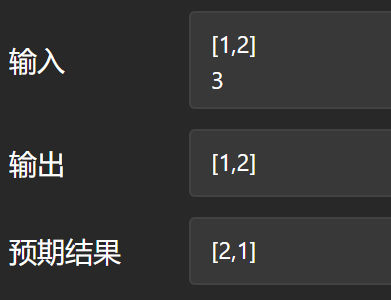
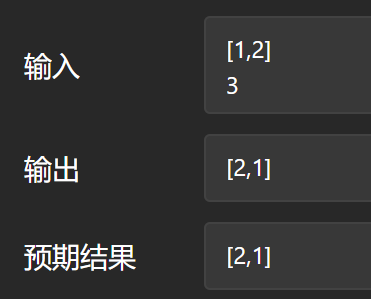
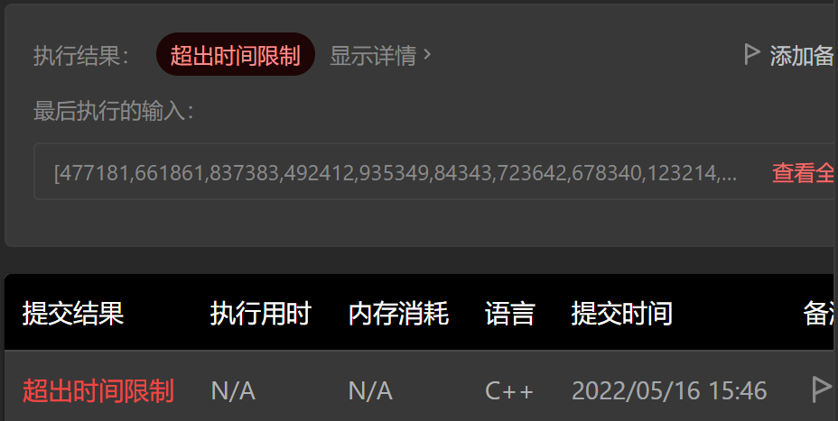

# 189.rotate-array

## Solution1

### Bug

```cpp
class Solution {
public:
    void rotate(vector<int>& nums, int k) {
        int size = nums.size();
        int rotate_num = (nums.size() - k > 0) ? (nums.size() - k) : (k - nums.size());
        
        //int rotate_num = (size - k > 0) ? (nums.size() - k) : (k - nums.size());

        for (int i = 0; i < rotate_num; i++) {
            std::rotate(nums.begin(), nums.begin() + 1, nums.end());
        }
    }
};
```



```cpp
class Solution {
public:
    void rotate(vector<int>& nums, int k) {
        int size = nums.size();
        //int rotate_num = (nums.size() - k > 0) ? (nums.size() - k) : (k - nums.size());
        
        int rotate_num = (size - k > 0) ? (size - k) : (k - size);

        for (int i = 0; i < rotate_num; i++) {
            std::rotate(nums.begin(), nums.begin() + 1, nums.end());
        }
    }
};
```



> | `constexpr size_type size() const noexcept;` | (C++20 起) |
> | -------------------------------------------- | ---------- |
>
> [std::vector<T,Allocator>::size \- cppreference\.com](https://zh.cppreference.com/w/cpp/container/vector/size)
>
> 在对诸如 [std::string](https://zh.cppreference.com/w/cpp/string/basic_string)、[std::vector](https://zh.cppreference.com/w/cpp/container/vector) 等 C++ 容器进行索引操作时，正确的类型是该容器的成员 typedef size_type，而该类型通常被定义为与 `std::size_t` 相同。
>
> [std::vector<T,Allocator>::size \- cppreference\.com](https://zh.cppreference.com/w/cpp/container/vector/size)

`nums.size() - k` 将不是一个负数，而是一个极大的正数。

### Code

参考[std::rotate - 轮转数组 - 力扣（LeetCode）](https://leetcode.cn/problems/rotate-array/solution/by-haers-i3a8/)

> ### 复杂度
>
> 与 `first` 和 `last` 间的距离成线性。
>
> [std::rotate \- cppreference\.com](https://zh.cppreference.com/w/cpp/algorithm/rotate)

```cpp
class Solution {
public:
    void rotate(vector<int>& nums, int k) {
        int size = nums.size();
        //int rotate_num = (nums.size() - k > 0) ? (nums.size() - k) : (k - nums.size());
        k = k % size;
        int rotate_num = (size - k > 0) ? (size - k) : (k - size);

        for (int i = 0; i < rotate_num; i++) {
            std::rotate(nums.begin(), nums.begin() + 1, nums.end());
        }
    }
};
```

正确但超时。



```cpp
class Solution {
public:
    void rotate(vector<int>& nums, int k) {
        int size = nums.size();
        
        k = k % size;
        int rotate_num = size - k;

        std::rotate(nums.begin(), nums.begin() + rotate_num, nums.end());
    }
};
```

```output
执行结果：通过
执行用时：52 ms, 在所有 C++ 提交中击败了9.11%的用户
内存消耗：24.3 MB, 在所有 C++ 提交中击败了76.46%的用户
通过测试用例：38 / 38
```

`std::rotate`是向左轮转，故不能直接套用，但是可以转换成向右轮转。观察发现，轮转其实有点像一个环，`std::rotate(beg, mid, end)`中的`mid`定了环的开始元素。观察发现，向右轮转 k 次等价于向左轮转 nums.size() - k 次，而向左轮转  nums.size() - k 次就等价于：将 nums 中的索引为 nums.size() - k 的元素放在环首，其余依次向左轮转。

### Complexity

复杂度：O(n)

## Solution2

> 我们遍历原数组，将原数组下标为 i 的元素放至新数组下标为 $(i+k) \bmod n $的位置，最后将新数组拷贝至原数组即可。
>
> 作者：LeetCode-Solution
> 链接：https://leetcode.cn/problems/rotate-array/solution/xuan-zhuan-shu-zu-by-leetcode-solution-nipk/
> 来源：力扣（LeetCode）
> 著作权归作者所有。商业转载请联系作者获得授权，非商业转载请注明出处。

### Bug

| 0    |      |      | 3    |      |      |      |
| ---- | ---- | ---- | ---- | ---- | ---- | ---- |
| 1    | 2    | 3    | 4    | 5    | 6    | 7    |
| 5    | 6    | 7    | 1    | 2    | 3    | 4    |

index : 0 -> 3

i + k % size?

```c
void rotate(int* nums, int numsSize, int k){
    int arr[numsSize];
    for (int i = 0; i < numsSize; i++) {
        arr[i + k % numsSize] = nums[i];
    }
    for (int i = 0; i < numsSize; i++) {
        nums[i] = arr[i];
    }
    return ;
}
```

```output
Line 4: Char 12: runtime error: index 7 out of bounds for type 'int [*]' [solution.c]
```

### Code

```c
void rotate(int* nums, int numsSize, int k){
    int arr[numsSize];
    for (int i = 0; i < numsSize; i++) {
        arr[(i + k) % numsSize] = nums[i];
    }
    for (int i = 0; i < numsSize; i++) {
        nums[i] = arr[i];
    }
    return ;
}
```

No, it's `(i + k) % size`.

```result
执行用时：108 ms, 在所有 C 提交中击败了71.34%的用户
内存消耗：21.5 MB, 在所有 C 提交中击败了83.87%的用户
通过测试用例：38 / 38
```

### Complexity

$O(n)$

