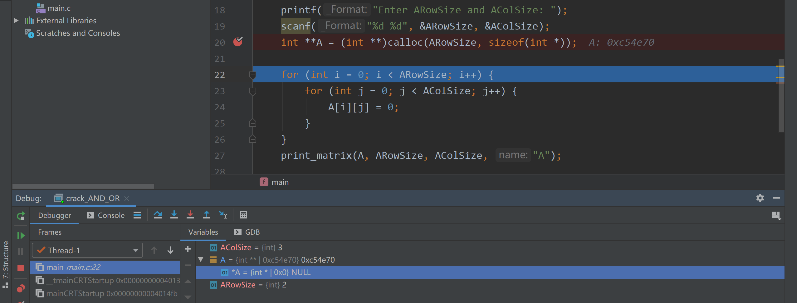

# Sparse Matrix Multiplication

vip题，故先抄题。

```c
/*
311. Sparse Matrix Multiplication
Given two sparse matrices A and B, return the result of AB.
You may assume that A's column number is equal to B's row number.
Example:
A = [
  [ 1, 0, 0],
  [-1, 0, 3]
]
B = [
  [ 7, 0, 0 ],
  [ 0, 0, 0 ],
  [ 0, 0, 1 ]
]
     |  1 0 0 |   | 7 0 0 |   |  7 0 0 |
AB = | -1 0 3 | x | 0 0 0 | = | -7 0 3 |
                  | 0 0 1 |
*/

/**
 * Return an array of arrays.
 * Note: The returned array must be malloced, assume caller calls free().
 */
int** multiply(int** A, int ARowSize, int AColSize, int** B, int BRowSize, int BColSize) {

}

```

## 矩阵的初始化、输入、输出

### 多维数组初始化

思考：这样对一个二维数组初始化可行吗？

```c
    int **A = (int **)malloc(ARowSize * sizeof(int *));

    for (int i = 0; i < ARowSize; i++) {
        for (int j = 0; j < AColSize; j++) {
            A[i][j] = 0;
        }
    }
```

不行，这样会造成`Segment fault`。`sizeof(int *)`计算的是一个指针的大小，所以

```c
#include <stdio.h>
#include <string.h>
#include <malloc.h>

void print_matrix(int **A, int ARowSize, int AColSize, char *name) {
    printf("The matrix of %s is:\n", name);
    for (int i = 0; i < ARowSize; i++) {
        for (int j = 0; j < AColSize; j++) {
            printf("%d ", A[i][j]);
        }
        printf("\n");
    }
}

int main() {
    int ARowSize, AColSize;
    int BRowSize, BColSize;
    printf("Enter ARowSize and AColSize: ");
    scanf("%d %d", &ARowSize, &AColSize);
    int **A = (int **)calloc(ARowSize, sizeof(int *));

    for (int i = 0; i < ARowSize; i++) {
        for (int j = 0; j < AColSize; j++) {
            A[i][j] = 0;
        }
    }
    print_matrix(A, ARowSize, AColSize, "A");

    return 0;
}
```

```shell
#in Clion
Enter ARowSize and AColSize:2 3

Process finished with exit code -1073741819 (0xC0000005)

```

> [What does an unhandled exception, 0xC0000005, mean in C code? \- Quora](https://www.quora.com/What-does-an-unhandled-exception-0xC0000005-mean-in-C-code)
>
> [0xC0000005](https://www.quora.com/What-does-an-unhandled-exception-0xC0000005-mean-in-C-code) is a code for Access Violation error. It means that your program just tried to read, or write, in a section of memory that it has no access to. Most likely, this happened due to poor usage of pointers.



可以看到，当为 A 分配完内存空间后，`*A`指向一个 NULL 的地址。当识图访问 `A[0][0]`时，自然会报错:这意味着您的程序刚刚尝试在无法访问的内存的一部分中读取或写入。

正确的做法是将每一个 `int *`类型的 `*A`分配一个$列数 \times sizeof(int)$大小的空间。

```c
#include <stdio.h>
#include <string.h>
#include <malloc.h>

void print_matrix(int **A, int ARowSize, int AColSize, char *name) {
    printf("The matrix of %s is:\n", name);
    for (int i = 0; i < ARowSize; i++) {
        for (int j = 0; j < AColSize; j++) {
            printf("%d ", A[i][j]);
        }
        printf("\n");
    }
}

int main() {
    int ARowSize, AColSize;
    int BRowSize, BColSize;
    printf("Enter ARowSize and AColSize: ");
    scanf("%d %d", &ARowSize, &AColSize);
    int **A = (int **)malloc(ARowSize * sizeof(int *));

    for (int i = 0; i < ARowSize; i++) {
        A[i] = (int *)malloc(AColSize * sizeof(int));
    }

    for (int i = 0; i < ARowSize; i++) {
        for (int j = 0; j < AColSize; j++) {
            A[i][j] = 0;
        }
    }
    print_matrix(A, ARowSize, AColSize, "A");

    return 0;
}
```

```shell
Enter ARowSize and AColSize: 3 4
The matrix of A is:
0 0 0 0 
0 0 0 0 
0 0 0 0 
```

还是不太清楚，先看《现代方法》和《C和指针》

在现代方法的 17.3.2 节中，可以使用 calloc 快速为数组分配内存空间并初始化。

所以可以改进成

```c
#include <stdio.h>
#include <string.h>
#include <malloc.h>

void print_matrix(int **A, int ARowSize, int AColSize, char *name) {
    printf("The matrix of %s is:\n", name);
    for (int i = 0; i < ARowSize; i++) {
        for (int j = 0; j < AColSize; j++) {
            printf("%d ", A[i][j]);
        }
        printf("\n");
    }
}

int main() {
    int ARowSize, AColSize;
    int BRowSize, BColSize;
    printf("Enter ARowSize and AColSize: ");
    scanf("%d %d", &ARowSize, &AColSize);
    int **A = (int **)malloc(ARowSize * sizeof(int *));

    for (int i = 0; i < ARowSize; i++) {
        A[i] = (int *)calloc(AColSize, sizeof(int));
    }

    print_matrix(A, ARowSize, AColSize, "A");

    return 0;
}
```

```shell
Enter ARowSize and AColSize: 4 3
The matrix of A is:
0 0 0 
0 0 0 
0 0 0 
0 0 0 
```

故最后：

```c
#include <stdio.h>
#include <string.h>
#include <malloc.h>

void print_matrix(int **A, int ARowSize, int AColSize, char *name) {
    printf("The matrix of %s is:\n", name);
    for (int i = 0; i < ARowSize; i++) {
        for (int j = 0; j < AColSize; j++) {
            printf("%d ", A[i][j]);
        }
        printf("\n");
    }
}

int **init_matrix(int Row, int Col) {
    int **M = (int **)malloc(Row * (sizeof(int *)));
    for (int i = 0; i < Row; i++) {
        M[i] = (int *)calloc(Col, sizeof(int));
    }
    return M;
}

int **input_matrix(int **M,int Row, int Col) {
    for (int i = 0; i < Row; i++) {
        for (int j = 0; j < Col; j++) {
            scanf("%d", &M[i][j]);
        }
    }
    return M;
}

int main() {
    int ARowSize, AColSize;
    printf("Enter ARowSize and AColSize: ");
    scanf("%d %d", &ARowSize, &AColSize);
    int **A = init_matrix(ARowSize, AColSize);
    A = input_matrix(A, ARowSize, AColSize);

    print_matrix(A, ARowSize, AColSize, "A");

    return 0;
}
```

```shell
Enter ARowSize and AColSize: 2 3
1 2 3
4 5 6
The matrix of A is:
1 2 3 
4 5 6 
```

接着我们完成数组相乘函数 `multiply` 

## Solution

### Standard

```c
/*************************************************************************
	> File Name: 311.c
	> Author: 
	> Mail: 
	> Created Time: Wed May 11 19:13:47 2022
 ************************************************************************/

#include <stdio.h>
#include <string.h>
#include <malloc.h>

void print_matrix(int **A, int ARowSize, int AColSize, char *name) {
    printf("The matrix of %s is:\n", name);
    for (int i = 0; i < ARowSize; i++) {
        for (int j = 0; j < AColSize; j++) {
            printf("%d ", A[i][j]);
        }
        printf("\n");
    }
}

int** multiply(int** A, int ARowSize, int AColSize, int** B, int BRowSize, int BColSize) {
    int **result, *buff;
    int i, j, k;
    
    result = malloc(ARowSize * sizeof(int *));
    //assert(result);
    for (i = 0; i < ARowSize; i ++) {
        buff = calloc(BColSize, sizeof(int));
        //assert(buff);
        result[i] = buff;
        for (j = 0; j < AColSize; j ++) {
            if (A[i][j] != 0) {
                //printf("\nAij: %d\n", A[i][j]);
                for (k = 0; k < BColSize; k ++) {
                    //printf("Bjk: %d, ", B[j][k]);
                    buff[k] += A[i][j] * B[j][k];
                }
            }
        }
    }
    
    return result;
}

int **init_matrix(int Row, int Col) {
    int **M = (int **)malloc(Row * (sizeof(int *)));
    for (int i = 0; i < Row; i++) {
        M[i] = (int *)calloc(Col, sizeof(int));
    }
    return M;
}

int **input_matrix(int **M,int Row, int Col) {
    for (int i = 0; i < Row; i++) {
        for (int j = 0; j < Col; j++) {
            scanf("%d", &M[i][j]);
        }
    }
    return M;
}

int main() {
    int ARowSize, AColSize, BRowSize, BColSize;

	//A
    printf("Enter ARowSize and AColSize: ");
    scanf("%d %d", &ARowSize, &AColSize);
    int **A = init_matrix(ARowSize, AColSize);
    A = input_matrix(A, ARowSize, AColSize);

    print_matrix(A, ARowSize, AColSize, "A");

	//B
    printf("Enter BRowSize and BColSize: ");
    scanf("%d %d", &BRowSize, &BColSize);
    int **B = init_matrix(BRowSize, BColSize);
    B = input_matrix(B, BRowSize, BColSize);
    
    print_matrix(B, BRowSize, BColSize, "B");

	//C
    int **C = multiply(A, ARowSize, AColSize, B, BRowSize, BColSize);
    print_matrix(C, ARowSize, BColSize, "C");
    return 0;
}

```

```input
2 3
1 0 0
-1 0 3
3 3
7 0 0
0 0 0
0 0 1
```

```output
Enter ARowSize and AColSize: The matrix of A is:
1 0 0 
-1 0 3 
Enter BRowSize and BColSize: The matrix of B is:
7 0 0 
0 0 0 
0 0 1 
The matrix of C is:
7 0 0 
-7 0 3 
```

### My

```c
int** multiply(int** A, int ARowSize, int AColSize, int** B, int BRowSize, int BColSize) {
    //loop iteration
    int **C = init_matrix(C, ARowSize, BColSize);

    for (int a_r = 0; a_r < ARowSize; a_r++) {
        for (int b_c = 0; b_c < BColSize; b_c++) {
            //C: ARowSize, BColSize
            //里面的循环？
            for (int i = 0/*i can be row or col*/; i < AColSize; i++) {
                C[a_r][b_c] += A[a_r][i] * B[i][b_c];
            }
        }
    }
    return C;
}
```

#### 最里面的循环

卡了好久，但是其实只要纸笔稍加分析即可。

举个题目的例子：两个矩阵A、B相乘：$A \times B = C$
$$
\begin{bmatrix}

1 & 0 & 0 \\
-1 & 0 & 3 \\
0 & 0 & 1

\end{bmatrix} 
\times
\begin{bmatrix}

7 & 0 & 0 \\
-7 & 0 & 3 

\end{bmatrix}
= 
\begin{bmatrix}
7 & 0 & 0 \\
-7 & 0 & 3
\end{bmatrix}
$$
最外层由于 $A_{a \times b} \times B_{b \times c} = C_{a \times c}$。所以求出 C 矩阵就一定要遍历 C 矩阵中的每一个元素，故写出最外层两层 for 循环。

```c
    for (int a_r = 0; a_r < ARowSize; a_r++) {
        for (int b_c = 0; b_c < BColSize; b_c++) {
```

接着是里面的循环：

首先我们举例子不要从 `c[0][0]`这种位置举例子，行数和列数一样傻傻分不清。

从`c[1][2]`这样的例子开始，在数学中我们一般标记为$c_{23}$。根据线性代数的知识，矩阵相乘，

$c_{23} = a_{遍历矩阵A的第2行} \times b_{遍历矩阵B的第3列}$。而遍历过程中 a 的行数和 b 的列数都相等，且从 1 遍历到 A 的列数（即 B 的行数）。转换为C语言：

```c
for (int a_r = 0; a_r < ARowSize; a_r++) {
    for (int b_c = 0; b_c < BColSize; b_c++) {
        for (int i = 0/*i can be row or col*/; i < AColSize; i++) {
            C[a_r][b_c] += A[a_r][i] * B[i][b_c];
        }
    }
}
```

