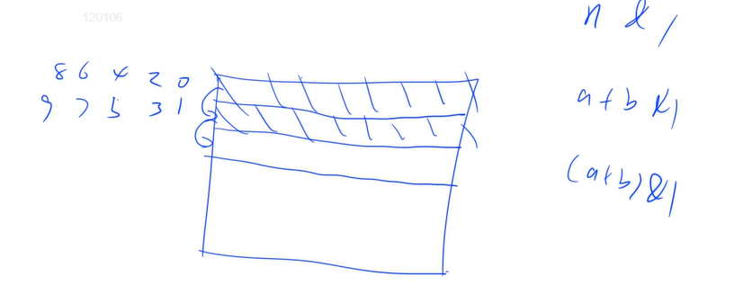

# 119.pascals-triangle-ii

## Solution

[119. 杨辉三角 II - 力扣（LeetCode）](https://leetcode.cn/problems/pascals-triangle-ii/)

该题与[118. 杨辉三角 - 力扣（LeetCode）](https://leetcode.cn/problems/pascals-triangle/)区别是只返回一行的杨辉三角。

```cpp
class Solution {
public:
    vector<int> getRow(int n) {
        //yxc
        // recursive O(n^2)
        //188 change a little
        n++;
        vector<vector<int>> f;
        for (int i = 0; i < n; i++) {
            vector<int> line(i + 1);
            line[0] = line[i] = 1;
            for (int j = 1; j < i; j++) {
                line[j] = f[i - 1][j - 1] + f[i - 1][j];
            }
            f.push_back(line);
        }
        return f[n - 1];
    }
};
```

yxc

```cpp
class Solution {
public:
    vector<int> getRow(int n) {
        vector<vector<int>> f(n + 1, vector<int>(n + 1));
        for (int i = 0; i <= n; i++) {
            f[i][0] = f[i][i] = 1;
            for (int j = 1; j < i; j++) {
                f[i][j] = f[i - 1][j - 1] + f[i - 1][j];
            }
        }
        return f[n];
    }
};
```

## 进阶

**进阶：**

你可以优化你的算法到 `O(rowIndex)` 空间复杂度吗？

### Solution

先算出第 0 行和第 1 行

当你算第 2 行的时候，可以发现第 0 行的空间已经没用了，所以可以把第 2 行的数存到第 0 行，以此类推。



```cpp
a + b & 1;
//equal to
(a + b) & 1;
```

```cpp
class Solution {
public:
    vector<int> getRow(int n) {
        vector<vector<int>> f(2, vector<int>(n + 1));// n + 1 change to 2
        for (int i = 0; i <= n; i++) {
            f[i & 1][0] = f[i & 1][i] = 1;//i & 1 should be remembered
            for (int j = 1; j < i; j++) {
                f[i & 1][j] = f[i - 1 & 1][j - 1] + f[i - 1 & 1][j];
            }
        }
        return f[n & 1];
    }
};
```

