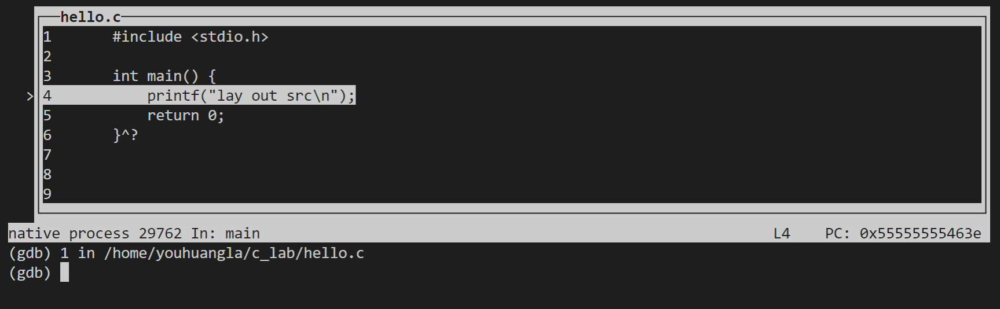
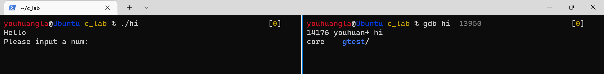
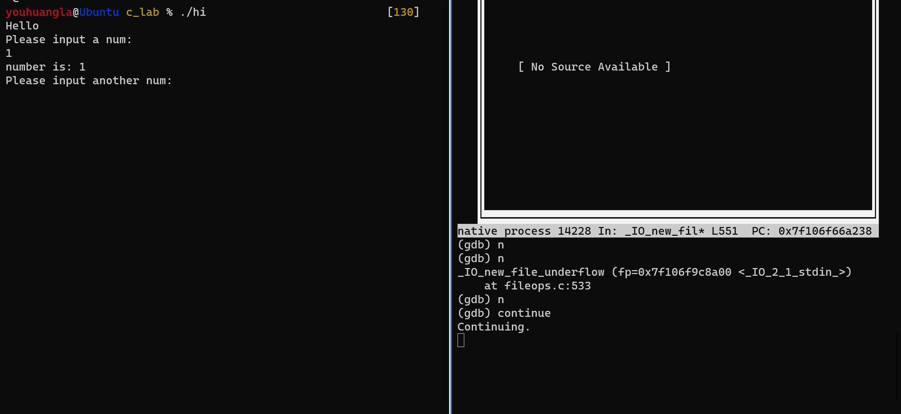
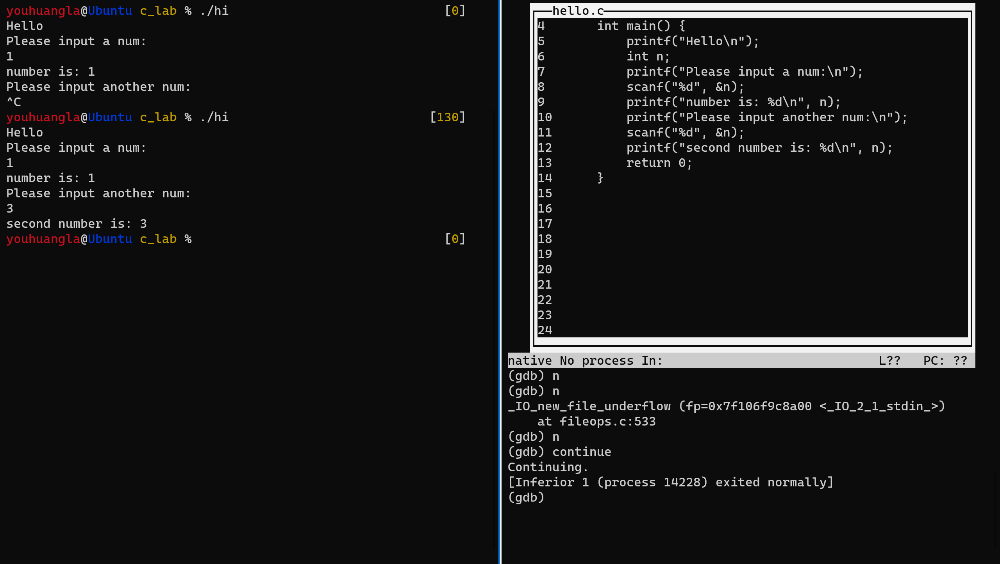

# C

* C语言实现在控制台同一行覆盖刷新输出，以及'\b'退格控制字符的使用https://blog.csdn.net/zhanghuoding/article/details/52041120

## Debug

### GDB

```shell
youhuangla@Ubuntu c_lab % gcc -g hello.c                                                                     [0]
youhuangla@Ubuntu c_lab % gdb a.out                                                                          [0]
GNU gdb (Ubuntu 8.1.1-0ubuntu1) 8.1.1
......
```

```gdb
(gdb) start
Temporary breakpoint 1 at 0x63e: file hello.c, line 4.
Starting program: /home/youhuangla/c_lab/a.out 

Temporary breakpoint 1, main () at hello.c:4
4           printf("lay out src\n");
(gdb) layout src
```



#### Input

[io \- How to use gdb with input redirection? \- Stack Overflow](https://stackoverflow.com/questions/4758175/how-to-use-gdb-with-input-redirection)

#### Attach a process

[unix \- How to attach a process in gdb \- Stack Overflow](https://stackoverflow.com/questions/14370972/how-to-attach-a-process-in-gdb)

试了n久，结果发现没有sudo，真的坑

```shell
gcc -g hello.c -o hi
```

```shell
GNU gdb (Ubuntu 8.1.1-0ubuntu1) 8.1.1
......
Attaching to program: /home/youhuangla/c_lab/hi, process 14014
Could not attach to process.  If your uid matches the uid of the target
process, check the setting of /proc/sys/kernel/yama/ptrace_scope, or try
again as the root user.  For more details, see /etc/sysctl.d/10-ptrace.conf
ptrace: Operation not permitted.
......
```

sudo added:

```shell
gdb hi#Press "Tab" to show and "Shift Tab to choose"
gdb hi 14176
```



```shell
youhuangla@Ubuntu c_lab % ./hi                           [130]
Hello
Please input a num:
1
```

```shell
#another terminal
(gdb) n
(gdb) n
_IO_new_file_underflow (fp=0x7f106f9c8a00 <_IO_2_1_stdin_>)
    at fileops.c:533
```





调试 bomb lab 时，试图这样做会出现奇怪的结果。猜测是因为没有完整的源代码信息。

```shell
youhuangla@Ubuntu bomb % sudo cgdb --p 30184      [0]
```


### CGDB

[终端调试哪家强？ - 知乎 (zhihu.com)](https://zhuanlan.zhihu.com/p/32843449)

[《深入理解计算机系统》配套实验：Bomblab - 知乎 (zhihu.com)](https://zhuanlan.zhihu.com/p/31269514)

[GDB/CGDB 入门与拆弹游戏 - 知乎 (zhihu.com)](https://zhuanlan.zhihu.com/p/120378884)

另见CSAPP_lab中的bomb lab
