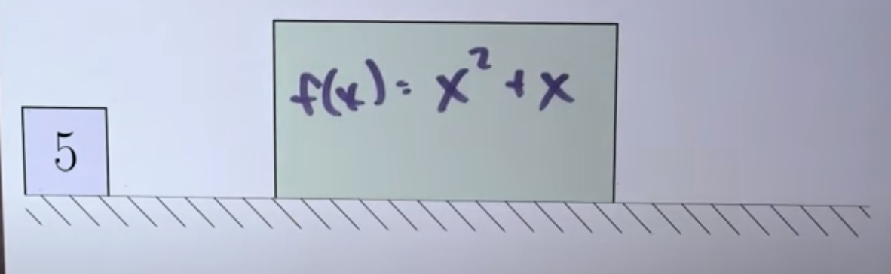
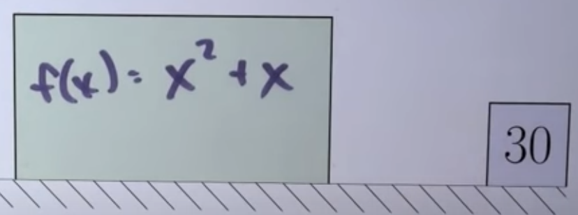
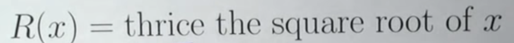
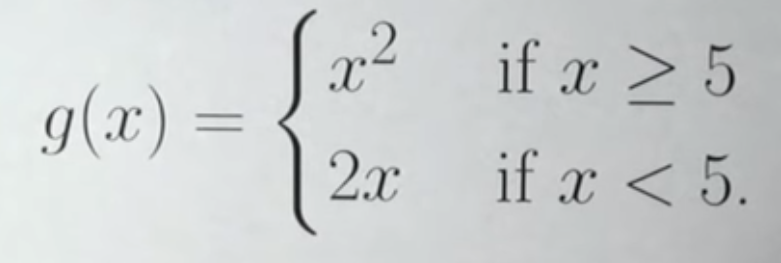
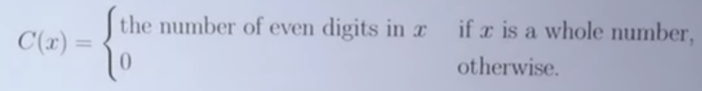
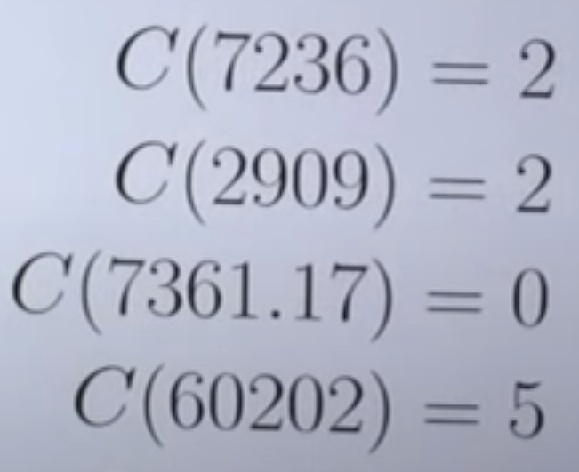
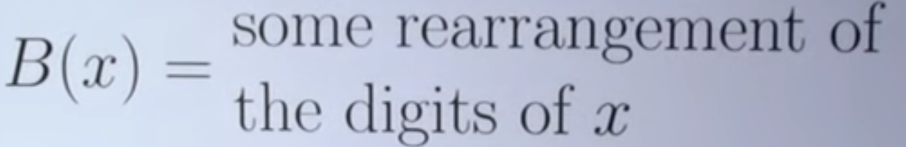
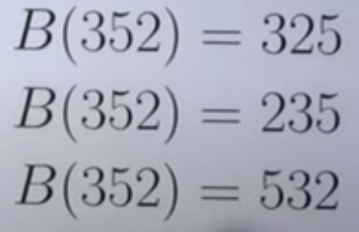

# Calculas_One

[Mooculus 1: Functions and limits \- YouTube](https://www.youtube.com/playlist?list=PLjOkVtsM_edKlAd5unZC0WxSUQTjv6Dpd)

[【俄亥俄州立大学】 Calculus One \#微积分基础（Coursera精选）\_哔哩哔哩\_bilibili](https://www.bilibili.com/video/BV194411R7oy/?vd_source=4ed832873c3b70388cd7746abf15ce0a)

[kisonecat\.com \- k = 1 cat \- Jim Fowler](https://kisonecat.com/)

[fowler@math.osu.edu](mailto:fowler@math.osu.edu)

[Home \- Ximera](https://ximera.osu.edu/)

## Ximera Intro

### Educators

Ximera lets you write documents in **LATEX** and post them as interactive activities online for your students.

By relying on GitHub to store content, you can easily share activities with your colleagues.

[View GitHub »](https://github.com/mooculus/calculus)

### Students

Ximera brings the classroom to you, wherever you are.

You can use your favorite device to study math anywhere, anytime.

[View Textbooks »](https://ximera.osu.edu/mooculus)

### Researchers

Ximera computes statistics on student success, such as point biserials.

By creating branches in GitHub, you can quickly run A/B tests on student performance.

[Calculus 1 \- Ximera](https://ximera.osu.edu/mooculus/calculus1)

## xake

Use `xake` to convert your own TEX documents into interactive computer-graded worksheets. “Ximera begins where TEX ends.”

[XimeraProject/xake: The new build system for Ximera content written in Go](https://github.com/ximeraproject/xake)

## Ximera tutorial

After completing this section, students should be able to do the following.

-   Type answers into Ximera.
-   Update Ximera activities.

Mathematics cannot be learned passively : it must be actively [constructed](http://en.wikipedia.org/wiki/Constructivism_(philosophy_of_education)) by the person learning it. With this in mind, this course is built around solving problems!

Here are some examples. Play around with it, get it wrong, try the hints out. Don’t be afraid to fail: **getting an answer wrong never hurts you.**

## How to use Ximera

For this course, you should always have a paper and pencil near at hand to make notes, doodle pictures, or solve complicated equations. We **strongly** recommend that you really **grapple** with a problem before getting a hint, or moving on. The difference between what you learn by struggling with a problem on your own versus perusing someone else’s solution is astonishing.

With that said, even if you get an answer right you should **always** try the hints out afterwards. They might explain the concept from a new point of view, or challenge you to think in a different way than you solved the problem.

We support a few different answer types. Here are some example problems from the different answer types we support:

As you complete activities the green “completion bar” moves at the top of the page. This lets you know how close you are to being done with an activity.

You advance through pages either by completing them and clicking the “next activity” button, or by navigating on the little scroll bar at the top of the page.
$$
(x^2 + y^2) / 7
$$

$$
tan(x) / (2xa + b^2)
$$

$$
arcsin(x)
$$

Note that typing sin^(-1)(x)sin^(-1)(x) does not work.
$$
abs(x)
$$
You can type |x| |x| or abs(x) abs(x), but abs(x) abs(x) may be preferable because it is easier to parse appropriately.
$$
log(x + 1) \\
ln(x + 1)
$$
You could type ln(x+1) or log(x+1), **N**ot the **S**ame **I**n **M**arkdown.
$$
sin(\theta)
$$
Type sin(theta), NSIM.(same as last one)
$$
\phi
$$
Type phi, NSIM.
$$
\rho
$$
Type rho

[Using Greek Letters \- TeX \- LaTeX Stack Exchange](https://tex.stackexchange.com/questions/100882/using-greek-letters)
$$
\sqrt{x} \\
x ^ {1 / 2} \\
x ^ {\frac{1}{2}}
$$

Type sqrt(x), It would also work to type x^(1/2), NSIM.
$$
\sqrt[3]{y}
$$
We do not have a “slick” way to enter this, so you should just type `y^(1/3)`, which is equivalent. NSIM.
$$
DNE
$$
Type DNE.

[Find the limit, if it exists, or type 'DNE' if it \.\.\. \| Chegg\.com](https://www.chegg.com/homework-help/questions-and-answers/find-limit-exists-type-dne-notexist-q375489)

This web needs to be paid.

>   -   In mathematics it may be used as an abbreviation to illustrate that a proper solution to some problem **D**oes **N**ot **E**xist.
>
>   [DNE \- Wikipedia](https://en.wikipedia.org/wiki/DNE#:~:text=In%20mathematics%20it%20may%20be,law%20of%20double%20negation%20elimination.)

$$
\infin \\
$$

Type inftyinfty or infinity or oo. NSIM.

As you complete activities the green “completion bar” moves at the top of the page. This lets you know how close you are to being done with an activity.

You advance through pages either by completing them and clicking the “next activity” button, or by navigating on the little scroll bar at the top of the page.

## How is my work scored?

We want you to learn from this text. Hence, we ask questions to “push” your thinking, and leave blanks in examples to ensure you are following along. We encourage you to **keep a notebook** where you write each question and your answers, along with each major theorem and example. In essence we want you to imagine that **we are writing mathematics together**, and thus are exploring a new world of mathematics together.

etc

## Video Begins Here:

## L0.Who will help me?

[Who will help me? \- Week 1 Introduction \- Mooculus \- YouTube](https://www.youtube.com/watch?v=R4xtSdvkG-s&list=PLjOkVtsM_edKlAd5unZC0WxSUQTjv6Dpd&ab_channel=JimFowler)

One does not simply walk into calculus. But to prepare you, we offer four resources.

1.   The first is this, these videos where you can watch us do some mathematics. 
2.   Second, a text book where you can read the mathematics being done in a bit more detail.
3.   Third nucleus, a website full of calculus problems that react to your performance.When you get the questions right, it gives you harder problems.And if you don't know how to do the problems, it has hints so you can discover the answer. But there's a fourth resource we provide.
4.   And that fourth resource is each other. You can't do this by yourself.If you're having trouble. Post a message to the forum.Send us an email, give us a call. You're not alone.This course isn't just about doing calculus problems.It's about doing calculus problem in fellowship with one another, .

And so let's get started together.

## L1.What is a function

[What is a function? \- Week 1 \- Lecture 1 \- Mooculus \- YouTube](https://www.youtube.com/watch?v=2MrH499MvHw&list=PLjOkVtsM_edKlAd5unZC0WxSUQTjv6Dpd&index=2&ab_channel=JimFowler)

A **<u>function</u>** assigns to each number in its **domain** another number.

one way to talk about these assignments is to use a rule,

the **<u>domain</u>** consists of all numbers for which the rule makes sense.

You could imagine a, a conveyor belt with the function, you know, And you could imagine the numbers coming in.Boom. Being hit by the function and then going out transformed somehow, by whatever the rule is of the function.

Here's what I'm talking about. I've got a conveyor belt here, I got this big box, and imagine if that big box is the function.

You can also write down a function just using English words. 

We can kind of combine those two things, alright?

We can use the English to sort of pick out different kinds of of algebra.

Let me just do with some calculations and that might convince you, you know, how, how this notation is,

this so-called **<u>piecewise</u>** notation works.

And it is a really different and crazy function, right?

Bad function.(Even not a function)

A function is suppose to ***take its input and produce unambiguously a single output value***. But this so-called function takes this single input value and purportedly produces all these possible outputs.

This thing here is not a function, alright?

A function takes one input and produces one output.

## Understanding functions

After completing this section, students should be able to do the following.

-   State the definition of a function.
-   Find the domain and range of a function.
-   Distinguish between functions by considering their domains（定义域）.
-   Determine where a function is positive or negative.
-   Plot（绘制） basic functions.
-   Perform basic operations and compositions on functions.
-   Work with piecewise（分段） defined functions.
-   Determine if a function is one-to-one.
-   Recognize different representations of the same function.
-   Define and work with inverse functions（反函数）.
-   Plot inverses of basic functions.
-   Find inverse functions (algebraically（代数） and graphically（图表）).
-   Find the largest interval（区间） containing a given point where the function is invertible（可逆的）.
-   Determine the intervals on which a function has an inverse.