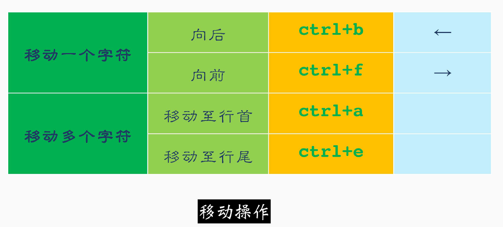
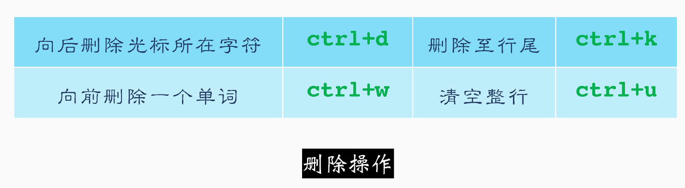
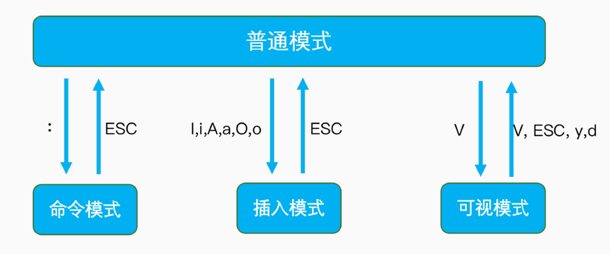
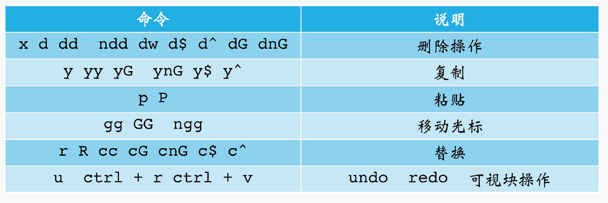
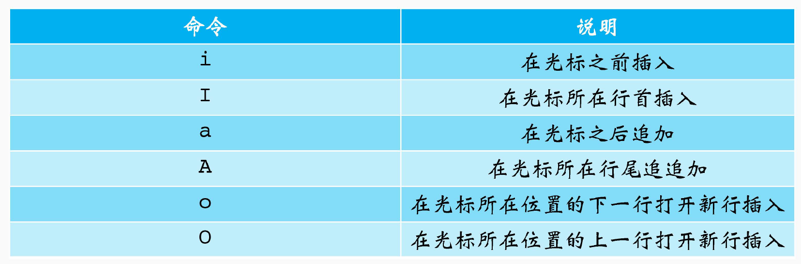
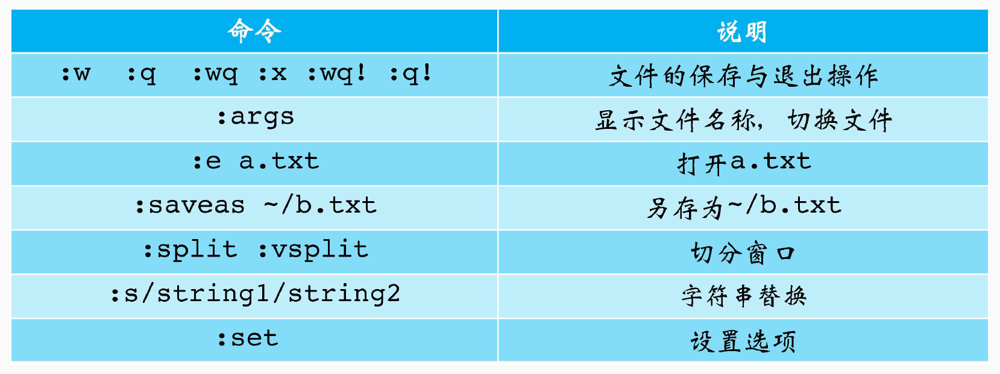
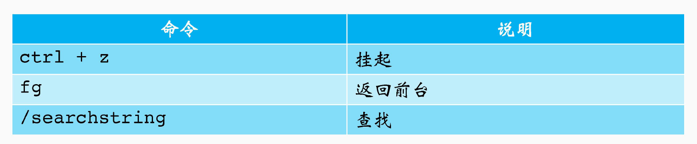
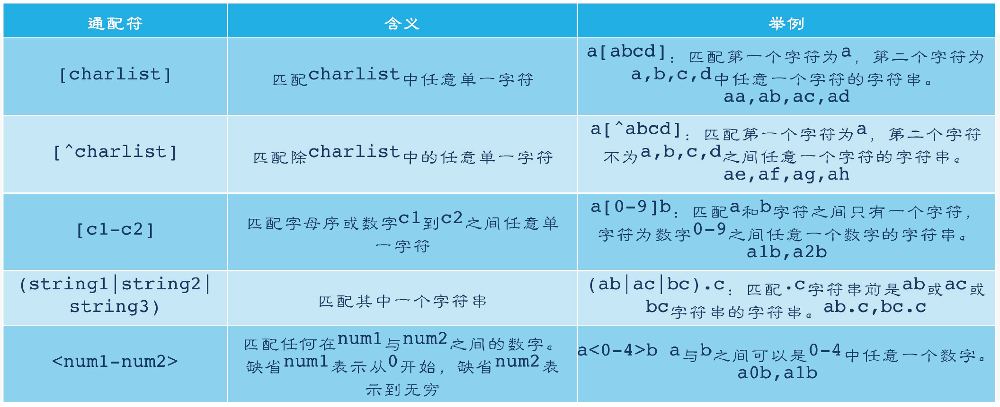

# s2

本节课将重点讲解zsh的使用技巧，使用云主机编程的技巧，帮助手册及100个Linux常见命令

## 高效使用云主机

### zsh

强大的shell 解释器

特性：

-   兼容bash: 99 ％ 的Bash 操作和zsh 是相同的
-   强大的历史记录功能
-   强大的补全功能：目录补全、命令补全、命令参数补全
-   强大的插件： oh-my-zsh
-   智能跳转 autojump: j + 目录
-   无需cd 的目录跳转
-   多种主题

sudo apt update #更新软件列表

sudo apt install zsh #下载安装shell

默认解释器修改 chsh -s /bin/zsh

zsh 配置文件

~/.zshrc         /etc/zshrc 

~/.zlogin        /etc/zlogin 

~/.zlogout       /etc/zlogout 

~/.zprofile        /etc/zprofile

etc：“全局”的意思，配置文件所在地

zsh启动过程中资源和配置文件是怎么执行的？

#### zsh 命令行操作





`ctrl + c` : 丢弃所有当前编辑的命令


### vim 的使用



#### 普通模式



#### 插入模式




#### 命令模式



#### 其他使用技巧



vim -t string 打开并跳转到 string

### ctags的使用

#### 变星

全局变量可通过Tlist显示

#### 函数

定义的函数可以列出，也可跳转

#### 类型

系统中，自定义的类型都可以使用ctags来查看其定义

#### 往返跳转

ctr| ＋]进入定义

ctrl + o返回上—级

### 重定向

`>`：重定向符号，从命令到文件的重定向

`>>`：追加符号，从命令到文件的追加

`<` ：重定向符号，从文件到命令的重定向

### 通配符



### 管道

pipe

`|` : 将管道符号左边命令的标准输出，作为管道符号右边命令的标准输入

### 转义符

`\` : 反斜杠,转义,去除其后紧跟的元字符或通配符的特殊意义。

`''` : 硬转义,硬引用,其内部所有的shell元字符、通配符都会被关掉。注意,硬转义中不允许出现`''`

`""` : 软转义,软引用,其内部只允许出现特定的shell元字符: `$`用于变量值替换、`用于命令替换、\用于转义单个字符

### 手册

#### man

系统自带

系统中的命令， C语言的函数库，常见协议，配置文件等都有完备的手册

-   Linux/Unix系统自带，无需单独安装
-   系统中的每个命令都有自己的man 手册
-   是我们学习操作系统、C语言的一大杀器
-   也是学习英语的好机会

#### tldr

短小精悍

man 手册虽好，但实在是太长了

tldr提供了常见命令的常见使用方式，但只限于命令

-   开源高效能工具，聚焦常见命令
-   可以使用pip来安装
-   手册在github上共享，首次需要下载
-   并不是所有的命令都可以使用tldr

#### MAN手册支持的范围

-   系统调用
-   特殊文件
-   普通的Linux命令
-   C语言的库函数
-   游戏
-   管理员命令
-   指定文件格式
-   附件、变量

## Linux常见命令

### 文件及目录相关命令

ls 查看目录下内容

cd 目录跳转

pwd 打印工作目录

cp 拷贝

ln 创建连接文件

mv 移动文件及目录

rm 删除文件及目录

mkdir 创建目录

tree 打印目录树

tar 文件归档与压缩

### 文件内容的修改与查看

touch 创建空白文件

head 查看文件头部

cat 查看文件内容

tail 查看文件尾部

vim 文本编辑器

diff 对比文件

echo 打印文本

grep 检索信息

more 分页查看文件

WC 计数

less 分页查看文件

### 文件的查找与定位

find 查找文件

which 查找可执行文件

whereis 查找可执行、源码、帮助手册

locate 定位任何文件

### 用户相关命令

useradd 新建用户

chgrp 修改所属组

userdel 删除用户

chmod 文件权限修改

usermod 修改用户

chown 修改文件所属

passwd 修改密码

logout 退出用户

su 切换用户

exit 退出用户

sudo 获取管理员权限

### 进程相关命令

ps 打印进程

ctrl +z 挂起前台进程

kill 杀死进程

fg 将进程调至前台运行

pkill 批量杀死进程

bg 让挂起的进程后台执行

killall 批量杀死进程

jobs 查看挂起和后台进程

crotab 定时任务

### 系统信息获取命令

date 查看时间

dstat 查看系统信息

df 查看文件系统

nmon 查看系统信息

du 获取目录文件大小

ifconfig 查看IP信息

free 查看内存

uname 查看OS信息

top 查看系统信息

last 查看最近登录

htop 查看系统信息

who 查看当前登录

### 其他命令

ssh 远程连接

poweroff 关机

scp 远程拷贝

reboot 重启

wget 获取http文件

ping 测试远程主机

## 线上源码获取方式

### 使用git下载源码

[suyelu/KKB\-OS\-0330: 操作系统课程随堂代码](https://github.com/suyelu/KKB-OS-0330)

[KKB\-OS\-0330: 同步克隆自github](https://gitee.com/suyelu/KKB-OS-0330)

1．使用下面命令获取源码

```shell
git clone https://github.com/suyelu/KKB-os-0330.git
git clone https://gitee.com/suyelu/KKB-OS-0330
```

2．使用下面命令来更新源码

```shell
git pll
```

 3．如果本地修改了，可以每次删除目录，重新执行第一步