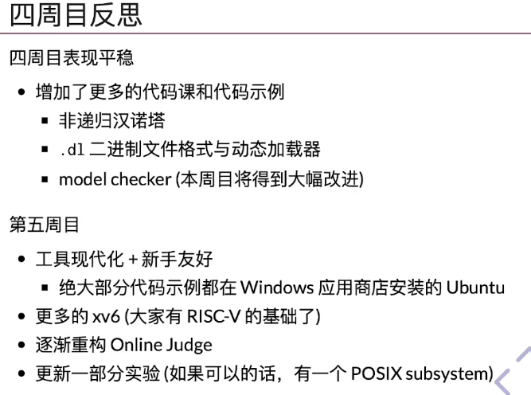
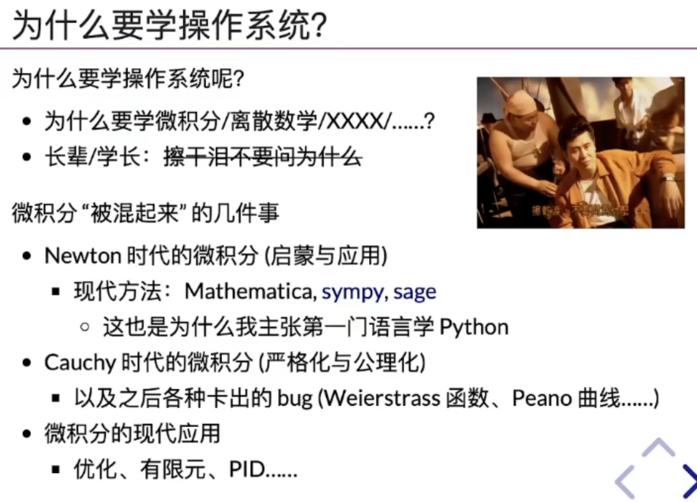
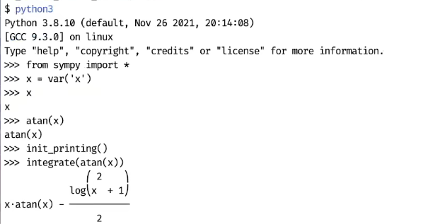
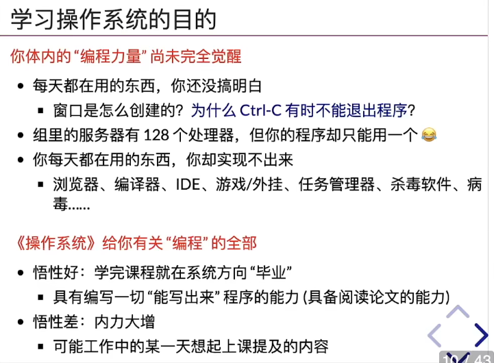
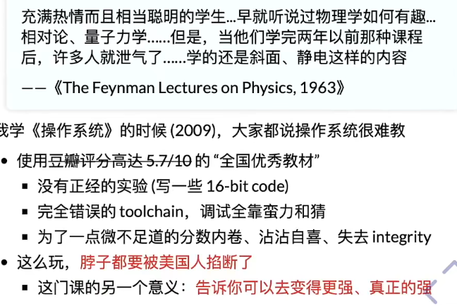

# l1. 操作系统概述

## 四周目反思与第五周目展望

## 环境

- wsl

## 为什么要学操作系统

j：

微分中值定理，会用，会做题，刷了很多题但是感觉还是很糟糕，因为没有理解微积分背后的东西比，如实数的概念，处处连续，处处不可导。微积分的公理化和计算分开。不用讲微积分的技巧

使用python包sympy：

arctan(x)的积分，计算技巧，有意义吗？

> 按偏差的比例（P）、积分（I）和微分（D）进行控制的[PID控制器](https://baike.baidu.com/item/PID控制器/1888589)（亦称[PID调节器](https://baike.baidu.com/item/PID调节器/4092310)）是应用最为广泛的一种[自动控制器](https://baike.baidu.com/item/自动控制器/8096258)。

微积分应该以现代化技术来讲，辅以适当计算练习

线性代数从图形开始教，不应立刻进入纯数学

## 学习操作系统的目的

stackoverflow: exit vim？

图灵机

视频：36:15

