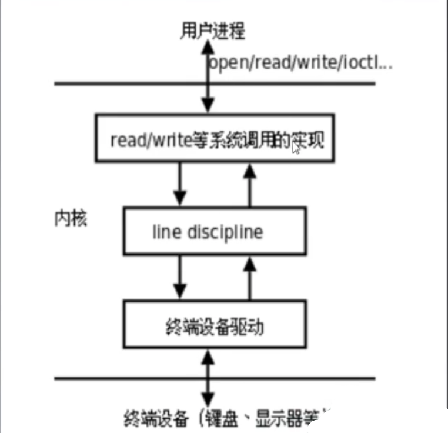
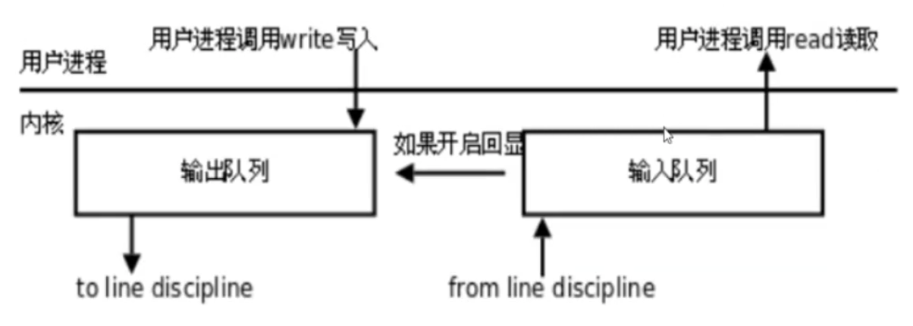
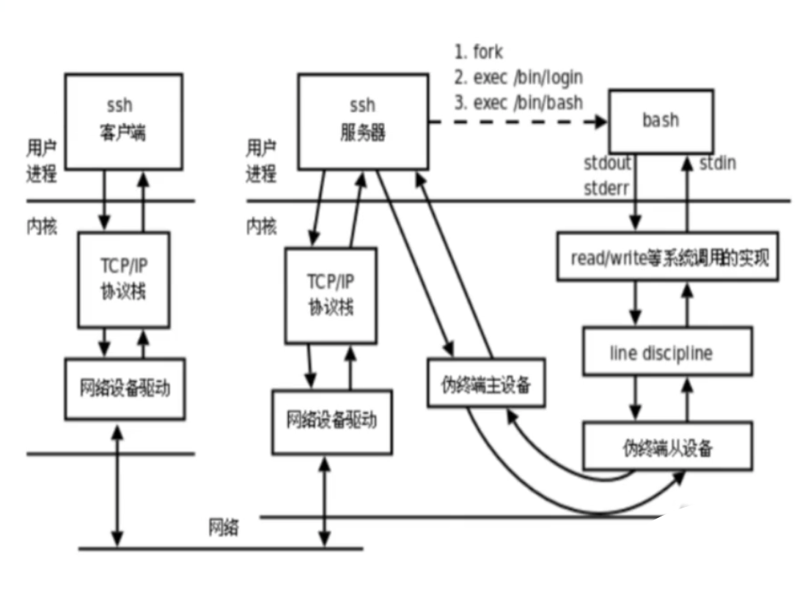
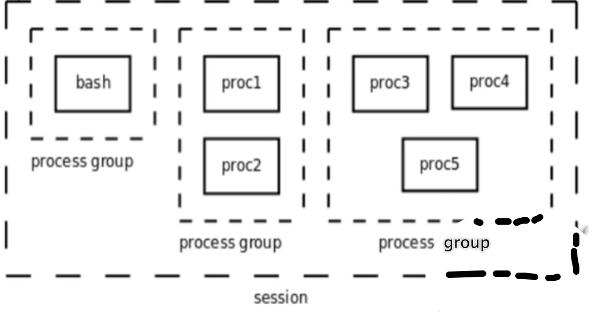

# s16

- [s16](#s16)
  - [终端](#终端)
  - [回显(echo)](#回显echo)
  - [作业(job)](#作业job)
  - [守护进程(Daemon)](#守护进程daemon)

## 终端

- 用户通过终端登录系统后得到一个Shell进程，这个终端成为Shell进程的控制终端（Controlling Terminal），fork会复制PCB 中的信息，因此由Shell进程启动的其它进程的控制终端也是这个终端。

  默认情况下（没有重定向），每个进程的标准输入、标准输出和标准错误输出都指向控制终端，进程从标准输入读也就是读用户的键盘输入，进程往标准输出或标准错误输出写也就是输出到显示器上。



- #系统调用open、read、write。line sicipline类似缓冲区。终端设备为硬件驱动。

## 回显(echo)

- 以输入队列为例，从键盘输入的字符经线路规程过滤后进入输入队列，用户程序以先 进先出的顺序从队列中读取字符，一般情况下，当输入队列满的时候再输入字符会丢 失，同时系统会响铃警报。终端可以配置成回显（Echo）模式，在这种模式下，输入 队列中的每个字符既送给用户程序也送给输出队列，因此我们在命令行键入字符时， 该字符不仅可以被程序读取，我们也可以同时在屏幕上看到该字符的回显



- 网络终端或图形终端窗口的数 目却是不受限制的，这是通过 伪终端（Pseudo TTY）实现的。 一套伪终端由一个主设备（PTY Master）和一个从设备 （PTY Slave）组成。主设备 在概念上相当于键盘和显示器， 只不过它不是真正的硬件而是 一个内核模块，操作它的也不 是用户而是另外一个进程。从 设备的底层驱动程序不是访问硬件而是访问主设备。



- 查看终端对应的设备文件名

```c
#include <unistd.h>
char *ttyname (int fd);
```

- 多打开几个终端对比不同之处

```c
/*************************************************************************
        > File Name: ttyOpt.c
        > Author:
        > Mail:
        > Created Time: Wed 16 Feb 2022 09:15:22 PM CST
 ************************************************************************/

#include <stdio.h>
#include <unistd.h>
#include <sys/types.h>
#include <sys/stat.h>
#include <fcntl.h>

int main(void) {
    int fd = open("./hello.txt", O_RDONLY);

    printf("fd %d: %s\n", 0, ttyname(0));
    printf("fd %d: %s\n", 1, ttyname(1));
    printf("fd %d: %s\n", 2, ttyname(2));
    printf("fd %d: %s\n", 3, ttyname(3));

    return 0;
}
```

```shell
youhuangla@Ubuntu s16 % make ttyOpt                                                                                 [0]
cc     ttyOpt.c   -o ttyOpt
youhuangla@Ubuntu s16 % ./ttyOpt                                                                                    [0]
fd 0: /dev/pts/0
fd 1: /dev/pts/0
fd 2: /dev/pts/0
fd 3: (null)
youhuangla@Ubuntu s16 % ls /dev/pts*                                                                                [0]
0  1  ptmx
#open a new terminal,below is a vertual terminal
youhuangla@Ubuntu s16 % ./ttyOpt                                                                                    [0]
fd 0: /dev/pts/1
fd 1: /dev/pts/1
fd 2: /dev/pts/1
fd 3: (null)
youhuangla@Ubuntu s16 % pstree                                                                                    [127]
systemd─┬─AliYunDun───23*[{AliYunDun}]
        ├─AliYunDunUpdate───5*[{AliYunDunUpdate}]
        ├─a.out
        ├─accounts-daemon───2*[{accounts-daemon}]
        ├─2*[agetty]
        ├─aliyun-service───8*[{aliyun-service}]
        ├─apache2───8*[apache2]
        ├─assist_daemon───7*[{assist_daemon}]
        ├─atd
        ├─chronyd
        ├─containerd───12*[{containerd}]
        ├─cron
        ├─dbus-daemon
        ├─dockerd───11*[{dockerd}]
        ├─mysqld───34*[{mysqld}]
        ├─networkd-dispat───{networkd-dispat}
        ├─rsyslogd───3*[{rsyslogd}]
        ├─sshd─┬─sshd───sshd───zsh───pstree#I use ssh to login server,open 2 zsh.
        │      └─sshd───sshd───zsh
        ├─systemd───(sd-pam)
        ├─systemd-journal
        ├─systemd-logind
        ├─systemd-network
        ├─systemd-resolve
        └─systemd-udevd
```

## 作业(job)

- Shell分前后台来控制的不是进程而是作业（Job）或者进程组（Process Group）。一个前台作业可以由多个进程组成，一个后台作业也可以由多个进程组成，Shell可以同时运行一个前台作业和任意多个后台作业，这称为作业控制（Job Control）

- ```shell
  $proc1 | proc2 &
  $proc3 | proc4 | proc5
  ```

- 控制终端相同的进程组，属于同一个会话Session #xshell登录的会话，会话管理器



- homework

比较下面个命令的输出结果：

```shell
youhuangla@Ubuntu s16 % ps -o pid,ppid,pgrp,session,tpgid,comm  | cat                                               [0]
#parent pid, pid group, session, 该session的前台进程组id
#cat and ps's parent's pid is 25197,that's zsh's pid.
#zsh's ppid is ssh's pid.
  PID  PPID  PGRP  SESS TPGID COMMAND
25197 25196 25197 25197 25559 zsh
25559 25197 25559 25197 25559 ps
25560 25197 25559 25197 25559 cat
youhuangla@Ubuntu s16 % ps -o pid,ppid,pgrp,session,tpgid,comm  | cat &                                             [0]
[1] 25562 25563
  PID  PPID  PGRP  SESS TPGID COMMAND
25197 25196 25197 25197 25197 zsh
25562 25197 25562 25197 25197 ps
25563 25197 25562 25197 25197 cat
[1]  + 25562 done       ps -o pid,ppid,pgrp,session,tpgid,comm |
       25563 done       cat
```

## 守护进程(Daemon)

- Linux系统启动时会启动很多系统服务进程，这些系统服务进程没有控制终端，不能直接和用户交互。其它进程都是在用户登录或运行程序时创建，在运行结束或用户注销时终止，但系统服务进程不受用户登录注销的影响，它们一直在运行着。

- 这种进程有一个名称叫守护进程（Daemon）

- 创建守护进程最关键的一步是调用setsid函数创建一个新的Session，并成为Session Leader。

  ```c
  #include <unistd.h>
  pid_t setsid(void);
  ```

  - 该函数调用成功时返回新创建的Session的id（其实也就是当前进程的id），出错返回-1。注意，调用这个函数之前，当前进程不允许是进程组的Leader，否则该函数返回-1。

```c
/*************************************************************************
        > File Name: deamon.c
        > Author:
        > Mail:
        > Created Time: Thu 17 Feb 2022 09:49:27 AM CST
 ************************************************************************/

#include <stdio.h>
#include <stdlib.h>
#include <unistd.h>
#include <sys/types.h>
#include <sys/stat.h>
#include <fcntl.h>

int main(void) {
    pid_t pid = fork();
    if (pid < 0) {
        perror("fork");
        exit(1);
    }

    if (pid) {
        exit(0);
    }

    pid_t nsid= setsid();//a new session id will return if success
    printf("new session id is %d\n", nsid);

    if (chdir("/") < 0) {
        //chdir() changes the current working directory of the calling process to the directory specified in path.
        perror("chdir");
        exit(1);
    }

   close(0);//关文件描述符0
    open("/dev/null", O_RDWR);//黑洞，输入该文件的都会消失，可读可写
    //让文件描述符0、1、2指向黑洞
    dup2(0, 1);
    dup2(0, 2);

    while(1) {
        sleep(1);
    }
    return 0;
}
```

```shell
youhuangla@Ubuntu s16 % make deamon                                                                                 [0]
cc     deamon.c   -o deamon
youhuangla@Ubuntu s16 % ./deamon                                                                                    [0]
new session id is 25913
youhuangla@Ubuntu s16 % ps ajx | grep 25913                                                                         [0]
    1 25913 25913 25913 ?           -1 Ss    1000   0:00 ./deamon#它现在是一个守护进程
    25197 25927 25926 25197 pts/0    25926 S+    1000   0:00 grep --color=auto --exclude-dir=.bzr --exclude-dir=CVS --exclude-dir=.git --exclude-dir=.hg --exclude-dir=.svn --exclude-dir=.idea --exclude-dir=.tox 25913
youhuangla@Ubuntu s16 % ps ajx | grep 25913                                                                         [0]
25197 25996 25995 25197 pts/0    25995 S+    1000   0:00 grep --color=auto --exclude-dir=.bzr --exclude-dir=CVS --exclude-dir=.git --exclude-dir=.hg --exclude-dir=.svn --exclude-dir=.idea --exclude-dir=.tox 25913
```
