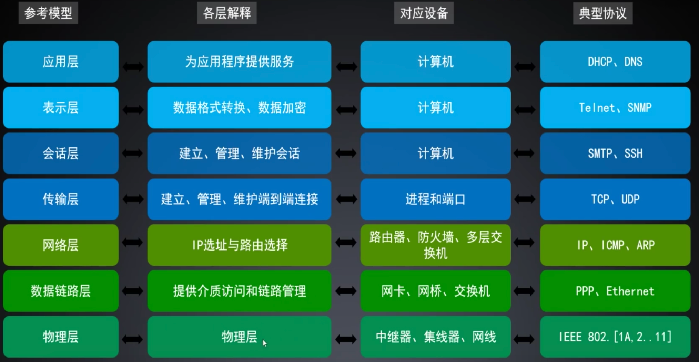
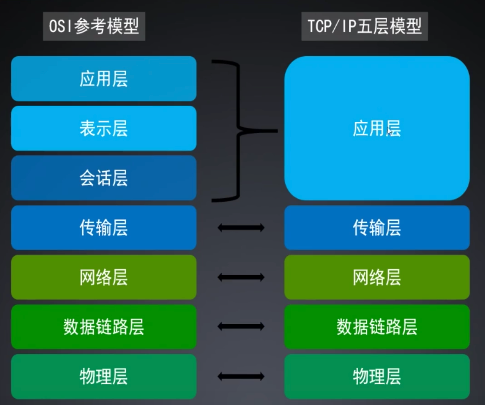
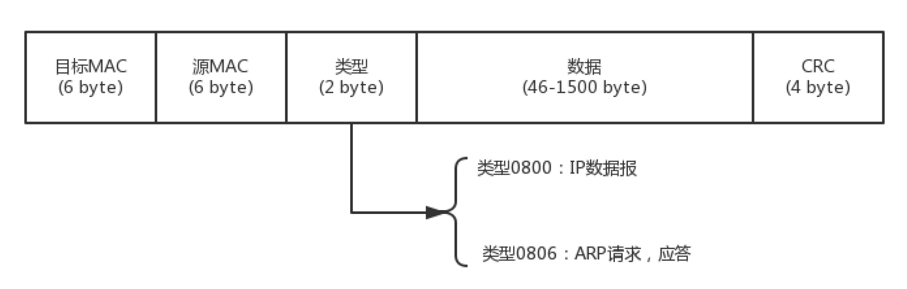
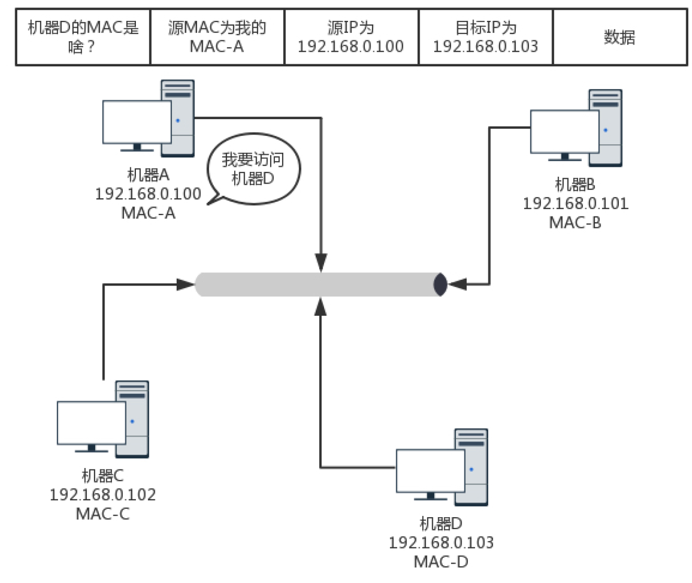
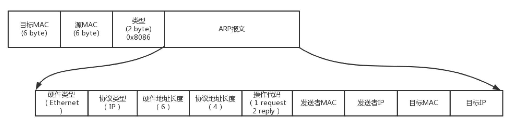
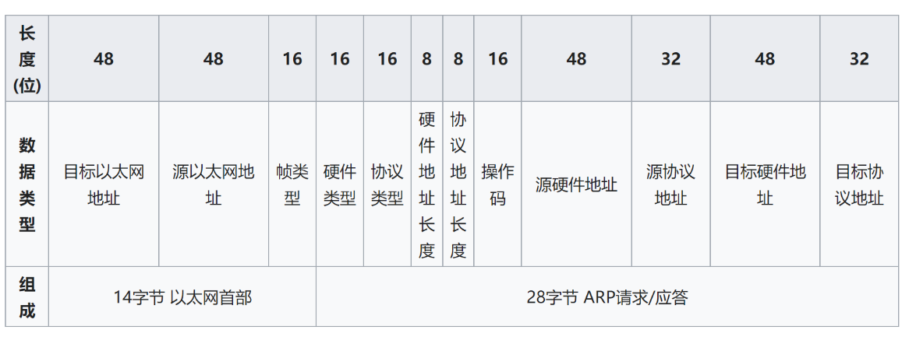
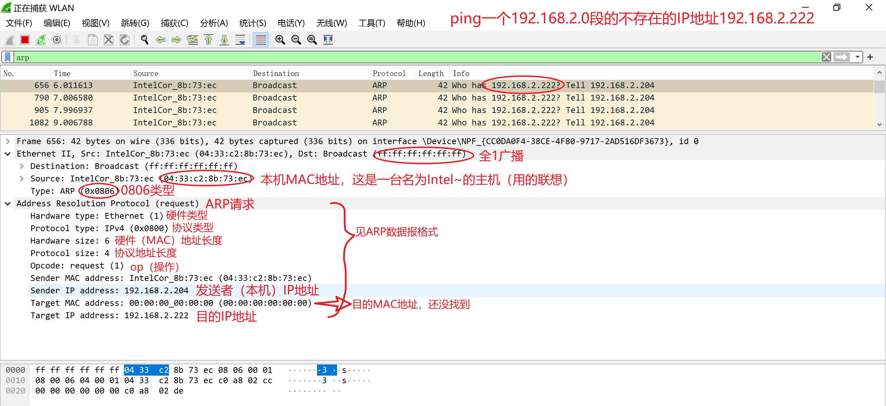
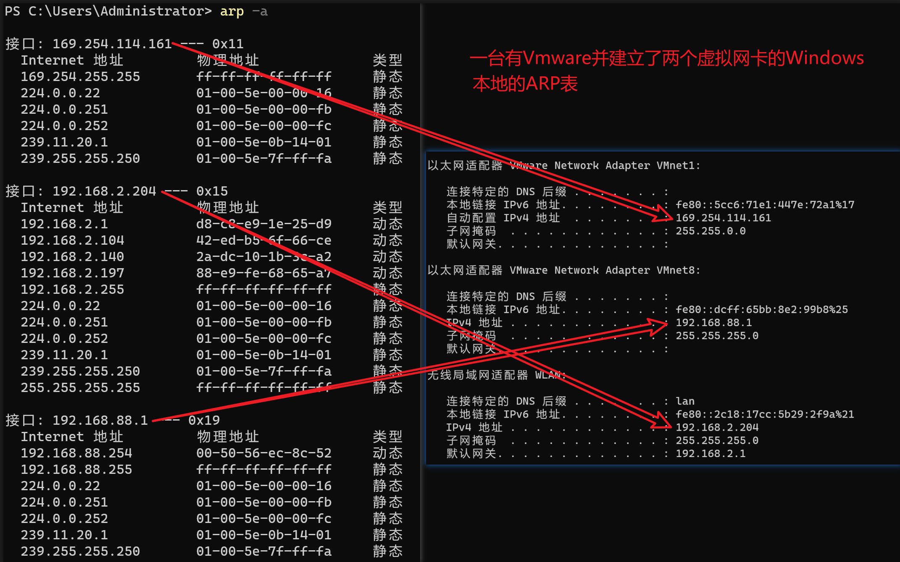

# 计算机网络协议

- [计算机网络协议](#计算机网络协议)
  - [协议](#协议)
    - [OSI七层模型：开放式系统互联参考模型](#osi七层模型开放式系统互联参考模型)
    - [TCP/IP五层模型](#tcpip五层模型)
  - [物理层](#物理层)
    - [两台电脑的联机](#两台电脑的联机)
    - [三台电脑的联机](#三台电脑的联机)
  - [链路层：外卖配送](#链路层外卖配送)
    - [饭店确认客人身份？](#饭店确认客人身份)
    - [饭店让骑手出门时间怎么定？](#饭店让骑手出门时间怎么定)
    - [送的饭如何确认有没送错？](#送的饭如何确认有没送错)
  - [ARP请求](#arp请求)
    - [IP到MAC全靠吼](#ip到mac全靠吼)
      - [ARP数据报格式](#arp数据报格式)
    - [ARP抓包](#arp抓包)
    - [ARP表](#arp表)
      - [Windows](#windows)
      - [Linux](#linux)
  - [ICMP请求](#icmp请求)

## 协议

- 什么是协议？
- 游戏规则
- 语法：就是这一段内容要符合一定的规则和格式。例如，这一部分写几个字节，下一个部分写几个字节。
- 语义：就是这一段内容要代表某种意义。例如这几个字节什么意思，那几个字节什么意思，代表什么。
- 顺序：就是先干啥，后干啥。例如，先请求租房子，后提供offer，在请求签合同，最后确认合同成立并公示。

### OSI七层模型：开放式系统互联参考模型



- 从下到上越来越复杂，上层实现对下层的封装

### TCP/IP五层模型



## 物理层

### 两台电脑的联机

- 我们要的是电脑连电脑。这种方式就是一根网线，有两个头。一头插在一台电脑的网卡上，另一头插在另一台电脑的网卡上。但是在当时，普通的网线这样是通不了的，所以水晶头要做交叉线，用的就是所谓的1－3、2－6 交叉接法。
- 水晶头的第 1、2 和第 3、6 脚，它们分别起着收、发信号的作用。将一端的 1 号和 3 号线、2 号和 6号线互换一下位置，就能够在物理层实现一端发送的信号，另一端能收到。
- 当然电脑连电脑，除了网线要交叉，还需要配置这两台电脑的 IP 地址、子网掩码和默认网关。这三个概念上一节详细描述过了。要想两台电脑能够通信，这三项必须配置成为一个网络，可以一个是192.168.0.1/24，另一个是 192.168.0.2/24，否则是不通的。
- 这里我想问你一个问题，两台电脑之间的网络包，包含 MAC 层吗？当然包含，要完整。IP 层要封装了MAC 层才能将包放入物理层。
- 到此为止，两台电脑已经构成了一个最小的局域网，也即LAN。可以玩联机局域网游戏啦！

### 三台电脑的联机

- 等到第三个哥们也买了一台电脑，怎么把三台电脑连在一起呢？

- 先别说交换机，当时交换机也贵。有一个叫作Hub的东西，也就是集线器。这种设备有多个口，可以将宿舍里的多台电脑连接起来。但是，和交换机不同，集线器没有大脑，它完全在物理层工作。它会将自己收到的每一个字节，都复制到其他端口上去。这是第一层物理层联通的方案。

- Hub 采取的是广播的模式，如果每一台电脑发出的包，宿舍的每个电脑都能收到，那就麻烦了。这就需要解决几个问题：

1. 这个包是发给谁的？谁应该接收？#对象
2. 大家都在发，会不会产生混乱？有没有谁先发、谁后发的规则？#顺序
3. 如果发送的时候出现了错误，怎么办？#内容

- 这几个问题，都是第二层，数据链路层，也即 MAC 层要解决的问题。

## 链路层：外卖配送

送外卖

### 饭店确认客人身份？

- 第一个问题：发给谁，谁接收？这里用到一个物理地址，叫作链路层地址。但是因为第二层主要解决媒体接入控制的问题，所以它常被称为MAC地址。#身份证

- 解决第一个问题就牵扯到第二层的网络包格式。对于以太网，第二层的最开始，就是目标的 MAC 地址和源的 MAC 地址。



- 接下来是类型，大部分的类型是 IP 数据包，然后 IP 里面包含 TCP、UDP，以及 HTTP 等，这都是里层封装的事情。有了这个目标 MAC 地址，数据包在链路上广播，MAC 的网卡才能发现，这个包是给它的。MAC 的网卡把包收进来，然后打开 IP 包，发现 IP 地址也是自己的，再打开 TCP 包，发现端口是自己，也就是80，而 nginx 就是监听 80。
- 于是将请求提交给 nginx，nginx 返回一个网页。然后将网页需要发回请求的机器。然后层层封装，最后到 MAC 层。因为来的时候有源 MAC 地址，返回的时候，源 MAC 就变成了目标 MAC，再返给请求的机器。

### 饭店让骑手出门时间怎么定？

- MAC层中的MAC的全称是Medium Access Control，即媒体访问控制。控制什么呢？其实就是控制在往媒体上发数据的时候，谁先发、谁后发的问题。防止发生混乱。这解决的是第二个问题。这个问题中的规则，学名叫多路访问。有很多算法可以解决这个问题。就像车管所管束马路上跑的车，能想的办法都想过了。
- 比如接下来这三种方式：

1. 分多个车道。每个车一个车道，你走你的，我走我的。这在计算机网络里叫作信道划分；
2. 今天单号出行，明天双号出行，轮着来。这在计算机网络里叫作轮流协议；
3. 不管三七二十一，有事儿先出门，发现特堵，就回去。错过高峰再出。我们叫作随机接入协议。著名的以太网，用的就是这个方式。

### 送的饭如何确认有没送错？

- 对于以太网，第二层的最后面是CRC，也就是循环冗余检测。通过 XOR 异或的算法，来计算整个包是否在发送的过程中出现了错误，主要解决第三个问题。
- 这里还有一个没有解决的问题，当源机器知道目标机器的时候，可以将目标地址放入包里面，如果不知道呢？一个广播的网络里面接入了 N 台机器，我怎么知道每个 MAC 地址是谁呢？这就是ARP 协议[见ARP请求](#ARP请求)，也就是已知 IP 地址，求 MAC 地址的协议。

## ARP请求

- #客人，你在哪里？

### IP到MAC全靠吼

在一个局域网里面，当知道了 IP 地址，不知道 MAC 怎么办呢？靠“吼”。




- 广而告之，发送一个广播包，谁是这个 IP 谁来回答。具体询问和回答的报文就像下面这样：

#### ARP数据报格式



- 为了避免每次都用 ARP 请求，机器本地也会进行 ARP 缓存。当然机器会不断地上线下线，IP 也可能会变，所以 ARP 的 MAC 地址缓存过一段时间就会过期。



- ——[地址解析协议报文格式](https://zh.wikipedia.org/wiki/%E5%9C%B0%E5%9D%80%E8%A7%A3%E6%9E%90%E5%8D%8F%E8%AE%AE)

### ARP抓包

- 打开Wireshark输入arp开始抓包
- ping局域网子网内一个不存在的IP地址，如我的是192.169.2.204(见[ARP表的Windows](#windows)和[s17计算机网络概论.md中windows一章](./s17计算机网络概论.md))，子网掩码为255.255.255.0，所以我可以ping 192.168.2.0子网内的192.168.2.222这个并不存在的IP地址，来寻找一个ARP Request。

```powershell
PS C:\Users\Administrator> ping 192.168.2.222

正在 Ping 192.168.2.222 具有 32 字节的数据:
来自 192.168.2.204 的回复: 无法访问目标主机。
来自 192.168.2.204 的回复: 无法访问目标主机。
来自 192.168.2.204 的回复: 无法访问目标主机。
来自 192.168.2.204 的回复: 无法访问目标主机。

192.168.2.222 的 Ping 统计信息:
    数据包: 已发送 = 4，已接收 = 4，丢失 = 0 (0% 丢失)，
```



- 上图就是ping之后抓包的结果了，对照[APR数据报格式](#arp数据报格式)可以很清晰的明白每一项的含义

### ARP表

- 每台主机或路由器在其内存中具有一个ARP表(ARP table) , 这张表包含IP地址到MAC地址的映射关系。——《自顶向下第七版》p306

#### Windows

```powershell
arp -a
```



#### Linux

```bash
arp -a
```

- 一个云服务器的ARP表


## ICMP请求
