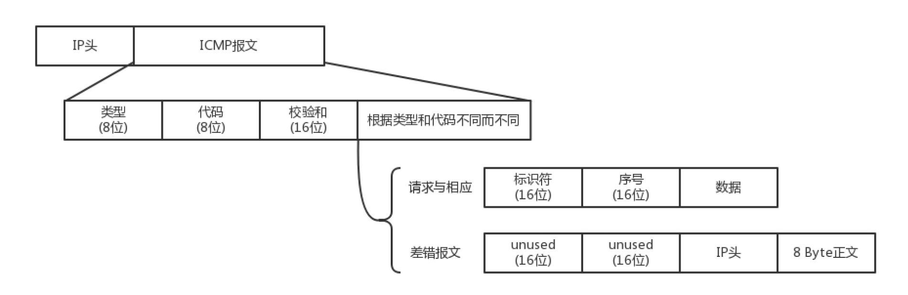
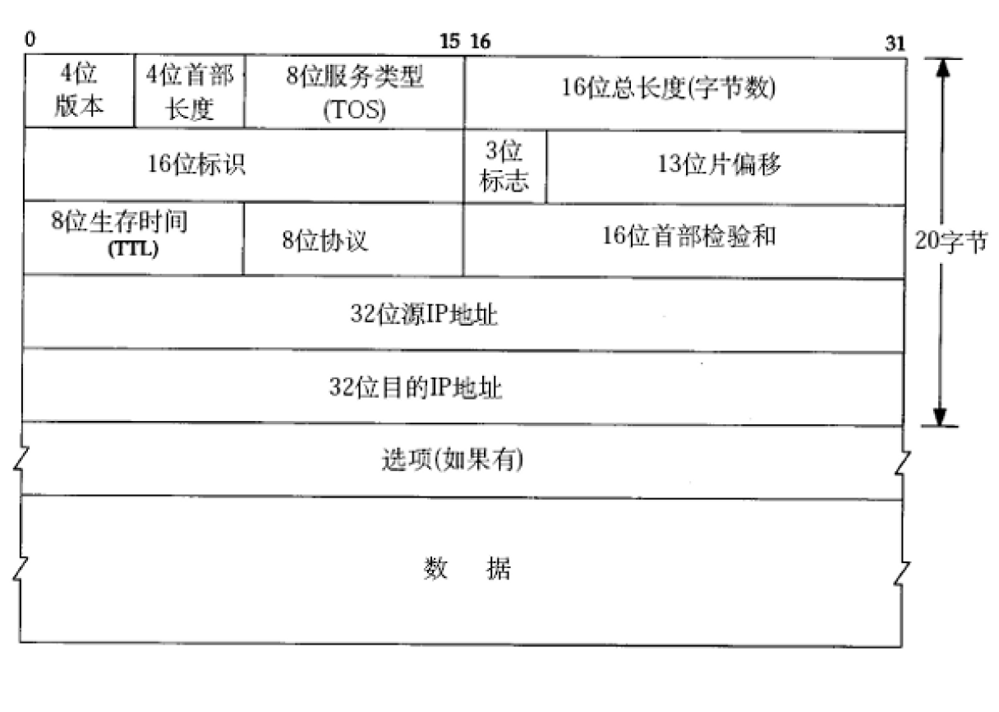
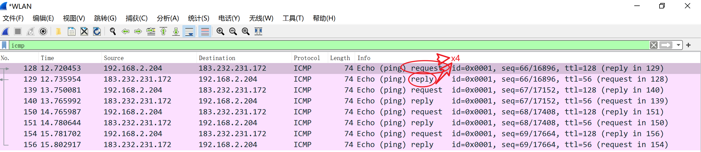
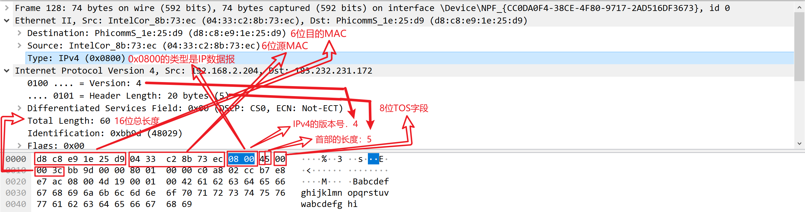
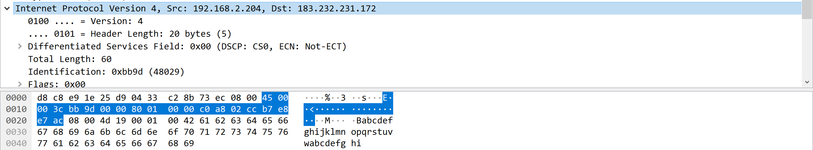
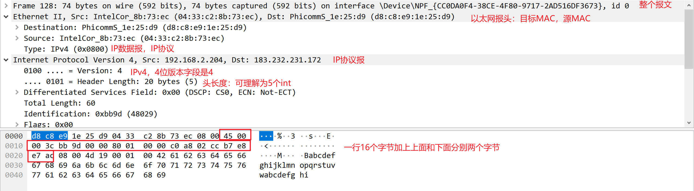
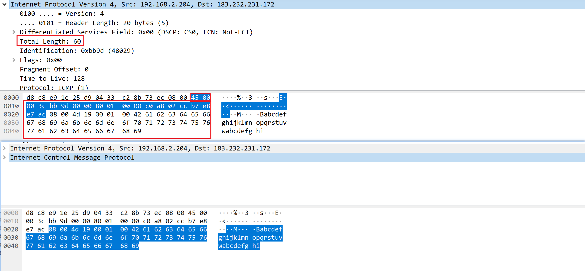
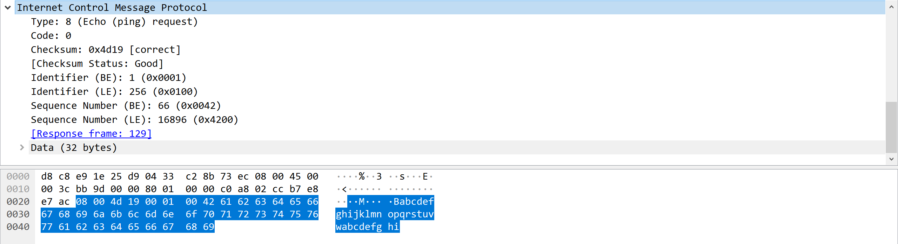
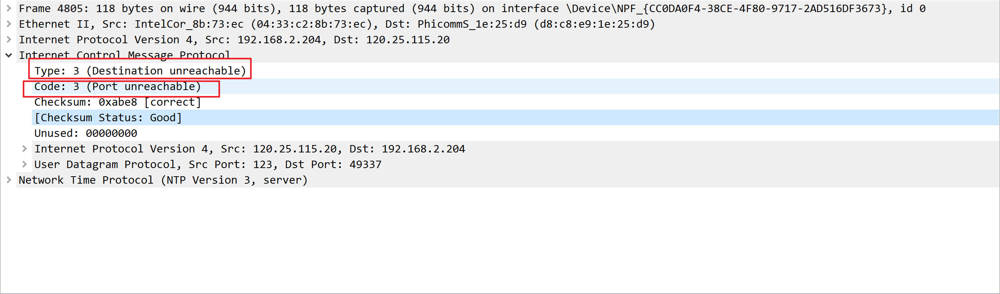

# s19 网络层协议硬件


[TOC]


## ICMP与ping：投石问路的侦察兵

- 无论是在宿舍，还是在办公室，或者运维一个数据中心，我们常常会遇到网络不通的问题。那台机器明明就在那里，你甚至都可以通过机器的终端连上去看。它看着好好的，可是就是连不上去，究竟是哪里出了问题呢？

### ICMP 协议的格式

一般情况下，你会想到 ping 一下。那你知道 ping 是如何工作的吗？

ping 是基于 ICMP 协议工作的。ICMP全称Internet Control Message Protocol，就是互联网控制报文协议。这里面的关键词是“控制”，那具体是怎么控制的呢？

网络包在异常复杂的网络环境中传输时，常常会遇到各种各样的问题。当遇到问题的时候，总不能“死个不明不白”，要传出消息来，报告情况，这样才可以调整传输策略。这就相当于我们经常看到的电视剧里，古代行军的时候，为将为帅者需要通过侦察兵、哨探或传令兵等人肉的方式来掌握情况，控制整个战局。

ICMP 报文是封装在 IP 包里面的。因为传输指令的时候，肯定需要源地址和目标地址。它本身非常简单。因为作为侦查兵，要轻装上阵，不能携带大量的包袱。

Q:为什么ICMP封装在IP包里,却可以归为网络层而不是传输层?

A:因为ICMP协议主要负责的是IP的选址与路由选择



ICMP 报文有很多的类型，不同的类型有不同的代码。最常用的类型是主动请求为 8，主动请求的应答为0。



<center>IPv4的IP数据报格式</center>

[《Linux C编程一站式学习》](https://akaedu.github.io/book/ch36s04.html)

IP数据报的首部长度和数据长度都是可变长的，但总是4字节的整数倍。

对于IPv4，4位版本字段是4。

4位首部长度的数值是以4字节为单位的，最小值为5，也就是说<a name="首部最小长度">首部长度最小</a>是4x5=20字节，也就是不带任何选项的IP首部，4位能表示的最大值是15，也就是说IP数据报首部长度最大是60字节。

8位TOS字段有3个位用来指定IP数据报的优先级（目前已经废弃不用），还有4个位表示可选的服务类型（最小延迟、最大呑吐量、最大可靠性、最小成本），还有一个位总是0。

总长度是整个数据报（包括IP首部和IP层payload）的字节数。

每传一个IP数据报，16位的标识加1，可用于分片和重新组装数据报。

3位标志和13位片偏移用于分片。

TTL（Time to live)是这样用的：源主机为数据包设定一个生存时间，比如64，每过一个路由器就把该值减1，如果减到0就表示路由已经太长了仍然找不到目的主机的网络，就丢弃该包，因此这个生存时间的单位不是秒，而是跳（hop）。

协议字段指示上层协议是TCP、UDP、ICMP还是IGMP。

然后是校验和，只校验IP首部，数据的校验由更高层协议负责。

IPv4的IP地址长度为32位。选项字段的解释从略。

#### 抓包

```powershell
PS C:\Users\Administrator> ping www.baidu.com

正在 Ping www.a.shifen.com [183.232.231.172] 具有 32 字节的数据:#百度早期是一个打分网站shifen，183.232.231.172即是百度服务器的IP地址，每个人ping的IP可能不一样，百度有很多服务器
来自 183.232.231.172 的回复: 字节=32 时间=15ms TTL=56
来自 183.232.231.172 的回复: 字节=32 时间=16ms TTL=56
来自 183.232.231.172 的回复: 字节=32 时间=15ms TTL=56
来自 183.232.231.172 的回复: 字节=32 时间=21ms TTL=56

183.232.231.172 的 Ping 统计信息:
    数据包: 已发送 = 4，已接收 = 4，丢失 = 0 (0% 丢失)，
往返行程的估计时间(以毫秒为单位):
    最短 = 15ms，最长 = 21ms，平均 = 16ms
```

- ping发送了四次请求，收到了服务器的四次回复



- 开头是目的和源MAC地址各占6字节
- 0100 .... = Version: 4#对于IPv4，四位版本号字段是4



- .... 0101 = Header Length: 20 bytes (5)#表示首部长度为5 * 4 = 20字节（[首部最小长度](#首部最小长度)）



<center>IPv4首部,长度为20字节</center>



- Differentiated Services Field: 0x00#8位TOS字段
- Total Length:60，图中可算得上下选中部分十六进制总共60字节，表示整个数据报（包括IP首部和IP层payload）的字节数



<center>IP报文总长度验证</center>



<center>ICMP协议，长度为40字节</center>

### 查询报文类型

我们经常在电视剧里听到这样的话：主帅说，来人哪！前方战事如何，快去派人打探，一有情况，立即通报！

这种是主帅发起的，主动查看敌情，对应 ICMP 的查询报文类型。例如，常用的ping 就是查询报文，是一种主动请求，并且获得主动应答的 ICMP 协议。所以，ping 发的包也是符合 ICMP 协议格式的，只不过它在后面增加了自己的格式。

对 ping 的主动请求，进行网络抓包，称为ICMP ECHO REQUEST。同理主动请求的回复，称为ICMP ECHO REPLY。比起原生的 ICMP，这里面多了两个字段，一个是标识符。这个很好理解，你派出去两队侦查兵，一队是侦查战况的，一队是去查找水源的，要有个标识才能区分。另一个是序号，你派出去
的侦查兵，都要编个号。如果派出去 10 个，回来 10 个，就说明前方战况不错；如果派出去 10 个，回来 2 个，说明情况可能不妙。

在选项数据中，ping 还会存放发送请求的时间值，来计算往返时间，说明路程的长短。

### 差错报文类型

当然也有另外一种方式，就是差错报文。

主帅骑马走着走着，突然来了一匹快马，上面的小兵气喘吁吁的：报告主公，不好啦！张将军遭遇埋伏，全军覆没啦！这种是异常情况发起的，来报告发生了不好的事情，对应 ICMP 的差错报文类型。

我举几个 ICMP 差错报文的例子：终点不可达为 3，源抑制为 4，超时为 11，重定向为 5。这些都是什么意思呢？我给你具体解释一下。

#### 1. 终点不可达

第一种是终点不可达。小兵：报告主公，您让把粮草送到张将军那里，结果没有送到。
如果你是主公，你肯定会问，为啥送不到？具体的原因在代码中表示就是，网络不可达代码为 0，主机不可达代码为 1，协议不可达代码为 2，端口不可达代码为 3，需要进行分片但设置了不分片位代码为4。

具体的场景就像这样：
网络不可达：主公，找不到地方呀？
主机不可达：主公，找到地方没这个人呀？
协议不可达：主公，找到地方，找到人，口号没对上，人家天王盖地虎，我说 12345！
端口不可达：主公，找到地方，找到人，对了口号，事儿没对上，我去送粮草，人家说他们在等救兵。
需要进行分片但设置了不分片位：主公，走到一半，山路狭窄，想换小车，但是您的将令，严禁换小车，就没办法送到了。

##### 抓包



#### 2. 源站抑制

第二种是源站抑制，也就是让源站放慢发送速度。小兵：报告主公，您粮草送的太多了吃不完。

#### 3. 时间超时

第三种是时间超时，也就是超过网络包的生存时间还是没到。小兵：报告主公，送粮草的人，自己把粮草吃完了，还没找到地方，已经饿死啦。

#### 4. 路由重定向

第四种是路由重定向，也就是让下次发给另一个路由器。小兵：报告主公，上次送粮草的人本来只要走一站地铁，非得从五环绕，下次别这样了啊。

差错报文的结构相对复杂一些。除了前面还是 IP，ICMP 的前 8 字节不变，后面则跟上出错的那个 IP 包的 IP 头和 IP 正文的前 8 个字节。

而且这类侦查兵特别恪尽职守，不但自己返回来报信，还把一部分遗物也带回来。
侦察兵：报告主公，张将军已经战死沙场，这是张将军的印信和佩剑。
主公：神马？张将军是怎么死的（可以查看 ICMP 的前 8 字节）？没错，这是张将军的剑，是他的剑（IP 数据包的头及正文前 8 字节）。

### ping：查询报文类型的使用

接下来，我们重点来看 ping 的发送和接收过程。

假定主机 A 的 IP 地址是 192.168.1.1，主机 B 的 IP 地址是 192.168.1.2，它们都在同一个子网。那当你在主机 A 上运行“ping 192.168.1.2”后，会发生什么呢?

ping 命令执行的时候，源主机首先会构建一个 ICMP 请求数据包，ICMP 数据包内包含多个字段。最重要的是两个，第一个是类型字段，对于请求数据包而言该字段为 8；另外一个是顺序号，主要用于区分连续 ping 的时候发出的多个数据包。每发出一个请求数据包，顺序号会自动加 1。为了能够计算往返时间 RTT，它会在报文的数据部分插入发送时间。

然后，由 ICMP 协议将这个数据包连同地址 192.168.1.2 一起交给 IP 层。IP 层将以 192.168.1.2 作为目的地址，本机 IP 地址作为源地址，加上一些其他控制信息，构建一个 IP 数据包。

接下来，需要加入 MAC 头。如果在本节 ARP 映射表中查找出 IP 地址 192.168.1.2 所对应的 MAC 地址，则可以直接使用；如果没有，则需要发送 ARP 协议查询 MAC 地址，获得 MAC 地址后，由数据链路层构建一个数据帧，目的地址是 IP 层传过来的 MAC 地址，源地址则是本机的 MAC 地址；还要附加上一些控制信息，依据以太网的介质访问规则，将它们传送出去。

主机 B 收到这个数据帧后，先检查它的目的 MAC 地址，并和本机的 MAC 地址对比，如符合，则接收，否则就丢弃。接收后检查该数据帧，将 IP 数据包从帧中提取出来，交给本机的 IP 层。同样，IP 层检查后，将有用的信息提取后交给 ICMP 协议。

主机 B 会构建一个 ICMP 应答包，应答数据包的类型字段为 0，顺序号为接收到的请求数据包中的顺序号，然后再发送出去给主机 A。
在规定的时候间内，源主机如果没有接到 ICMP 的应答包，则说明目标主机不可达；如果接收到了ICMP 应答包，则说明目标主机可达。此时，源主机会检查，用当前时刻减去该数据包最初从源主机上发出的时刻，就是 ICMP 数据包的时间延迟。
当然这只是最简单的，同一个局域网里面的情况。如果跨网段的话，还会涉及网关的转发、路由器的转发等等。但是对于 ICMP 的头来讲，是没什么影响的。会影响的是根据目标 IP 地址，选择路由的下一跳，还有每经过一个路由器到达一个新的局域网，需要换 MAC 头里面的 MAC 地址。这个过程后面几节会详细描述，这里暂时不多说。

如果在自己的可控范围之内，当遇到网络不通的问题的时候，除了直接 ping 目标的 IP 地址之外，还应该有一个清晰的网络拓扑图。并且从理论上来讲，应该要清楚地知道一个网络包从源地址到目标地址都需要经过哪些设备，然后逐个 ping 中间的这些设备或者机器。如果可能的话，在这些关键点，通过tcpdump -i eth0 icmp，查看包有没有到达某个点，回复的包到达了哪个点，可以更加容易推断出错的位置。

经常会遇到一个问题，如果不在我们的控制范围内，很多中间设备都是禁止 ping 的，但是 ping 不通不代表网络不通。这个时候就要使用 telnet，通过其他协议来测试网络是否通，这个就不在本篇的讲述范围了。

说了这么多，你应该可以看出 ping 这个程序是使用了 ICMP 里面的 ECHO REQUEST 和 ECHO REPLY类型的。
