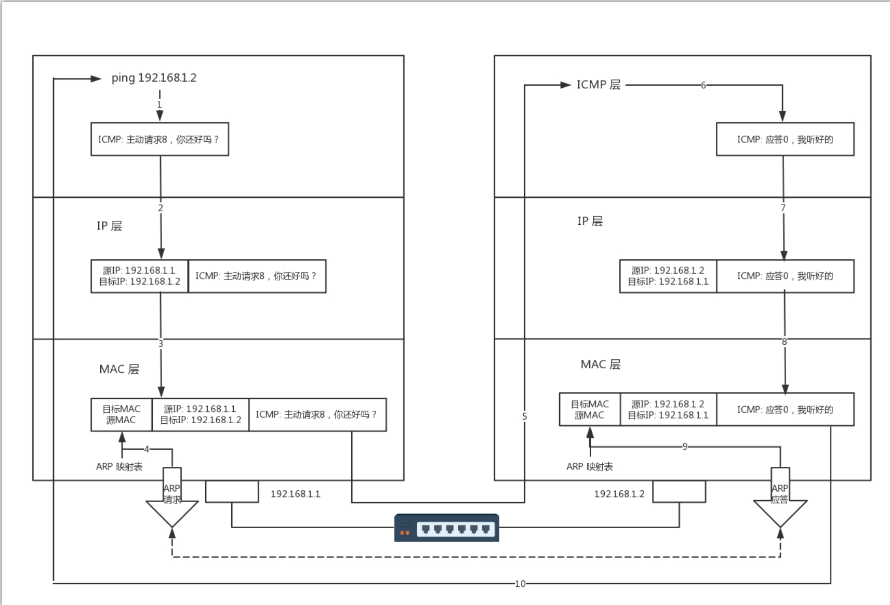
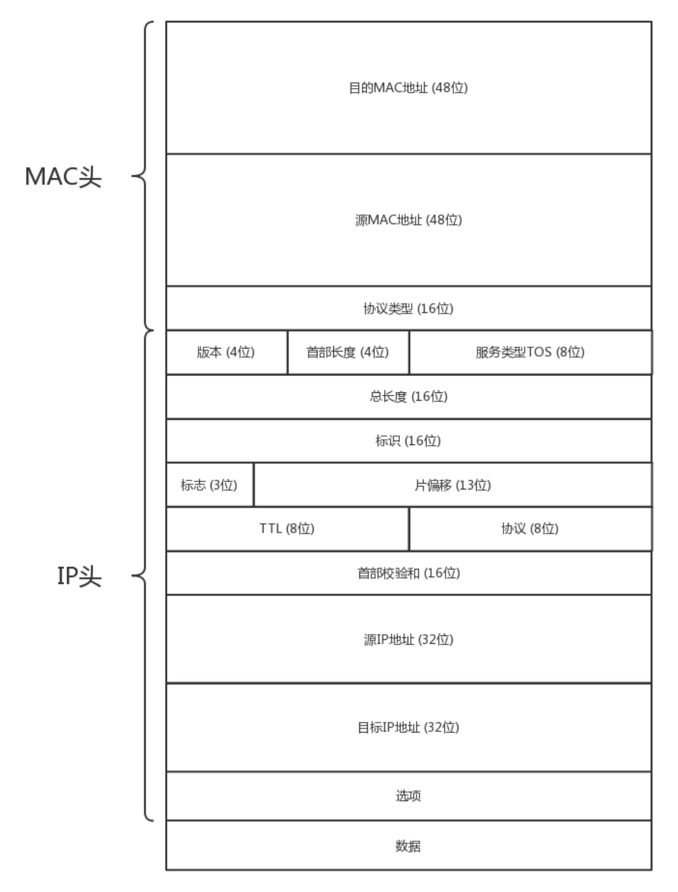
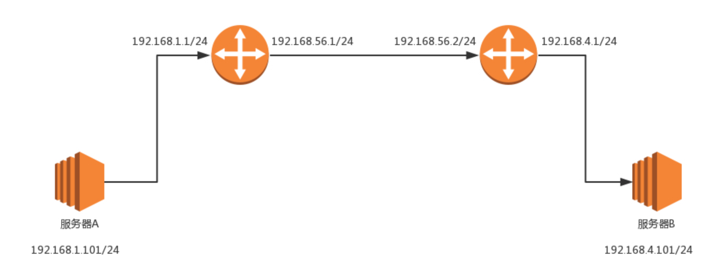
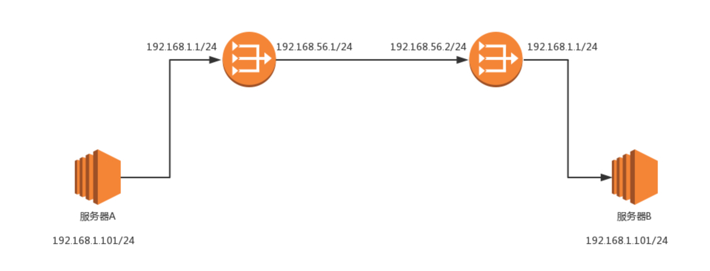
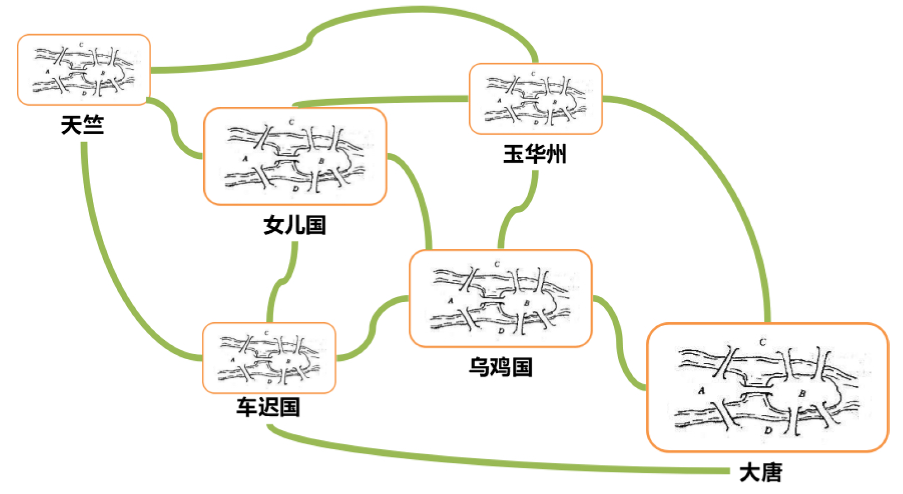
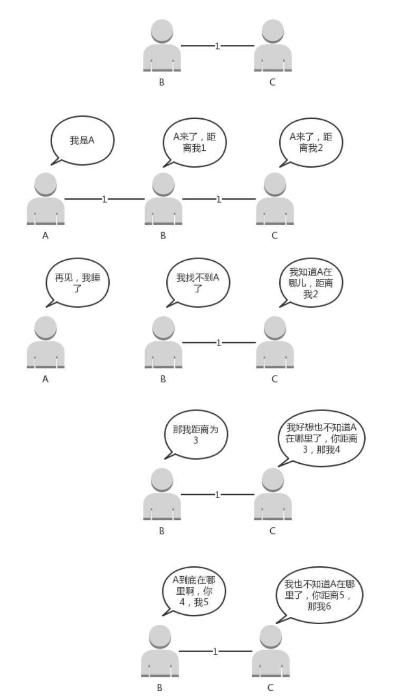
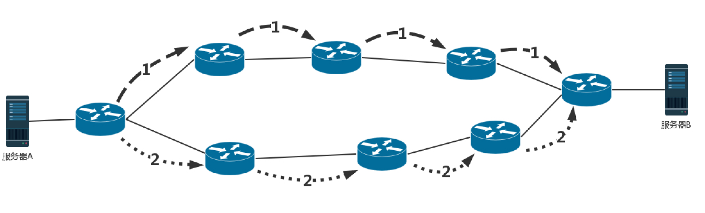
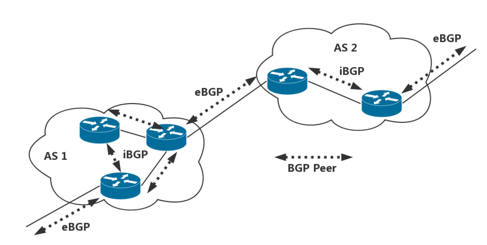

# s19 网络层协议硬件


[TOC]


## ICMP与ping：投石问路的侦察兵

- 无论是在宿舍，还是在办公室，或者运维一个数据中心，我们常常会遇到网络不通的问题。那台机器明明就在那里，你甚至都可以通过机器的终端连上去看。它看着好好的，可是就是连不上去，究竟是哪里出了问题呢？

### ICMP 协议的格式

一般情况下，你会想到 ping 一下。那你知道 ping 是如何工作的吗？

ping 是基于 ICMP 协议工作的。ICMP全称Internet Control Message Protocol，就是互联网控制报文协议。这里面的关键词是“控制”，那具体是怎么控制的呢？

网络包在异常复杂的网络环境中传输时，常常会遇到各种各样的问题。当遇到问题的时候，总不能“死个不明不白”，要传出消息来，报告情况，这样才可以调整传输策略。这就相当于我们经常看到的电视剧里，古代行军的时候，为将为帅者需要通过侦察兵、哨探或传令兵等人肉的方式来掌握情况，控制整个战局。

ICMP 报文是封装在 IP 包里面的。因为传输指令的时候，肯定需要源地址和目标地址。它本身非常简单。因为作为侦查兵，要轻装上阵，不能携带大量的包袱。

Q:为什么ICMP封装在IP包里,却可以归为网络层而不是传输层?

A:因为ICMP协议主要负责的是IP的选址与路由选择


ICMP 报文有很多的类型，不同的类型有不同的代码。最常用的类型是主动请求为 8，主动请求的应答为0。


<center>IPv4的IP数据报格式</center>

[《Linux C编程一站式学习》](https://akaedu.github.io/book/ch36s04.html)

IP数据报的首部长度和数据长度都是可变长的，但总是4字节的整数倍。

对于IPv4，4位版本字段是4。

4位首部长度的数值是以4字节为单位的，最小值为5，也就是说<a name="首部最小长度">首部长度最小</a>是4x5=20字节，也就是不带任何选项的IP首部，4位能表示的最大值是15，也就是说IP数据报首部长度最大是60字节。

8位TOS字段有3个位用来指定IP数据报的优先级（目前已经废弃不用），还有4个位表示可选的服务类型（最小延迟、最大呑吐量、最大可靠性、最小成本），还有一个位总是0。

总长度是整个数据报（包括IP首部和IP层payload）的字节数。

每传一个IP数据报，16位的标识加1，可用于分片和重新组装数据报。

3位标志和13位片偏移用于分片。

TTL（Time to live)是这样用的：源主机为数据包设定一个生存时间，比如64，每过一个路由器就把该值减1，如果减到0就表示路由已经太长了仍然找不到目的主机的网络，就丢弃该包，因此这个生存时间的单位不是秒，而是跳（hop）。

协议字段指示上层协议是TCP、UDP、ICMP还是IGMP。

然后是校验和，只校验IP首部，数据的校验由更高层协议负责。

IPv4的IP地址长度为32位。选项字段的解释从略。

#### 抓包

```powershell
PS C:\Users\Administrator> ping www.baidu.com

正在 Ping www.a.shifen.com [183.232.231.172] 具有 32 字节的数据:#百度早期是一个打分网站shifen，183.232.231.172即是百度服务器的IP地址，每个人ping的IP可能不一样，百度有很多服务器
来自 183.232.231.172 的回复: 字节=32 时间=15ms TTL=56
来自 183.232.231.172 的回复: 字节=32 时间=16ms TTL=56
来自 183.232.231.172 的回复: 字节=32 时间=15ms TTL=56
来自 183.232.231.172 的回复: 字节=32 时间=21ms TTL=56

183.232.231.172 的 Ping 统计信息:
    数据包: 已发送 = 4，已接收 = 4，丢失 = 0 (0% 丢失)，
往返行程的估计时间(以毫秒为单位):
    最短 = 15ms，最长 = 21ms，平均 = 16ms
```

- ping发送了四次请求，收到了服务器的四次回复


- 开头是目的和源MAC地址各占6字节
- 0100 .... = Version: 4#对于IPv4，四位版本号字段是4


- .... 0101 = Header Length: 20 bytes (5)#表示首部长度为5 * 4 = 20字节（[首部最小长度](#首部最小长度)）


<center>IPv4首部,长度为20字节</center>


- Differentiated Services Field: 0x00#8位TOS字段
- Total Length:60，图中可算得上下选中部分十六进制总共60字节，表示整个数据报（包括IP首部和IP层payload）的字节数


<center>IP报文总长度验证</center>


<center>ICMP协议，长度为40字节</center>

### 查询报文类型

我们经常在电视剧里听到这样的话：主帅说，来人哪！前方战事如何，快去派人打探，一有情况，立即通报！

这种是主帅发起的，主动查看敌情，对应 ICMP 的查询报文类型。例如，常用的ping 就是查询报文，是一种主动请求，并且获得主动应答的 ICMP 协议。所以，ping 发的包也是符合 ICMP 协议格式的，只不过它在后面增加了自己的格式。

对 ping 的主动请求，进行网络抓包，称为ICMP ECHO REQUEST。同理主动请求的回复，称为ICMP ECHO REPLY。比起原生的 ICMP，这里面多了两个字段，一个是标识符。这个很好理解，你派出去两队侦查兵，一队是侦查战况的，一队是去查找水源的，要有个标识才能区分。另一个是序号，你派出去
的侦查兵，都要编个号。如果派出去 10 个，回来 10 个，就说明前方战况不错；如果派出去 10 个，回来 2 个，说明情况可能不妙。

在选项数据中，ping 还会存放发送请求的时间值，来计算往返时间，说明路程的长短。

### 差错报文类型

当然也有另外一种方式，就是差错报文。

主帅骑马走着走着，突然来了一匹快马，上面的小兵气喘吁吁的：报告主公，不好啦！张将军遭遇埋伏，全军覆没啦！这种是异常情况发起的，来报告发生了不好的事情，对应 ICMP 的差错报文类型。

我举几个 ICMP 差错报文的例子：终点不可达为 3，源抑制为 4，超时为 11，重定向为 5。这些都是什么意思呢？我给你具体解释一下。

#### 1. 终点不可达

第一种是终点不可达。小兵：报告主公，您让把粮草送到张将军那里，结果没有送到。
如果你是主公，你肯定会问，为啥送不到？具体的原因在代码中表示就是，网络不可达代码为 0，主机不可达代码为 1，协议不可达代码为 2，端口不可达代码为 3，需要进行分片但设置了不分片位代码为4。

具体的场景就像这样：
网络不可达：主公，找不到地方呀？
主机不可达：主公，找到地方没这个人呀？
协议不可达：主公，找到地方，找到人，口号没对上，人家天王盖地虎，我说 12345！
端口不可达：主公，找到地方，找到人，对了口号，事儿没对上，我去送粮草，人家说他们在等救兵。
需要进行分片但设置了不分片位：主公，走到一半，山路狭窄，想换小车，但是您的将令，严禁换小车，就没办法送到了。

##### 抓包


#### 2. 源站抑制

第二种是源站抑制，也就是让源站放慢发送速度。小兵：报告主公，您粮草送的太多了吃不完。

#### 3. 时间超时

第三种是时间超时，也就是超过网络包的生存时间还是没到。小兵：报告主公，送粮草的人，自己把粮草吃完了，还没找到地方，已经饿死啦。

#### 4. 路由重定向

第四种是路由重定向，也就是让下次发给另一个路由器。小兵：报告主公，上次送粮草的人本来只要走一站地铁，非得从五环绕，下次别这样了啊。

差错报文的结构相对复杂一些。除了前面还是 IP，ICMP 的前 8 字节不变，后面则跟上出错的那个 IP 包的 IP 头和 IP 正文的前 8 个字节。

而且这类侦查兵特别恪尽职守，不但自己返回来报信，还把一部分遗物也带回来。
侦察兵：报告主公，张将军已经战死沙场，这是张将军的印信和佩剑。
主公：神马？张将军是怎么死的（可以查看 ICMP 的前 8 字节）？没错，这是张将军的剑，是他的剑（IP 数据包的头及正文前 8 字节）。

### ping：查询报文类型的使用

接下来，我们重点来看 ping 的发送和接收过程。



中间黑色的的是交换机。

假定主机 A 的 IP 地址是 192.168.1.1，主机 B 的 IP 地址是 192.168.1.2，它们都在同一个子网。那当你在主机 A 上运行“ping 192.168.1.2”后，会发生什么呢?

ping 命令执行的时候，源主机首先会构建一个 ICMP 请求数据包，ICMP 数据包内包含多个字段。最重要的是两个，第一个是类型字段，对于请求数据包而言该字段为 8；另外一个是顺序号，主要用于区分连续 ping 的时候发出的多个数据包。每发出一个请求数据包，顺序号会自动加 1。为了能够计算往返时间 RTT，它会在报文的数据部分插入发送时间。

然后，由 ICMP 协议将这个数据包连同地址 192.168.1.2 一起交给 IP 层。IP 层将以 192.168.1.2 作为目的地址，本机 IP 地址作为源地址，加上一些其他控制信息，构建一个 IP 数据包。

接下来，需要加入 MAC 头。如果在本节 ARP 映射表中查找出 IP 地址 192.168.1.2 所对应的 MAC 地址，则可以直接使用；如果没有，则需要发送 ARP 协议查询 MAC 地址，获得 MAC 地址后，由数据链路层构建一个数据帧，目的地址是 IP 层传过来的 MAC 地址，源地址则是本机的 MAC 地址；还要附加上一些控制信息，依据以太网的介质访问规则，将它们传送出去。

主机 B 收到这个数据帧后，先检查它的目的 MAC 地址，并和本机的 MAC 地址对比，如符合，则接收，否则就丢弃。接收后检查该数据帧，将 IP 数据包从帧中提取出来，交给本机的 IP 层。同样，IP 层检查后，将有用的信息提取后交给 ICMP 协议。

主机 B 会构建一个 ICMP 应答包，应答数据包的类型字段为 0，顺序号为接收到的请求数据包中的顺序号，然后再发送出去给主机 A。
在规定的时候间内，源主机如果没有接到 ICMP 的应答包，则说明目标主机不可达；如果接收到了ICMP 应答包，则说明目标主机可达。此时，源主机会检查，用当前时刻减去该数据包最初从源主机上发出的时刻，就是 ICMP 数据包的时间延迟。
当然这只是最简单的，同一个局域网里面的情况。如果跨网段的话，还会涉及网关的转发、路由器的转发等等。但是对于 ICMP 的头来讲，是没什么影响的。会影响的是根据目标 IP 地址，选择路由的下一跳，还有每经过一个路由器到达一个新的局域网，需要换 MAC 头里面的 MAC 地址。这个过程后面几节会详细描述，这里暂时不多说。

如果在自己的可控范围之内，当遇到网络不通的问题的时候，除了直接 ping 目标的 IP 地址之外，还应该有一个清晰的网络拓扑图。并且从理论上来讲，应该要清楚地知道一个网络包从源地址到目标地址都需要经过哪些设备，然后逐个 ping 中间的这些设备或者机器。如果可能的话，在这些关键点，通过tcpdump -i eth0 icmp，查看包有没有到达某个点，回复的包到达了哪个点，可以更加容易推断出错的位置。

经常会遇到一个问题，如果不在我们的控制范围内，很多中间设备都是禁止 ping 的，但是 ping 不通不代表网络不通。这个时候就要使用 telnet，通过其他协议来测试网络是否通，这个就不在本篇的讲述范围了。

说了这么多，你应该可以看出 ping 这个程序是使用了 ICMP 里面的 ECHO REQUEST 和 ECHO REPLY类型的。

IP层：

## 世界这么大，我想出网关：欧洲十国游与玄奘西行

前几节，我主要跟你讲了宿舍里和办公室里用到的网络协议。你已经有了一些基础，是时候去外网逛逛了！

### 怎么在宿舍上网？

还记得咱们在宿舍的时候买了台交换机，几台机器组了一个局域网打游戏吗？可惜啊，只能打局域网的游戏，不能上网啊！盼啊盼啊，终于盼到大二，允许宿舍开通网络了。学校给每个宿舍的网口分配了一个 IP 地址。这个 IP 是校园网的 IP，完全由网管部门控制。宿舍网的 IP 地址多为 192.168.1.x。校园网的 IP 地址，假设是 10.10.x.x。这个时候，你要在宿舍上网，有两个办法：

第一个办法，让你们宿舍长再买一个网卡。这个时候，你们宿舍长的电脑里就有两张网卡。一张网卡的线插到你们宿舍的交换机上，另一张网卡的线插到校园网的网口。而且，这张新的网卡的 IP 地址要按照学校网管部门分配的配置，不然上不了网。这种情况下，如果你们宿舍的人要上网，就需要一直开着宿舍长的电脑。

第二个办法，你们共同出钱买个家庭路由器（反正当时我们买不起）。家庭路由器会有内网网口和外网网口。把外网网口的线插到校园网的网口上，将这个外网网口配置成和网管部的一样。内网网口连上你们宿舍的所有的电脑。这种情况下，如果你们宿舍的人要上网，就需要一直开着路由器。

这两种方法其实是一样的。只不过第一种方式，让你的宿舍长的电脑，变成一个有多个口的路由器而已。而你买的家庭路由器，里面也跑着程序，和你宿舍长电脑里的功能一样，只不过是一个嵌入式的系统。

当你的宿舍长能够上网之后，接下来，就是其他人的电脑怎么上网的问题。这就需要配置你们的**网卡**。当然 DHCP 是可以默认配置的。在进行网卡配置的时候，除了 IP 地址，还需要配置一个Gateway的东西，这个就是**网关**。

### 你了解 MAC 头和 IP 头的细节吗？

一旦配置了 IP 地址和网关，往往就能够指定目标地址进行访问了。由于在跨网关访问的时候，牵扯到 MAC 地址和 IP 地址的变化，这里有必要详细描述一下 MAC 头和 IP 头的细节。



在 MAC 头里面，先是目标 MAC 地址，然后是源 MAC 地址，然后有一个协议类型，用来说明里面是 IP 协议。IP 头里面的版本号，目前主流的还是 IPv4，服务类型 TOS 在第三节讲 ip addr 命令的时候讲过，TTL 在第 7 节讲 ICMP 协议的时候讲过。另外，还有 8 位标识协议。这里到了下一层的协议，也就是，是 TCP 还是 UDP。最重要的就是源 IP 和目标IP。先是源 IP 地址，然后是目标 IP 地址。

### 网段

在任何一台机器上，当要访问另一个 IP 地址的时候，都会先判断，这个目标 IP 地址，和当前机器的 IP 地址，是否在同一个**网段**。怎么判断同一个网段呢？需要 CIDR 和子网掩码，这个在第三节的时候也讲过了。

如果是<u>同一个网段</u>，例如，你访问你旁边的兄弟的电脑，那就没网关什么事情，直接将源地址和目标地址放入 IP 头中，然后通过 ARP 获得 MAC 地址，将源 MAC 和目的 MAC 放入MAC 头中，发出去就可以了。

如果<u>不是同一网段</u>，例如，你要访问你们校园网里面的 BBS，该怎么办？这就需要发往**默认网关** Gateway。Gateway 的地址一定是和源 IP 地址是一个网段的。往往不是第一个，就是第二个。例如 192.168.1.0/24 这个网段，Gateway 往往会是 192.168.1.1/24 或者192.168.1.2/24。

如何发往默认网关呢？网关不是和源 IP 地址是一个网段的么？这个过程就和发往同一个网段的其他机器是一样的：将源地址和目标 IP 地址放入 IP 头中，通过 ARP 获得网关的MAC 地址，将源 MAC 和网关的 MAC 放入 MAC 头中，发送出去。网关所在的端口，例如 192.168.1.1/24 将网络包收进来，然后接下来怎么做，就完全看网关的了。

网关往往是一个路由器，是一个<u>三层转发的设备</u>。啥叫**三层设备**？前面也说过了，就是把MAC 头和 IP 头都取下来，然后根据里面的内容，看看接下来把包往哪里转发的设备。

在你的宿舍里面，网关就是你宿舍长的电脑。一个路由器往往有多个网口，如果是一台服务器做这个事情，则就有多个网卡，其中一个网卡是和源 IP 同网段的。

很多情况下，人们把网关就叫作路由器。其实不完全准确，而另一种比喻更加恰当：**路由器**是一台设备，它有五个网口或者网卡，相当于有五只手，分别连着五个局域网。每只手的IP 地址都和局域网的 IP 地址相同的网段，每只手都是它握住的那个局域网的网关。

任何一个想发往其他局域网的包，都会到达其中一只手，被拿进来，拿下 MAC 头和 IP头，看看，根据自己的路由算法，选择另一只手，加上 IP 头和 MAC 头，然后扔出去。

### 静态路由是什么？

这个时候，问题来了，该选择哪一只手？IP 头和 MAC 头加什么内容，哪些变、哪些不变呢？这个问题比较复杂，大致可以分为两类，一个是静态路由，一个是动态路由。动态路由下一节我们详细地讲。这一节我们先说静态路由。

**静态路由**，其实就是<u>在路由器上，配置一条一条规则</u>。这些规则包括：想访问 BBS 站（它肯定有个网段），从 2 号口出去，下一跳是 IP2；想访问教学视频站（它也有个自己的网段），从 3 号口出去，下一跳是 IP3，然后保存在路由器里。

每当要选择从哪只手抛出去的时候，就一条一条的匹配规则，找到符合的规则，就按规则中设置的那样，从某个口抛出去，找下一跳 IPX。

### IP 头和 MAC 头哪些变、哪些不变？

对于 IP 头和 MAC 头哪些变、哪些不变的问题，可以分两种类型。我把它们称为“欧洲十国游”型和“玄奘西行”型。
之前我说过，MAC 地址是一个局域网内才有效的地址。因而，MAC 地址只要过网关，就必定会改变，因为已经换了局域网。两者主要的区别在于 IP 地址是否改变。不改变 IP 地址的网关，我们称为转发网关；改变 IP 地址的网关，我们称为NAT 网关。

#### “欧洲十国游”型

结合这个图，我们先来看“欧洲十国游”型。



服务器 A 要访问服务器 B。首先，服务器 A 会思考，192.168.4.101 和我不是一个网段的，因而需要先发给网关。那网关是谁呢？已经静态配置好了，网关是 192.168.1.1。网关的 MAC 地址是多少呢？发送 ARP 获取网关的 MAC 地址，然后发送包。包的内容是这样的：

> 源 MAC：服务器 A 的 MAC
> 目标 MAC：192.168.1.1 这个网口的 MAC
> 源 IP：192.168.1.101
> 目标 IP：192.168.4.101

包到达 192.168.1.1 这个网口，发现 MAC 一致，将包收进来，开始思考往哪里转发。

在路由器 A 中配置了静态路由之后，要想访问 192.168.4.0/24，要从 192.168.56.1 这个口出去，下一跳为 192.168.56.2。

于是，路由器 A 思考的时候，匹配上了这条路由，要从 192.168.56.1 这个口发出去，发给192.168.56.2，那 192.168.56.2 的 MAC 地址是多少呢？路由器 A 发送 ARP 获取192.168.56.2 的 MAC 地址，然后发送包。包的内容是这样的：

> 源 MAC：192.168.56.1 的 MAC 地址
> 目标 MAC：192.168.56.2 的 MAC 地址
> 源 IP：192.168.1.101
> 目标 IP：192.168.4.101

包到达 192.168.56.2 这个网口，发现 MAC 一致，将包收进来，开始思考往哪里转发。

在路由器 B 中配置了静态路由，要想访问 192.168.4.0/24，要从 192.168.4.1 这个口出去，没有下一跳了。因为我右手这个网卡，就是这个网段的，我是最后一跳了。

于是，路由器 B 思考的时候，匹配上了这条路由，要从 192.168.4.1 这个口发出去，发给192.168.4.101。那 192.168.4.101 的 MAC 地址是多少呢？路由器 B 发送 ARP 获取192.168.4.101 的 MAC 地址，然后发送包。包的内容是这样的：

> 源 MAC：服务器 A 的 MAC
> 目标 MAC：192.168.1.1 这个网口的 MAC
> 源 IP：192.168.1.101
> 目标 IP：192.168.4.101

包到达服务器 B，MAC 地址匹配，将包收进来。

通过这个过程可以看出，每到一个新的局域网，MAC 都是要变的，但是 IP 地址都不变。在 IP 头里面，不会保存任何网关的 IP 地址。所谓的下一跳是，某个 IP 要将这个 IP 地址转换为 MAC 放入 MAC 头。

之所以将这种模式比喻称为欧洲十国游，是因为在整个过程中，IP 头里面的地址都是不变的。IP 地址在三个局域网都可见，在三个局域网之间的网段都不会冲突。在三个网段之间传输包，IP 头不改变。这就像在欧洲各国之间旅游，一个签证就能搞定。

#### “玄奘西行”型

我们再来看“玄奘西行”型。



这里遇见的第一个问题是，局域网之间没有商量过，各定各的网段，因而 IP 段冲突了。最左面大唐的地址是 192.168.1.101，最右面印度的地址也是 192.168.1.101，如果单从 IP地址上看，简直是自己访问自己，其实是大唐的 192.168.1.101 要访问印度的192.168.1.101。

怎么解决这个问题呢？既然局域网之间没有商量过，你们各管各的，那到国际上，也即中间的局域网里面，就需要使用另外的地址。就像出国，不能用咱们自己的身份证，而要改用护照一样，玄奘西游也要拿着专门取经的通关文牒，而不能用自己国家的身份证。

首先，目标服务器 B 在国际上要有一个国际的身份，我们给它一个 192.168.56.2。在网关B 上，我们记下来，国际身份 192.168.56.2 对应国内身份 192.168.1.101。凡是要访问192.168.56.2，都转成 192.168.1.101。

于是，源服务器 A 要访问目标服务器 B，要指定的目标地址为 192.168.56.2。这是它的国际身份。服务器 A 想，192.168.56.2 和我不是一个网段的，因而需要发给网关，网关是谁？已经静态配置好了，网关是 192.168.1.1，网关的 MAC 地址是多少？发送 ARP 获取网关的 MAC 地址，然后发送包。包的内容是这样的：

> 源 MAC：服务器 A 的 MAC
> 目标 MAC：192.168.1.1 这个网口的 MAC
> 源 IP：192.168.1.101
> 目标 IP：192.168.56.2

包到达 192.168.1.1 这个网口，发现 MAC 一致，将包收进来，开始思考往哪里转发。

在路由器 A 中配置了静态路由：要想访问 192.168.56.2/24，要从 192.168.56.1 这个口出去，没有下一跳了，因为我右手这个网卡，就是这个网段的，我是最后一跳了。

于是，路由器 A 思考的时候，匹配上了这条路由，要从 192.168.56.1 这个口发出去，发给192.168.56.2。那 192.168.56.2 的 MAC 地址是多少呢？路由器 A 发送 ARP 获取192.168.56.2 的 MAC 地址。

当网络包发送到中间的局域网的时候，服务器 A 也需要有个国际身份，因而在国际上，源IP 地址也不能用 192.168.1.101，需要改成 192.168.56.1。发送包的内容是这样的：

> 源 MAC：192.168.56.1 的 MAC 地址
> 目标 MAC：192.168.56.2 的 MAC 地址
> 源 IP：192.168.56.1
> 目标 IP：192.168.56.2

包到达 192.168.56.2 这个网口，发现 MAC 一致，将包收进来，开始思考往哪里转发。

路由器 B 是一个 NAT 网关，它上面配置了，要访问国际身份 192.168.56.2 对应国内身份192.168.1.101，于是改为访问 192.168.1.101。

在路由器 B 中配置了静态路由：要想访问 192.168.1.0/24，要从 192.168.1.1 这个口出去，没有下一跳了，因为我右手这个网卡，就是这个网段的，我是最后一跳了。

于是，路由器 B 思考的时候，匹配上了这条路由，要从 192.168.1.1 这个口发出去，发给192.168.1.101。

那 192.168.1.101 的 MAC 地址是多少呢？路由器 B 发送 ARP 获取 192.168.1.101 的MAC 地址，然后发送包。内容是这样的：

> 源 MAC：192.168.1.1 的 MAC 地址
> 目标 MAC：192.168.1.101 的 MAC 地址
> 源 IP：192.168.56.1
> 目标 IP：192.168.1.101

包到达服务器 B，MAC 地址匹配，将包收进来。

从服务器 B 接收的包可以看出，源 IP 为服务器 A 的国际身份，因而发送返回包的时候，也发给这个国际身份，由路由器 A 做 NAT，转换为国内身份。

从这个过程可以看出，IP 地址也会变。这个过程用英文说就是Network Address Translation，简称**NAT**。

其实这第二种方式我们经常见，现在大家每家都有家用路由器，家里的网段都是192.168.1.x，所以你肯定访问不了你邻居家的这个私网的 IP 地址的。所以，当我们家里的包发出去的时候，都被家用路由器 NAT 成为了运营商的地址了。

很多办公室访问外网的时候，也是被 NAT 过的，因为不可能办公室里面的 IP 也是公网可见的，公网地址实在是太贵了，所以一般就是整个办公室共用一个到两个出口 IP 地址。你可以通过 https://www.whatismyip.com/ 查看自己的出口 IP 地址。

linux可以用 tcpdump 抓包。

如果在云服务器上

```shell
tcpdump icmp#抓icmp包
```

本地上 ping 该云服务器，可以看到 ping 这台服务器的主机的出口 IP 地址。

### 小结

如果离开本局域网，就需要经过网关，网关是路由器的一个网口；
路由器是一个三层设备，里面有如何寻找下一跳的规则；
经过路由器之后 MAC 头要变，如果 IP 不变，相当于不换护照的欧洲旅游，如果 IP 变，相当于换护照的玄奘西行。

两个思考题：
1. 当在你家里要访问 163 网站的时候，你的包需要 NAT 成为公网 IP，返回的包又要 NAT成你的私有 IP，返回包怎么知道这是你的请求呢？它怎么就这么智能的 NAT 成了你的IP 而非别人的 IP 呢？
2. 对于路由规则，这一节讲述了静态路由，需要手动配置，如果要自动配置，你觉得应该怎么办呢？

## 路由协议：西出网关无故人，敢问路在何方

俗话说得好，在家千日好，出门一日难。网络包一旦出了网关，就像玄奘西行一样踏上了江湖漂泊的路。

上一节我们描述的是一个相对简单的情形。出了网关之后，只有一条路可以走。但是，网络世界复杂得多，一旦出了网关，会面临着很多路由器，有很多条道路可以选。如何选择一个更快速的道路求取真经呢？这里面还有很多门道可以讲。

### 如何配置路由？

通过上一节的内容，你应该已经知道，路由器就是一台网络设备，它有多张网卡。当一个入口的网络包送到路由器时，它会<u>根据一个本地的转发信息库，来决定如何正确地转发流量</u>。这个转发信息库通常被称为**路由表**。

一张路由表中会有多条路由规则。每一条规则至少包含这三项信息。

1. 目的网络：这个包想去哪儿？
2. 出口设备：将包从哪个口扔出去？
3. 下一跳网关：下一个路由器的地址。

通过 route 命令和 ip route 命令都可以进行查询或者配置。

例如，我们设置 ip route add 10.176.48.0/20 via 10.173.32.1 dev eth0，就说明要去10.176.48.0/20 这个目标网络，要从 eth0 端口出去，经过 10.173.32.1。

上一节的例子中，网关上的路由策略就是按照这三项配置信息进行配置的。这种配置方式的一个核心思想是：根据目的 IP 地址来配置路由。

上面说的都是静态的路由，一般来说网络环境简单的时候，在自己的可控范围之内，自己捣鼓还是可以的。但是有时候网络环境复杂并且多变，如果总是用静态路由，一旦网络结构发生变化，让网络管理员手工修改路由太复杂了，因而需要动态路由算法。

### 动态路由算法

使用动态路由路由器，可以根据路由协议算法生成动态路由表，随网络运行状况的变化而变化。那路由算法是什么样的呢？

我们可以想象唐僧西天取经，需要解决两大问题，一个是在每个国家如何找到正确的路，去换通关文牒、吃饭、休息；一个是在国家之间，野外行走的时候，如何找到正确的路、水源的问题。


无论是一个国家内部，还是国家之间，我们都可以将复杂的路径，抽象为一种叫作图的数据结构。至于唐僧西行取经，肯定想走得路越少越好，道路越短越好，因而这就转化成为如何在途中找到最短路径的问题。

咱们在大学里面学习计算机网络与数据结构的时候，知道求最短路径常用的有两种方法，一种是 Bellman-Ford 算法，一种是 Dijkstra 算法。在计算机网络中基本也是用这两种方法计算的。

#### 1.距离矢量路由算法

第一大类的算法称为**距离矢量路由**（distance vector routing）。它是基于 Bellman-Ford 算法的。

这种算法的基本思路是，每个路由器都保存一个路由表，包含多行，每行对应网络中的一个路由器，每一行包含两部分信息，一个是要到目标路由器，从那条线出去，另一个是到目标路由器的距离。

由此可以看出，每个路由器都是知道全局信息的。那这个信息如何更新呢？每个路由器都知道自己和邻居之间的距离，每过几秒，每个路由器都将自己所知的到达所有的路由器的距离告知邻居，每个路由器也能从邻居那里得到相似的信息。

每个路由器根据新收集的信息，计算和其他路由器的距离，比如自己的一个邻居距离目标路由器的距离是 M，而自己距离邻居是 x，则自己距离目标路由器是 x+M。

这个算法比较简单，但是还是有问题。

第一个问题就是好消息传得快，坏消息传得慢。如果有个路由器加入了这个网络，它的邻居就能很快发现它，然后将消息广播出去。要不了多久，整个网络就都知道了。但是一旦一个路由器挂了，挂的消息是没有广播的。当每个路由器发现原来的道路到不了这个路由器的时候，感觉不到它已经挂了，而是试图通过其他的路径访问，直到试过了所有的路径，才发现这个路由器是真的挂了。

我再举个例子。



原来的网络包括两个节点，B 和 C。A 加入了网络，它的邻居 B 很快就发现 A 启动起来了。于是它将自己和 A 的距离设为 1，同样 C 也发现 A 起来了，将自己和 A 的距离设置为 2。但是如果 A 挂掉，情况就不妙了。B 本来和 A 是邻居，发现连不上 A 了，但是 C 还是能够连上，只不过距离远了点，是 2，于是将自己的距离设置为 3。殊不知 C 的距离 2其实是基于原来自己的距离为 1 计算出来的。C 发现自己也连不上 A，并且发现 B 设置为3，于是自己改成距离 4。依次类推，数越来越大，直到超过一个阈值，我们才能判定 A 真的挂了。

这个道理有点像有人走丢了。当你突然发现找不到这个人了。于是你去学校问，是不是在他姨家呀？找到他姨家，他姨说，是不是在他舅舅家呀？他舅舅说，是不是在他姥姥家呀？他姥姥说，是不是在学校呀？总归要问一圈，或者是超过一定的时间，大家才会认为这个人的确走丢了。如果这个人其实只是去见了一个谁都不认识的网友去了，当这个人回来的时候，只要他随便见到其中的一个亲戚，这个亲戚就会拉着他到他的家长那里，说你赶紧回家，你
妈都找你一天了。

这种算法的第二个问题是，每次发送的时候，要发送整个全局路由表。网络大了，谁也受不了，所以最早的路由协议 RIP 就是这个算法。它适用于小型网络（小于 15 跳）。当网络规模都小的时候，没有问题。现在一个数据中心内部路由器数目就很多，因而不适用了。

所以上面的两个问题，限制了距离矢量路由的网络规模。

#### 2.链路状态路由算法

第二大类算法是**链路状态路由**（link state routing），基于 Dijkstra 算法。

这种算法的基本思路是：当一个路由器启动的时候，首先是发现邻居，向邻居 say hello，邻居都回复。然后计算和邻居的距离，发送一个 echo，要求马上返回，除以二就是距离。然后将自己和邻居之间的链路状态包广播出去，发送到整个网络的每个路由器。这样每个路由器都能够收到它和邻居之间的关系的信息。因而，每个路由器都能在自己本地构建一个完整的**图**，然后针对这个图使用 **Dijkstra 算法**，找到两点之间的最短路径。

不像距离距离矢量路由协议那样，更新时发送整个路由表。链路状态路由协议只广播更新的或改变的网络拓扑，这使得更新信息更小，节省了带宽和 CPU 利用率。而且一旦一个路由器挂了，它的邻居都会广播这个消息，可以使得坏消息迅速收敛。

### 动态路由协议

#### 1.基于链路状态路由算法的 OSPF

OSPF（Open Shortest Path First，**开放式最短路径优先**）就是这样一个基于链路状态路由协议，广泛应用在数据中心中的协议。由于主要用在数据中心内部，用于路由决策，因而称为内部网关协议（Interior Gateway Protocol，简称IGP）。

内部网关协议的重点就是找到最短的路径。在一个组织内部，路径最短往往最优。当然有时候 OSPF 可以发现多个最短的路径，可以在这多个路径中进行<u>负载均衡</u>，这常常被称为**等价路由**。



这一点非常重要。有了等价路由，到一个地方去可以有相同的两个路线，可以分摊流量，还可以当一条路不通的时候，走另外一条路。这个在后面我们讲数据中心的网络的时候，一般应用的接入层会有负载均衡 LVS。它可以和 OSPF 一起，实现高吞吐量的接入层设计。

有了内网的路由协议，在一个国家内，唐僧可以想怎么走怎么走了，两条路选一条也行。

#### 2.基于距离矢量路由算法的 BGP

但是外网的路由协议，也即国家之间的，又有所不同。我们称为**外网路由协议**（Border Gateway Protocol，简称BGP）。

在一个国家内部，有路当然选近的走。但是国家之间，不光远近的问题，还有政策的问题。例如，唐僧去西天取经，有的路近。但是路过的国家看不惯僧人，见了僧人就抓。例如灭法国，连光头都要抓。这样的情况即便路近，也最好绕远点走。

对于网络包同样，每个数据中心都设置自己的 Policy。例如，哪些外部的 IP 可以让内部知晓，哪些内部的 IP 可以让外部知晓，哪些可以通过，哪些不能通过。这就好比，虽然从我家里到目的地最近，但是不能谁都能从我家走啊！

在网络世界，这一个个国家成为自治系统AS（Autonomous System）。自治系统分几种类型。

- Stub AS：对外只有一个连接。这类 AS 不会传输其他 AS 的包。例如，个人或者小公司
  的网络。
- Multihomed AS：可能有多个连接连到其他的 AS，但是大多拒绝帮其他的 AS 传输包。例如一些大公司的网络。
- Transit AS：有多个连接连到其他的 AS，并且可以帮助其他的 AS 传输包。例如主干网。

每个自治系统都有边界路由器，通过它和外面的世界建立联系。



BGP 又分为两类，**eBGP 和 iBGP**。自治系统间，边界路由器之间使用 eBGP 广播路由。内部网络也需要访问其他的自治系统。边界路由器如何将 BGP 学习到的路由导入到内部网络呢？就是通过运行 iBGP，使得内部的路由器能够找到到达外网目的地的最好的边界路由器。

BGP 协议使用的算法是**路径矢量路由协议**（path-vector protocol）。它是距离矢量路由协议的升级版。

前面说了距离矢量路由协议的缺点。其中一个是收敛慢。在 BGP 里面，除了下一跳 hop之外，还包括了自治系统 AS 的路径，从而可以避免坏消息传的慢的问题，也即上面所描述的，B 知道 C 原来能够到达 A，是因为通过自己，一旦自己都到达不了 A 了，就不用假设C 还能到达 A 了。

另外，在路径中将一个自治系统看成一个整体，不区分自治系统内部的路由器，这样自治系统的数目是非常有限的。就像大家都能记住出去玩，从中国出发先到韩国然后到日本，只要不计算细到具体哪一站，就算是发送全局信息，也是没有问题的。

##### BGP的应用

购买云服务器时，在线路的选项中可以选择购买全局BGP和静态BGP。

[静态BGP与全动态BGP有何区别？_虚拟私有云 VPC_常见问题_带宽类_华为云 (huaweicloud.com)](https://support.huaweicloud.com/vpc_faq/faq_bandwidth_0008.html)

> |      | 静态BGP                                                      | 全动态BGP                                                    |
> | ---- | ------------------------------------------------------------ | ------------------------------------------------------------ |
> | 定义 | 由网络运营商手动配置的路由信息。当网络的拓扑结构或链路的状态发生变化时，运营商需要手动去修改路由表中相关的静态路由信息。 | 使用BGP协议同时接入多个运营商，可以根据设定的寻路协议实时自动优化网络结构，保持客户使用的网络持续稳定，高效。 |

游戏加速器中会找到所有可用的路由器节点，找到速度最快的节点访问。

> 全球加速GA（Global Accelerator）是一款覆盖全球的网络加速服务，依托阿里云优质BGP带宽和全球传输网络，实现全球网络就近接入和跨地域部署，减少延迟、抖动、丢包等网络问题对服务质量的影响，为您提供高可用和高性能的网络加速服务。
>
> 适用于以下场景：	
>
> - 游戏服务加速
> - 企业应用加速
> 
> [跨地域互连](https://help.aliyun.com/document_detail/156164.html?spm=5176.22414175.sslink.17.3af24fe3v3HpP6)

[科学用游戏加速器等上网的原理](https://www.limfx.pro/readarticle/1678/ke-xue-shang-wang-de-yuan-li-)

### 小结

路由分静态路由和动态路由，静态路由可以配置复杂的策略路由，控制转发策略；

动态路由主流算法有两种，距离矢量算法和链路状态算法。基于两种算法产生两种协议，BGP 协议和 OSPF 协议。

两个思考题：
1. 路由协议要在路由器之间交换信息，这些信息的交换还需要走路由吗？不是死锁了吗？
2. 路由器之间信息的交换使用什么协议呢？报文格式是什么样呢？

## 概要

1. 了解网络基本结构
2. 掌握查看 IP 的方法
3. 掌握 DHCP 协议
4. 了解 ARP 请求、ICMP 请求
5. 掌握NAT网关原理
6. 了解动态路由算法
