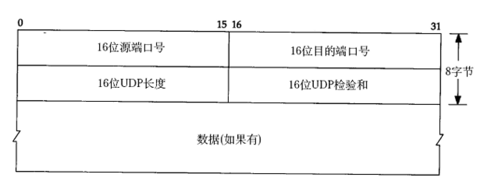
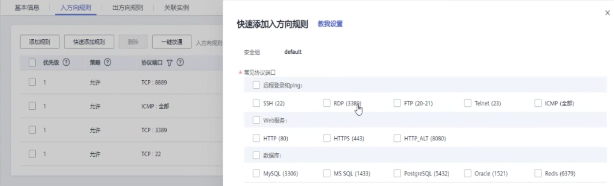
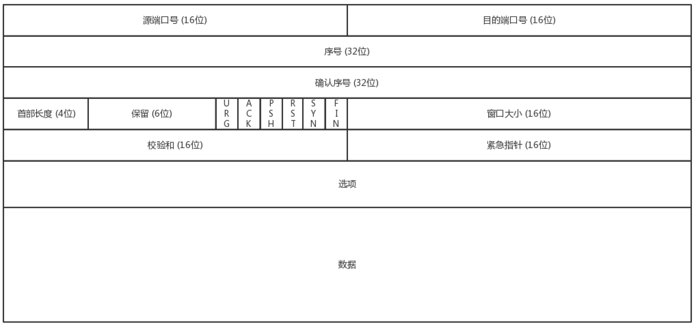
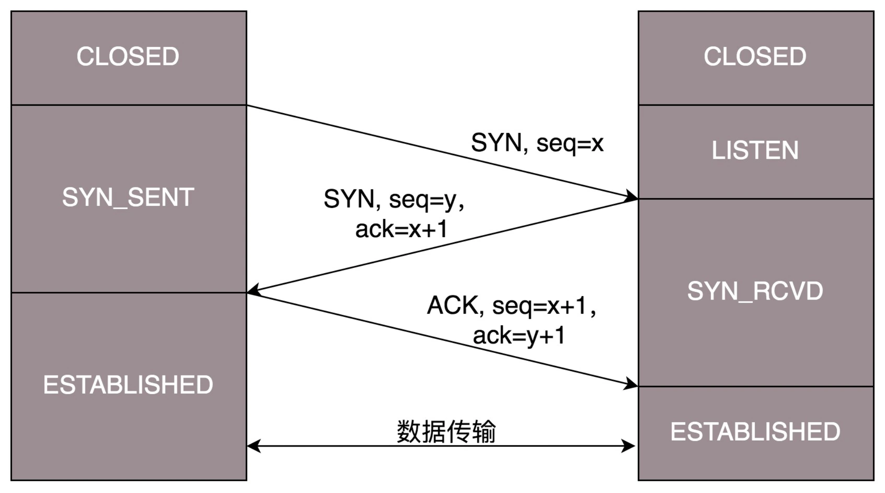
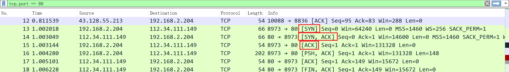
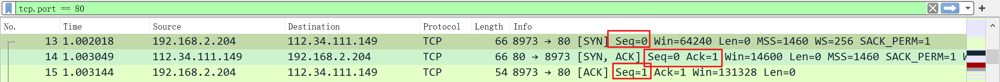
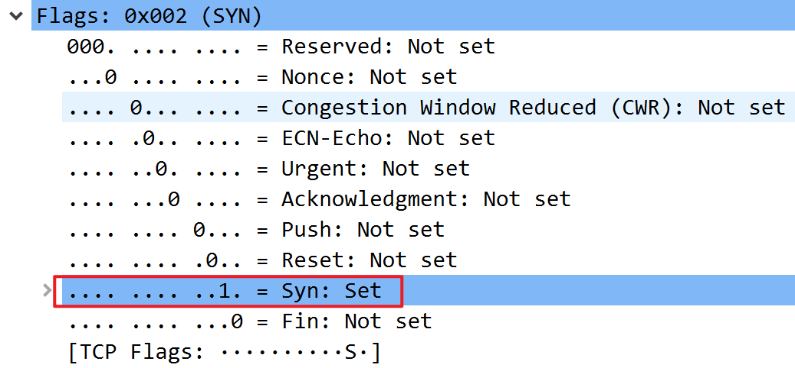
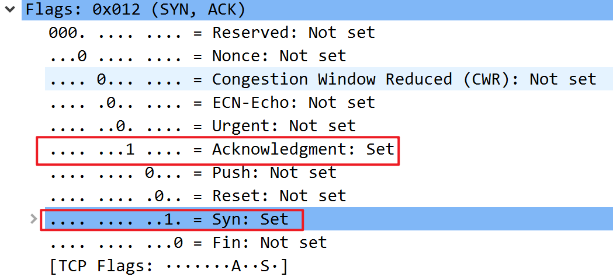
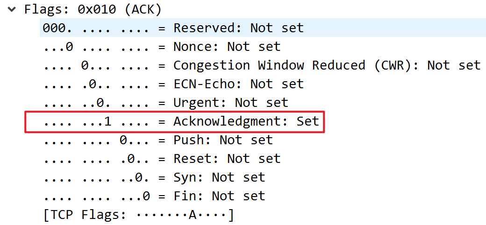

# s20.传输层协议TCP/UDP

掌握UDP、TCP协议的基本概念、特点和使用，掌握TCP协议中的流量控制、丢包问题和拥塞问题，掌握编写简单服务器/客户端程序的基础知识。

如无注明则引用自《趣谈网络协议》

## UDP协议：因性善而简单，难免碰到“城会玩”

讲完了 IP 层以后，接下来我们开始讲传输层。传输层里比较重要的两个协议，一个是TCP，一个是 UDP。对于不从事底层开发的人员来讲，或者对于开发应用的人来讲，最常用的就是这两个协议。由于面试的时候，这两个协议经常会被放在一起问，因而我在讲的时候，也会结合着来讲。

### TCP 和 UDP 有哪些区别？

一般面试的时候我问这两个协议的区别，大部分人会回答，TCP 是<u>面向连接</u>的，UDP 是<u>面向无连接</u>的。

什么叫面向连接，什么叫无连接呢？在互通之前，面向连接的协议会先建立连接。例如，TCP 会三次握手，而 UDP 不会。为什么要建立连接呢？你 TCP 三次握手，我 UDP 也可以发三个包玩玩，有什么区别吗？

所谓的**建立连接**，<u>是为了在客户端和服务端维护连接，而建立一定的数据结构来维护双方交互的状态，用这样的数据结构来保证所谓的面向连接的特性。</u>

例如，TCP 提供可靠交付。通过 TCP 连接传输的数据，无差错、不丢失、不重复、并且按序到达。我们都知道 IP 包是没有任何可靠性保证的，一旦发出去，就像西天取经，走丢了、被妖怪吃了，都只能随它去。但是 TCP 号称能做到那个连接维护的程序做的事情，这个下两节我会详细描述。而UDP 继承了 IP 包的特性，<u>不保证不丢失，不保证按顺序到达。</u>

再如，TCP 是面向字节流的。发送的时候发的是一个流，没头没尾。IP 包可不是一个流，而是一个个的 IP 包。之所以变成了流，这也是 TCP 自己的状态维护做的事情。而UDP 继承了 IP 的特性，基于数据报的，一个一个地发，一个一个地收。

还有 TCP 是可以有拥塞控制的。它意识到包丢弃了或者网络的环境不好了，就会根据情况调整自己的行为，看看是不是发快了，要不要发慢点。UDP 就不会，应用让我发，我就发，管它洪水滔天。

因而 TCP 其实是一个有状态服务，通俗地讲就是有脑子的，里面精确地记着发送了没有，接收到没有，发送到哪个了，应该接收哪个了，错一点儿都不行。而 UDP 则是无状态服务。通俗地说是没脑子的，天真无邪的，发出去就发出去了。

我们可以这样比喻，如果 MAC 层定义了本地局域网的传输行为，IP 层定义了整个网络端到端的传输行为，这两层基本定义了这样的基因：网络传输是以包为单位的，二层叫帧，网络层叫包，传输层叫段。我们笼统地称为包。包单独传输，自行选路，在不同的设备封装解封装，不保证到达。基于这个基因，生下来的孩子 UDP 完全继承了这些特性，几乎没有自己的思想。

### UDP 包头是什么样的？

我们来看一下 UDP 包头。

前面章节我已经讲过包的传输过程，这里不再赘述。当我发送的 UDP 包到达目标机器后，发现 MAC 地址匹配，于是就取下来，将剩下的包传给处理 IP 层的代码。把 IP 头取下来，发现目标 IP 匹配，接下来呢？这里面的数据包是给谁呢？

发送的时候，我知道我发的是一个 UDP 的包，收到的那台机器咋知道的呢？所以在 IP 头里面有个 8 位协议，这里会存放，数据里面到底是 TCP 还是 UDP，当然这里是 UDP。于是，如果我们知道 UDP 头的格式，就能从数据里面，将它解析出来。解析出来以后呢？数据给谁处理呢？

处理完传输层的事情，内核的事情基本就干完了，里面的数据应该交给应用程序自己去处理，可是一台机器上跑着这么多的应用程序，应该给谁呢？

无论应用程序写的使用 TCP 传数据，还是 UDP 传数据，都要监听一个端口。正是这个端口，用来区分应用程序，要不说端口不能冲突呢。两个应用监听一个端口，到时候包给谁呀？所以，按理说，无论是 TCP 还是 UDP 包头里面应该有**端口号**，<u>根据端口号，将数据交给相应的应用程序。</u>



[TCPIP] TCP/IP Illustrated, Volume 1: The Protocols. W. Richard Stevens.

#### 端口号

端口号的范围是0 ~ $ 2^{26} - 1$。其中 0 ~ 1023 被很多软件固定占用。

云服务器的访问控制->安全组->入方向规则中，可以看到很多常见协议端口。

《Linux C编程一站式学习》：

很多服务有well-known的端口号，然而客户端程序的端口号却不必是well-known的，往往是每次运行客户端程序时由系统自动分配一个空闲的端口号，用完就释放掉，称为ephemeral的端口号，想想这是为什么。

UDP协议不面向连接，也不保证传输的可靠性，例如：

- 发送端的UDP协议层只管把应用层传来的数据封装成段交给IP协议层就算完成任务了，如果因为网络故障该段无法发到对方，UDP协议层也不会给应用层返回任何错误信息。
- 接收端的UDP协议层只管把收到的数据根据端口号交给相应的应用程序就算完成任务了，如果发送端发来多个数据包并且在网络上经过不同的路由，到达接收端时顺序已经错乱了，UDP协议层也不保证按发送时的顺序交给应用层。
- 通常接收端的UDP协议层将收到的数据放在一个固定大小的缓冲区中等待应用程序来提取和处理，如果应用程序提取和处理的速度很慢，而发送端发送的速度很快，就会丢失数据包，UDP协议层并不报告这种错误。



当我们看到 UDP 包头的时候，发现的确有端口号，有源端口号和目标端口号。因为是两端通信嘛，这很好理解。但是你还会发现，UDP 除了端口号，再没有其他的了。和下两节要讲的 TCP 头比起来，这个简直简单得一塌糊涂啊！

其中，我们之前学习的 DHCP 协议就是基于 UDP 协议的。

### UDP 的三大特点

UDP 就像小孩子一样，有以下这些特点：

第一，**沟通简单**，不需要一肚子花花肠子（大量的数据结构、处理逻辑、包头字段）。前提是它相信网络世界是美好的，秉承性善论，相信网络通路默认就是很容易送达的，不容易被丢弃的。

第二，**轻信他人**。它不会建立连接，虽然有端口号，但是监听在这个地方，谁都可以传给他数据，他也可以传给任何人数据，甚至可以同时传给多个人数据。

第三，**愣头青**，做事不懂权变。不知道什么时候该坚持，什么时候该退让。它不会根据网络的情况进行发包的拥塞控制，无论网络丢包丢成啥样了，它该怎么发还怎么发。

### UDP 的三大使用场景

《Linux C编程一站式学习》：使用UDP协议的应用程序必须考虑到这些可能的问题并实现适当的解决方案，例如等待应答、超时重发、为数据包编号、流量控制等。一般使用UDP协议的应用程序实现都比较简单，只是发送一些对可靠性要求不高的消息，而不发送大量的数据。

基于 UDP 这种“小孩子”的特点，我们可以考虑在以下的场景中使用。

第一，<u>需要资源少，在网络情况比较好的内网，或者对于丢包不敏感的应用</u>。这很好理解，就像如果你是领导，你会让你们组刚毕业的小朋友去做一些没有那么难的项目，打一些没有那么难的客户，或者做一些失败了也能忍受的实验性项目。

我们在第四节讲的 DHCP 就是基于 UDP 协议的。一般的获取 IP 地址都是内网请求，而且一次获取不到 IP 又没事，过一会儿还有机会。我们讲过 PXE 可以在启动的时候自动安装操作系统，操作系统镜像的下载使用的 TFTP，这个也是基于 UDP 协议的。在还没有操作系统的时候，客户端拥有的资源很少，不适合维护一个复杂的状态机，而是因为是内网，一般也没啥问题。

第二，<u>不需要一对一沟通，建立连接，而是可以广播的应用</u>。咱们小时候人都很简单，大家在班级里面，谁成绩好，谁写作好，应该表扬谁惩罚谁，谁得几个小红花都是当着全班的面讲的，公平公正公开。长大了人心复杂了，薪水、奖金要背靠背，和员工一对一沟通。

UDP 的不面向连接的功能，可以使得可以承载广播或者多播的协议。DHCP 就是一种广播的形式，就是基于 UDP 协议的，而广播包的格式前面说过了。

对于多播，我们在讲 IP 地址的时候，讲过一个 D 类地址，也即组播地址，使用这个地址，可以将包组播给一批机器。当一台机器上的某个进程想监听某个组播地址的时候，需要发送IGMP 包，所在网络的路由器就能收到这个包，知道有个机器上有个进程在监听这个组播地址。当路由器收到这个组播地址的时候，会将包转发给这台机器，这样就实现了跨路由器的组播。

在后面云中网络部分，有一个协议 VXLAN，也是需要用到组播，也是基于 UDP 协议的。

第三，<u>需要处理速度快，时延低，可以容忍少数丢包，但是要求即便网络拥塞，也毫不退缩，一往无前的时候</u>。记得曾国藩建立湘军的时候，专门招出生牛犊不怕虎的新兵，而不用那些“老油条”的八旗兵，就是因为八旗兵经历的事情多，遇到敌军不敢舍死忘生。

同理，UDP 简单、处理速度快，不像 TCP 那样，操这么多的心，各种重传啊，保证顺序啊，前面的不收到，后面的没法处理啊。不然等这些事情做完了，时延早就上去了。而TCP 在网络不好出现丢包的时候，拥塞控制策略会主动的退缩，降低发送速度，这就相当于本来环境就差，还自断臂膀，用户本来就卡，这下更卡了。

当前很多应用都是要求低时延的，它们可不想用 TCP 如此复杂的机制，而是想根据自己的场景，实现自己的可靠和连接保证。例如，如果应用自己觉得，有的包丢了就丢了，没必要重传了，就可以算了，有的比较重要，则应用自己重传，而不依赖于 TCP。有的前面的包没到，后面的包到了，那就先给客户展示后面的嘛，干嘛非得等到齐了呢？如果网络不好，丢了包，那不能退缩啊，要尽快传啊，速度不能降下来啊，要挤占带宽，抢在客户失去耐心
之前到达。
由于 UDP 十分简单，基本啥都没做，也就给了应用“城会玩”的机会。就像在和平年代，每个人应该有独立的思考和行为，应该可靠并且礼让；但是如果在战争年代，往往不太需要过于独立的思考，而需要士兵简单服从命令就可以了。

曾国藩说哪支部队需要诱敌牺牲，也就牺牲了，相当于包丢了就丢了。两军狭路相逢的时候，曾国藩说上，没有带宽也要上，这才给了曾国藩运筹帷幄，城会玩的机会。同理如果你实现的应用需要有自己的连接策略，可靠保证，时延要求，使用 UDP，然后再应用层实现这些是再好不过了。

### 基于 UDP 的“城会玩”的五个例子

我列举几种“城会玩”的例子。

#### “城会玩”一：网页或者 APP 的访问

原来访问网页和手机 APP 都是基于 HTTP 协议的。HTTP 协议是基于 TCP 的，建立连接都需要多次交互，对于时延比较大的目前主流的移动互联网来讲，建立一次连接需要的时间会比较长，然而既然是移动中，TCP 可能还会断了重连，也是很耗时的。而且目前的 HTTP协议，往往采取多个数据通道共享一个连接的情况，这样本来为了加快传输速度，但是TCP 的严格顺序策略使得哪怕共享通道，前一个不来，后一个和前一个即便没关系，也要
等着，时延也会加大。

而QUIC（全称Quick UDP Internet Connections，快速 UDP 互联网连接）是 Google提出的一种基于 UDP 改进的通信协议，其目的是降低网络通信的延迟，提供更好的用户互动体验。

QUIC 在应用层上，会自己实现快速连接建立、减少重传时延，自适应拥塞控制，是应用层“城会玩”的代表。这一节主要是讲 UDP，QUIC 我们放到应用层去讲。

#### “城会玩”二：流媒体的协议

现在直播比较火，直播协议多使用 RTMP，这个协议我们后面的章节也会讲，而这个RTMP 协议也是基于 TCP 的。TCP 的严格顺序传输要保证前一个收到了，下一个才能确认，如果前一个收不到，下一个就算包已经收到了，在缓存里面，也需要等着。对于直播来讲，这显然是不合适的，因为老的视频帧丢了其实也就丢了，就算再传过来用户也不在意了，他们要看新的了，如果老是没来就等着，卡顿了，新的也看不了，那就会丢失客户，所
以直播，实时性比较比较重要，宁可丢包，也不要卡顿的。

另外，对于丢包，其实对于视频播放来讲，有的包可以丢，有的包不能丢，因为视频的连续帧里面，有的帧重要，有的不重要，如果必须要丢包，隔几个帧丢一个，其实看视频的人不会感知，但是如果连续丢帧，就会感知了，因而在网络不好的情况下，应用希望选择性的丢帧。

还有就是当网络不好的时候，TCP 协议会主动降低发送速度，这对本来当时就卡的看视频来讲是要命的，应该应用层马上重传，而不是主动让步。因而，很多直播应用，都基于UDP 实现了自己的视频传输协议。

#### “城会玩”三：实时游戏

游戏有一个特点，就是实时性比较高。快一秒你干掉别人，慢一秒你被别人爆头，所以很多职业玩家会买非常专业的鼠标和键盘，争分夺秒。

因而，实时游戏中客户端和服务端要建立长连接，来保证实时传输。但是游戏玩家很多，服务器却不多。由于维护 TCP 连接需要在内核维护一些数据结构，因而一台机器能够支撑的TCP 连接数目是有限的，然后 UDP 由于是没有连接的，在异步 IO 机制引入之前，常常是应对海量客户端连接的策略。

另外还是 TCP 的强顺序问题，对战的游戏，对网络的要求很简单，玩家通过客户端发送给服务器鼠标和键盘行走的位置，服务器会处理每个用户发送过来的所有场景，处理完再返回给客户端，客户端解析响应，渲染最新的场景展示给玩家。

如果出现一个数据包丢失，所有事情都需要停下来等待这个数据包重发。客户端会出现等待接收数据，然而玩家并不关心过期的数据，激战中卡 1 秒，等能动了都已经死了。

游戏对实时要求较为严格的情况下，采用自定义的可靠 UDP 协议，自定义重传策略，能够把丢包产生的延迟降到最低，尽量减少网络问题对游戏性造成的影响。

#### “城会玩”四：IoT 物联网

一方面，物联网领域终端资源少，很可能只是个内存非常小的嵌入式系统，而维护 TCP 协议代价太大；另一方面，物联网对实时性要求也很高，而 TCP 还是因为上面的那些原因导致时延大。Google 旗下的 Nest 建立Thread Group，推出了物联网通信协议 Thread，就是基于 UDP 协议的。

#### “城会玩”五：移动通信领域

在 4G 网络里，移动流量上网的数据面对的协议 GTP-U 是基于 UDP 的。因为移动网络协议比较复杂，而 GTP 协议本身就包含复杂的手机上线下线的通信协议。如果基于 TCP，TCP 的机制就显得非常多余，这部分协议我会在后面的章节单独讲解。

### 小结

好了，这节就到这里了，我们来总结一下：

如果将 TCP 比作成熟的社会人，UDP 则是头脑简单的小朋友。TCP 复杂，UDP 简单；

TCP 维护连接，UDP 谁都相信；TCP 会坚持知进退；UDP 愣头青一个，勇往直前；

UDP 虽然简单，但它有简单的用法。它可以用在环境简单、需要多播、应用层自己控制传输的地方。例如 DHCP、VXLAN、QUIC 等。

思考题：

1. 都说 TCP 是面向连接的，在计算机看来，怎么样才算一个连接呢？
2. 你知道 TCP 的连接是如何建立，又是如何关闭的吗？

## TCP协议（上）：因性恶而复杂，先恶后善反轻松

[第11讲 | TCP协议（上）：因性恶而复杂，先恶后善反轻松 (geekbang.org)](https://time.geekbang.org/column/article/8975)

上一节，我们讲的 UDP，基本上包括了传输层所必须的端口字段。它就像我们小时候一样简单，相信“网之初，性本善，不丢包，不乱序”。

后来呢，我们都慢慢长大，了解了社会的残酷，变得复杂而成熟，就像 TCP 协议一样。它之所以这么复杂，那是因为它秉承的是“性恶论”。它天然认为网络环境是恶劣的，丢包、乱序、重传，拥塞都是常有的事情，一言不合就可能送达不了，因而要从算法层面来保证可靠性。

### TCP 包头格式

我们先来看 TCP 头的格式。从这个图上可以看出，它比 UDP 复杂得多。



首先，源端口号和目标端口号是不可少的，这一点和 UDP 是一样的。如果没有这两个端口号。数据就不知道应该发给哪个应用。

接下来是包的序号。为什么要给包编号呢？当然是为了解决乱序的问题。不编好号怎么确认哪个应该先来，哪个应该后到呢。编号是为了解决乱序问题。既然是社会老司机，做事当然要稳重，一件件来，面临再复杂的情况，也临危不乱。

还应该有的就是确认序号。发出去的包应该有确认，要不然我怎么知道对方有没有收到呢？如果没有收到就应该重新发送，直到送达。这个可以解决不丢包的问题。作为老司机，做事当然要靠谱，答应了就要做到，暂时做不到也要有个回复。

TCP 是靠谱的协议，但是这不能说明它面临的网络环境好。从 IP 层面来讲，如果网络状况的确那么差，是没有任何可靠性保证的，而作为 IP 的上一层 TCP 也无能为力，唯一能做的就是更加努力，不断重传，通过各种算法保证。也就是说，对于 TCP 来讲，IP 层你丢不丢包，我管不着，但是我在我的层面上，会努力保证可靠性。

这有点像如果你在北京，和客户约十点见面，那么你应该清楚堵车是常态，你干预不了，也控制不了，你唯一能做的就是早走。打车不行就改乘地铁，尽力不失约。

接下来有一些状态位。例如 **SYN** 是发起一个连接，**ACK** 是回复，RST 是重新连接，FIN 是结束连接等。TCP 是面向连接的，因而双方要维护连接的状态，这些带状态位的包的发送，会引起双方的状态变更。

不像小时候，随便一个不认识的小朋友都能玩在一起，人大了，就变得礼貌，优雅而警觉，人与人遇到会互相热情的寒暄，离开会不舍的道别，但是人与人之间的信任会经过多次交互才能建立。

还有一个重要的就是窗口大小。TCP 要做流量控制，通信双方各声明一个窗口，标识自己当前能够的处理能力，别发送的太快，撑死我，也别发的太慢，饿死我。

作为老司机，做事情要有分寸，待人要把握尺度，既能适当提出自己的要求，又不强人所难。除了做流量控制以外，TCP 还会做拥塞控制，对于真正的通路堵车不堵车，它无能为力，唯一能做的就是控制自己，也即控制发送的速度。不能改变世界，就改变自己嘛。

作为老司机，要会自我控制，知进退，知道什么时候应该坚持，什么时候应该让步。

通过对 TCP 头的解析，我们知道要掌握 TCP 协议，重点应该关注以下几个问题：

<u>顺序问题 ，稳重不乱；</u>
<u>丢包问题，承诺靠谱；</u>
<u>连接维护，有始有终；</u>
<u>流量控制，把握分寸；</u>
<u>拥塞控制，知进知退。</u>

### TCP 的三次握手

所有的问题，首先都要先建立一个连接，所以我们先来看连接维护问题。
TCP 的连接建立，我们常常称为**三次握手**。

A：您好，我是 A。

B：您好 A，我是 B。

A：您好 B。

我们也常称为“请求 -> 应答 -> 应答之应答”的三个回合。这个看起来简单，其实里面还是有很多的学问，很多的细节。

首先，为什么要三次，而不是两次？按说两个人打招呼，一来一回就可以了啊？为了可靠，为什么不是四次？

我们还是假设这个通路是非常不可靠的，A 要发起一个连接，当发了第一个请求杳无音信的时候，会有很多的可能性，比如第一个请求包丢了，再如没有丢，但是绕了弯路，超时了，还有 B 没有响应，不想和我连接。

A 不能确认结果，于是再发，再发。终于，有一个请求包到了 B，但是请求包到了 B 的这个事情，目前 A 还是不知道的，A 还有可能再发。

B 收到了请求包，就知道了 A 的存在，并且知道 A 要和它建立连接。如果 B 不乐意建立连接，则 A 会重试一阵后放弃，连接建立失败，没有问题；如果 B 是乐意建立连接的，则会发送应答包给 A。

当然对于 B 来说，这个应答包也是一入网络深似海，不知道能不能到达 A。这个时候 B 自然不能认为连接是建立好了，因为应答包仍然会丢，会绕弯路，或者 A 已经挂了都有可能。

而且这个时候 B 还能碰到一个诡异的现象就是，A 和 B 原来建立了连接，做了简单通信后，结束了连接。还记得吗？A 建立连接的时候，请求包重复发了几次，有的请求包绕了一大圈又回来了，B 会认为这也是一个正常的的请求的话，因此建立了连接，可以想象，这个连接不会进行下去，也没有个终结的时候，纯属单相思了。因而两次握手肯定不行。

B 发送的应答可能会发送多次，但是只要一次到达 A，A 就认为连接已经建立了，因为对于A 来讲，他的消息有去有回。A 会给 B 发送应答之应答，而 B 也在等这个消息，才能确认连接的建立，只有等到了这个消息，对于 B 来讲，才算它的消息有去有回。

当然 A 发给 B 的应答之应答也会丢，也会绕路，甚至 B 挂了。按理来说，还应该有个应答之应答之应答，这样下去就没底了。所以四次握手是可以的，四十次都可以，关键四百次也不能保证就真的可靠了。只要双方的消息都有去有回，就基本可以了。

好在大部分情况下，A 和 B 建立了连接之后，A 会马上发送数据的，一旦 A 发送数据，则很多问题都得到了解决。例如 A 发给 B 的应答丢了，当 A 后续发送的数据到达的时候，B 可以认为这个连接已经建立，或者 B 压根就挂了，A 发送的数据，会报错，说 B 不可达，A 就知道 B 出事情了。

当然你可以说 A 比较坏，就是不发数据，建立连接后空着。我们在程序设计的时候，可以要求开启 keepalive 机制，即使没有真实的数据包，也有探活包。

另外，你作为服务端 B 的程序设计者，对于 A 这种长时间不发包的客户端，可以主动关闭，从而空出资源来给其他客户端使用。

三次握手除了双方建立连接外，主要还是为了沟通一件事情，就是 TCP 包的序号的问题。

A 要告诉 B，我这面发起的包的序号起始是从哪个号开始的，B 同样也要告诉 A，B 发起的包的序号起始是从哪个号开始的。为什么序号不能都从 1 开始呢？因为这样往往会出现冲突。

例如，A 连上 B 之后，发送了 1、2、3 三个包，但是发送 3 的时候，中间丢了，或者绕路了，于是重新发送，后来 A 掉线了，重新连上 B 后，序号又从 1 开始，然后发送 2，但是压根没想发送 3，但是上次绕路的那个 3 又回来了，发给了 B，B 自然认为，这就是下一个包，于是发生了错误。

因而，每个连接都要有不同的序号。这个序号的起始序号是随着时间变化的，可以看成一个 32 位的计数器，每 4 微秒加一，如果计算一下，如果到重复，需要 4 个多小时，那个绕路的包早就死翘翘了，因为我们都知道 IP 包头里面有个 TTL，也即生存时间。

好了，双方终于建立了信任，建立了连接。前面也说过，为了维护这个连接，双方都要维护一个状态机，在连接建立的过程中，双方的**状态变化时序图**就像这样。



> SYN 是同步的缩写，是发送到另一台计算机请求在它们之间建立连接的 TCP 数据包。如果第二台机器接收到 SYN，就会将 SYN/ACK 发送回 SYN 请求的地址。最后，如果原始计算机接收到 SYN/ACK，则发送最终的 ACK。
>
> [What is SYN \(Synchronize\)?](https://www.computerhope.com/jargon/s/syn.htm#:~:text=Short%20for%20synchronize%2C%20SYN%20is,a%20final%20ACK%20is%20sent.)
>
> ACK: 帮助向另一方确认它已经接收到 SYN
>
> [TCP 3\-Way Handshake \(SYN, SYN\-ACK,ACK\)](https://www.guru99.com/tcp-3-way-handshake.html)
>
> TCP 序列(seq)和确认(ack)号码有助于为 TCP 流实现有序、可靠的数据传输。Seq 编号是由 TCP 客户机发送的，表示为会话发送了多少数据(也称为字节顺序编号)。Ack 号码由 TCP 服务器发送，表示已经接收到累积的数据并准备好进入下一个段。
>
> [TCP Sequence and Acknowledgement Numbers Explained – MadPackets](https://madpackets.com/2018/04/25/tcp-sequence-and-acknowledgement-numbers-explained/#:~:text=The%20seq%20number%20is%20sent,ready%20for%20the%20next%20segment.)

一开始，客户端和服务端都处于 CLOSED 状态。先是服务端主动监听某个端口，处于 LISTEN 状态。然后客户端主动发起连接 SYN，之后处于 SYN-SENT 状态。服务端收到发起的连接，返回 SYN，并且 ACK 客户端的 SYN，之后处于 SYN-RCVD 状态。客户端收到服务端发送的 SYN 和 ACK 之后，发送 ACK 的 ACK，之后处于 ESTABLISHED 状态，因为它一发一收成功了。服务端收到 ACK 的 ACK 之后，处于 ESTABLISHED 状态，因为它也一发一收了。

#### 抓三次握手的包

环境：Wireshark

从 80 端口抓包


```过滤器表达式
tcp.port == 80
```



可以看到，数据包的类型分别是 [SYN] , [SYN, ACK], [ACK]，这就是三次握手发送的包。


而每一次源 IP 和目的 IP 都翻转了。前面的端口号也翻转了（Info 列的 8973 -> 80）。



而 Seq 和 ACK 号码也如状态变化时序图中变化。

`seq = x` =>`seq = y; ack = x + 1` => `seq = x + 1; ack = y + 1`

##### 第一次握手分析

显示的 seq 与 ack (一次 tab 表示折叠，使用 Ctrl + Alt + Shift + D 复制描述)：

```shell
Transmission Control Protocol, Src Port: 8973, Dst Port: 80, Seq: 0, Len: 0
	Sequence Number: 0    (relative sequence number)
	Sequence Number (raw): 281103731 #random
	[Next Sequence Number: 1    (relative sequence number)]
	Acknowledgment Number: 0
	Acknowledgment number (raw): 0
```



##### 第二次握手分析

显示的 seq 与 ack :

```shell
Transmission Control Protocol, Src Port: 80, Dst Port: 8973, Seq: 0, Ack: 1, Len: 0
	Sequence Number: 0    (relative sequence number)
	Sequence Number (raw): 3976109921 # random
	[Next Sequence Number: 1    (relative sequence number)]
	Acknowledgment Number: 1    (relative ack number)
	Acknowledgment number (raw): 281103732 # second raw ack = first raw seq + 1
```



##### 第三次握手分析

显示的 seq 与 ack :

```shell
Transmission Control Protocol, Src Port: 8973, Dst Port: 80, Seq: 1, Ack: 1, Len: 0 
	Sequence Number: 1    (relative sequence number)
	Sequence Number (raw): 281103732 # third raw seq = second raw ack + 1
	[Next Sequence Number: 1    (relative sequence number)]
	Acknowledgment Number: 1    (relative ack number)
	Acknowledgment number (raw): 3976109922 # third raw ack = second raw seq + 1
```




### TCP 四次挥手

好了，说完了连接，接下来说一说“拜拜”，好说好散。这常被称为四次挥手。

A：B 啊，我不想玩了。

B：哦，你不想玩了啊，我知道了。

这个时候，还只是 A 不想玩了，也即 A 不会再发送数据，但是 B 能不能在 ACK 的时候，直接关闭呢？当然不可以了，很有可能 A 是发完了最后的数据就准备不玩了，但是 B 还没做完自己的事情，还是可以发送数据的，所以称为半关闭的状态。

这个时候 A 可以选择不再接收数据了，也可以选择最后再接收一段数据，等待 B 也主动关闭。

B：A 啊，好吧，我也不玩了，拜拜。

A：好的，拜拜。这样整个连接就关闭了。

但是这个过程有没有异常情况呢？当然有，上面是和平分手的场面。

A 开始说“不玩了”，B 说“知道了”，这个回合，是没什么问题的，因为在此之前，双方还处于合作的状态，如果 A 说“不玩了”，没有收到回复，则 A 会重新发送“不玩了”。但是这个回合结束之后，就有可能出现异常情况了，因为已经有一方率先撕破脸。

一种情况是，A 说完“不玩了”之后，直接跑路，是会有问题的，因为 B 还没有发起结束，而如果 A 跑路，B 就算发起结束，也得不到回答，B 就不知道该怎么办了。另一种情况是，A 说完“不玩了”，B 直接跑路，也是有问题的，因为 A 不知道 B 是还有事情要处理，还是过一会儿会发送结束。

那怎么解决这些问题呢？TCP 协议专门设计了几个状态来处理这些问题。我们来看断开连接的时候的状态时序图。
