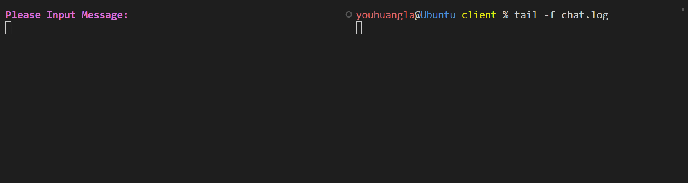
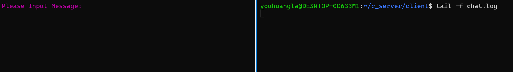
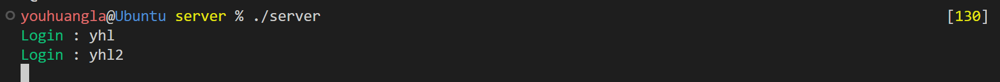
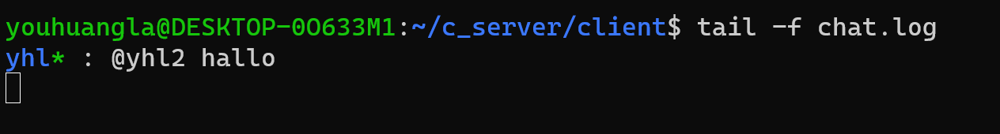

```bash
sudo ufw allow 8888
```

[阿里云服务器开放端口教程（通过配置安全组规则）\-阿里云开发者社区](https://developer.aliyun.com/article/767328)

```
youhuangla@Ubuntu server % ./client  39.96.76.xxx 8888                                                        [1]
Socket create.
Socket connect.
```

```bash
youhuangla@Ubuntu server % ./server 8888                                                                    [130]
Socket create.
Socket bind.
Socket before accept.
Socket after accept.
Socket received.
name: suyelu
Socket before accept.
^C
```

扫描公共服务器可用[Nmap: the Network Mapper \- Free Security Scanner](https://nmap.org/)

用 sleep-client (连接上socket后不发信息)连上server端后，其他客户端程序也无法连接，所以要使用多线程、多进程。

多进程见 fork-server. 但是多进程会产生僵尸进程。

多线程封装成echo服务器：

```bash
youhuangla@Ubuntu server % ./a.out 8888                                                                       [2]
Socket create.
Socket bind.
New Client Login
recv: abc

Success in ECHO!
^C
```

```
youhuangla@DESKTOP-0O633M1:~$ telnet 39.96.76.106 8888
Trying 39.96.76.106...
Connected to 39.96.76.106.
Escape character is '^]'.
You are Here
abc
ABC
Connection closed by foreign host.
```

## 完成私聊

删除 chat.log 内容，并用 ./G 重新编译

### 登录

yhl



yhl2

记得在 client.conf 中改名，并用 ./G 重新编译



server



### 私聊不存在用户

```bash
Please Input Message:
@123 123
```

```bash
youhuangla@Ubuntu client % tail -f chat.log
Notification:  123 is not online.
```

### 私聊自己

yhl

```bash
Please Input Message:
@yhl Hello,me!                    

```

```bash
youhuangla@Ubuntu client % tail -f chat.log
Notification:  123 is not online.
yhl* : @yhl Hello,me!
```

而 yhl2 中无变化

### 私聊其他用户

```bash
Please Input Message:
@yhl2 hallo
```



TODO: 自己私聊其他用户的信息，自己却看不到
