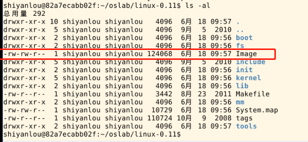
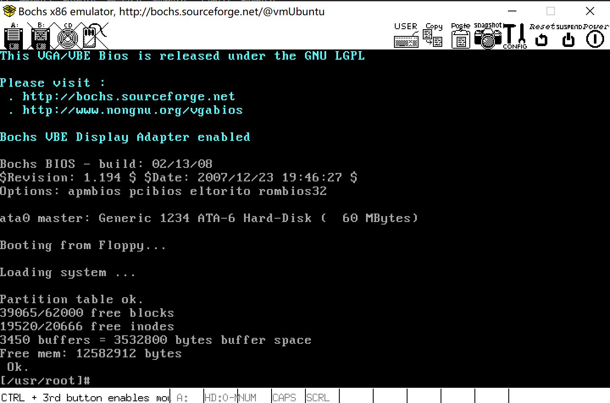
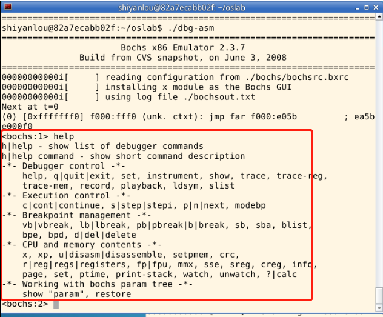
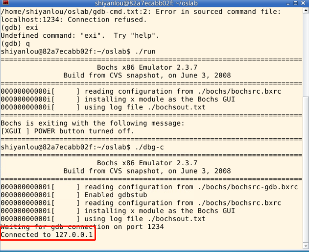
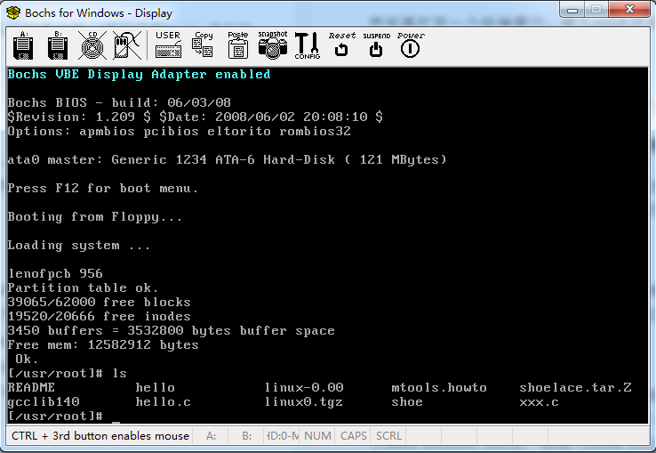
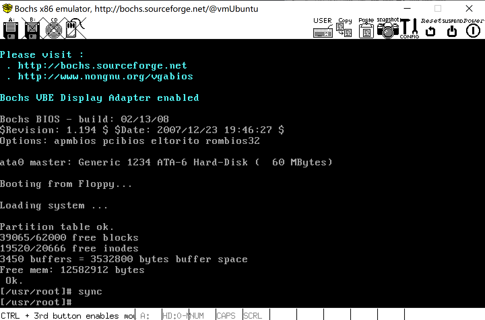

# 1.熟悉实验环境

## 1.1.课程说明

本实验是 [操作系统之基础](https://mooc.study.163.com/course/1000002004#/info) 课程的配套实验，推荐大家进行实验之前先学习相关课程：

- L1 什么是操作系统

> Tips：点击上方文字中的超链接或者输入 https://mooc.study.163.com/course/1000002004#/info 进入理论课程的学习。 如果网易云上的课程无法查看，也可以看 Bilibili 上的 [操作系统哈尔滨工业大学李治军老师](https://www.bilibili.com/video/av17036347)。

## 1.2.主要平台和工具简介

本操作系统实验的硬件环境是 IA-32（x86） 架构的 PC 机（在实验楼的环境中就是右侧的窗口），主要软件环境是 Bochs + gcc + 你最喜欢的编辑器 / IDE + 你最喜欢的操作系统 + Linux 0.11 源代码。

实验的基本流程是根据实验要求编写应用程序、修改 Linux 0.11 的源代码，用 gcc 编译后，在 Bochs 的虚拟环境中运行、调试目标代码。

上述实验环境涉及到的软件都是免费且开源的，具有较强的可移植性，可以在多种计算机的多种操作系统上搭建。为方便实验者，我们在最常见的平台 Ubuntu（最流行的 GNU/Linux 发行版之一）——上制作了 hit-oslab 集成环境，它基本包含了实验所需的所有软件，安装过程非常简单，基本上是直接解压就可以使用。

### 1.2.1.x86 模拟器 Bochs

Bochs 是一个免费且开放源代码的 IA-32（x86）架构 PC 机模拟器。在它模拟出的环境中可以运行 Linux、DOS 和各种版本的 Windows 等多种操作系统。而 Bochs 本身具有很高的移植性，可以运行在多种软硬件平台之上，这也是我们选择它做为本书的指定模拟器的主要原因。

如果您想拥抱自由的 Linux，那么 Bochs 几乎是您的不二选择。如果您想继续把自己绑定在 Windows 平台上，那么除了 Bochs，您还可以选用 VMware 或者 Microsoft Virtual PC。它们是最著名虚拟机软件，而且都可以免费使用。因为 Bochs 的是模拟器，其原理决定了它的运行效率会低于虚拟机。

但对于本书所设计的实验来说，效率上的差别很不明显。而且，Bochs 有虚拟机无可比拟的调试操作系统的能力，所以我们更建议您选用 Bochs。hit-oslab 已经内置了 bochs，本实验后文假定的缺省环境也是 Bochs。

关于 Bochs 的更详细的介绍请访问它的 [主页](http://bochs.sourceforge.net/) 及 Bochs 使用手册。

### 1.2.2.GCC 编译器

### 1.2.3.GDB 调试器

## 1.3.实验环境的工作模式

### 文件结构

- Image 文件

oslab 工作在一个宿主操作系统之上，我们使用的 Linux，在宿主操作系统之上完成对 Linux 0.11 的开发、修改和编译之后，在 linux-0.11 目录下会生产一个名为 **Image** 的文件，它就是编译之后的目标文件。

该文件内已经包含引导和所有内核的二进制代码。如果拿来一张软盘，从它的 0 扇区开始，逐字节写入 Image 文件的内容，就可以用这张软盘启动一台真正的计算机，并进入 Linux 0.11 内核。

> oslab 采用 bochs 模拟器加载这个 Image 文件，模拟执行 Linux 0.11，这样省却了重新启动计算机的麻烦。

- bochs 目录

bochs 目录下是与 bochs 相关的执行文件、数据文件和配置文件。

- run 脚本

run 是运行 bochs 的脚本命令。

运行后 bochs 会自动在它的虚拟软驱 A 和虚拟硬盘上各挂载一个镜像文件，软驱上挂载是 linux-0.11/Image，硬盘上挂载的是 hdc-0.11.img。

因为 bochs 配置文件中的设置是从软驱 A 启动，所以 Linux 0.11 会被自动加载。

而 Linux 0.11 会驱动硬盘，并 mount 硬盘上的文件系统，也就是将 hdc-0.11.img 内镜像的文件系统挂载到 0.11 系统内的根目录 —— `/`。在 0.11 下访问文件系统，访问的就是 hdc-0.11.img 文件内虚拟的文件系统。

- hdc-0.11.img 文件

hdc-0.11.img 文件的格式是 Minix 文件系统的镜像。

Linux 所有版本都支持这种格式的文件系统，所以可以直接在宿主 Linux 上通过 mount 命令访问此文件内的文件，达到宿主系统和 bochs 内运行的 Linux 0.11 之间交换文件的效果。

Windows 下目前没有（或者是还没发现）直接访问 Minix 文件系统的办法，所以要借助于 fdb.img，这是一个 1.44M 软盘的镜像文件，内部是 FAT12 文件系统。将它挂载到 bochs 的软驱 B，就可以在 0.11 中访问它。而通过 filedisk 或者 WinImage，可以在 Windows 下访问它内部的文件。

hdc-0.11.img 内包含有：

- Bash shell；
- 一些基本的 Linux 命令、工具，比如 cp、rm、mv、tar；
- vi 编辑器；
- gcc 1.4 编译器，可用来编译标准 C 程序；
- as86 和 ld86；
- Linux 0.11 的源代码，可在 0.11 下编译，然后覆盖现有的二进制内核。

> 其他文件在后面用到的时候会进行单独讲解。

## 1.4.使用方法

### 1.4.1.编译内核

“编译内核” 比 “编写内核” 要简单得多。

首先要进入 linux-0.11 目录，然后执行 make 命令：

```bash
$ cd ./linux-0.11/
$ make all
```

因为 `all` 是最常用的参数，所以可以省略，只用 `make`，效果一样。

在多处理器的系统上，可以用 -j 参数进行并行编译，加快速度。例如双 CPU 的系统可以：

```bash
$ make -j 2
```

make 命令会显示很多很多的信息，你可以尽量去看懂，也可以装作没看见。只要最后几行中没有 “error” 就说明编译成功。

最后生成的目标文件是一个软盘镜像文件—— `linux-0.11/Image`（下面的图中给出了详细的信息）。如果将此镜像文件写到一张 1.44MB 的软盘上，就可以启动一台真正的计算机。



linux-0.11 目录下是全部的源代码，很多实验内容都是要靠修改这些代码来完成。修改后需要重新编译内核，还是执行命令：`make all`。

make 命令会自动跳过未被修改的文件，链接时直接使用上次编译生成的目标文件，从而节约编译时间。但如果重新编译后，你的修改貌似没有生效，可以试试先 `make clean` ，再 `make all`（或者一行命令：`make clean && make all`。`make clean` 是删除上一次编译生成的所有中间文件和目标文件，确保是在全新的状态下编译整个工程。

#### 编译报错

```bash
youhuangla@vmUbuntu linux-0.11 % make all                                                      [0]
as86 -0 -a -o boot/bootsect.o boot/bootsect.s
make: as86: No such file or directory
make: *** [Makefile:101: boot/bootsect] Error 127
```

#### 安装as86

```bash
youhuangla@vmUbuntu linux-0.11 %  apt-cache search as86                                        [1]
bin86 - 16-bit x86 assembler and loader
youhuangla@vmUbuntu linux-0.11 % sudo apt-get install bin86
```

#### 安装gcc3.4

```bash
youhuangla@vmUbuntu linux-0.11 % make all                                   [0]
as86 -0 -a -o boot/bootsect.o boot/bootsect.s
ld86 -0 -s -o boot/bootsect boot/bootsect.o
as86 -0 -a -o boot/setup.o boot/setup.s
ld86 -0 -s -o boot/setup boot/setup.o
gcc-3.4 -m32 -g -I./include -traditional -c boot/head.s
make: gcc-3.4: No such file or directory
make: *** [Makefile:62: boot/head.o] Error 127
youhuangla@vmUbuntu ~ % apt-cache search gcc-3.4                                                                               [0]
libalien-wxwidgets-perl - Perl module for locating wxWidgets binaries
#似乎不像gcc-3.4
```

从网上找的gcc-3.4，见[gcc-3.4.tar.gz](./resource)

[哈工大李治军操作系统课程实验环境搭建_zy010101的博客-CSDN博客_李治军 环境搭建](https://blog.csdn.net/zy010101/article/details/108085192)

```bash
youhuangla@vmUbuntu ~ % cd gcc-3.4/                                                                                            [0]
youhuangla@vmUbuntu gcc-3.4 % cd amd64/                                                                                        [0]
youhuangla@vmUbuntu amd64 % ls                                                                                                 [0]
cpp-3.4_3.4.6-8ubuntu2_amd64.deb  gcc-3.4_3.4.6-8ubuntu2_amd64.deb  gcc-3.4-base_3.4.6-8ubuntu2_amd64.deb
youhuangla@vmUbuntu amd64 % sudo dpkg -i *.deb                                                                                 [0]
[sudo] password for youhuangla:
Selecting previously unselected package cpp-3.4.
(Reading database ... 197207 files and directories currently installed.)
Preparing to unpack cpp-3.4_3.4.6-8ubuntu2_amd64.deb ...
Unpacking cpp-3.4 (3.4.6-8ubuntu2) ...
Selecting previously unselected package gcc-3.4.
Preparing to unpack gcc-3.4_3.4.6-8ubuntu2_amd64.deb ...
Unpacking gcc-3.4 (3.4.6-8ubuntu2) ...
Selecting previously unselected package gcc-3.4-base.
Preparing to unpack gcc-3.4-base_3.4.6-8ubuntu2_amd64.deb ...
Unpacking gcc-3.4-base (3.4.6-8ubuntu2) ...
Setting up gcc-3.4-base (3.4.6-8ubuntu2) ...
Setting up cpp-3.4 (3.4.6-8ubuntu2) ...
Setting up gcc-3.4 (3.4.6-8ubuntu2) ...
Processing triggers for man-db (2.9.4-2) ...
youhuangla@vmUbuntu amd64 % gcc-3.4 -v                                                                                         [0]
Reading specs from /usr/lib/gcc/x86_64-linux-gnu/3.4.6/specs
Configured with: ../src/configure -v --enable-languages=c,f77 --prefix=/usr --libexecdir=/usr/lib --with-gxx-include-dir=/usr/include/c++/3.4 --enable-shared --with-system-zlib --enable-nls --without-included-gettext --program-suffix=-3.4 --enable-__cxa_atexit x86_64-linux-gnu
Thread model: posix
gcc version 3.4.6 (Ubuntu 3.4.6-8ubuntu2)
```

成功，泪目

```bash
youhuangla@vmUbuntu linux-0.11 % make all                                                                                      [0]
gcc-3.4 -m32 -g -I./include -traditional -c boot/head.s
mv head.o boot/
gcc-3.4 -march=i386  -m32 -g -Wall -O2 -fomit-frame-pointer  \
-nostdinc -Iinclude -c -o init/main.o init/main.c
init/main.c:23: warning: static declaration of 'fork' follows non-static declaration
include/unistd.h:210: warning: previous declaration of 'fork' was here
init/main.c:24: warning: static declaration of 'pause' follows non-static declaration
include/unistd.h:224: warning: previous declaration of 'pause' was here
init/main.c:26: warning: static declaration of 'sync' follows non-static declaration
include/unistd.h:235: warning: previous declaration of 'sync' was here
init/main.c:105: warning: return type of 'main' is not `int'
(cd kernel; make)
make[1]: Entering directory '/home/youhuangla/oslab/linux-0.11/kernel'
gcc-3.4 -march=i386 -m32 -g -Wall -O -fstrength-reduce -fomit-frame-pointer -finline-functions -nostdinc -I../include \
-c -o sched.o sched.c
as --32 -o system_call.o system_call.s
system_call.s: Assembler messages:
system_call.s:94: Warning: indirect call without `*'
gcc-3.4 -march=i386 -m32 -g -Wall -O -fstrength-reduce -fomit-frame-pointer -finline-functions -nostdinc -I../include \
-c -o traps.o traps.c
In file included from traps.c:13:
../include/string.h:129: warning: conflicting types for built-in function 'strchr'
../include/string.h:146: warning: conflicting types for built-in function 'strrchr'
../include/string.h:401: warning: conflicting types for built-in function 'memset'
as --32 -o asm.o asm.s
gcc-3.4 -march=i386 -m32 -g -Wall -O -fstrength-reduce -fomit-frame-pointer -finline-functions -nostdinc -I../include \
-c -o fork.o fork.c
gcc-3.4 -march=i386 -m32 -g -Wall -O -fstrength-reduce -fomit-frame-pointer -finline-functions -nostdinc -I../include \
-c -o panic.o panic.c
gcc-3.4 -march=i386 -m32 -g -Wall -O -fstrength-reduce -fomit-frame-pointer -finline-functions -nostdinc -I../include \
-c -o printk.o printk.c
gcc-3.4 -march=i386 -m32 -g -Wall -O -fstrength-reduce -fomit-frame-pointer -finline-functions -nostdinc -I../include \
-c -o vsprintf.o vsprintf.c
In file included from vsprintf.c:13:
../include/string.h:129: warning: conflicting types for built-in function 'strchr'
../include/string.h:146: warning: conflicting types for built-in function 'strrchr'
../include/string.h:401: warning: conflicting types for built-in function 'memset'
gcc-3.4 -march=i386 -m32 -g -Wall -O -fstrength-reduce -fomit-frame-pointer -finline-functions -nostdinc -I../include \
-c -o sys.o sys.c
gcc-3.4 -march=i386 -m32 -g -Wall -O -fstrength-reduce -fomit-frame-pointer -finline-functions -nostdinc -I../include \
-c -o exit.o exit.c
gcc-3.4 -march=i386 -m32 -g -Wall -O -fstrength-reduce -fomit-frame-pointer -finline-functions -nostdinc -I../include \
-c -o signal.o signal.c
gcc-3.4 -march=i386 -m32 -g -Wall -O -fstrength-reduce -fomit-frame-pointer -finline-functions -nostdinc -I../include \
-c -o mktime.o mktime.c
ld -m elf_i386 -r -o kernel.o sched.o system_call.o traps.o asm.o fork.o panic.o printk.o vsprintf.o sys.o exit.o signal.o mktime.o
sync
make[1]: Leaving directory '/home/youhuangla/oslab/linux-0.11/kernel'
(cd mm; make)
make[1]: Entering directory '/home/youhuangla/oslab/linux-0.11/mm'
gcc-3.4 -march=i386 -m32 -g -Wall -O -fstrength-reduce -fomit-frame-pointer -finline-functions -nostdinc -I../include \
-c -o memory.o memory.c
as --32 -o page.o page.s
ld -m elf_i386 -r -o mm.o memory.o page.o
make[1]: Leaving directory '/home/youhuangla/oslab/linux-0.11/mm'
(cd fs; make)
make[1]: Entering directory '/home/youhuangla/oslab/linux-0.11/fs'
gcc-3.4 -march=i386 -m32 -g -Wall -fstrength-reduce -fomit-frame-pointer -nostdinc -I../include \
-c -o open.o open.c
gcc-3.4 -march=i386 -m32 -g -Wall -fstrength-reduce -fomit-frame-pointer -nostdinc -I../include \
-c -o read_write.o read_write.c
gcc-3.4 -march=i386 -m32 -g -Wall -fstrength-reduce -fomit-frame-pointer -nostdinc -I../include \
-c -o inode.o inode.c
In file included from inode.c:7:
../include/string.h:129: warning: conflicting types for built-in function 'strchr'
../include/string.h:146: warning: conflicting types for built-in function 'strrchr'
../include/string.h:401: warning: conflicting types for built-in function 'memset'
gcc-3.4 -march=i386 -m32 -g -Wall -fstrength-reduce -fomit-frame-pointer -nostdinc -I../include \
-c -o file_table.o file_table.c
gcc-3.4 -march=i386 -m32 -g -Wall -fstrength-reduce -fomit-frame-pointer -nostdinc -I../include \
-c -o buffer.o buffer.c
gcc-3.4 -march=i386 -m32 -g -Wall -fstrength-reduce -fomit-frame-pointer -nostdinc -I../include \
-c -o super.o super.c
gcc-3.4 -march=i386 -m32 -g -Wall -fstrength-reduce -fomit-frame-pointer -nostdinc -I../include \
-c -o block_dev.o block_dev.c
gcc-3.4 -march=i386 -m32 -g -Wall -fstrength-reduce -fomit-frame-pointer -nostdinc -I../include \
-c -o char_dev.o char_dev.c
gcc-3.4 -march=i386 -m32 -g -Wall -fstrength-reduce -fomit-frame-pointer -nostdinc -I../include \
-c -o file_dev.o file_dev.c
gcc-3.4 -march=i386 -m32 -g -Wall -fstrength-reduce -fomit-frame-pointer -nostdinc -I../include \
-c -o stat.o stat.c
gcc-3.4 -march=i386 -m32 -g -Wall -fstrength-reduce -fomit-frame-pointer -nostdinc -I../include \
-c -o exec.o exec.c
In file included from exec.c:21:
../include/string.h:129: warning: conflicting types for built-in function 'strchr'
../include/string.h:146: warning: conflicting types for built-in function 'strrchr'
../include/string.h:401: warning: conflicting types for built-in function 'memset'
exec.c: In function `copy_strings':
exec.c:140: warning: use of cast expressions as lvalues is deprecated
gcc-3.4 -march=i386 -m32 -g -Wall -fstrength-reduce -fomit-frame-pointer -nostdinc -I../include \
-c -o pipe.o pipe.c
gcc-3.4 -march=i386 -m32 -g -Wall -fstrength-reduce -fomit-frame-pointer -nostdinc -I../include \
-c -o namei.o namei.c
In file included from namei.c:15:
../include/string.h:129: warning: conflicting types for built-in function 'strchr'
../include/string.h:146: warning: conflicting types for built-in function 'strrchr'
../include/string.h:401: warning: conflicting types for built-in function 'memset'
gcc-3.4 -march=i386 -m32 -g -Wall -fstrength-reduce -fomit-frame-pointer -nostdinc -I../include \
-c -o bitmap.o bitmap.c
In file included from bitmap.c:8:
../include/string.h:129: warning: conflicting types for built-in function 'strchr'
../include/string.h:146: warning: conflicting types for built-in function 'strrchr'
../include/string.h:401: warning: conflicting types for built-in function 'memset'
gcc-3.4 -march=i386 -m32 -g -Wall -fstrength-reduce -fomit-frame-pointer -nostdinc -I../include \
-c -o fcntl.o fcntl.c
gcc-3.4 -march=i386 -m32 -g -Wall -fstrength-reduce -fomit-frame-pointer -nostdinc -I../include \
-c -o ioctl.o ioctl.c
gcc-3.4 -march=i386 -m32 -g -Wall -fstrength-reduce -fomit-frame-pointer -nostdinc -I../include \
-c -o truncate.o truncate.c
ld -m elf_i386 -r -o fs.o open.o read_write.o inode.o file_table.o buffer.o super.o block_dev.o char_dev.o file_dev.o stat.o exec.o pipe.o namei.o bitmap.o fcntl.o ioctl.o truncate.o
make[1]: Leaving directory '/home/youhuangla/oslab/linux-0.11/fs'
(cd kernel/blk_drv; make)
make[1]: Entering directory '/home/youhuangla/oslab/linux-0.11/kernel/blk_drv'
gcc-3.4 -march=i386 -m32 -g -Wall -O -fstrength-reduce -fomit-frame-pointer -finline-functions -nostdinc -I../../include \
-c -o ll_rw_blk.o ll_rw_blk.c
gcc-3.4 -march=i386 -m32 -g -Wall -O -fstrength-reduce -fomit-frame-pointer -finline-functions -nostdinc -I../../include \
-c -o floppy.o floppy.c
gcc-3.4 -march=i386 -m32 -g -Wall -O -fstrength-reduce -fomit-frame-pointer -finline-functions -nostdinc -I../../include \
-c -o hd.o hd.c
gcc-3.4 -march=i386 -m32 -g -Wall -O -fstrength-reduce -fomit-frame-pointer -finline-functions -nostdinc -I../../include \
-c -o ramdisk.o ramdisk.c
In file included from ramdisk.c:7:
../../include/string.h:129: warning: conflicting types for built-in function 'strchr'
../../include/string.h:146: warning: conflicting types for built-in function 'strrchr'
../../include/string.h:401: warning: conflicting types for built-in function 'memset'
ar rcs blk_drv.a ll_rw_blk.o floppy.o hd.o ramdisk.o
sync
make[1]: Leaving directory '/home/youhuangla/oslab/linux-0.11/kernel/blk_drv'
(cd kernel/chr_drv; make)
make[1]: Entering directory '/home/youhuangla/oslab/linux-0.11/kernel/chr_drv'
gcc-3.4 -march=i386 -m32 -g -Wall -O -fstrength-reduce -fomit-frame-pointer -finline-functions -nostdinc -I../../include \
-c -o tty_io.o tty_io.c
tty_io.c: In function `copy_to_cooked':
tty_io.c:160: warning: subscript has type `char'
tty_io.c: In function `tty_write':
tty_io.c:316: warning: subscript has type `char'
gcc-3.4 -march=i386 -m32 -g -Wall -O -fstrength-reduce -fomit-frame-pointer -finline-functions -nostdinc -I../../include \
-c -o console.o console.c
gcc-3.4 -m32 -g -E -nostdinc -I../../include -traditional keyboard.S -o keyboard.s
as --32 -o keyboard.o keyboard.s
keyboard.S: Assembler messages:
keyboard.S:53: Warning: indirect call without `*'
gcc-3.4 -march=i386 -m32 -g -Wall -O -fstrength-reduce -fomit-frame-pointer -finline-functions -nostdinc -I../../include \
-c -o serial.o serial.c
as --32 -o rs_io.o rs_io.s
rs_io.s: Assembler messages:
rs_io.s:65: Warning: indirect call without `*'
gcc-3.4 -march=i386 -m32 -g -Wall -O -fstrength-reduce -fomit-frame-pointer -finline-functions -nostdinc -I../../include \
-c -o tty_ioctl.o tty_ioctl.c
ar rcs chr_drv.a tty_io.o console.o keyboard.o serial.o rs_io.o tty_ioctl.o
sync
make[1]: Leaving directory '/home/youhuangla/oslab/linux-0.11/kernel/chr_drv'
(cd kernel/math; make)
make[1]: Entering directory '/home/youhuangla/oslab/linux-0.11/kernel/math'
gcc-3.4 -march=i386 -m32 -g -Wall -O -fstrength-reduce -fomit-frame-pointer -finline-functions -nostdinc -I../../include \
-c -o math_emulate.o math_emulate.c
ar rcs math.a math_emulate.o
sync
make[1]: Leaving directory '/home/youhuangla/oslab/linux-0.11/kernel/math'
(cd lib; make)
make[1]: Entering directory '/home/youhuangla/oslab/linux-0.11/lib'
gcc-3.4 -march=i386 -m32 -g -Wall -O -fstrength-reduce -fomit-frame-pointer -finline-functions -nostdinc -I../include \
-c -o ctype.o ctype.c
gcc-3.4 -march=i386 -m32 -g -Wall -O -fstrength-reduce -fomit-frame-pointer -finline-functions -nostdinc -I../include \
-c -o _exit.o _exit.c
_exit.c: In function `_exit':
_exit.c:13: warning: `noreturn' function does return
gcc-3.4 -march=i386 -m32 -g -Wall -O -fstrength-reduce -fomit-frame-pointer -finline-functions -nostdinc -I../include \
-c -o open.o open.c
gcc-3.4 -march=i386 -m32 -g -Wall -O -fstrength-reduce -fomit-frame-pointer -finline-functions -nostdinc -I../include \
-c -o close.o close.c
gcc-3.4 -march=i386 -m32 -g -Wall -O -fstrength-reduce -fomit-frame-pointer -finline-functions -nostdinc -I../include \
-c -o errno.o errno.c
gcc-3.4 -march=i386 -m32 -g -Wall -O -fstrength-reduce -fomit-frame-pointer -finline-functions -nostdinc -I../include \
-c -o write.o write.c
gcc-3.4 -march=i386 -m32 -g -Wall -O -fstrength-reduce -fomit-frame-pointer -finline-functions -nostdinc -I../include \
-c -o dup.o dup.c
gcc-3.4 -march=i386 -m32 -g -Wall -O -fstrength-reduce -fomit-frame-pointer -finline-functions -nostdinc -I../include \
-c -o setsid.o setsid.c
gcc-3.4 -march=i386 -m32 -g -Wall -O -fstrength-reduce -fomit-frame-pointer -finline-functions -nostdinc -I../include \
-c -o execve.o execve.c
gcc-3.4 -march=i386 -m32 -g -Wall -O -fstrength-reduce -fomit-frame-pointer -finline-functions -nostdinc -I../include \
-c -o wait.o wait.c
gcc-3.4 -march=i386 -m32 -g -Wall -O -fstrength-reduce -fomit-frame-pointer -finline-functions -nostdinc -I../include \
-c -o string.o string.c
In file included from string.c:14:
../include/string.h:129: warning: conflicting types for built-in function 'strchr'
../include/string.h:146: warning: conflicting types for built-in function 'strrchr'
../include/string.h:401: warning: conflicting types for built-in function 'memset'
../include/string.h:39: warning: 'strncpy' defined but not used
../include/string.h:69: warning: 'strncat' defined but not used
../include/string.h:108: warning: 'strncmp' defined but not used
../include/string.h:129: warning: 'strchr' defined but not used
../include/string.h:146: warning: 'strrchr' defined but not used
../include/string.h:369: warning: 'memcmp' defined but not used
../include/string.h:401: warning: 'memset' defined but not used
gcc-3.4 -march=i386 -m32 -g -Wall -O -fstrength-reduce -fomit-frame-pointer -finline-functions -nostdinc -I../include \
-c -o malloc.o malloc.c
malloc.c: In function `malloc':
malloc.c:156: warning: use of cast expressions as lvalues is deprecated
ar rcs lib.a ctype.o _exit.o open.o close.o errno.o write.o dup.o setsid.o execve.o wait.o string.o malloc.o
sync
make[1]: Leaving directory '/home/youhuangla/oslab/linux-0.11/lib'
ld -m elf_i386 -Ttext 0 -e startup_32 boot/head.o init/main.o \
kernel/kernel.o mm/mm.o fs/fs.o \
kernel/blk_drv/blk_drv.a kernel/chr_drv/chr_drv.a \
kernel/math/math.a \
lib/lib.a \
-o tools/system
nm tools/system | grep -v '\(compiled\)\|\(\.o$\)\|\( [aU] \)\|\(\.\.ng$\)\|\(LASH[RL]DI\)'| sort > System.map
gcc -m32 -g -Wall -O2 -fomit-frame-pointer  \
-o tools/build tools/build.c
cp -f tools/system system.tmp
strip system.tmp
objcopy -O binary -R .note -R .comment system.tmp tools/kernel
tools/build boot/bootsect boot/setup tools/kernel  > Image
Root device is (3, 1)
Boot sector 512 bytes.
Setup is 312 bytes.
System is 125601 bytes.
rm system.tmp
rm tools/kernel -f
sync
youhuangla@vmUbuntu linux-0.11 % ls                                                                                            [0]
boot  fs  Image  include  init  kernel  lib  Makefile  mm  System.map  tags  tools
```

### 1.4.2.运行

```bash
youhuangla@vmUbuntu oslab % ./run                                                                                              [0]
./bochs/bochs-gdb: error while loading shared libraries: libSM.so.6: cannot open shared object file: No such file or directory
```

#### 安装libSM.so.6共享库

```bash
youhuangla@vmUbuntu oslab %                                                                                                  [127]
sudo apt install libsm6:i386
sudo apt install libx11-6:i386
sudo apt install libxpm4:i386
......
E: Failed to fetch http://cn.archive.ubuntu.com/ubuntu/pool/main/u/util-linux/libuuid1_2.36.1-7ubuntu2_i386.deb  Error reading from server. Remote end closed connection [IP: 91.189.91.39 80]
```

[解决ubuntu下时Failed to fetch问题-百度经验 (baidu.com)](https://jingyan.baidu.com/article/ca41422f7ed0831eae99ed24.html)

修改DNS后

`sudo etc/init.d/networking restart`提示没有文件（所以要不要执行这个?），直接执行sudo apt-get update。

#### 关于Xserver

如果用的是不带Xserver的纯终端，显示

```bash
youhuangla@vmUbuntu oslab % ./run                                                                                              [0]
========================================================================
                       Bochs x86 Emulator 2.3.7
               Build from CVS snapshot, on June 3, 2008
========================================================================
00000000000i[     ] reading configuration from ./bochs/bochsrc.bxrc
00000000000i[     ] installing x module as the Bochs GUI
00000000000i[     ] using log file ./bochsout.txt
========================================================================
Event type: PANIC
Device: [XGUI ]
Message: bochs: cannot connect to X server

A PANIC has occurred.  Do you want to:
  cont       - continue execution
  alwayscont - continue execution, and don't ask again.
               This affects only PANIC events from device [XGUI ]
  die        - stop execution now
  abort      - dump core
  debug      - hand control to gdb
Choose one of the actions above: [die]
========================================================================
Bochs is exiting with the following message:
[XGUI ] bochs: cannot connect to X server
========================================================================
```

使用带Xserver的MobaXterm

```bash
youhuangla@vmUbuntu oslab % ./run                                                                           [0]
========================================================================
                       Bochs x86 Emulator 2.3.7
               Build from CVS snapshot, on June 3, 2008
========================================================================
00000000000i[     ] reading configuration from ./bochs/bochsrc.bxrc
00000000000i[     ] installing x module as the Bochs GUI
00000000000i[     ] using log file ./bochsout.txt

```



但是这个`_`号闪的有点快，暂时不知道有没有副作用。

### 1.4.3 调试


内核调试分为两种模式：汇编级调试和 C 语言级调试。

#### （1）汇编级调试

汇编级调试需要执行命令：

```bash
# 确认在 oslab 目录下
$ cd ~/oslab/

# 运行脚本前确定已经关闭刚刚运行的 Bochs
$ ./dbg-asm
```

> 汇编级调试的启动之后 Bochs 是黑屏，这是正常的。

可以用命令 `help` 来查看调试系统用的基本命令。更详细的信息请查阅 Bochs 使用手册。




```bash
youhuangla@vmUbuntu oslab % ./dbg-asm                                                                     [130]
========================================================================
                       Bochs x86 Emulator 2.3.7
               Build from CVS snapshot, on June 3, 2008
========================================================================
00000000000i[     ] reading configuration from ./bochs/bochsrc.bxrc
00000000000i[     ] installing x module as the Bochs GUI
00000000000i[     ] using log file ./bochsout.txt
Next at t=0
(0) [0xfffffff0] f000:fff0 (unk. ctxt): jmp far f000:e05b         ; ea5be000f0
<bochs:1> ^C^C
<bochs:2> help
h|help - show list of debugger commands
h|help command - show short command description
-*- Debugger control -*-
    help, q|quit|exit, set, instrument, show, trace, trace-reg,
    trace-mem, record, playback, ldsym, slist
-*- Execution control -*-
    c|cont|continue, s|step|stepi, p|n|next, modebp
-*- Breakpoint management -*-
    vb|vbreak, lb|lbreak, pb|pbreak|b|break, sb, sba, blist,
    bpe, bpd, d|del|delete
-*- CPU and memory contents -*-
    x, xp, u|disasm|disassemble, setpmem, crc,
    r|reg|regs|registers, fp|fpu, mmx, sse, sreg, creg, info,
    page, set, ptime, print-stack, watch, unwatch, ?|calc
-*- Working with bochs param tree -*-
    show "param", restore
<bochs:3>

```


#### （2）C 语言级调试

C 语言级调试稍微复杂一些。首先执行如下命令：

##### dbg-c

```bash
$ cd ~/oslab
$ ./dbg-c
```

```bash
youhuangla@vmUbuntu oslab % ./dbg-c                                                                       [130]
========================================================================
                       Bochs x86 Emulator 2.3.7
               Build from CVS snapshot, on June 3, 2008
========================================================================
00000000000i[     ] reading configuration from ./bochs/bochsrc-gdb.bxrc
00000000000i[     ] Enabled gdbstub
00000000000i[     ] reading configuration from ./bochs/bochsrc.bxrc
00000000000i[     ] installing x module as the Bochs GUI
00000000000i[     ] using log file ./bochsout.txt
Waiting for gdb connection on port 1234

```

若在第二个终端窗口中再次`./dbg-c`

```bash
youhuangla@vmUbuntu oslab % ./dbg-c                                                                         [0]
========================================================================
                       Bochs x86 Emulator 2.3.7
               Build from CVS snapshot, on June 3, 2008
========================================================================
00000000000i[     ] reading configuration from ./bochs/bochsrc-gdb.bxrc
00000000000i[     ] Enabled gdbstub
00000000000i[     ] reading configuration from ./bochs/bochsrc.bxrc
00000000000i[     ] installing x module as the Bochs GUI
00000000000i[     ] using log file ./bochsout.txt
Waiting for gdb connection on port 1234
========================================================================
Bochs is exiting with the following message:
[GDBST] Failed to bind socket
=======================================================================
```

[Fail to Bind Socket - Stack Overflow](https://stackoverflow.com/questions/31899691/fail-to-bind-socket)

这是因为一旦你在一个进程中获取了端口，在内核让你再次拥有它之前会有一个明显的超时

##### rungdb

然后再打开一个终端窗口，执行：

```bash
$ cd ~/oslab
$ ./rungdb
```

```bash
youhuangla@vmUbuntu oslab % ./rungdb                                                                      [148]
./gdb: error while loading shared libraries: libncurses.so.5: cannot open shared object file: No such file or directory
```

##### 安装libncurses5:i386 

```bash
youhuangla@vmUbuntu oslab % sudo apt-get install libncurses5:i386 
```

```bash
youhuangla@vmUbuntu oslab % ./rungdb                                                                      [130]
./gdb: error while loading shared libraries: libexpat.so.1: cannot open shared object file: No such file or directory
youhuangla@vmUbuntu oslab %                                                                               [127]
youhuangla@vmUbuntu oslab % apt-cache search libexpat                                                     [130]
libexpat1 - XML parsing C library - runtime library
libexpat1-dev - XML parsing C library - development kit
libexpat-gst - Expat bindings for GNU Smalltalk
libexpat-ocaml - OCaml expat bindings (runtime)
libexpat-ocaml-dev - OCaml expat bindings (development)
lua-expat - libexpat bindings for the Lua language
lua-expat-dev - libexpat development files for the Lua language
```

##### 安装libexpat1-dev

```bash
youhuangla@vmUbuntu oslab % sudo apt-get install libexpat1-dev:i386                                   ......
youhuangla@vmUbuntu oslab % ./rungdb                                                                        [0]
GNU gdb 6.8
Copyright (C) 2008 Free Software Foundation, Inc.
License GPLv3+: GNU GPL version 3 or later <http://gnu.org/licenses/gpl.html>
This is free software: you are free to change and redistribute it.
There is NO WARRANTY, to the extent permitted by law.  Type "show copying"
and "show warranty" for details.
This GDB was configured as "i686-pc-linux-gnu"...
Breakpoint 1 at 0x66d1: file init/main.c, line 110.
localhost: unknown host
/home/youhuangla/oslab/gdb-cmd.txt:2: Error in sourced command file:
localhost:1234: No such file or directory.#我的机器上localhost改了sudo vim /etc/hosts,已改回localhost
(gdb)

```

> 注意：启动的顺序不能交换，否则 gdb 无法连接。

出现下图所示的提示，才说明连接成功：



```bash
# 旧终端
youhuangla@vmUbuntu oslab % ./dbg-c                                                                       [130]
========================================================================
                       Bochs x86 Emulator 2.3.7
               Build from CVS snapshot, on June 3, 2008
========================================================================
00000000000i[     ] reading configuration from ./bochs/bochsrc-gdb.bxrc
00000000000i[     ] Enabled gdbstub
00000000000i[     ] reading configuration from ./bochs/bochsrc.bxrc
00000000000i[     ] installing x module as the Bochs GUI
00000000000i[     ] using log file ./bochsout.txt
Waiting for gdb connection on port 1234
Connected to 127.0.0.1

```


```bash
#新终端
youhuangla@vmUbuntu oslab % ./rungdb                                                                      [130]
GNU gdb 6.8
Copyright (C) 2008 Free Software Foundation, Inc.
License GPLv3+: GNU GPL version 3 or later <http://gnu.org/licenses/gpl.html>
This is free software: you are free to change and redistribute it.
There is NO WARRANTY, to the extent permitted by law.  Type "show copying"
and "show warranty" for details.
This GDB was configured as "i686-pc-linux-gnu"...
Breakpoint 1 at 0x66d1: file init/main.c, line 110.
warning: Remote failure reply: Eff
0x0000fff0 in open_namei (pathname=0x0, flag=0, mode=0, res_inode=0x0) at namei.c:393
393             dev = dir->i_dev;

Breakpoint 1, main () at init/main.c:110
110             ROOT_DEV = ORIG_ROOT_DEV;
(gdb)

```


新终端窗口中运行的是 GDB 调试器。关于 gdb 调试器请查阅 GDB 使用手册。

### 1.4.4.文件交换

接下来讲解一下 Ubuntu 和 Linux 0.11 之间的文件交换如何启动。

> 开始设置文件交换之前，务必关闭所有的 Bochs 进程。

oslab 下的 `hdc-0.11-new.img` 是 0.11 内核启动后的根文件系统镜像文件，相当于在 bochs 虚拟机里装载的硬盘。在 Ubuntu 上访问其内容的方法是：

```bash
$ cd ~/oslab/

# 启动挂载脚本
$ sudo ./mount-hdc
```

> 大家使用 sudo 时，password 是 `shiyanlou`，也有可能不会提示输入密码。

之后，hdc 目录下就是和 0.11 内核一模一样的文件系统了，可以读写任何文件（可能有些文件要用 sudo 才能访问）。

```bash
# 进入挂载到 Ubuntu 上的目录
$ cd ~/oslab/hdc

# 查看内容
$ ls -al
```

```bash
youhuangla@vmUbuntu oslab % sudo ./mount-hdc                                                              [130]
sudo: unable to resolve host vmUbuntu: Name or service not known
[sudo] password for youhuangla:
youhuangla@vmUbuntu oslab % cd ~/oslab/hdc/                                                                 [0]
youhuangla@vmUbuntu hdc % ls                                                                                [0]
bin  dev  etc  image  Image  mnt  shoelace  tmp  usr  var
```

读写完毕，不要忘了卸载这个文件系统：

```bash
$ cd ~/oslab/

# 卸载
$ sudo umount hdc
```

```bash
youhuangla@vmUbuntu hdc % cd ../                                                                          [130]
youhuangla@vmUbuntu oslab % sudo umount hdc                                                                 [0]
sudo: unable to resolve host vmUbuntu: Name or service not known#如未说明忽略此行，由于我用的虚拟机改了名字出现的问题，最好不要改名，用localhost。若/etc/hosts改变了127.0.0.1可能报错
youhuangla@vmUbuntu oslab % ls                                                                            [130]
bochs  bochsout.txt  dbg-asm  dbg-c  gdb  gdb-cmd.txt  hdc  hdc-0.11.img  linux-0.11  mount-hdc  run  rungdb
youhuangla@vmUbuntu oslab % cd hdc/                                                                         [0]
youhuangla@vmUbuntu hdc % ls                                                                                [0]
umounted
```

经过 `sudo ./mount-hdc` 这样处理以后，我们可以在 Ubuntu 的 hdc 目录下创建一个 xxx.c 文件，然后利用 Ubuntu 上的编辑工具（如 gedit 等）实现对 xxx.c 文件的编辑工作，在编辑保存以后。

执行 `sudo umount hdc` 后，再进入 Linux 0.11（即 run 启动 bochs 以后）就会看到这个 xxx.c（即如下图所示），这样就避免了在 Linux 0.11 上进行编辑 xxx.c 的麻烦，因为 Linux 0.11 作为一个很小的操作系统，其上的编辑工具只有 vi，使用起来非常不便。



图 2 用 Ubuntu 和 Linux 0.11 完成文件交换以后再启动 Linux 0.11 以后

另外在 Linux 0.11 上产生的文件，如后面实验中产生的 `process.log` 文件，可以按这种方式 “拿到” Ubuntu 下用 python 程序进行处理，当然这个 python 程序在 Linux 0.11 上显然是不好使的，因为 Linux 0.11 上搭建不了 python 解释环境。

> 注意 1：不要在 0.11 内核运行的时候 mount 镜像文件，否则可能会损坏文件系统。同理，也不要在已经 mount 的时候运行 0.11 内核。
>
> 注意 2：在关闭 Bochs 之前，需要先在 0.11 的命令行运行 “sync”，确保所有缓存数据都存盘后，再关闭 Bochs。



Power：关闭Bochs，MobaXterm的Xserver直接关貌似不行
