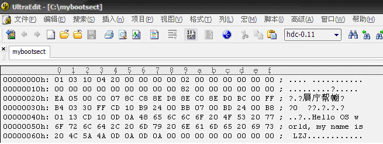
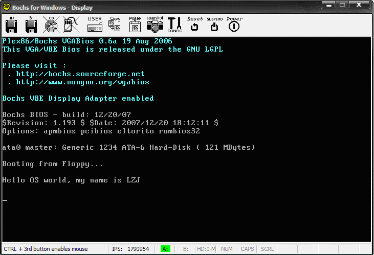
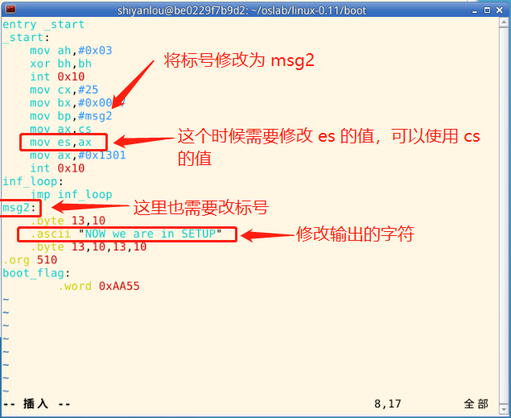
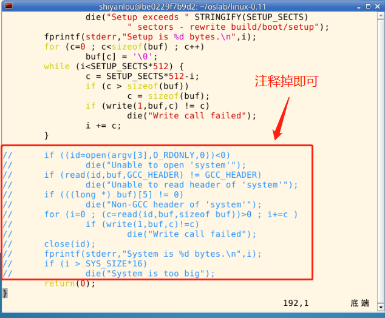
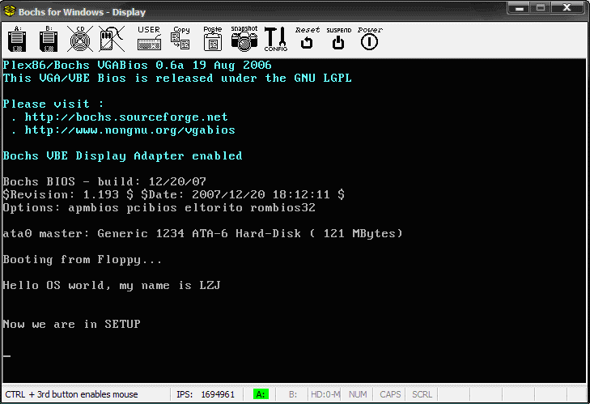
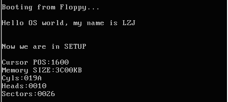

# 2.操作系统的引导


## 2.1.课程说明

本实验是 [操作系统之基础 - 网易云课堂](https://mooc.study.163.com/course/1000002004#/info) 课程的配套实验，推荐大家进行实验之前先学习相关课程：

- L2 开始揭开钢琴的盖子
- L3 操作系统启动

> Tips：点击上方文字中的超链接或者输入 https://mooc.study.163.com/course/1000002004#/info 进入理论课程的学习。 如果网易云上的课程无法查看，也可以看 Bilibili 上的 [操作系统哈尔滨工业大学李治军老师](https://www.bilibili.com/video/av17036347)。

## 2.2.实验目的

- 熟悉 hit-oslab 实验环境；
- 建立对操作系统引导过程的深入认识；
- 掌握操作系统的基本开发过程；
- 能对操作系统代码进行简单的控制，揭开操作系统的神秘面纱。

## 2.3.实验内容

此次实验的基本内容是：

1. 阅读《Linux 内核完全注释》的第 6 章，对计算机和 Linux 0.11 的引导过程进行初步的了解；
2. 按照下面的要求改写 0.11 的引导程序 bootsect.s
3. 有兴趣同学可以做做进入保护模式前的设置程序 setup.s。

改写 `bootsect.s` 主要完成如下功能：

1. bootsect.s 能在屏幕上打印一段提示信息“XXX is booting...”，其中 XXX 是你给自己的操作系统起的名字，例如 LZJos、Sunix 等（可以上论坛上秀秀谁的 OS 名字最帅，也可以显示一个特色 logo，以表示自己操作系统的与众不同。）

改写 `setup.s` 主要完成如下功能：

1. bootsect.s 能完成 setup.s 的载入，并跳转到 setup.s 开始地址执行。而 setup.s 向屏幕输出一行"Now we are in SETUP"。
2. setup.s 能获取至少一个基本的硬件参数（如内存参数、显卡参数、硬盘参数等），将其存放在内存的特定地址，并输出到屏幕上。
3. setup.s 不再加载 Linux 内核，保持上述信息显示在屏幕上即可。

## 2.4.实验报告

在实验报告中回答如下问题：

1. 有时，继承传统意味着别手蹩脚。x86 计算机为了向下兼容，导致启动过程比较复杂。请找出 x86 计算机启动过程中，被硬件强制，软件必须遵守的两个“多此一举”的步骤（多找几个也无妨），说说它们为什么多此一举，并设计更简洁的替代方案。

## 2.5.评分标准

- bootsect 显示正确，30%
- bootsect 正确读入 setup，10%
- setup 获取硬件参数正确，20%
- setup 正确显示硬件参数，20%
- 实验报告，20%

## 2.6.实验提示


操作系统的 boot 代码有很多，并且大部分是相似的。本实验仿照 `Linux-0.11/boot` 目录下的 `bootsect.s` 和 `setup.s`，以剪裁它们为主线。当然，如果能完全从头编写，并实现实验所要求的功能，是再好不过了。

同济大学赵炯博士的《Linux 内核 0.11 完全注释（修正版 V3.0）》（以后简称《注释》）的第 6 章是非常有帮助的参考，实验中可能遇到的各种问题，几乎都能找到答案。谢煜波撰写的《操作系统引导探究》也是一份很好的参考。

需要注意的是，oslab 中的汇编代码使用 as86 编译。

> 下面将给出一些更具体的 “提示”。这些提示并不是实验的一步一步的指导，而是罗列了一些实验中可能遇到的困难，并给予相关提示。它们肯定不会涵盖所有问题，也不保证其中的每个字都对完成实验有帮助。所以，它们更适合在你遇到问题时查阅，而不是当作指南一样地亦步亦趋。本课程所有实验的提示都是秉承这个思想编写的。

### 2.6.1.开始实验前

在正式开始实验之前，你需要先了解下面的内容：

#### （1）相关代码文件

Linux 0.11 文件夹中的 `boot/bootsect.s`、`boot/setup.s` 和 `tools/build.c` 是本实验会涉及到的源文件。它们的功能详见《注释》的 6.2、6.3 节和 16 章。

#### （2）引导程序的运行环境

引导程序由 BIOS 加载并运行。它活动时，操作系统还不存在，整台计算机的所有资源都由它掌控，而能利用的功能只有 BIOS 中断调用。

实验中主要使用 BIOS 0x10 和 0x13 中断。

### 2.6.2.完成 bootsect.s 的屏幕输出功能

> 代码中以 `!` 开头的行都是注释，实际在写代码时可以忽略。
>
> 实验中所有提到的修改，均是指相对于 linux-0.11 中的代码。

首先来看完成屏幕显示的关键代码，如下：(#93行)

```
! 首先读入光标位置
    mov ah,#0x03
    xor bh,bh
    int 0x10

! 显示字符串 “Hello OS world, my name is LZJ”
! 要显示的字符串长度
    mov cx,#36
    mov bx,#0x0007
    mov bp,#msg1
! es:bp 是显示字符串的地址
! 相比与 linux-0.11 中的代码，需要增加对 es 的处理，因为原代码中在输出之前已经处理了 es
    mov ax,#0x07c0
    mov es,ax
    mov ax,#0x1301
    int 0x10
! 设置一个无限循环
inf_loop:
    jmp inf_loop
```

这里需要修改的是字符串长度，即用需要输出的字符串长度替换 `mov cx,#24` 中的 24。要注意：除了我们设置的字符串 msg1 之外，还有三个换行 + 回车，一共是 6 个字符。比如这里 `Hello OS world, my name is LZJ` 的长度是 30，加上 6 后是 36，所以代码应该修改为 `mov cx,#36`。

接下来就是修改输出的字符串了：

```
! msg1 处放置字符串
msg1:
! 换行 + 回车
    .byte   13,10
    .ascii  "Hello OS world, my name is LZJ"
! 两对换行 + 回车
    .byte   13,10,13,10

! boot_flag 必须在最后两个字节
.org 510
! 设置引导扇区标记 0xAA55
! 必须有它，才能引导
boot_flag:
    .word   0xAA55
```

将 `.org 508` 修改为 `.org 510`，是因为这里不需要 `root_dev: .word ROOT_DEV`，为了保证 `boot_flag` 一定在最后两个字节，所以要修改 `.org`。

完整的代码如下：

```
entry _start
_start:
    mov ah,#0x03
    xor bh,bh
    int 0x10
    mov cx,#36
    mov bx,#0x0007
    mov bp,#msg1
    mov ax,#0x07c0
    mov es,ax
    mov ax,#0x1301
    int 0x10
inf_loop:
    jmp inf_loop
msg1:
    .byte   13,10
    .ascii  "Hello OS world, my name is LZJ"
    .byte   13,10,13,10
.org 510
boot_flag:
    .word   0xAA55
```

接下来，将完成屏幕显示的代码在开发环境中编译，并将编译后的目标文件做成 Image 文件。

### 2.6.3.编译和运行

Ubuntu 上先从终端进入 ~/oslab/linux-0.11/boot/ 目录。

Windows 上则先双击快捷方式 “MinGW32.bat”，将打开一个命令行窗口，当前目录是 oslab，用 cd 命令进入 linux-0.11\boot。

无论那种系统，都执行下面两个命令编译和链接 bootsect.s：

```bash
$ as86 -0 -a -o bootsect.o bootsect.s
$ ld86 -0 -s -o bootsect bootsect.o
```

其中 `-0`（注意：这是数字 0，不是字母 O）表示生成 8086 的 16 位目标程序，`-a` 表示生成与 GNU as 和 ld 部分兼容的代码，`-s` 告诉链接器 ld86 去除最后生成的可执行文件中的符号信息。

如果这两个命令没有任何输出，说明编译与链接都通过了。

Ubuntu 下用 `ls -l` 可列出下面的信息：

```txt
-rw--x--x    1  root  root  544  Jul  25  15:07   bootsect
-rw------    1  root  root  257  Jul  25  15:07   bootsect.o
-rw------    1  root  root  686  Jul  25  14:28   bootsect.s
```

Windows 下用 dir 可列出下面的信息：

```txt
2008-07-28  20:14               544 bootsect
2008-07-28  20:14               924 bootsect.o
2008-07-26  20:13             5,059 bootsect.s
```

其中 bootsect.o 是中间文件。bootsect 是编译、链接后的目标文件。

需要留意的文件是 bootsect 的文件大小是 544 字节，而引导程序必须要正好占用一个磁盘扇区，即 512 个字节。造成多了 32 个字节的原因是 ld86 产生的是 Minix 可执行文件格式，这样的可执行文件除了文本段、数据段等部分以外，还包括一个 Minix 可执行文件头部，它的结构如下：

```c
struct exec {
    unsigned char a_magic[2];  //执行文件魔数
    unsigned char a_flags;
    unsigned char a_cpu;       //CPU标识号
    unsigned char a_hdrlen;    //头部长度，32字节或48字节
    unsigned char a_unused;
    unsigned short a_version;
    long a_text; long a_data; long a_bss; //代码段长度、数据段长度、堆长度
    long a_entry;    //执行入口地址
    long a_total;    //分配的内存总量
    long a_syms;     //符号表大小
};
```

算一算：6 char（6 字节）+ 1 short（2 字节） + 6 long（24 字节）= 32，正好是 32 个字节，去掉这 32 个字节后就可以放入引导扇区了（这是 `tools/build.c` 的用途之一）。

对于上面的 Minix 可执行文件，其 a_magic[0]=0x01，a_magic[1]=0x03，a_flags=0x10（可执行文件），a_cpu=0x04（表示 Intel i8086/8088，如果是 0x17 则表示 Sun 公司的 SPARC），所以 bootsect 文件的头几个字节应该是 01 03 10 04。为了验证一下，Ubuntu 下用命令“hexdump -C bootsect”可以看到：

```
00000000  01 03 10 04 20 00 00 00  00 02 00 00 00 00 00 00  |.... ...........|
00000010  00 00 00 00 00 00 00 00  00 82 00 00 00 00 00 00  |................|
00000020  b8 c0 07 8e d8 8e c0 b4  03 30 ff cd 10 b9 17 00  |.........0......|
00000030  bb 07 00 bd 3f 00 b8 01  13 cd 10 b8 00 90 8e c0  |....?...........|
00000040  ba 00 00 b9 02 00 bb 00  02 b8 04 02 cd 13 73 0a  |..............s.|
00000050  ba 00 00 b8 00 00 cd 13  eb e1 ea 00 00 20 90 0d  |............. ..|
00000060  0a 53 75 6e 69 78 20 69  73 20 72 75 6e 6e 69 6e  |.Sunix is runnin|
00000070  67 21 0d 0a 0d 0a 00 00  00 00 00 00 00 00 00 00  |g!..............|
00000080  00 00 00 00 00 00 00 00  00 00 00 00 00 00 00 00  |................|
*
00000210  00 00 00 00 00 00 00 00  00 00 00 00 00 00 55 aa  |..............U.|
00000220
```

Windows 下用 UltraEdit 把该文件打开，果然如此。



图 1 用 UltraEdit 打开文件 bootsect

接下来干什么呢？是的，要去掉这 32 个字节的文件头部（`tools/build.c` 的功能之一就是这个）！随手编个小的文件读写程序都可以去掉它。不过，懒且聪明的人会在 Ubuntu 下用命令：

```bash
$ dd bs=1 if=bootsect of=Image skip=32
```

生成的 Image 就是去掉文件头的 bootsect。

Windows 下可以用 UltraEdit 直接删除（选中这 32 个字节，然后按 Ctrl+X）。

去掉这 32 个字节后，将生成的文件拷贝到 linux-0.11 目录下，并一定要命名为“Image”（注意大小写）。然后就“run”吧！

```bash
# 当前的工作路径为 /home/shiyanlou/oslab/linux-0.11/boot/

# 将刚刚生成的 Image 复制到 linux-0.11 目录下
$ cp ./Image ../Image

# 执行 oslab 目录中的 run 脚本
$ ../../run
```



图 2 bootsect 引导后的系统启动情况

### 2.6.4.bootsect.s 读入 setup.s


首先编写一个 setup.s，该 setup.s 可以就直接拷贝前面的 bootsect.s（还需要简单的调整），然后将其中的显示的信息改为：“Now we are in SETUP”。

可供参考的代码如下图所示：



接下来需要编写 bootsect.s 中载入 setup.s 的关键代码。原版 `bootsect.s` 中下面的代码就是做这个的。

```nasm
load_setup:
! 设置驱动器和磁头(drive 0, head 0): 软盘 0 磁头
    mov dx,#0x0000
! 设置扇区号和磁道(sector 2, track 0): 0 磁头、0 磁道、2 扇区
    mov cx,#0x0002
! 设置读入的内存地址：BOOTSEG+address = 512，偏移512字节
    mov bx,#0x0200
! 设置读入的扇区个数(service 2, nr of sectors)，
! SETUPLEN是读入的扇区个数，Linux 0.11 设置的是 4，
! 我们不需要那么多，我们设置为 2（因此还需要添加变量 SETUPLEN=2）
    mov ax,#0x0200+SETUPLEN
! 应用 0x13 号 BIOS 中断读入 2 个 setup.s扇区
    int 0x13
! 读入成功，跳转到 ok_load_setup: ok - continue
    jnc ok_load_setup
! 软驱、软盘有问题才会执行到这里。我们的镜像文件比它们可靠多了
    mov dx,#0x0000
! 否则复位软驱 reset the diskette
    mov ax,#0x0000
    int 0x13
! 重新循环，再次尝试读取
    jmp load_setup
ok_load_setup:
! 接下来要干什么？当然是跳到 setup 执行。
! 要注意：我们没有将 bootsect 移到 0x9000，因此跳转后的段地址应该是 0x7ce0
! 即我们要设置 SETUPSEG=0x07e0
```

所有需要的功能在原版 bootsect.s 中都是存在的，我们要做的仅仅是将这些代码添加到新的 `bootsect.s` 中去。

除了新增代码，我们还需要去掉 5.2 小节中我们在 `bootsect.s` 添加的无限循环。

编写完成后大致如下：

```nasm
SETUPLEN=2
SETUPSEG=0x07e0
entry _start
_start:
    mov ah,#0x03
    xor bh,bh
    int 0x10
    mov cx,#36
    mov bx,#0x0007
    mov bp,#msg1
    mov ax,#0x07c0
    mov es,ax
    mov ax,#0x1301
    int 0x10
load_setup:
    mov dx,#0x0000
    mov cx,#0x0002
    mov bx,#0x0200
    mov ax,#0x0200+SETUPLEN
    int 0x13
    jnc ok_load_setup
    mov dx,#0x0000
    mov ax,#0x0000
    int 0x13
    jmp load_setup
ok_load_setup:
    jmpi    0,SETUPSEG
msg1:
    .byte   13,10
    .ascii  "Hello OS world, my name is LZJ"
    .byte   13,10,13,10
.org 510
boot_flag:
    .word   0xAA55
```

### 2.6.5.再次编译

现在有两个文件都要编译、链接。一个个手工编译，效率低下，所以借助 Makefile 是最佳方式。

在 Ubuntu 下，进入 linux-0.11 目录后，使用下面命令（注意大小写）：

```bash
$ make BootImage
```

Windows 下，在命令行方式，进入 Linux-0.11 目录后，使用同样的命令（不需注意大小写）：

```bash
makeBootImage
```

无论哪种系统，都会看到：

```txt
Unable to open 'system'
make: *** [BootImage] Error 1
```

有 Error！这是因为 make 根据 Makefile 的指引执行了 `tools/build.c`，它是为生成整个内核的镜像文件而设计的，没考虑我们只需要 `bootsect.s` 和 `setup.s` 的情况。它在向我们要 “系统” 的核心代码。为完成实验，接下来给它打个小补丁。

### 2.6.6.修改 build.c


`build.c` 从命令行参数得到 bootsect、setup 和 system 内核的文件名，将三者做简单的整理后一起写入 Image。其中 system 是第三个参数（argv[3]）。当 “make all” 或者 “makeall” 的时候，这个参数传过来的是正确的文件名，`build.c` 会打开它，将内容写入 Image。而 “make BootImage” 时，传过来的是字符串 "none"。所以，改造 build.c 的思路就是当 argv[3] 是"none"的时候，只写 bootsect 和 setup，忽略所有与 system 有关的工作，或者在该写 system 的位置都写上 “0”。

修改工作主要集中在 `build.c` 的尾部，可以参考下面的方式，将圈起来的部分注释掉。



当按照前一节所讲的编译方法编译成功后再 run，就得到了如图 3 所示的运行结果，和我们想得到的结果完全一样。

```bash
$ cd ~/oslab/linux-0.11
$ make BootImage
$ ../run
```



图 3 用修改后的 bootsect.s 和 setup.s 进行引导的结果

### 2.6.7.setup.s 获取基本硬件参数


setup.s 将获得硬件参数放在内存的 0x90000 处。原版 setup.s 中已经完成了光标位置、内存大小、显存大小、显卡参数、第一和第二硬盘参数的保存。

用 `ah=#0x03` 调用 `0x10` 中断可以读出光标的位置，用 `ah=#0x88` 调用 `0x15` 中断可以读出内存的大小。有些硬件参数的获取要稍微复杂一些，如磁盘参数表。在 PC 机中 BIOS 设定的中断向量表中 `int 0x41` 的中断向量位置(4*0x41 = 0x0000:0x0104)存放的并不是中断程序的地址，而是第一个硬盘的基本参数表。第二个硬盘的基本参数表入口地址存于 `int 0x46` 中断向量位置处。每个硬盘参数表有 16 个字节大小。下表给出了硬盘基本参数表的内容：

表 1 磁盘基本参数表

| 位移 | 大小 | 说明         |
| ---- | ---- | ------------ |
| 0x00 | 字   | 柱面数       |
| 0x02 | 字节 | 磁头数       |
| ...  | ...  | ...          |
| 0x0E | 字节 | 每磁道扇区数 |
| 0x0F | 字节 | 保留         |

所以获得磁盘参数的方法就是复制数据。

下面是将硬件参数取出来放在内存 0x90000 的关键代码。

```nasm
mov    ax,#INITSEG
! 设置 ds = 0x9000
mov    ds,ax
mov    ah,#0x03
! 读入光标位置
xor    bh,bh
! 调用 0x10 中断
int    0x10
! 将光标位置写入 0x90000.
mov    [0],dx

! 读入内存大小位置
mov    ah,#0x88
int    0x15
mov    [2],ax

! 从 0x41 处拷贝 16 个字节（磁盘参数表）
mov    ax,#0x0000
mov    ds,ax
lds    si,[4*0x41]
mov    ax,#INITSEG
mov    es,ax
mov    di,#0x0004
mov    cx,#0x10
! 重复16次
rep
movsb
```

### 2.6.8.显示获得的参数


现在已经将硬件参数（只包括光标位置、内存大小和硬盘参数，其他硬件参数取出的方法基本相同，此处略去）取出来放在了 0x90000 处，接下来的工作是将这些参数显示在屏幕上。这些参数都是一些无符号整数，所以需要做的主要工作是用汇编程序在屏幕上将这些整数显示出来。

以十六进制方式显示比较简单。这是因为十六进制与二进制有很好的对应关系（每 4 位二进制数和 1 位十六进制数存在一一对应关系），显示时只需将原二进制数每 4 位划成一组，按组求对应的 ASCII 码送显示器即可。ASCII 码与十六进制数字的对应关系为：0x30 ～ 0x39 对应数字 0 ～ 9，0x41 ～ 0x46 对应数字 a ～ f。从数字 9 到 a，其 ASCII 码间隔了 7h，这一点在转换时要特别注意。为使一个十六进制数能按高位到低位依次显示，实际编程中，需对 bx 中的数每次循环左移一组（4 位二进制），然后屏蔽掉当前高 12 位，对当前余下的 4 位（即 1 位十六进制数）求其 ASCII 码，要判断它是 0 ～ 9 还是 a ～ f，是前者则加 0x30 得对应的 ASCII 码，后者则要加 0x37 才行，最后送显示器输出。以上步骤重复 4 次，就可以完成 bx 中数以 4 位十六进制的形式显示出来。

下面是完成显示 16 进制数的汇编语言程序的关键代码，其中用到的 BIOS 中断为 INT 0x10，功能号 0x0E（显示一个字符），即 AH=0x0E，AL=要显示字符的 ASCII 码。

```nasm
! 以 16 进制方式打印栈顶的16位数
print_hex:
! 4 个十六进制数字
    mov cx,#4
! 将(bp)所指的值放入 dx 中，如果 bp 是指向栈顶的话
    mov dx,(bp)
print_digit:
! 循环以使低 4 比特用上 !! 取 dx 的高 4 比特移到低 4 比特处。
    rol dx,#4
! ah = 请求的功能值，al = 半字节(4 个比特)掩码。
    mov ax,#0xe0f
! 取 dl 的低 4 比特值。
    and al,dl
! 给 al 数字加上十六进制 0x30
    add al,#0x30
    cmp al,#0x3a
! 是一个不大于十的数字
    jl  outp
! 是a～f，要多加 7
    add al,#0x07
outp:
    int 0x10
    loop    print_digit
    ret
! 这里用到了一个 loop 指令;
! 每次执行 loop 指令，cx 减 1，然后判断 cx 是否等于 0。
! 如果不为 0 则转移到 loop 指令后的标号处，实现循环；
! 如果为0顺序执行。
!
! 另外还有一个非常相似的指令：rep 指令，
! 每次执行 rep 指令，cx 减 1，然后判断 cx 是否等于 0。
！ 如果不为 0 则继续执行 rep 指令后的串操作指令，直到 cx 为 0，实现重复。

! 打印回车换行
print_nl:
! CR
    mov ax,#0xe0d
    int 0x10
! LF
    mov al,#0xa
    int 0x10
    ret
```

只要在适当的位置调用 print_bx 和 print_nl（注意，一定要设置好栈，才能进行函数调用）就能将获得硬件参数打印到屏幕上，完成此次实验的任务。但事情往往并不总是顺利的，前面的两个实验大多数实验者可能一次就编译调试通过了（这里要提醒大家：编写操作系统的代码一定要认真，因为要调试操作系统并不是一件很方便的事）。但在这个实验中会出现运行结果不对的情况（为什么呢？因为我们给的代码并不是 100% 好用的）。所以接下来要复习一下汇编，并阅读《Bochs 使用手册》，学学在 Bochs 中如何调试操作系统代码。

我想经过漫长而痛苦的调试后，大家一定能兴奋地得到下面的运行结果：



图 4 用可以打印硬件参数的 setup.s 进行引导的结果

Memory Size 是 0x3C00KB，算一算刚好是 15MB（扩展内存），加上 1MB 正好是 16MB，看看 Bochs 配置文件 bochs/bochsrc.bxrc：

```
!……
megs: 16
!……
ata0-master: type=disk, mode=flat, cylinders=410, heads=16, spt=38
!……
```

这些都和上面打出的参数吻合，表示此次实验是成功的。

> 实验楼的环境中参数可能跟上面给出的不一致。大家需要根据自己环境中 `bochs/bochsrc.bxrc` 文件中的内容才能确定具体的输出信息。

下面是提供的参考代码，大家可以根据这个来进行编写代码：

```nasm
INITSEG  = 0x9000
entry _start
_start:
! Print "NOW we are in SETUP"
    mov ah,#0x03
    xor bh,bh
    int 0x10
    mov cx,#25
    mov bx,#0x0007
    mov bp,#msg2
    mov ax,cs
    mov es,ax
    mov ax,#0x1301
    int 0x10

    mov ax,cs
    mov es,ax
! init ss:sp
    mov ax,#INITSEG
    mov ss,ax
    mov sp,#0xFF00

! Get Params
    mov ax,#INITSEG
    mov ds,ax
    mov ah,#0x03
    xor bh,bh
    int 0x10
    mov [0],dx
    mov ah,#0x88
    int 0x15
    mov [2],ax
    mov ax,#0x0000
    mov ds,ax
    lds si,[4*0x41]
    mov ax,#INITSEG
    mov es,ax
    mov di,#0x0004
    mov cx,#0x10
    rep
    movsb

! Be Ready to Print
    mov ax,cs
    mov es,ax
    mov ax,#INITSEG
    mov ds,ax

! Cursor Position
    mov ah,#0x03
    xor bh,bh
    int 0x10
    mov cx,#18
    mov bx,#0x0007
    mov bp,#msg_cursor
    mov ax,#0x1301
    int 0x10
    mov dx,[0]
    call    print_hex
! Memory Size
    mov ah,#0x03
    xor bh,bh
    int 0x10
    mov cx,#14
    mov bx,#0x0007
    mov bp,#msg_memory
    mov ax,#0x1301
    int 0x10
    mov dx,[2]
    call    print_hex
! Add KB
    mov ah,#0x03
    xor bh,bh
    int 0x10
    mov cx,#2
    mov bx,#0x0007
    mov bp,#msg_kb
    mov ax,#0x1301
    int 0x10
! Cyles
    mov ah,#0x03
    xor bh,bh
    int 0x10
    mov cx,#7
    mov bx,#0x0007
    mov bp,#msg_cyles
    mov ax,#0x1301
    int 0x10
    mov dx,[4]
    call    print_hex
! Heads
    mov ah,#0x03
    xor bh,bh
    int 0x10
    mov cx,#8
    mov bx,#0x0007
    mov bp,#msg_heads
    mov ax,#0x1301
    int 0x10
    mov dx,[6]
    call    print_hex
! Secotrs
    mov ah,#0x03
    xor bh,bh
    int 0x10
    mov cx,#10
    mov bx,#0x0007
    mov bp,#msg_sectors
    mov ax,#0x1301
    int 0x10
    mov dx,[12]
    call    print_hex

inf_loop:
    jmp inf_loop

print_hex:
    mov    cx,#4
print_digit:
    rol    dx,#4
    mov    ax,#0xe0f
    and    al,dl
    add    al,#0x30
    cmp    al,#0x3a
    jl     outp
    add    al,#0x07
outp:
    int    0x10
    loop   print_digit
    ret
print_nl:
    mov    ax,#0xe0d     ! CR
    int    0x10
    mov    al,#0xa     ! LF
    int    0x10
    ret

msg2:
    .byte 13,10
    .ascii "NOW we are in SETUP"
    .byte 13,10,13,10
msg_cursor:
    .byte 13,10
    .ascii "Cursor position:"
msg_memory:
    .byte 13,10
    .ascii "Memory Size:"
msg_cyles:
    .byte 13,10
    .ascii "Cyls:"
msg_heads:
    .byte 13,10
    .ascii "Heads:"
msg_sectors:
    .byte 13,10
    .ascii "Sectors:"
msg_kb:
    .ascii "KB"

.org 510
boot_flag:
    .word 0xAA55
```

