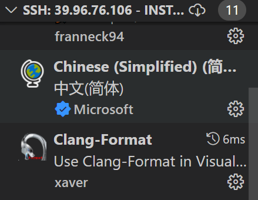
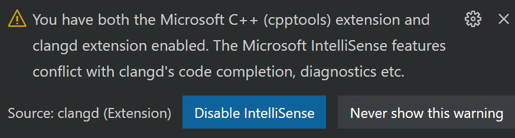
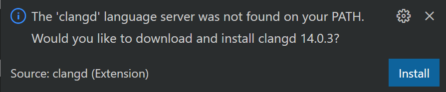
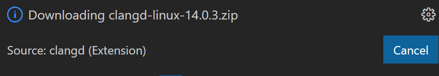
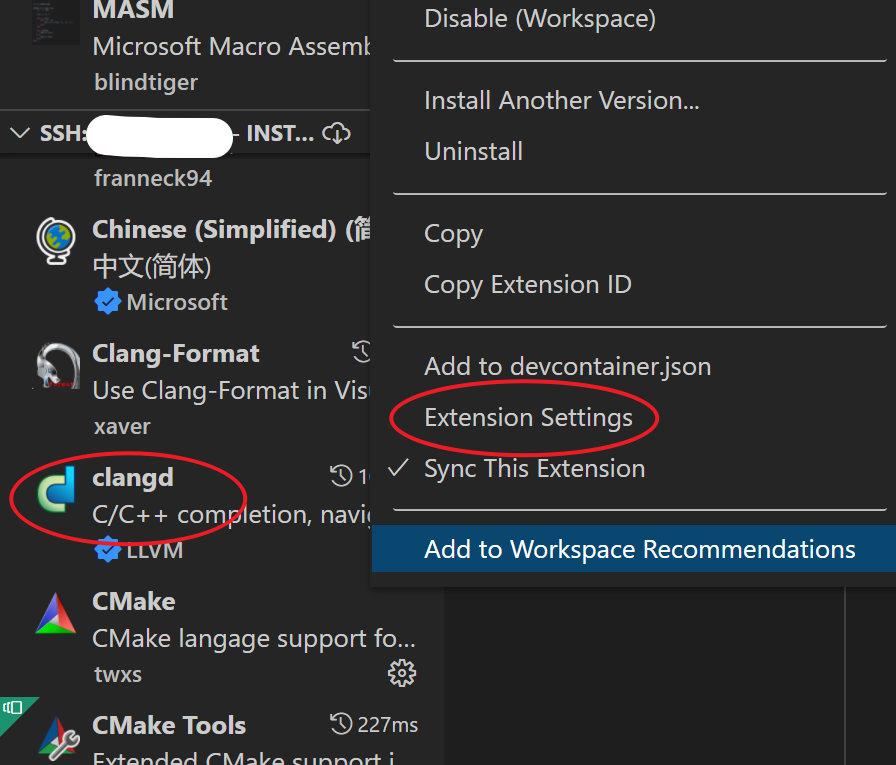
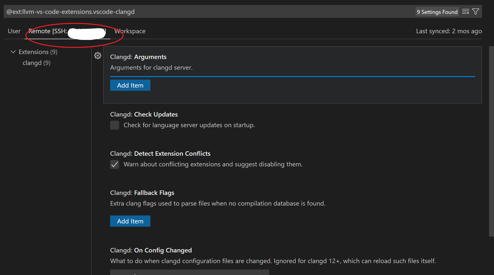
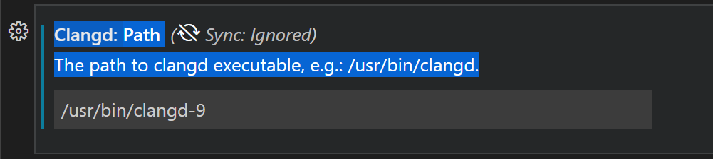
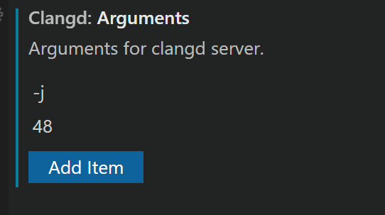
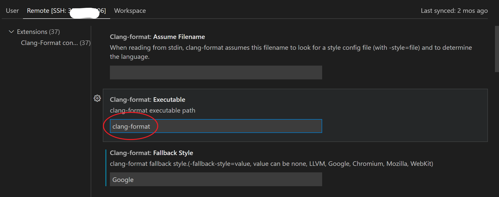

# extension

## Run Snippets in Markdown

[Run Snippets in Markdown \- Visual Studio Marketplace](https://marketplace.visualstudio.com/items?itemName=statiolake.vscode-markdown-run-snippet)

Select a snippets and Ctrl+Shift+P, runRun Snippets in Markdown.

## C/C++ Compile Run

[VScode tasks\.json和launch\.json的设置 \- 知乎](https://zhuanlan.zhihu.com/p/92175757)

今天搞个链接数学库函数搞了半天，才发现是tasks.json和launch.json理解有问题。

tasks用于在launch前执行任务，launch用于读取执行文件。

另外，在搜索框里输入 C_Cpp.errorSquiggles，将错误提醒设置为打开状态或关闭状态（有一次试图quick fix不小心关了。。要记得看好选项）

[Get Started with C\+\+ on Linux in Visual Studio Code](https://code.visualstudio.com/docs/cpp/config-linux)

## Clangd



提示和微软冲突



disable一波





### 安装clangd

[远程开发C++_4.Linux下如何打造C++完美开发IDE：clangd_哔哩哔哩_bilibili](https://www.bilibili.com/video/BV16g411N77i?spm_id_from=333.337.search-card.all.click)

[Getting started](https://clangd.llvm.org/installation.html)

```shell
sudo apt-get install clangd-9

youhuangla@Ubuntu 4-0 % clangd-9                                                                             [0]
clangd is a language server that provides IDE-like features to editors.

It should be used via an editor plugin rather than invoked directly. For more information, see:
        https://clang.llvm.org/extra/clangd/
        https://microsoft.github.io/language-server-protocol/

clangd accepts flags on the commandline, and in the CLANGD_FLAGS environment variable.

I[23:20:38.320] clangd version 9.0.0-2~ubuntu18.04.2 (tags/RELEASE_900/final)
I[23:20:38.321] Working directory: /home/youhuangla/accelerated_cpp/4/4-0
I[23:20:38.321] argv[0]: clangd-9
I[23:20:38.321] Starting LSP over stdin/stdout
^C
```

#### 配置





#### Path

```shell
youhuangla@Ubuntu 4-0 % where clangd-9                                                                       [1]
/usr/bin/clangd-9
```





可以了！

### clang-format

The 'clang-format' command is not available.

```shell
sudo apt install clang-format
```



#### help

```shell
clang-format -help
```

### auto complete function

After auto complete function, use Tab key to switch to the next argument.

### .clang-format

In ~ directory:

[VS Code \+ Clang\-format 格式化代码 \- 知乎](https://zhuanlan.zhihu.com/p/356143396#:~:text=VS%20Code%20C%2B%2B%20%E4%BB%A3%E7%A0%81%E6%A0%BC%E5%BC%8F%E5%8C%96%E6%96%B9%E6%B3%95&text=2.%20%E6%89%93%E5%BC%80%E9%A6%96%E9%80%89%E9%A1%B9%E8%AE%BE%E7%BD%AE,%E6%A0%BC%E5%BC%8F%E8%87%AA%E5%8A%A8%E6%A0%BC%E5%BC%8F%E5%8C%96%E4%BB%A3%E7%A0%81%E3%80%82)

```.clang-format
# 语言: None, Cpp, Java, JavaScript, ObjC, Proto, TableGen, TextProto
Language: Cpp
# BasedOnStyle:	LLVM

# 访问说明符(public、private等)的偏移
AccessModifierOffset: -4

# 开括号(开圆括号、开尖括号、开方括号)后的对齐: Align, DontAlign, AlwaysBreak(总是在开括号后换行)
AlignAfterOpenBracket: Align

# 连续赋值时，对齐所有等号
AlignConsecutiveAssignments: false

# 连续声明时，对齐所有声明的变量名
AlignConsecutiveDeclarations: false

# 右对齐逃脱换行(使用反斜杠换行)的反斜杠
AlignEscapedNewlines: Right

# 水平对齐二元和三元表达式的操作数
AlignOperands: true

# 对齐连续的尾随的注释
AlignTrailingComments: true

# 不允许函数声明的所有参数在放在下一行
AllowAllParametersOfDeclarationOnNextLine: false

# 不允许短的块放在同一行
AllowShortBlocksOnASingleLine: true

# 允许短的case标签放在同一行
AllowShortCaseLabelsOnASingleLine: true

# 允许短的函数放在同一行: None, InlineOnly(定义在类中), Empty(空函数), Inline(定义在类中，空函数), All
AllowShortFunctionsOnASingleLine: None

# 允许短的if语句保持在同一行
AllowShortIfStatementsOnASingleLine: true

# 允许短的循环保持在同一行
AllowShortLoopsOnASingleLine: true

# 总是在返回类型后换行: None, All, TopLevel(顶级函数，不包括在类中的函数), 
# AllDefinitions(所有的定义，不包括声明), TopLevelDefinitions(所有的顶级函数的定义)
AlwaysBreakAfterReturnType: None

# 总是在多行string字面量前换行
AlwaysBreakBeforeMultilineStrings: false

# 总是在template声明后换行
AlwaysBreakTemplateDeclarations: true

# false表示函数实参要么都在同一行，要么都各自一行
BinPackArguments: true

# false表示所有形参要么都在同一行，要么都各自一行
BinPackParameters: true

# 大括号换行，只有当BreakBeforeBraces设置为Custom时才有效
BraceWrapping:
  # class定义后面
  AfterClass: false
  # 控制语句后面
  AfterControlStatement: false
  # enum定义后面
  AfterEnum: false
  # 函数定义后面
  AfterFunction: false
  # 命名空间定义后面
  AfterNamespace: false
  # struct定义后面
  AfterStruct: false
  # union定义后面
  AfterUnion: false
  # extern之后
  AfterExternBlock: false
  # catch之前
  BeforeCatch: false
  # else之前
  BeforeElse: false
  # 缩进大括号
  IndentBraces: false
  # 分离空函数
  SplitEmptyFunction: false
  # 分离空语句
  SplitEmptyRecord: false
  # 分离空命名空间
  SplitEmptyNamespace: false

# 在二元运算符前换行: None(在操作符后换行), NonAssignment(在非赋值的操作符前换行), All(在操作符前换行)
BreakBeforeBinaryOperators: NonAssignment

# 在大括号前换行: Attach(始终将大括号附加到周围的上下文), Linux(除函数、命名空间和类定义，与Attach类似), 
#   Mozilla(除枚举、函数、记录定义，与Attach类似), Stroustrup(除函数定义、catch、else，与Attach类似), 
#   Allman(总是在大括号前换行), GNU(总是在大括号前换行，并对于控制语句的大括号增加额外的缩进), WebKit(在函数前换行), Custom
#   注：这里认为语句块也属于函数
BreakBeforeBraces: Custom

# 在三元运算符前换行
BreakBeforeTernaryOperators: false

# 在构造函数的初始化列表的冒号后换行
BreakConstructorInitializers: AfterColon

#BreakInheritanceList: AfterColon

BreakStringLiterals: false

# 每行字符的限制，0表示没有限制
ColumnLimit: 0

CompactNamespaces: true

# 构造函数的初始化列表要么都在同一行，要么都各自一行
ConstructorInitializerAllOnOneLineOrOnePerLine: false

# 构造函数的初始化列表的缩进宽度
ConstructorInitializerIndentWidth: 4

# 延续的行的缩进宽度
ContinuationIndentWidth: 4

# 去除C++11的列表初始化的大括号{后和}前的空格
Cpp11BracedListStyle: true

# 继承最常用的指针和引用的对齐方式
DerivePointerAlignment: false

# 固定命名空间注释
FixNamespaceComments: true

# 缩进case标签
IndentCaseLabels: false

IndentPPDirectives: None

# 缩进宽度
IndentWidth: 4

# 函数返回类型换行时，缩进函数声明或函数定义的函数名
IndentWrappedFunctionNames: false

# 保留在块开始处的空行
KeepEmptyLinesAtTheStartOfBlocks: false

# 连续空行的最大数量
MaxEmptyLinesToKeep: 1

# 命名空间的缩进: None, Inner(缩进嵌套的命名空间中的内容), All
NamespaceIndentation: None

# 指针和引用的对齐: Left, Right, Middle
PointerAlignment: Right

# 允许重新排版注释
ReflowComments: true

# 允许排序#include
SortIncludes: false

# 允许排序 using 声明
SortUsingDeclarations: false

# 在C风格类型转换后添加空格
SpaceAfterCStyleCast: false

# 在Template 关键字后面添加空格
SpaceAfterTemplateKeyword: true

# 在赋值运算符之前添加空格
SpaceBeforeAssignmentOperators: true

# SpaceBeforeCpp11BracedList: true

# SpaceBeforeCtorInitializerColon: true

# SpaceBeforeInheritanceColon: true

# 开圆括号之前添加一个空格: Never, ControlStatements, Always
SpaceBeforeParens: ControlStatements

# SpaceBeforeRangeBasedForLoopColon: true

# 在空的圆括号中添加空格
SpaceInEmptyParentheses: false

# 在尾随的评论前添加的空格数(只适用于//)
SpacesBeforeTrailingComments: 1

# 在尖括号的<后和>前添加空格
SpacesInAngles: false

# 在C风格类型转换的括号中添加空格
SpacesInCStyleCastParentheses: false

# 在容器(ObjC和JavaScript的数组和字典等)字面量中添加空格
SpacesInContainerLiterals: true

# 在圆括号的(后和)前添加空格
SpacesInParentheses: false

# 在方括号的[后和]前添加空格，lamda表达式和未指明大小的数组的声明不受影响
SpacesInSquareBrackets: false

# 标准: Cpp03, Cpp11, Auto
Standard: Cpp11

# tab宽度
TabWidth: 4

# 使用tab字符: Never, ForIndentation, ForContinuationAndIndentation, Always
UseTab: Never
```

为了对齐，不出现空格和混杂的缩进，最后一行改为

```
UseTab: Never
```

[How make clang\-format indent using tabs instead of spaces? \- Stack Overflow](https://stackoverflow.com/questions/69135590/how-make-clang-format-indent-using-tabs-instead-of-spaces)
