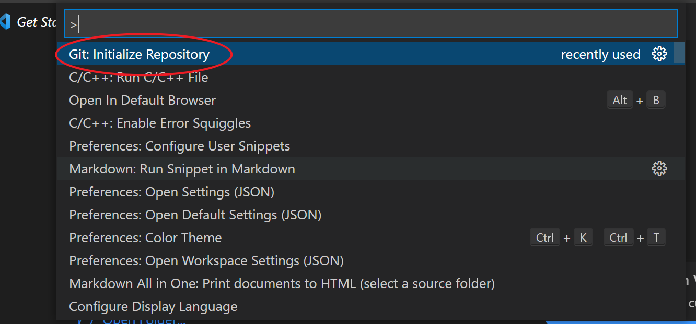
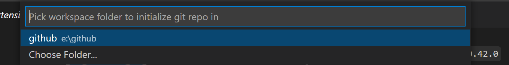
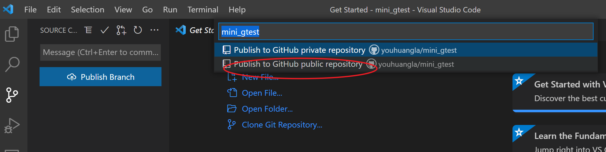
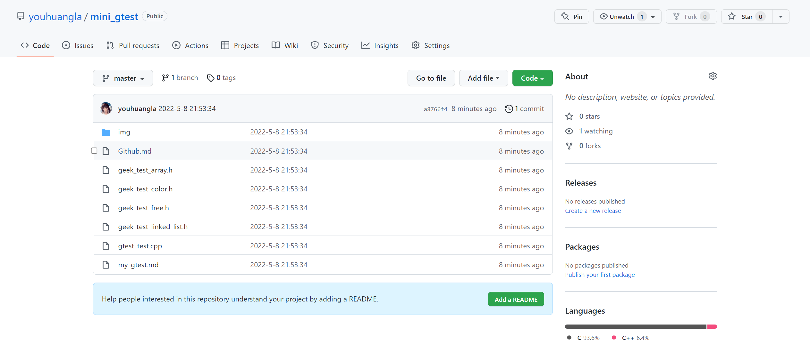
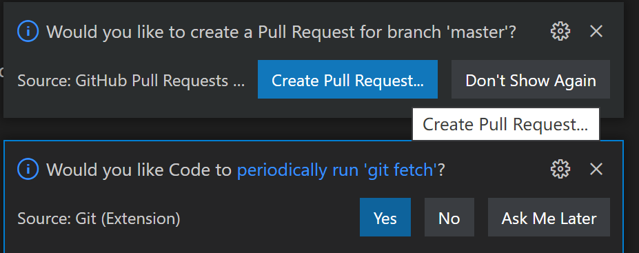
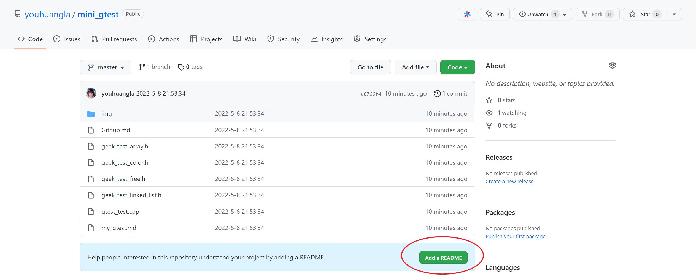
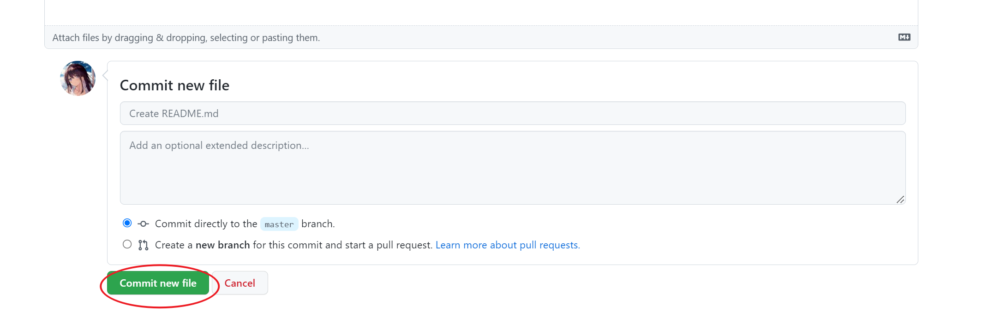

[Version Control in Visual Studio Code](https://code.visualstudio.com/docs/editor/versioncontrol)





无脑三件套失败。。。

```shell
 git push
fatal: No configured push destination.
Either specify the URL from the command-line or configure a remote repository using

    git remote add <name> <url>

and then push using the remote name

    git push <name>
```

别忘记首先在 vscode 上登陆 github！



publish 后会弹出一个可以让你转到 github 对应的 repo 的链接。



然后




[what is "Would you like to enable auto fetching of Git repositories?" · Issue \#40282 · microsoft/vscode](https://github.com/microsoft/vscode/issues/40282)

那么先不管他们，直接用朴素的方法新建吧！





```shell
PS E:\github\mini_gtest> git pull 
remote: Enumerating objects: 4, done.
remote: Counting objects: 100% (4/4), done.
remote: Compressing objects: 100% (2/2), done.
remote: Total 3 (delta 1), reused 0 (delta 0), pack-reused 0
Unpacking objects: 100% (3/3), done.
From https://github.com/youhuangla/mini_gtest
   a8766f4..7ddbcab  master     -> origin/master
Updating a8766f4..7ddbcab
Fast-forward
 README.md | 1 +
 1 file changed, 1 insertion(+)
 create mode 100644 README.md
```

愉快的无脑三件套吧！

```shell
git add .
git commit -a
git push
```

