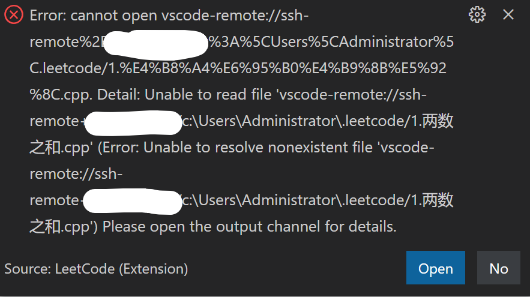
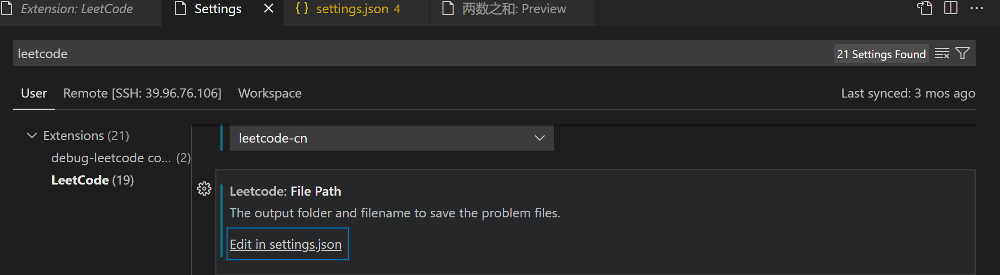
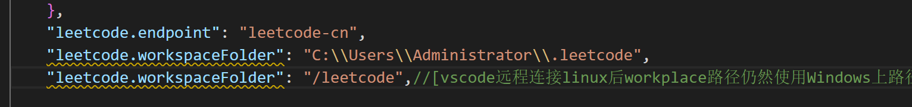
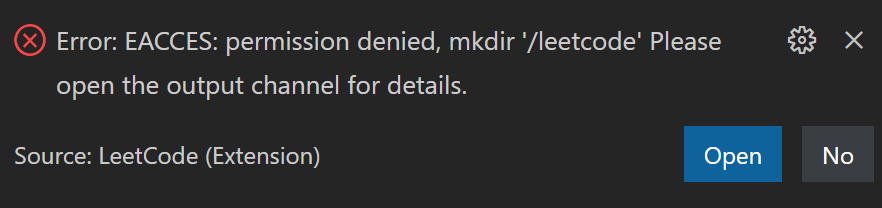

# leetcode

在 linux 远程服务器上使用 vscode-leetcode 出现的问题

点击 Code，选择语言后



```output
Error: cannot open vscode-remote://ssh-remote%2Bxx.xx.xx.xxx(ip)/c%3A%5CUsers%5CAdministrator%5C.leetcode/1.%E4%B8%A4%E6%95%B0%E4%B9%8B%E5%92%8C.cpp. Detail: Unable to read file 'vscode-remote://ssh-remote+xx.xx.xx.xxx(ip)/c:\Users\Administrator\.leetcode/1.两数之和.cpp' (Error: Unable to resolve nonexistent file 'vscode-remote://ssh-remote+xx.xx.xx.xxx(ip)/c:\Users\Administrator\.leetcode/1.两数之和.cpp') Please open the output channel for details.
```

[vscode远程连接linux后workplace路径仍然使用Windows上路径。 · Issue \#775 · LeetCode\-OpenSource/vscode\-leetcode](https://github.com/LeetCode-OpenSource/vscode-leetcode/issues/775)





改为 ~/youhuangla/leetcode 还是用不了，注释掉上面一行也不行，先尝试本地了。



