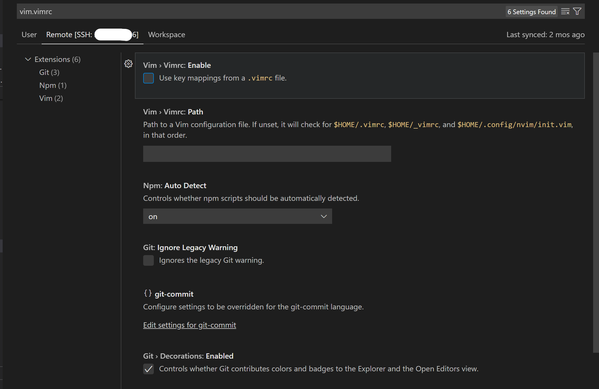
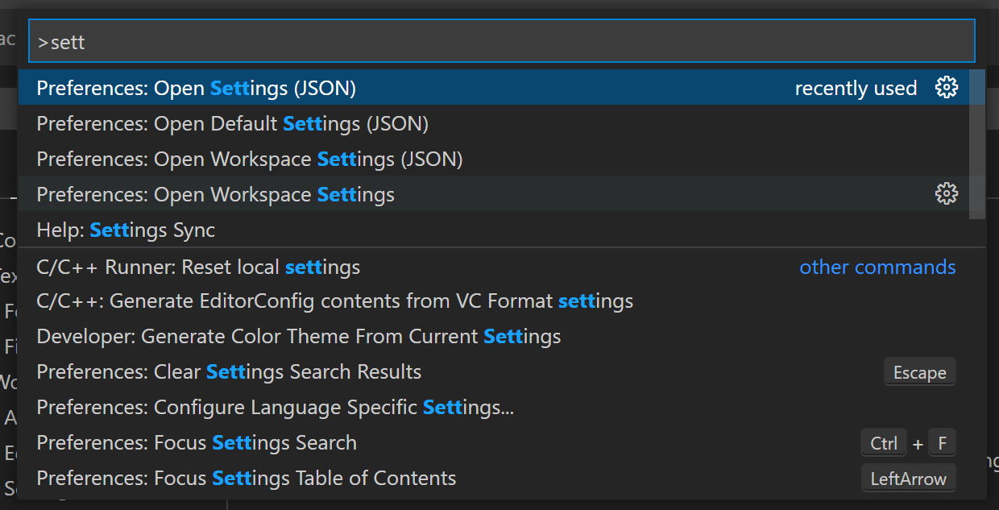
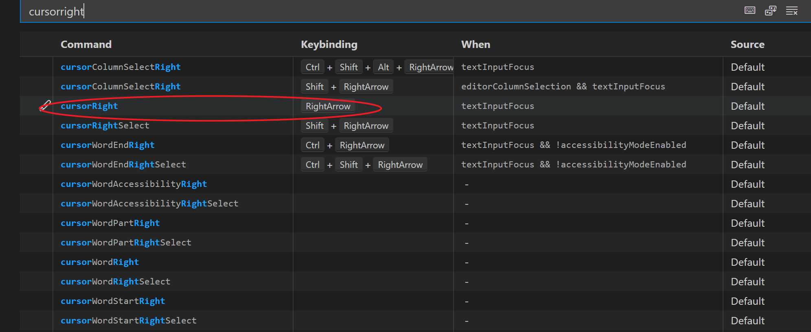

# Vim

## search mode

`/`

## Enable some of "ctrl"

<https://www.cnblogs.com/jie828/p/11320014.html>

- Edit settings

- Rember the "," before added code and the end of added code(add of delete?)

## Use Alt + hjkl

File->Preferences->Keyboard Shortcuts

## Common Vim

Use  `u`  to undo,use Ctrl + R to redo in normal mode.

## Man page

[Manpages \- Visual Studio Marketplace](https://marketplace.visualstudio.com/items?itemName=meronz.manpages)

right click to open man page.
