# Github

[5个隐藏的GitHub神技巧，助你秒变大佬！\_哔哩哔哩\_bilibili](https://www.bilibili.com/video/BV1q54y1f7h6?spm_id_from=333.337.search-card.all.click)

来自程序员鱼皮

笔记地址：[Note/github\.md at main · youhuangla/Note](https://github.com/youhuangla/Note/blob/main/web/github.md)

- [Github](#github)
  - [1.搜索](#1搜索)
  - [2.查找文件](#2查找文件)
  - [3.阅读代码技巧](#3阅读代码技巧)
  - [4.在线运行项目](#4在线运行项目)
  - [5.项目推送](#5项目推送)
  - [更新：从 mini_gtest 开始的 github 实践](#更新从-mini_gtest-开始的-github-实践)

## 1.搜索

github高级搜索功能

直接打开这里[GitHub · Where software is built](https://github.com/search/advanced)

或搜索后在搜索页面 language 下方打开（没找到更好的方法）

更多技巧可查看官方文档：

[About searching on GitHub \- GitHub Docs](https://docs.github.com/cn/search-github/getting-started-with-searching-on-github/about-searching-on-github)

[搜索代码 \- GitHub Docs](https://docs.github.com/cn/search-github/searching-on-github/searching-code)

## 2.查找文件

在主页按“t”：查找文件

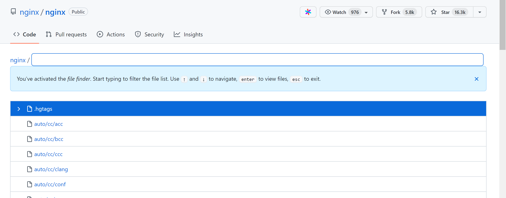

点进源代码后，按“l”：跳转到某一行

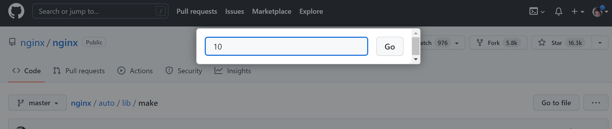

点击行号：

1. 复制这行代码
2. 生成永久链接

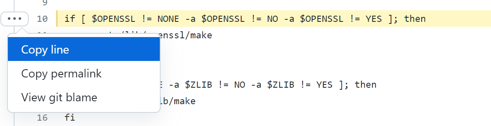

源代码中按“b”：查看文件的改动记录

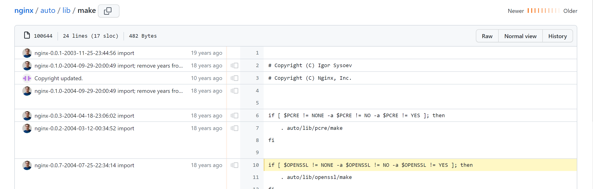

键盘快捷键：

- 文档

  [键盘快捷键 \- GitHub Docs](https://docs.github.com/cn/get-started/using-github/keyboard-shortcuts)

- 图片

  [GitHub Markdown Cheat Sheet \(Example\)](https://coderwall.com/p/ln-ira/github-markdown-cheat-sheet)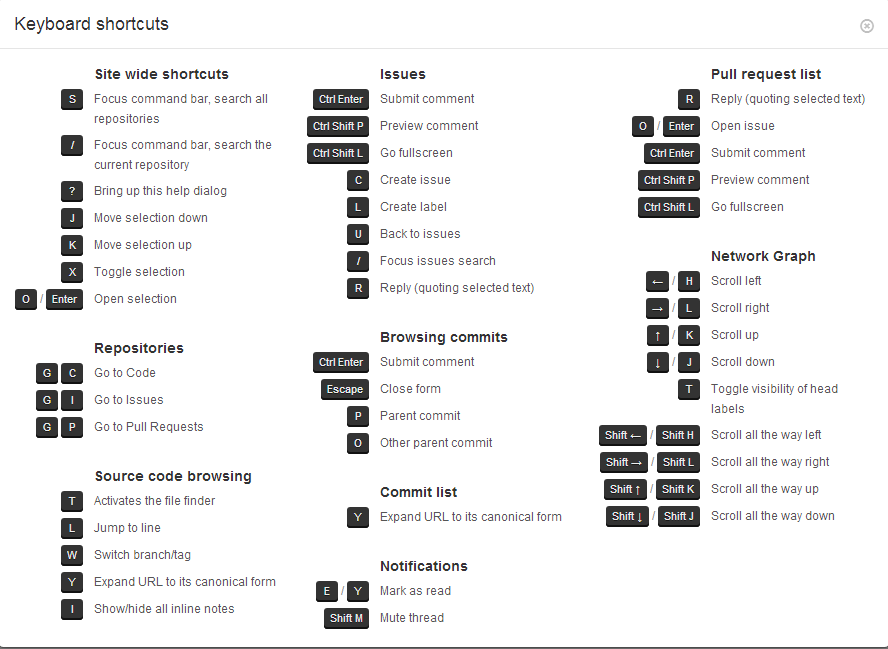

## 3.阅读代码技巧

代码跳转：

1. 下载到本地
2. 在线vscode：仓库详情界面按下“。”键，

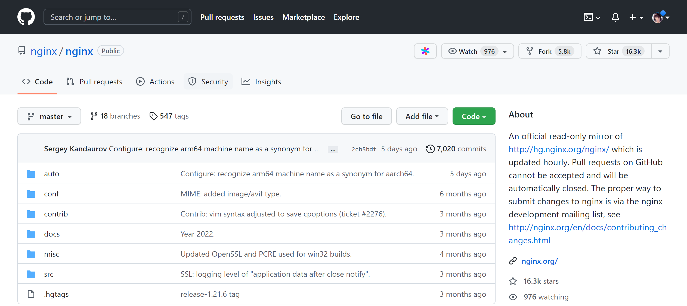

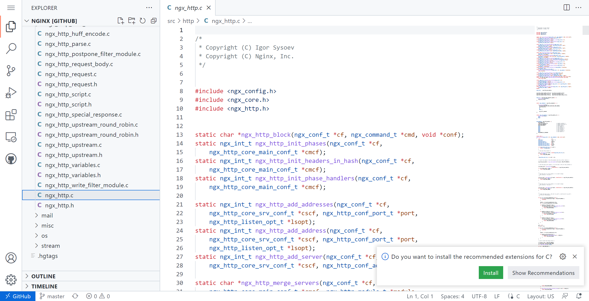

## 4.在线运行项目

在项目地址前加上`gitpod.io/#/`前缀

https://github.com/nginx/nginx  => https://gitpod.io/#/github.com/nginx/nginx

登陆：

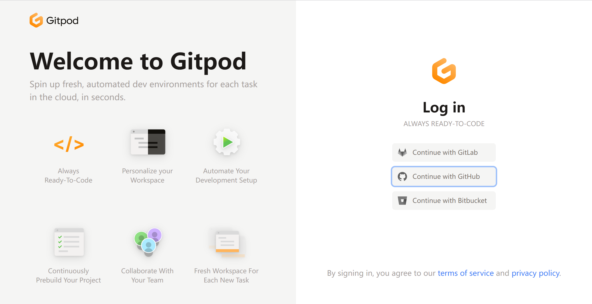

加载：

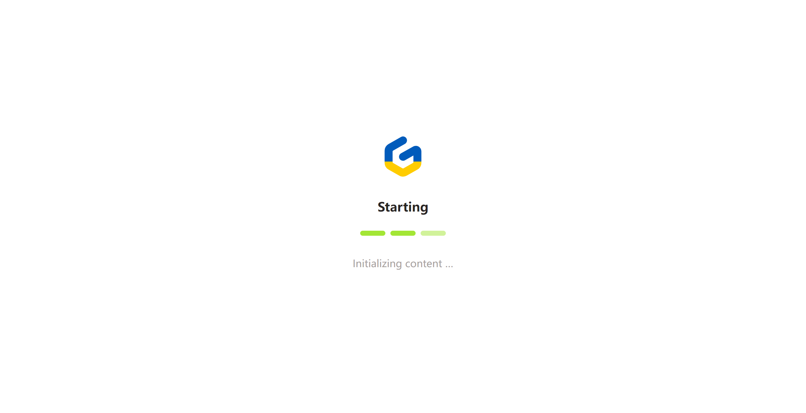

运行：

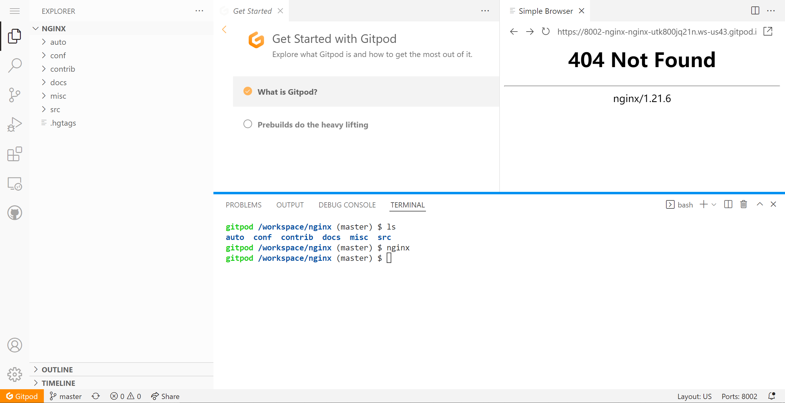

## 5.项目推送

根据自己的喜好让github推送自己感兴趣的优质项目

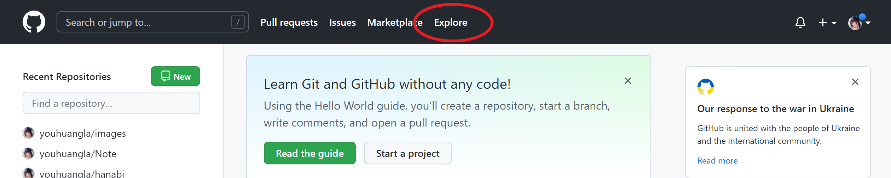

获取邮件更新：

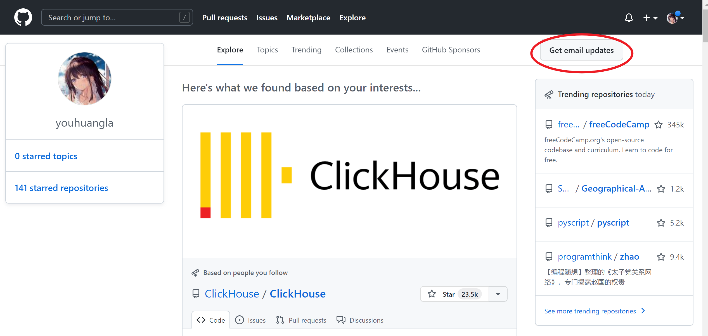

更新：该文档已得到up主点赞ヾ(≧▽≦*)o

再纪念一下up主回复(～￣▽￣)～

## 更新：从 mini_gtest 开始的 github 实践

该文档已经更新到[youhuangla/mini\_gtest](https://github.com/youhuangla/mini_gtest)

在[5个隐藏的GitHub神技巧，助你秒变大佬！_哔哩哔哩_bilibili](https://www.bilibili.com/video/BV1q54y1f7h6?spm_id_from=333.337.search-card.all.click)来自程序员鱼皮的视频中，看完了视频，惊觉十分有用（当年我自己探索的时候被各种环境劝退过）。于是决定记下笔记，当一次“课代表”，所以我就（顺势）开源（复制）了我自己笔记地址：[Note/github.md at main · youhuangla/Note](https://github.com/youhuangla/Note/blob/main/web/github.md)。

当时原本只是想着给大家做个图文参考，后来 star 的越来越多，竟然还有 fork 的 Σ(ﾟдﾟ；)，属实把我吓到了。由于该仓库是我的（白嫖）github做笔记及的的仓库，所以里面的笔记良莠不齐，有很多写代码时随意记录的文档，所以被 fork 了感觉挺尴尬的，所以另开一个较小的仓库将鱼皮视频的笔记放进来，毕竟为了单独下载一个小小的 md 文档，属实没必要整个 fork 我那杂乱的笔记（对网速不好的同学来说我相信更是一种煎熬）。

所以在这里已经将鱼皮视频的笔记加到了[这个小仓库youhuangla/mini\_gtest](https://github.com/youhuangla/mini_gtest)里，临时整合了我自己学习，[人人都能学会的编程入门课 (geekbang.org)](https://time.geekbang.org/column/intro/100043901?tab=catalog)的学习笔记。我在胡船长代码的基础上进行了些微的整理与完善，使得代码完成度更高，并可以作为入门实践在github上在线运行。

效果如下，使用方法见[youhuangla/mini\_gtest](https://github.com/youhuangla/mini_gtest)。

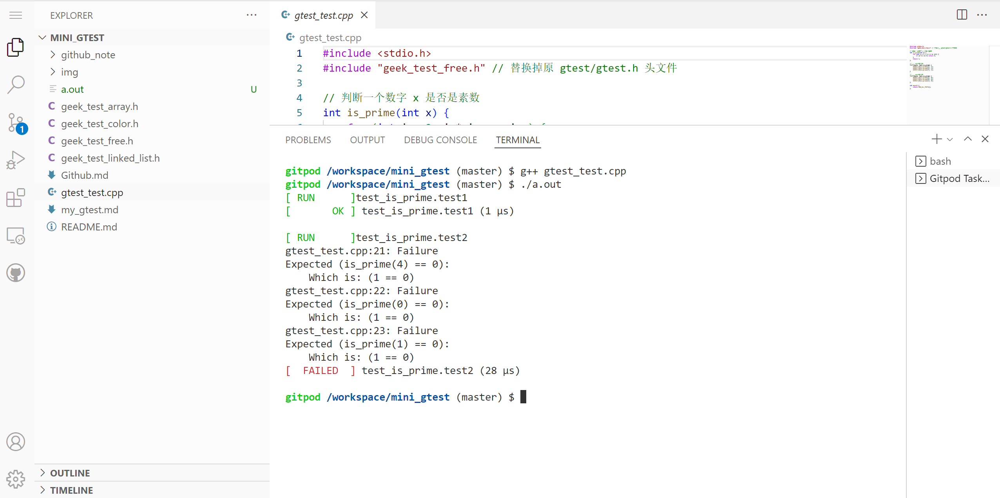

原项目名气大（谷歌出品，原仓库 25.7k star），据说工程中也常常用到。

[google/googletest: GoogleTest - Google Testing and Mocking Framework](https://github.com/google/googletest)

[GoogleTest User’s Guide | GoogleTest](https://google.github.io/googletest/)

我根据课程仿写的这个项目的特点：

1. 依赖较少，对只会 C 语言又想做项目的小白友好
2. 理解一些软件工程的思想~~也许可以对面试官吹水~~。
3. 数据结构的思维：链表
4. 如果是一个自己的项目也可以轻易地在最后调用（毕竟很多语言都能调用C语言），让面试官眼前一亮~~装个小b~~，让你的项目锦上添花。ヾ(≧▽≦*)o

所以，如果要 fork 或 star，请 fork 或 star [这个小仓库youhuangla/mini\_gtest](https://github.com/youhuangla/mini_gtest)吧，感谢各位大哥的厚爱了(￣▽￣)ノ