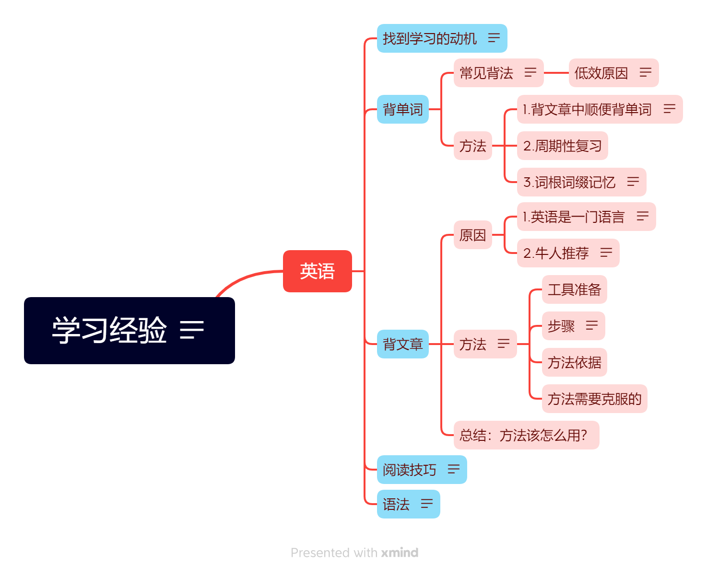
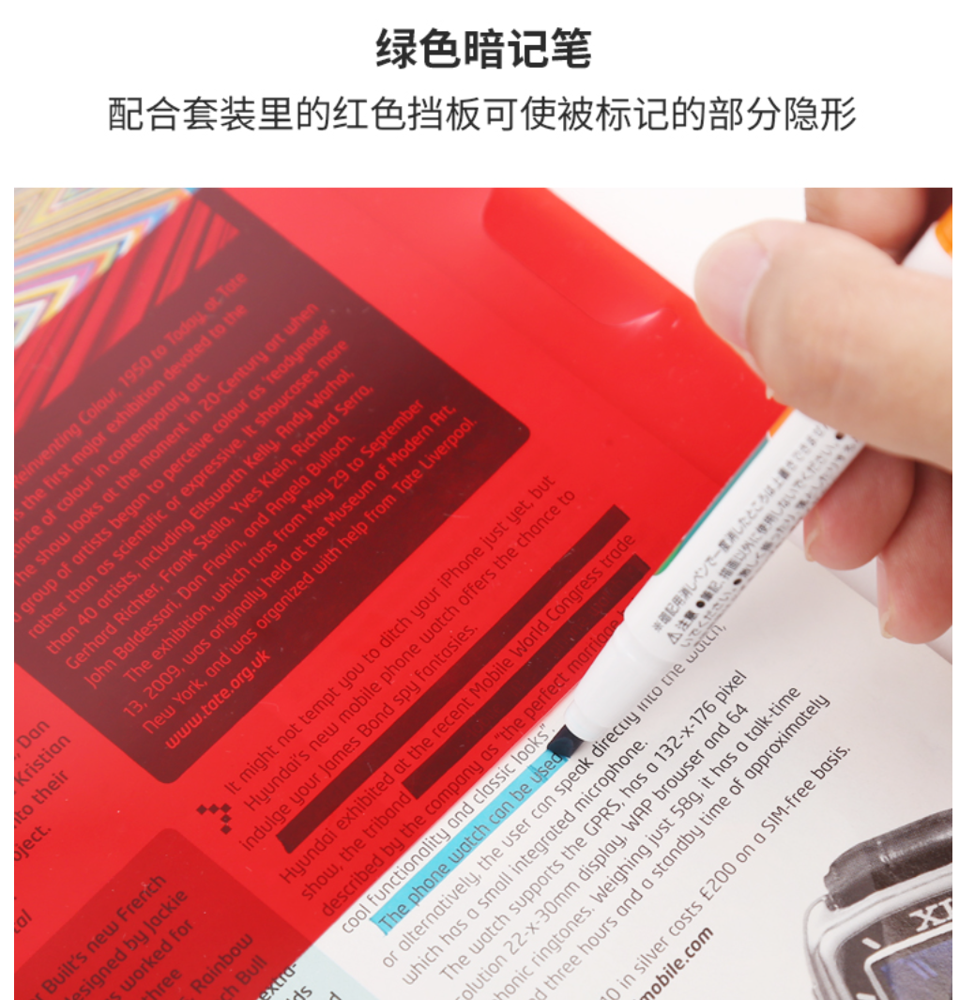

# 学习经验

2022年9月23日 11:11:40

- [学习经验](#学习经验)
  - [英语](#英语)
    - [找到学习的动机](#找到学习的动机)
    - [背单词](#背单词)
      - [常见背法](#常见背法)
        - [低效原因](#低效原因)
      - [方法](#方法)
        - [1.背文章中顺便背单词](#1背文章中顺便背单词)
        - [2.周期性复习](#2周期性复习)
        - [3.词根词缀记忆](#3词根词缀记忆)
    - [背文章](#背文章)
      - [原因](#原因)
        - [1.英语是一门语言](#1英语是一门语言)
        - [2.牛人推荐](#2牛人推荐)
      - [方法](#方法-1)
        - [工具准备](#工具准备)
        - [步骤](#步骤)
          - [1.跟读](#1跟读)
          - [2.暗记笔划线抠字](#2暗记笔划线抠字)
          - [3.看着被抠掉词的文章背诵](#3看着被抠掉词的文章背诵)
          - [4.跟录音背](#4跟录音背)
          - [5.直接背诵](#5直接背诵)
          - [6.听录音](#6听录音)
        - [方法依据](#方法依据)
          - [1.跟读](#1跟读-1)
          - [2.暗记笔划线](#2暗记笔划线)
          - [3.跟读和跟背](#3跟读和跟背)
        - [方法需要克服的](#方法需要克服的)
          - [消耗脑力较大](#消耗脑力较大)
          - [消耗时间](#消耗时间)
          - [消耗自控力](#消耗自控力)
      - [总结：方法该怎么用？](#总结方法该怎么用)
        - [1.明确学习动机](#1明确学习动机)
        - [2.循序渐进](#2循序渐进)
        - [3.阅读书籍，明白方法背后的原理](#3阅读书籍明白方法背后的原理)
        - [4.适当修改形成自己的方法](#4适当修改形成自己的方法)
        - [5.自己找方法并扩充](#5自己找方法并扩充)
        - [6.形成习惯](#6形成习惯)
          - [难点](#难点)
    - [阅读技巧](#阅读技巧)
    - [语法](#语法)

高中阶段学习经验，小学和初中可适当改动。

部分引用文章段落为OCR识别，可能有错误，请以原书为准。

TODO:[我不是针对谁，我是说在座各位... - 知乎 (zhihu.com)](https://zhuanlan.zhihu.com/p/25866272)

## 英语

### 找到学习的动机

学好英语的动机是什么？

大部分人肯定是为了考试取得高分。

但是英语这门学科也可以轻易找到个爱好，并把学英语当成是实现爱好的一部分，并以此为动机。我个人想到的是学好英语可以看自己喜欢的原版英文小说，听英文有声书《哈利波特》等。有些人的方法是看英文电视剧，但是由于他们还是看的带中文字幕的，以此学英语效率较低。

### 背单词

#### 常见背法

高中试过拿本单词书，顺序排序，一个个死背，综合看来效果其实一般。高中培训机构搞过那种多少天背多少个单词的活动，我一同学背的飞快，但是成绩仍然一般，我现在依然佩服那位同学的自律性与定力，但回头发现，方法错了，事倍功半。

##### 低效原因

1.按字母顺序背单词的低效性

>   这么背单词是没有道理的，因为我们在阅读、在生活中遇到的单词，并不是按照**首字母排列的顺序出现**的。把 [absent](https://www.zhihu.com/search?q=absent&search_source=Entity&hybrid_search_source=Entity&hybrid_search_extra={"sourceType"%3A"answer"%2C"sourceId"%3A2502549072}) 和 amount 放到一起，**看似有序**，实则对大脑来说**杂乱无章**。
>
>   [英语基础差是先补语法好，还是狂背单词好？ - 木子李学长好的回答 - 知乎](https://www.zhihu.com/question/392189907/answer/2509480657)

2.容易出现背了前面的忘记后面的情况。

3.枯燥。

4.背而不用，并不牢固，导致第1点。

#### 方法

##### 1.背文章中顺便背单词

包括但不限于课本、新概念英语、考研阅读。也就是在用中学，语言就是要用起来。常见的词汇搭配也可以学到。

>   **另一个方法就是在文章中背单词，**在具体的语境中，一次背住就再也不会忘了。
>
>   [英语基础差是先补语法好，还是狂背单词好？ - 木子李学长好的回答 - 知乎](https://www.zhihu.com/question/392189907/answer/2509480657)

##### 2.周期性复习

##### 3.词根词缀记忆

（辅助记忆，酌情使用）见《秘笈 北大奇人怪招》

### 背文章

#### 原因

##### 1.英语是一门语言

>   走进亭子，发现小波他老人家仍在**默默背诵着英文**，连姿势都没换一点，书倒是翻了一页。
>
>   我算是服了他，挫败地坐回石头上，拿起画笔，盯着池塘的荷花发呆。
>
>   直到小波完成今天的学习任务，他才叫我走。
>
>   后来，我们常常在荷塘边碰到陈劲，他也在学画画，只不过练习的是静物素描。我不和他说话，他也不搭理我们，各自在各自的角落里干事情。
>
>   有一天，他看了小波半晌，突然走过来对小波说：“**学习英文不是你这么学的，英文是一门语言，它最主要的功能就是说，你整天默背默诵，再用功都是事倍功半的笨方法。你应该大声读出来，不必刻意强求自己背下来，只需要反复读，以朗朗上口为目的，时间长了，你自然会培养出语感，有了语感，你做选择题时，有时候完全不用理会语法，只需读过去，你的舌头会告诉你哪个选项正确**。”
>
>   小波忙说：“谢谢你。”
>
>   陈劲淡淡说：“**不用谢。中国人刚开始说英文都会有些滑稽，不用不好意思，也不用管人家怎么看你，放大了声音读就行了。**”说完，背着画板走了。
>
>   ——小说《那些回不去的年少时光：新版》 by 桐华
>
>    (桐华，北京大学毕业，曾经以陕西省第九名的成绩考入北京大学光华管理学院，是一个典型的才女，毕业后从事金融方面的工作，但后来却选择写小说，并且仅凭一部《步步惊心》就扬名网络。小说中的“我”和“陈劲”设定均考入清华。小说里面的很多学习思路都让我有种醍醐灌顶的感觉，当时还不知道本人现实学历，我就感觉到“这作者肯定学习能力很强”，没想到后来和同学交流才得知真的是北大的。该书另一段对速读法的解释也十分有趣生动，TODO更新在阅读技巧中。)

在中国，大部分人无法找到和人交流的环境，只能依靠读、背文章来学习。同时培养的是**语感**，有了一定的语感之后，可以一定程度上“无视”语法，因为你已经把语法内化了，就像中国人用普通话交流不会刻意去想怎么样语法才正确。

##### 2.牛人推荐

《秘笈 北大奇人怪招》p179中，作者吴业涛（北大生物系）举了几个例子，下面我列举其中之一

>   ​	新东方的俞敏洪校长在一次讲座时，曾经举过一个优秀学员背课文的事例。
>   ​	英语学习特别简单，假如说您现在下决心找出几十篇文章，把它们背得很熟的话，说不定会变成英语专家。
>   ​	我举个例子您就明白了。有个学员现在在杜克大学，这个学生所以我认识，就是因为他背过《新概念英语》的第三册和第四册。他从高一开始背第三册，背到高三就背完了，高考考进了北大，进北大后，他本来不想再背了，但是当他背给同学听的时候，其他同学都露出了羡慕的眼光，于是，为了这种虚荣心，他就坚持背第四册，将其背得滚瓜烂熟。他熟到什么地步呢？我把其中任何一句说出来，他能把上一句和下一句说接下去，而且语音非常标准，因为他是模仿着磁带来背。
>   ​	后来去了美国杜克大学，他给我写信，他写来的英文信，我不敢回，我对他的英文有畏惧感，因为他的英文学得太好。所以我给他写中文信，并告诉他不是我不会写英文，而是想让他温习温习中文，不要忘记祖国语言。（全场大笑）
>
>   ——《秘笈 北大奇人怪招》吴业涛（北大生物系）

#### 方法

背文章的方法由于多人均总结，所以肯定是有用的。

我自己结合多本学习方法书籍，以“由易到难”为核心思想，总结了一套适用于自己的方法，该背诵方法不一定适用于所有人，可以根据个人情况适当调整。由于是我综合了一些书得到的，故我也会列出我的方法的大致依据。

##### 工具准备

1.   文章（最好是书，容易积累成就感，如课本），最好带有译文（如《新概念英语》，不必须，课本带译文吗？忘记了）
2.   暗记笔及配套挡板
3.   MP3。最好带AB复读、变速功能。较方便且符合中小学生使用规律，如果没有强大自制力不建议中小学生使用手机。磁带、光盘等可以日常听，但是由于不方便操控进退，且没有复读功能不是很推荐，可以用来大声跟读。
4.   文章标准录音

##### 步骤

以下是大致步骤，包含重复和循环

###### 1.跟读

跟着MP3里面的录音读，一开始可能有些词根本不认识，但是没关系，模拟录音中的发音。读不顺的话使用MP3变速功能降低语速0.6、0.8、0.9，直至读顺、读熟，然后尝试1.1、1.2、1.3倍语速跟读。注意降速升速复读不应过大。当然这个步骤也可以套用至早读读课文，像[背文章->原因->1.英语是一门语言](#####1.英语是一门语言)中就是使用了这个方法。具体参照

>   **音频辅助记忆法**
>
>   这是一个我能告诉你的**最野蛮、最不用动脑的记忆方法。**
>
>   **第一步：找一个可以开声朗诵、不用顾忌形象的场所**
>
>   最好是长期稳定的场所，现实的地点包括学校的后花园、居民的阳台、城中的公园、流水的河边（推荐）
>
>   如果你在背诵的时候还在担心，这么大声会不会被别人说啊；哇，好丢脸啊；被那人看到了，脸好烫. . .… 我可以明确地告诉你，这些心理会在不知不觉中消耗你很多注意力，会让你一而再，再而三地分心。一旦你消除了最开始的紧张害羞感，并且依旧谨记你的目的就是为了把书完整地背出来，那么进入专注忘我的记忆状态的前提条件就满足了。
>
>   **第二步：确认背诵内容的音频资料**
>
>   如果你要背诵的内容是英文课文－我的学生时代的英文课本正文都是会配有相应录音磁带的，这样直接使用就行， 而现在随着科技日新月异的发展，早就不需要那么烦琐了， 一个手机就能解决绝大多数的问题，你需要的是确认你所需要记忆的内容的音频形式是否巳成功下载。
>
>   如果你要背的是政治、历史、文言文、诗歌等这类音频读物普及力度较小的科目，有些内容甚至并没有音频版本， 那么就需要你在准备过程中自行录音完成了，这个录制过程要求你一定要发音清晰、吐字准确地朗读内容。
>
>   **第三步：正式进入音频辅助记忆状态**
>
>   ***第一回合：熟读记忆内容***
>
>   在这一阶段，要做的就是听清楚正确的发音， 然后跟读，最好保证语气语调咬字和播放内容一个节奏一个模样。干万注意， 要读对读熟练每一个句子，要是难一点的句子一次读不熟，那就反复听，读熟它，然后再跟读下一句… … 这一阶段要求，整篇文章不仅仅要读熟，而旦最为重要的是跟读的每一个句子都要做到发音和录音播放的内容一样准确清晰。这就像大厦的地基，干万不能含糊。
>
>   ***笫二回合：正常语速播放音频，跟读全文***
>
>   通常情况下，保待正常语速跟读音频内容两到三次，就基本可以顺利地将上一回合熟读的单一语句连接成文了。
>
>   ***笫三回合： 1倍语速加快播放音频，跟读全文***
>
>   这一阶段，同样不需要你刻意记忆，只需要不停顿地跟读——一直到你发现第一次跟不上，这时立刻暂停音频播放，返回第一回合，把跟丢的句子重新跟读。再次读熟后重新进行本回合，继续不停顿地跟读，直到你跟上了1.1 倍的播放速度，且跟读顺畅、不停顿，即为合格。
>
>   ***笫四回合： 1.2倍语速加快播放音频，跟读全文方法和要求同第三回合别无二致。***
>
>   ***笫五回合： 1.3倍语速加快播放音频，跟读全文方法和要求同第三回合别无二致。***
>
>   ——《高效学习之道》白仕刚（知乎网名@白诗诗，由于学习方法回答过于受欢迎被收入盐选内容，本书可以看成是他知乎回答的一部分的总结）
>
>   

下面是背诵阶段

###### 2.暗记笔划线抠字

以下划线均使用暗记笔划线，视作抠掉单词

划线抠字原则：

1.   先抠不认识的单词。比如“When reports came into London Zoo that a **wild** puma had been spotted forty-five miles south of London, they were not taken seriously.”，我不认识 wild 这个词，那就可以用暗记笔划上线，将词“抠掉”。
2.   再抠搭配。不要（或者最后）抠人名、地名、数字那些相对无意义的单词。“When reports came **into** London Zoo” 中我认识report、came、into，但是不熟悉 report come into 这种搭配，就可以先抠掉 into。
3.   尽量隔一个词抠。“When reports came **into** London Zoo” 中我认识report、came、into，但是不熟悉 report come into 这种搭配，into 已经被抠掉，且该词已经划线的情况下。如果已经能熟练跟读该段，可以进一步划掉reports，“When **reports** came **into** London Zoo”。

**划线后熟读**，以下步骤均使用暗记笔：

1.   首先，划上完全不认识的生词，了解其意思，或者在文章旁边注明中文意思（如果太多词不认识建议从较简单的书开始，如小学课本和新概念1）。
2.   盖上红色挡板，回归[步骤1.跟读](######1.跟读)。可以先尝试跟读一小句，不同的是，句子中的生词已经不可见，暗记笔划过的地方只能看到黑色的方块。跟读同样可根据熟练度调整语速，直到熟练为止。
3.   熟练背完一句后，根据原则再次划单词。

将句逐渐升级为段，各段都抠掉大部分仍能熟读后，开始背诵。

###### 3.看着被抠掉词的文章背诵

>   在尝试背诵之前，你还需要做一些准备工作，不要心急。
>
>   1.   **抄一些词**：在纸上写出每一个句子的第一个单词，如果你背中文，那就是中文字。
>   2.   **尝试背诵一个句子**： 看一个单词，试着回忆，能不能背诵出一个句子。在经历了音频辅助记忆之后，最初你认为根本无法背诵的内容，现在你会神奇地发现，只要给你第一个单词，回忆到第二遍，你就可以顺顺利利地背出来了。如果偶有卡顿，那就翻开课本去看一眼，直到你看见句首的一个单词或者中文字， 就能脱口而出一大串完整旬子来。
>   3.   **尝试背诵一个段落**： 突破了句子关卡，现在你需要把书合上，试着回忆一个段落里面的每一个句首词汇或者中文字，挑出来写在一张纸上，就像**<u>思维导图</u>**那样，画成一个圈。根据纸上的这些词的提醒，试着连贯地背诵出段落。然后，逐渐划掉一些词，不断尝试，直至最后只剩下第一个句子的词或者中文字的提示，就可以
>        背出来整个段落。
>   4.   **尝试背诵课文全文**： 像背诵段落那样，合上书，试着回忆每一个段落的第一个单词或者中文字，并尝试背诵全篇课文。过程中同样是要求逐渐地划掉一些词，直至最后剩下课文的第一个段落的第一个单词或者中文字，就可以背出全篇课文来。
>   5.   **联系一个题目**： 这是最后一步， 也是最容易的一步。困难的部分你已经一一突破， 现在你只需锦上添花般地将标题和内容相联结， 使它们重新回归成整体。完成了这一步，你这次的背诵记忆就实现了全部目标。
>
>   ——《高效学习之道》白仕刚

按照该方法尝试背诵前可以盖住原文，看译文来背诵，但是由于译文的意思可能不太流畅，所以背诵的流畅度可能会受到影响。

该方法可以结合思维导图，但原书提取的是句首单词，只是像思维导图。我个人比较喜欢提取句子里面的核心作为关键词。

比如“When ***reports*** came into London Zoo that a **wild** puma had been spotted forty-five miles south of London, they were not taken seriously.”这句话我就会提取 reports 作为关键词来画思维导图。思维导图画法技巧也有单独书本讲述，此处不讲太多。

>   前面提到了多次背诵效果更好，更容易坚持背。第二个促进背诵的方法是，减小背英语课文的难度。一开始的时候选些简短的课文，比如英语不及格的同学可以从新概念第二册开始背。在背课文之前应该先熟记生词和短语。最重要的是要**理解课文意思，画出一个简单的<u>思维导图</u>**，不是像念经一样死记硬背。如背下面这篇英语课文的时候可以先画个思维导图，就会更容易背。
>
>   ——《秘笈 北大奇人怪招》吴业涛（北大生物系）

###### 4.跟录音背

跟着录音不看文章，语速由慢到快。类似的，背不顺的话使用MP3变速功能降低语速0.6、0.8、0.9，直至读顺、读熟，然后尝试1.1、1.2、1.3倍语速跟背。注意降速升速复读不应过大。

###### 5.直接背诵

脱离文章和文章录音，直接背诵。

上述步骤都建议超量进行，如你背熟后，应该适当多背几遍。

>   我们看这种牛人的事迹往往都会感到热血沸腾，然后试图效法，有时才坚持了几天就放弃了，只得哀叹一番自己毅力不足，天赋不够。不过这其实更多是因为我们没有发现其中的窍门。很多人了解这个榜样后， 只知道要学他背课文，但忽略了他是怎么背的，他为什么能坚持。他不是像大多数人那样，刚背完一篇以后就再也不管了，开
>   始背下一篇，一边背一边忘，看似背了很多篇但是没记得多少。他在背完以后还多次背诵，实现超量学习，只有这样才能够达到长期滚瓜烂熟的地步。
>
>   这样做有**两大好处**。第一个好处是，**多次背诵比只背一遍印象深得多**。千鸟在林，不如一鸟在手。同样的时间，把30篇短文背得滚瓜烂熟，脱口即出，是实实在在的收获，比起把60篇短文背过一遍很快就忘了强。
>
>   第二个好处**是这样多次背诵，反而还比只背一遍的方式容易坚持得多**。这句话看起来有点奇怪，但是并不难理解。决定我们坚持的关键因素是收获和进步。只背一遍，很快就忘了，感觉自己就像是在用一张破洞很多的大网抓鱼，到底有多少收获，心中没有把握。再加上两三个星期看不到进步，很容易就放弃了。**多次背诵，虽然背的数最少，但是记得很牢，感觉自己就像是在用一张完好无损的小网抓鱼，心里很踏实，知道自己肯定是有收获的。**
>
>   **而且多次背诵属于超量学习，有过超量学习经历的人都知道，这会让人感觉自己很强，学习很简单，带来一种很爽的感觉。反复背同一篇短文时，毫不费力地脱口而出是让人很自豪与兴奋的事情，甚至会让人把背诵当成一种特长和爱好。**
>
>   所以花同样的时间，我们可以少背一半数目的短文，但是每篇短文应该至少反复背10 次以上，这样效果更好，也更容易坚持。10 次看着很吓人，其实如果在背完短文当天，再趁热打铁背3 次是很容易的事情。反正都记住了，后面的一周内再找时间背3 次也不用怎么费力。接下来的一周再背3 次就满10 次了。如果每次都等快忘完才重新
>   背，那l0次就变得很痛苦了。
>
>   为什么至少要背10次呢？因为我高中的时候背课文背5 次，还是达不到烂熟于心、脱口而出的地步。我表妹何洋英语成绩很一般，我推荐她背英语课文。她按照我的建议做了，发现只背一遍，很快就忘了，觉得这样不好，就问我要不要反复背。当时我还没深刻意识到多次背诵的好处，觉得记住英语课文内容没啥用，让她只背一次，结果她没过多久就放弃了。记住英语课文内容的确没啥用，但是背完以后很快就忘完的感觉很糟糕，会让人产生在做无用功的茫然感，心会累。人最怕的不是身累，是心累，心累就很难坚持了。
>
>   ——《秘笈 北大奇人怪招》吴业涛（北大生物系）

###### 6.听录音

食堂打饭、休息的时候可以听对应的录音。走路回家可以跟着录音读、背。做到抗遗忘的作用。

休息的时候可以听哈利波特的有声书放松（至少个人觉得是放松）。

##### 方法依据

###### 1.跟读

初步培养语感，见[背文章->原因->1.英语是一门语言](#####1.英语是一门语言)。在脑海中留下文章整体大致的印象，同时对于不认识的单词、句子引起自己的好奇心（当文章是故事时效果更加显著）。

###### 2.暗记笔划线

>   **高强度用脑记忆法**
>
>   ​	每一个完整的句子都存在一定的表达意义，单凭这一点，它已经为我们的记忆任务提供了极高的效率。
>
>   ​	关于如何成为记忆高手这个问题，在我之前已经有无数人作答了，相信在我之后依旧还有无数人作答， 但这并不妨碍我向你讲讲我的故事和我的方法。
>
>   ​	我不知道你是否也会遇到这种情况。读一本书， 纯粹出于对文字本身的喜爱，就会想要记住其中的精彩片段。我就经常会有这样的体会。有这样一段话，出自我最喜欢的一本书， 它这样写道：“她乳白色发光的膝盖会开始一次小心翼冀的旅行； 有时， 别的小孩们建筑的堡垒，能完全掩藏我们摩挚彼此咸腥的嘴唇；这种不完全的接触把我们健康却毫无经验的稚嫩身体趋向滚怒的状态，即使在冰凉的湖水中，我们仍然互相紧拉着手，不能解脱··· · ··"
>
>   ​	我第一次阅读到这段文字的时候就有一种强烈的想要记住整本书的欲望， 我认为这是纯粹的文字之美的吸引，喜爱它，并记住它。为此， 我陆陆续续地尝试了很多记忆的方法，诸如小时候老师带着背诵古诗、课文时那样的死记硬背，又或是在纸上反复抄写，等等，总是感觉吃力不讨好，稍微做几遍，就开始注意力不集中了。半天记不住，第二天还往往会哑着嗓子，难受极了。因为之前的方法使得记忆的效果太不尽如入意， 故而记忆这本书的计划就几乎是无限期地搁置了。
>
>   ​	记忆对人们来说， 总是一个大难题，以至于我们总是习惯以崇拜的眼光去看待身边那些记忆力超群的人，认为他们天生聪明，资质非凡。是的，我不否认他们的确聪明，但这聪明绝非天赋，而全赖于他们总是能快入一步地找到最适合自己的学习和记忆的方法。
>
>   ​	不久之前，我也找到了一个靠谱的记忆方法，出于对这个方法的信任，让我有信心重新拿起我最爱的文字实践背诵，而实践也更让我有底气把这个方法进行分享。
>
>   ​	这个记忆方法，从本质上讲，是一种高度用脑的记忆方法，我把它叫作高强度用脑记忆法。
>
>   ​	如何使用高强度用脑记忆法：
>
>   1.   **把需要背诵的文本隔字抠掉，以X取代，形成残文。如： 苏东坡一一苏x坡。**
>
>   2.   **根据原文通读残文。如残文是：苏x坡，因为你看过原文“苏东坡",这个时候你自然记得那个空是一个“东”字，而若你暂时忘记了这个“东”字，你可以通过联系前后的“苏”和"坡”，看看能不能想出来这个空是什么。想不出来没有关系，你这时可以去看原文，或许才惊讶地发现，原来就是一个“东“啊！ 我们总是能够记住那些在我们思考后，震惊我们的东西—这是人的记忆规律所决定的。**
>
>   3.   **减少参照原文的次数，继续通读。在通读的基础上丢掉原文，请多读几遍，读得越顺越好。**
>
>   4.   **尝试背诵。这时候我们说，只要在参考原文有限次数的提示之下，你可能已经能背出原文了； 之后，你无须提示，就可以完整背诵出原文了。**
>
>        
>
>      就是这么简单！
>
>      为什么高强度用脑记忆法能提高记忆效率呢？
>
>   ​      **这种高强度用脑的记忆方式，它的原理在于：你填出残文句子中的每一个空之前，会尽可能地根据空格前后的字，联想看看能不能填出来，如果能填出来，说明这地方你已经记住了；如果填不出来，那就需要先思考一番再去看原文，这样有针对性地又加深了一遍记忆，当你看原文看到那个字，你恍然大悟的那一刻， “原来是这个字啊! "此时，这个字对你来说印象已经十分深刻——这就是这个记忆方法技巧的核心。**
>
>   ​	**从认知心理学角度看一你的脑力用在什么地方，你的记忆成效就在什么地方。高强度的脑力使用，使得字与字之间建立起了高强度的联想式连接。这种隔字填空的做法，实际是建立了一个细微到具体每一个字上的反馈系统，加强了实践性，提高了反馈与剌激强度，类似于不断地做题，然后知道结果，实时反馈，一步步达成精深练习、准确记忆的目的。**
>
>   高强度用脑记忆法的适用范围
>
>   依照我的个人实践经验，收效最为明显的主要有：
>   ♦ 学生时代所要求背诵的课文、古诗词、俗语，乃至英文课文
>   和例句；
>   ♦ 诗歌和歌词；
>   ♦ 近现代散文、“诗词风“美文；
>   ♦ 法律条文；
>   ♦ 学科的专业术语和专业概念。
>
>   ——《高效学习之道》白仕刚

以上是“暗记笔划线法”的原文依据

###### 3.跟读和跟背

>   **音频辅助记忆法**
>
>   这是一个我能告诉你的**最野蛮、最不用动脑的记忆方法。**
>
>   **第一步：找一个可以开声朗诵、不用顾忌形象的场所**
>
>   最好是长期稳定的场所，现实的地点包括学校的后花园、居民的阳台、城中的公园、流水的河边（推荐）
>
>   如果你在背诵的时候还在担心，这么大声会不会被别人说啊；哇，好丢脸啊；被那人看到了，脸好烫. . .… 我可以明确地告诉你，这些心理会在不知不觉中消耗你很多注意力，会让你一而再，再而三地分心。一旦你消除了最开始的紧张害羞感，并且依旧谨记你的目的就是为了把书完整地背出来，那么进入专注忘我的记忆状态的前提条件就满足了。
>
>   **第二步：确认背诵内容的音频资料**
>
>   如果你要背诵的内容是英文课文－我的学生时代的英文课本正文都是会配有相应录音磁带的，这样直接使用就行， 而现在随着科技日新月异的发展，早就不需要那么烦琐了， 一个手机就能解决绝大多数的问题，你需要的是确认你所需要记忆的内容的音频形式是否巳成功下载。
>
>   如果你要背的是政治、历史、文言文、诗歌等这类音频读物普及力度较小的科目，有些内容甚至并没有音频版本， 那么就需要你在准备过程中自行录音完成了，这个录制过程要求你一定要发音清晰、吐字准确地朗读内容。
>
>   **第三步：正式进入音频辅助记忆状态**
>
>   ***第一回合：熟读记忆内容***
>
>   在这一阶段，要做的就是听清楚正确的发音， 然后跟读，最好保证语气语调咬字和播放内容一个节奏一个模样。干万注意， 要读对读熟练每一个句子，要是难一点的句子一次读不熟，那就反复听，读熟它，然后再跟读下一句… … 这一阶段要求，整篇文章不仅仅要读熟，而旦最为重要的是跟读的每一个句子都要做到发音和录音播放的内容一样准确清晰。这就像大厦的地基，干万不能含糊。
>
>   ***笫二回合：正常语速播放音频，跟读全文***
>
>   通常情况下，保待正常语速跟读音频内容两到三次，就基本可以顺利地将上一回合熟读的单一语句连接成文了。
>
>   ***笫三回合： 1倍语速加快播放音频，跟读全文***
>
>   这一阶段，同样不需要你刻意记忆，只需要不停顿地跟读——一直到你发现第一次跟不上，这时立刻暂停音频播放，返回第一回合，把跟丢的句子重新跟读。再次读熟后重新进行本回合，继续不停顿地跟读，直到你跟上了1.1 倍的播放速度，且跟读顺畅、不停顿，即为合格。
>
>   ***笫四回合： 1.2倍语速加快播放音频，跟读全文方法和要求同第三回合别无二致。***
>
>   ***笫五回合： 1.3倍语速加快播放音频，跟读全文方法和要求同第三回合别无二致。***
>
>   **第四步：终极背诵检验**
>
>   在尝试背诵之前，你还需要做一些准备工作，不要心急。
>
>   1.   抄一些词：在纸上写出每一个句子的第一个单词，如果你背中文，那就是中文字。
>   2.   尝试背诵一个句子： 看一个单词，试着回忆，能不能背诵出一个句子。在经历了音频辅助记忆之后，最初你认为根本无法背诵的内容，现在你会神奇地发现，只要给你第一个单词，回忆到第二遍，你就可以顺顺利利地背出来了。如果偶有卡顿，那就翻开课本去看一眼，直到你看见句首的一个单词或者中文字， 就能脱口而出一大串完整旬子来。
>   3.   尝试背诵一个段落： 突破了句子关卡，现在你需要把书合上，试着回忆一个段落里面的每一个句首词汇或者中文字，挑出来写在一张纸上，就像思维导图那样，画成一个圈。根据纸上的这些词的提醒，试着连贯地背诵出段落。然后，逐渐划掉一些词，不断尝试，直至最后只剩下第一个句子的词或者中文字的提示，就可以
>        背出来整个段落。
>   4.   尝试背诵课文全文： 像背诵段落那样，合上书，试着回忆每一个段落的第一个单词或者中文字，并尝试背诵全篇课文。过程中同样是要求逐渐地划掉一些词，直至最后剩下课文的第一个段落的第一个单词或者中文字，就可以背出全篇课文来。
>   5.   联系一个题目： 这是最后一步， 也是最容易的一步。困难的部分你已经一一突破， 现在你只需锦上添花般地将标题和内容相联结， 使它们重新回归成整体。完成了这一步，你这次的背诵记忆就实现了全部目标。
>
>   ——《高效学习之道》

以上是启发我[1.跟读](######1.跟读)步骤的原文依据

##### 方法需要克服的

###### 消耗脑力较大

没有免费的午餐！记得快，所以消耗脑力较大。比起读几遍课文，背课文走出了舒适区，消耗脑力更大。

>   **被迫走出舒适区之后**
>
>   超出界限后，你的身体系统和细胞自身会处在异常状态下，含氧量和各种与能量相关化合物含量都异常低，比如葡萄糖、二磷酸腺苷（adenosine diphosphate，ADP）、三磷酸腺苷（adenosine triphosphate，ATP），等等。各种细胞的新陈代谢不再像往常那样继续下去，因此，细胞中的生物化学反应，与正常状态下完全不同，产生的生物化学产品也和细胞通常产生的完全不同。细胞对这种状态的改变不满意，它们通过升高细胞DNA中的一些不同的基因来响应。（DNA中的大多数基因，在任何特定的时间都是不活动的，而细胞会“打开”和“关闭”各种不同的基因，这取决于它在那个时刻需要些什么。）这些刚刚激活的基因将打开或者提升细胞内部各种生物化学系统，由那些系统来改变细胞的行为，使细胞顺应这样的事实：细胞和周围的系统已经被迫走出了它们的“舒适区”。
>
>   细胞内部到底是怎样进行活动以应对这些压力的，其细节极为复杂，研究人员还只是刚刚开始揭示它们。例如，在一项关于老鼠的研究中，从事研究的科学家计算了112种不同的基因，当老鼠后腿的某块特定肌肉上的负荷突
>   然增大时，这些基因便会打开。通过已经打开的特定基因来判断，顺应包括许多方面，比如肌肉细胞的新陈代谢发生改变、细胞的结构发生改变以及肌肉细胞形成的速度发生改变。所有这些改变，最终的结果是强化了老鼠的肌肉，以便它们能够应对增加的负荷。老鼠还被逼着走出了舒适区，而肌肉对此的顺应方式是：变得足够强壮，以建立新的舒适区。这样就重新建立了体内平衡。
>
>   这就是体育锻炼制造身体变化的一般模式。当身体的系统（比如某些肌肉、心血管系统或者其他系统）感受到压力，以至于原来的体内平衡无法继续保持下去时，身体便会开始响应那些变化，目的是重新建立体内平衡。比
>   如，假设你开始执行一个有氧运动的计划，如每周慢跑三次，每次跑半个小时，使你的心率保持在最大心率的70%左右的水平（对于年轻人，应当超过140次）。这种持续的活动，将使得供应腿部肌肉的毛细血管的氧含量降低。于是，你的身体将通过生长新的毛细血管的方式来应对，以便为腿部的肌肉提供更多的氧，并使你的双腿重新回到它们的舒适区。
>
>   这正是我们可以怎样利用身体对体内平衡的渴望而推动变化的例子：足够努力地锻炼，并且保持足够长的时间，那么，身体将以各种方式来改变，使得那种努力变得更容易。你会稍稍变得更强壮一些，积累一定的耐力，身体
>   也变得更协调一些。但这里也有一个陷阱：一旦补偿已发生，也就是说，新的肌肉纤维已经生长出来并变得更加高效，新的毛细血管也已长出，等等。那么，身体就能轻松应对以前感到十分艰难的那些体育锻炼活动了，它会再度感到舒服。改变也停止了。因此，要使改变不断进行下去，你必须不断地加码：跑得更远一些、更快一些，并且爬坡跑。如果你不继续给自己施加一些压力，身体将会保持体内平衡，尽管此时的体内平衡不同于以前，但你将停下改进的脚步。
>
>   **挑战越大，变化越大，但不要太过**
>
>   这解释了持续将自己推出舒适区的重要性：你要使身体的补偿变化不停地发生，但如果一下子推得太猛，使自己远远离开了舒适区，就有可能受伤，而且，事实上反而阻碍了你的提高。至少，这是身体响应体育锻炼活动的一种方式。对于这些方面，科学家已经了解了许多，但他们对人类大脑如何响应心理上的挑战，却知之甚少。
>
>   身体与大脑的一个主要差别是：成年人大脑中的细胞，一般并不会分裂并组成新的大脑细胞。当然，也有少数几种例外，比如在海马体中，新的神经元可以生长，但发生在绝大多数大脑部位之中的、为了顺应心理挑战而进行
>   的改变（比如通过训练对比度来提高人们的视力），没有包含新的神经元的长出和发育。相反，大脑会以各种不同方式来“重新布线”那些网络，例如，强化或弱化神经元之间的各种连接，同时还增加新的神经元连接或摒弃旧的神经元连接。髓磷脂的含量也会增加，在神经细胞周围形成的隔离鞘，允许神经信号更加迅速地传递；髓鞘形成可以使神经脉冲的速度提高10倍之多。因为这些神经元网络负责思考、记忆、控制移动、解读感官信号以及大脑的所有其他功能，重新调整和加快这些网络的运转速度，使人们可以做各种各样的事情，譬如不用戴眼镜读报，或者迅速确定从甲地到乙地的最佳路径等，那些事情都是以前做不了的。
>
>   一个人遇到的挑战越大，在一定程度上，大脑中的变化也越大。一方面，最近的研究表明，人在学习一项新的技能时，如果能够触发大脑结构的变化，那么，这种学习比起只是继续练习已学会的某项技能时的学习要高效得
>   多。另一方面，在过长的时间内过分地逼迫自己，可能导致倦怠和学习低效。大脑和身体一样，对于处在舒适区之外却离得并不太远的“甜蜜点”上的挑战，改变最为迅速。
>
>   ——《刻意练习：如何从新手到大师 》艾利克森（著名心理学家）在“专业特长科学”领域潜心几十年，研究了一系列行业或领域中的专家级人物：国际象棋大师、顶尖小提琴家、运动明星、记忆高手、拼字冠军、杰出医生等。

###### 消耗时间

前期消耗时间可能较多，而且个人的步骤较为繁琐。使用者可根据自身情况修改。如果是短篇文章可以直接省略一些步骤。

###### 消耗自控力

虽然个人觉得已经算由易到难，循序渐进的方法，但是仍然会（特别是前期）由于用脑过度导致消耗自控力。

可参考心理学书籍《自控力 斯坦福大学广受欢迎的心理学课程》 凯利·麦格尼格尔 著。

#### 总结：方法该怎么用？

##### 1.明确学习动机

首先，搞清楚学习的动机。明确是为什么学习的，这个只有自己找，如果你自己都不想学，别人逼你也没用。

见《秘笈 北大奇人怪招》

##### 2.循序渐进

可以先试用其中某一些方法，先熟练掌握一两种方法，之后逐渐增加，再到掌握三四种方法。

##### 3.阅读书籍，明白方法背后的原理

由于方法都是经过我修改的，可能适用范围较小。但是我形成方法的原理都是依据一些出版的书籍，而且从书籍的作者都是现实中学习能力强的人（可自行搜索）。如果对方法为什么对你有用，或者为什么对你没用，可查阅文中书籍原文。其中，《秘笈 北大奇人怪招》《高效学习之道》是为中国人编写的主讲学习方法的书。《自控力》和《刻意练习：如何从新手到大师》是国际上知名的心理学书籍，除了方法外也有科学原理。思维导图本文涉及不多，但在学习过程中也很重要，可以自行补充。本文篇幅有限，且由于是转述，而且水平没有作者那么高，不免丧失了部分原文的精华，建议适当自行阅读原文。

##### 4.适当修改形成自己的方法

需要注意的是，我自己的方法不一定适用于每个人或每种情况。但背文章的方法是可以应用于背英语课文和新概念、考研英语阅读的。

如果你能直接读几遍文章、然后直接开始从头背到尾，而且完全不感觉吃力并可以持续下去，说明你已经有了强大的自控力、专注力，相信只要你一直背下去，英语成绩不提升也难。但是你也可以看看该方法，毕竟大部分人都不是天才，而就算你是天才，经过科学的学习方法也能得到一定的提升。

##### 5.自己找方法并扩充

找方法的途径包括但不限于，同班同学中某方面强的人、生活中你佩服的人、学习方法和心理学书籍、历史人物事迹。

##### 6.形成习惯

将方法内化为自己的习惯，加以坚持，其实这一步才是最难的。

###### 难点

信息时代身边的诱惑很多，对待包括但不限于手机、游戏、网络小说、电视剧等的态度也尤为重要，大部分未成年人（甚至一部分成年人）深受其害。根据我的观察和阅读，大学中可能有以下几类人

**1.从小父母严加管教**

这一类大部分小学到高中成绩较好，但是在大学有概率会因为接触诱惑少、脱离父母的管控、不适应大学节奏、不喜欢本专业等，对一些新事物缺乏抵抗力，导致无心学习。（身边例子）

**2.为了某种目的而学习**

虽然仍能刻苦学习，保持好成绩，甚至卷上保研，但是可能其实对本专业兴趣不大（身边例子）

**3.能从学习中找到乐趣，能平衡好学和玩**

部分人受到父母的引导（有的父母即使下班很累，也能努力营造出学习的氛围）。

部分人受到身边的班级、朋友的影响。

部分人明确自己的目标，不受外界干扰。

另外，在好的学校、班级中也有这种人，如果身边有这种人建议及时交（抱）友（腿），好的朋友让你受益终生。

上述几类人特点可能相互交叉，我的总结可能有片面性。

交友的重要性和以上部分人的例子见《秘笈 北大奇人怪招》，这里我也建议，如果没有时间读太多书，也可以先读这本**<u>《秘笈 北大奇人怪招》</u>**。

### 阅读技巧

待更新

核心：速读法和先看题干法结合

速读法《高效学习之道》《那些回不去的年少时光：新版》，前者为主

《奇速英语——快速阅读高手26招（八年级）》

### 语法

[外国人说英语会注重语法吗？ - 孟话英语的回答 - 知乎](https://www.zhihu.com/question/302040888/answer/529320080)
