# PS

## 文档

[使用矩形工具繪製矩形形狀](https://helpx.adobe.com/tw/photoshop/using/tool-techniques/rectangle-tool.html)

[了解如何在 Photoshop 中裁剪并拉直照片 (adobe.com)](https://helpx.adobe.com/cn/photoshop/using/crop-straighten-photos.html#:~:text=在裁剪区域上进行内容识别填充 1 在工具栏中，选择裁剪工具 ( )。 裁剪边界显示在照片的边缘上。 2 在选项栏中，选择“内容识别”。,使用图像周围的手柄，拉直或旋转图像。 或者，将画布的范围扩展到图像原始大小之外。 4 当您对结果满意时，可单击 选项 栏中的勾选图标以提交裁剪操作。 Photoshop 会智能地填充图像中的空白区域%2F空隙。)

ai功能：camera raw

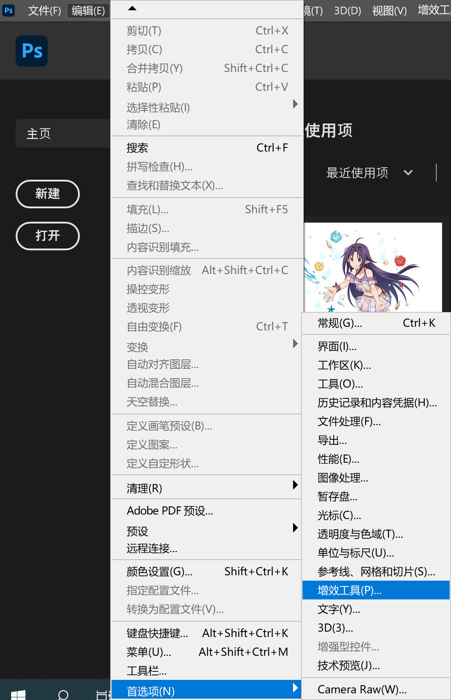

[如何裁剪和调整图像大小 \| Adobe Photoshop 教程](https://helpx.adobe.com/cn/photoshop/how-to/image-resizing-basics.html)

### 更改测量单位为像素

[在 Photoshop 中使用标尺](https://helpx.adobe.com/cn/photoshop/using/rulers.html)

### 从文档中导出区域

[从工作区导出](https://helpx.adobe.com/cn/fireworks/using/export-workspace.html)

### 脚本

[Photoshop 中的脚本](https://helpx.adobe.com/cn/photoshop/using/scripting.html)

### 新建白色图层等

[Photoshop 中的调整图层和填充图层](https://helpx.adobe.com/cn/photoshop/using/adjustment-fill-layers.html#:~:text=%E8%A6%81%E5%88%9B%E5%BB%BA%E5%A1%AB%E5%85%85%E5%9B%BE%E5%B1%82,%E7%84%B6%E5%90%8E%E5%8D%95%E5%87%BB%E2%80%9C%E7%A1%AE%E5%AE%9A%E2%80%9D%E3%80%82)这个好像只支持几种颜色？

新建调整图层不知道行不行

图层背景记得前景色选白色，选其他颜色同理

### 填充和描边选区

[在 Photoshop 中填充和描边选区、图层和路径](https://helpx.adobe.com/cn/photoshop/using/filling-stroking-selections-layers-paths.html)

### 移动选框（选区）

[PS怎么只移动选框而不移动选框里的图片? \- 自学ps教程网](https://www.taoxuemei.com/chuli/ps/711.html)

### 替换颜色

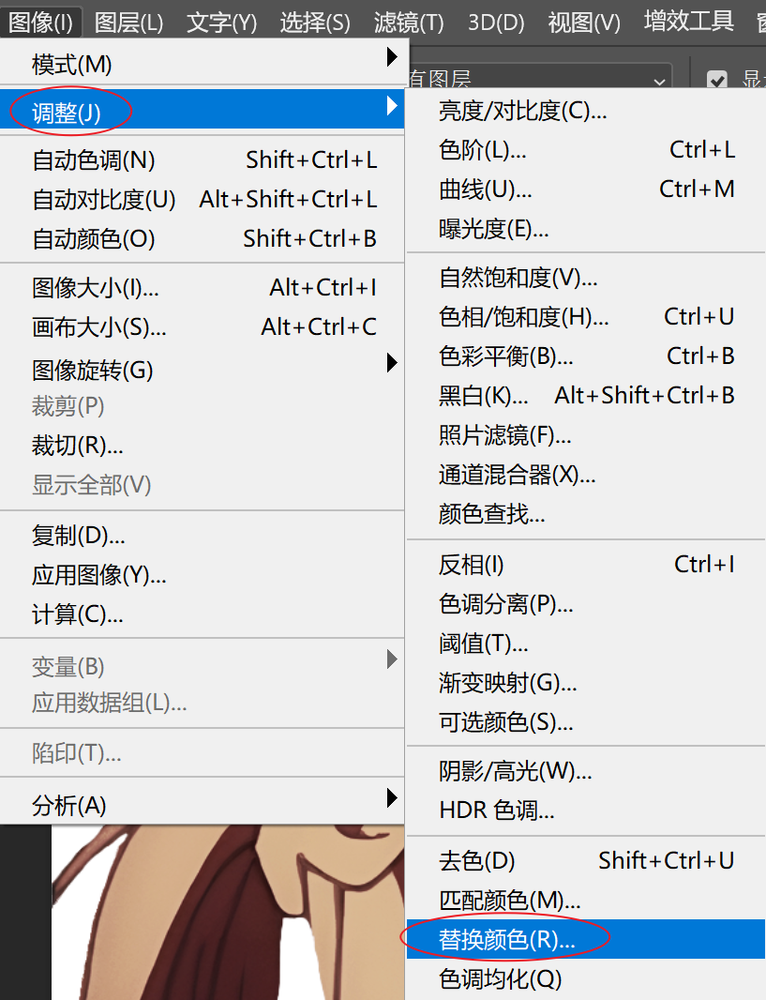

### 查看颜色信息

#### 取色

取ps工作区外的颜色，按住取色器拖到外面

##### RBG

右侧颜色面板

##### 十六进制颜色码（十六进制代码）

双击前景色查看

或在颜色面板栏右上角复制，注意区分前景色与背景色！

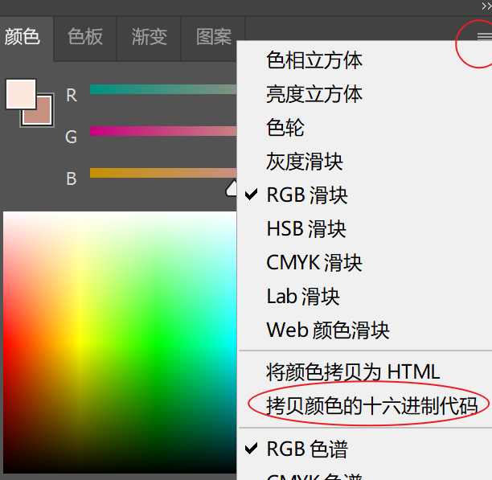

[十六进制颜色码](https://baike.baidu.com/item/十六进制颜色码/10894232)

#### 将颜色添加到色板

[自定 Photoshop 拾色器和色板](https://helpx.adobe.com/cn/photoshop/using/customizing-color-pickers-swatches.html)

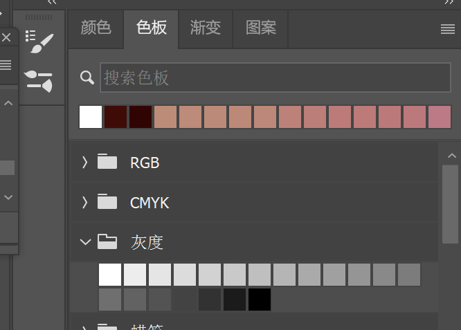

## 脚本

### 抠图片主体来ai训练

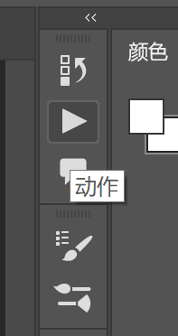

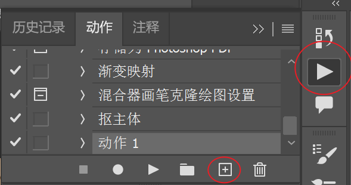

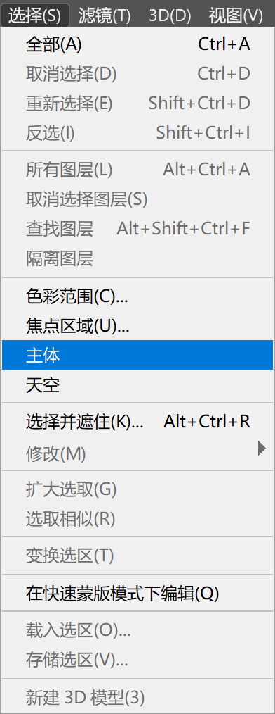

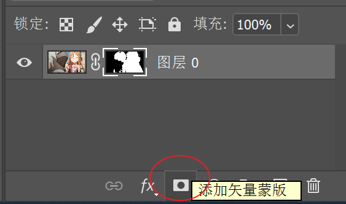

#### 新建图层法

下面是一个错误示范

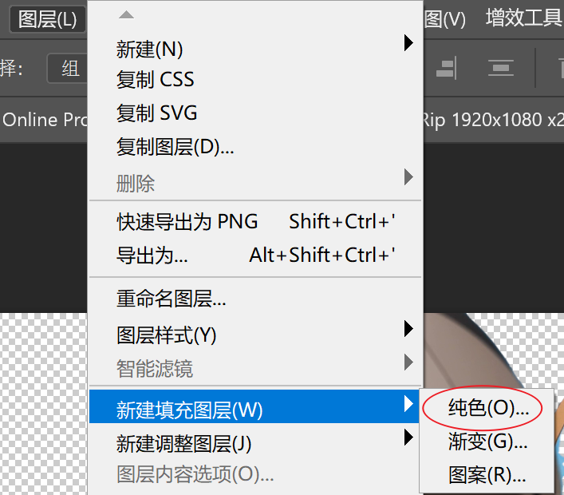

注意这里不能这样,因为纯色里面没有白色...如果要任意可以新建透明图层然后填充

白色这个比较快

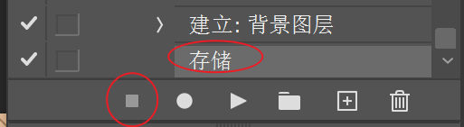

#### 调整曲线法

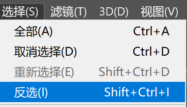

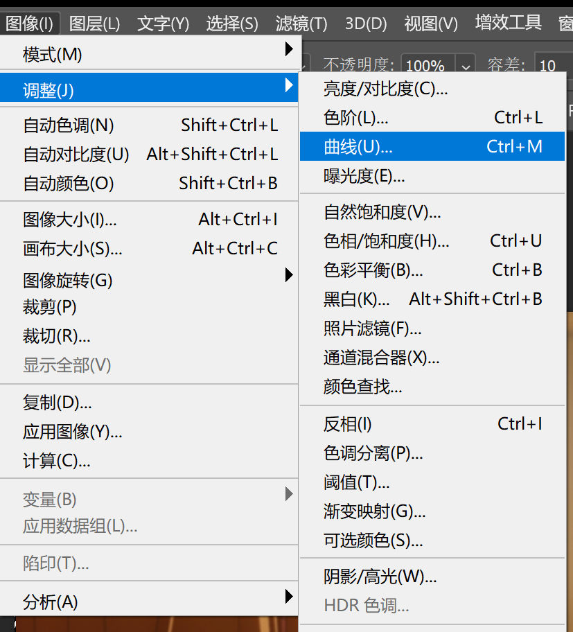

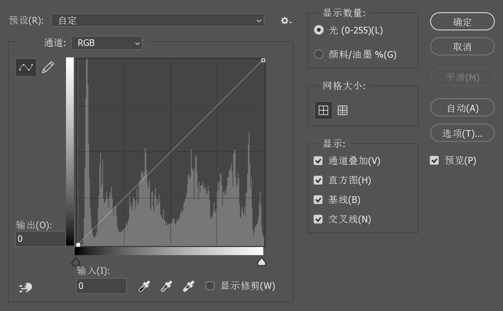

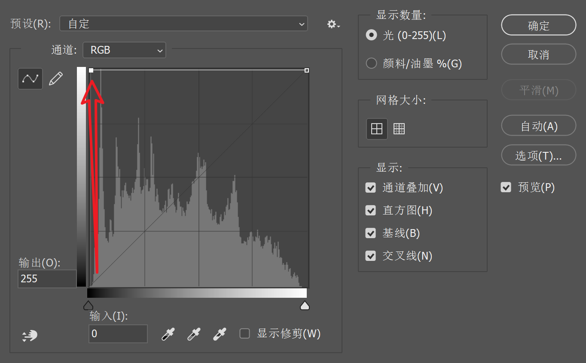

### 使用脚本

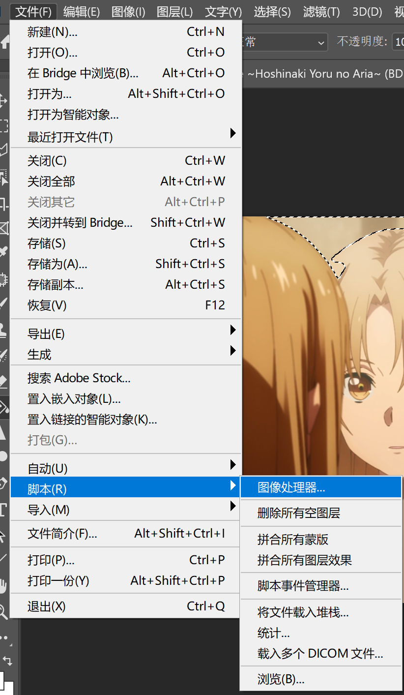

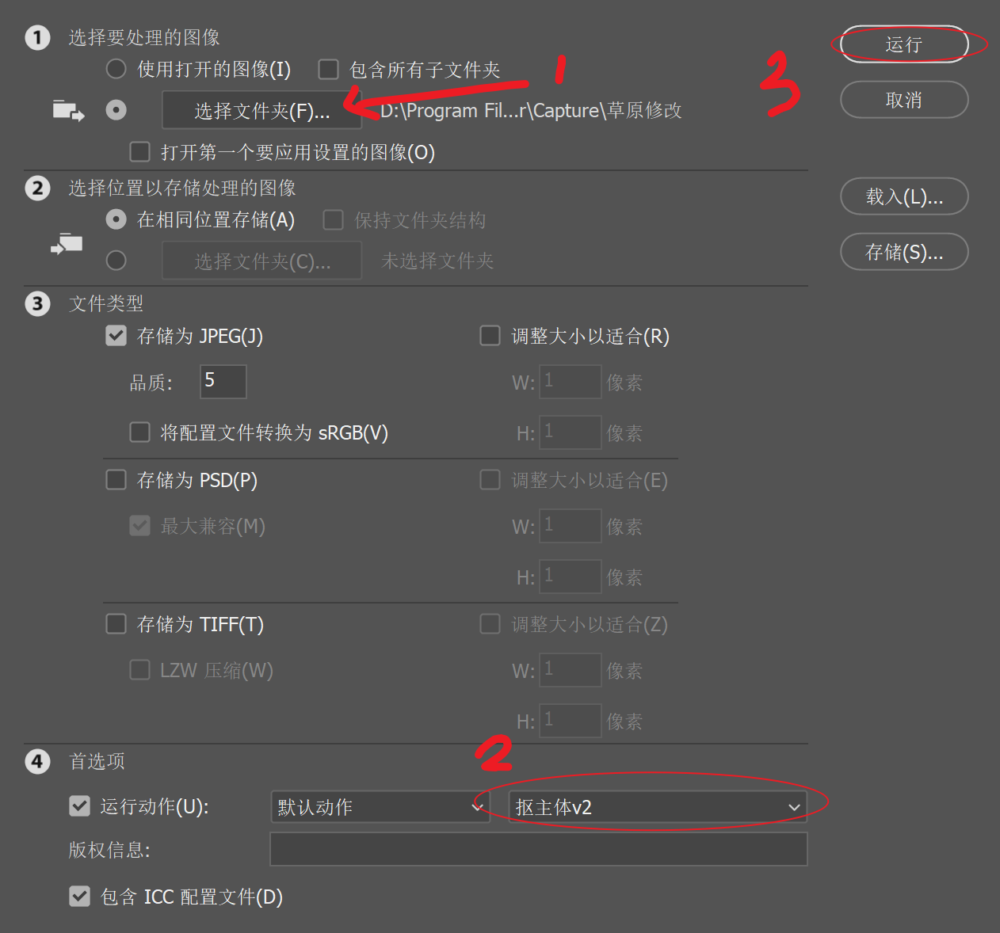

没找到转png的。。。

不知道如何导出脚本

## 经验

选择区域后先在`选择 -> 取消选择` 然后编辑图片