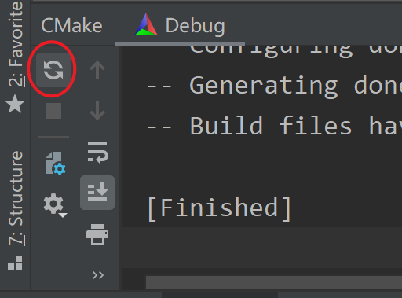
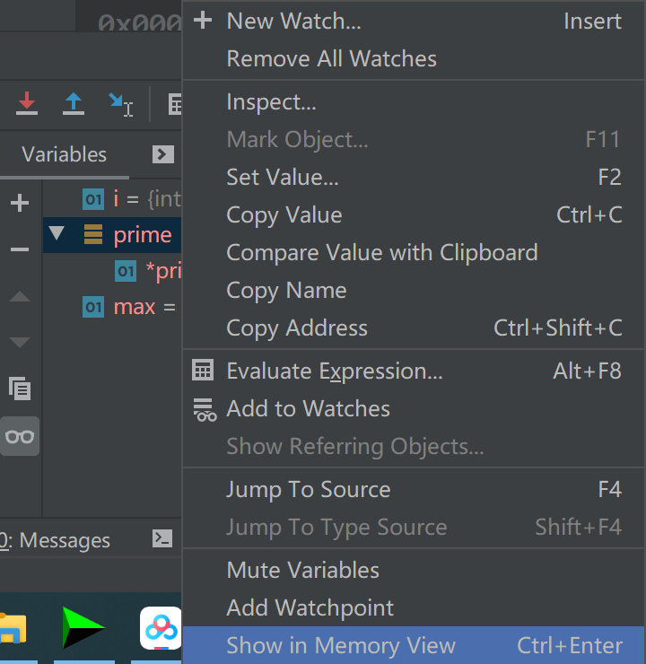

# Clion

* MinGW sh.exe must NOT be in your path
  <https://stackoverflow.com/questions/41333215/mingw-sh-exe-must-not-be-in-your-path>

  

  Just add

  > ```
  > set(DCMAKE_SH="CMAKE_SH-NOTFOUND")
  > ```

  to your

  > CMakeLists.txt file

  and reload project

  

## Debug

### Force step into

Steps into the function even if it is skipped by the regular Step Into by default.

Click the Force step into button Force Step Into icon or press Alt+Shift+F7.

In case the source code of the function that you want to step into is unavailable, you can debug disassembled code in a dedicated view.

<https://www.jetbrains.com/help/clion/stepping-through-the-program.html#force-step-into>

### Show in Memory view



see the content of array,etc.

>   nvidia tx2上容量有限，如果装有pycharm或clion，记得定时删除content.dat.storageData文件，一般位于home下隐藏文件.pycharm或.clion，cache目录下。
>   删除也没用，下一次打开clion，还是会生成同样大的content.dat.storageData缓存文件。
>   解决办法：打开clion安装目录的bin文件夹下idea.properties文件，将文件以下两行内容取消注释，并更改为
>   idea.config.path=外接硬盘的路径/.Clion2019/config
>   idea.system.path=外接硬盘的路径/.Clion2019/system
>   并将之前的.Clion2019文件拷贝过来。现在可以删掉原路径的.Clion2019文件。
>   ————————————————
>   版权声明：本文为CSDN博主「黄靖淞」的原创文章，遵循CC 4.0 BY-SA版权协议，转载请附上原文出处链接及本声明。
>   原文链接：https://blog.csdn.net/weixin_43710385/article/details/109327864

```
# idea.config.path=${user.home}/.CLion/config

#---------------------------------------------------------------------
# Uncomment this option if you want to customize path to IDE system folder. Make sure you're using forward slashes.
#---------------------------------------------------------------------
# idea.system.path=${user.home}/.CLion/system

#---------------------------------------------------------------------
# Uncomment this option if you want to customize path to user installed plugins folder. Make sure you're using forward slashes.
#---------------------------------------------------------------------
# idea.plugins.path=${idea.config.path}/plugins
```

1改为

```
idea.config.path=D:/.CLion/config

#---------------------------------------------------------------------
# Uncomment this option if you want to customize path to IDE system folder. Make sure you're using forward slashes.
#---------------------------------------------------------------------
# idea.system.path=${user.home}/.CLion/system

#---------------------------------------------------------------------
# Uncomment this option if you want to customize path to user installed plugins folder. Make sure you're using forward slashes.
#---------------------------------------------------------------------
# idea.plugins.path=${idea.config.path}/plugins
```

寄了，哪里搞错了，所以全删了。。
