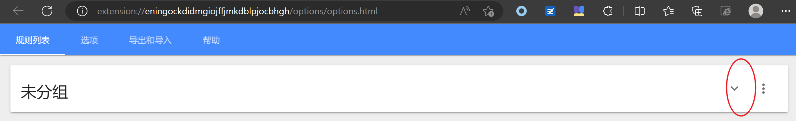
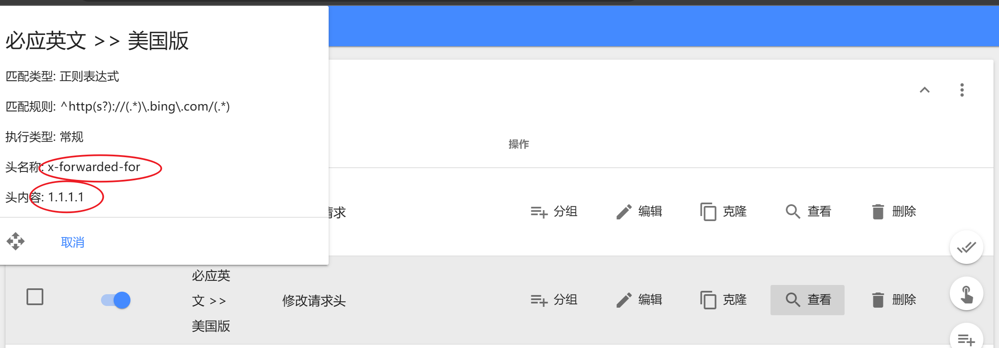

# Edge

edge科学上网事项


## New Bing

出现的第一个问题，开 clash 之后无法登录微软账号

[在Edge浏览器中登录微软账户报错：0x80190001错误\_0x80190001 edge\_点亮～黑夜的博客\-CSDN博客](https://blog.csdn.net/weixin_41010198/article/details/128952779)

[无需魔法，新版 New Bing 使用方法全攻略！_腾讯新闻 (qq.com)](https://new.qq.com/rain/a/20230305A03E5W00)

公众号：奔跑中的奶酪

https://mp.weixin.qq.com/s/1YDGE0n1OULlCtz5vlO5_w

```
Sorry, looks like your network settings are preventing access to this feature.
```

解决方法: 

[New Bing 这是给我拉黑了？ \- V2EX](https://www.v2ex.com/t/924296)

[New Bing 网络设置错误 \- 简书](https://www.jianshu.com/p/57918baf0ac8)





## Pixiv免翻

Steam++

已改名为Watt Toolkit

[仅需两步，完美解决vm16（vmware workstation16）占用443（https）端口的问题 - 知乎 (zhihu.com)](https://zhuanlan.zhihu.com/p/376328486)
