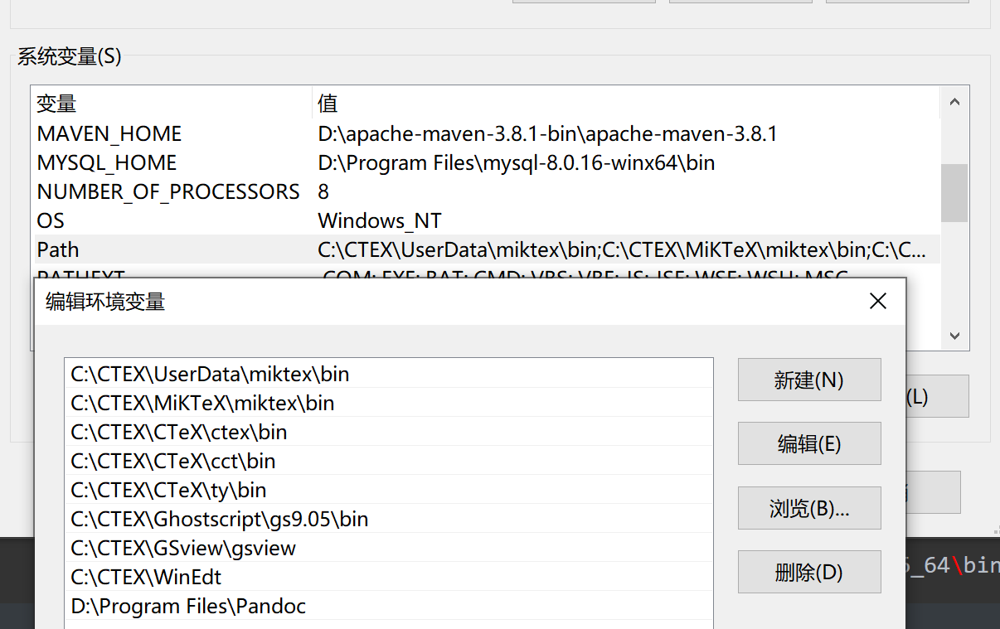

# environment variables

## 命令行查看某个命令的环境变量

### where

```powershell
where.exe gcc
```

[在PowerShell中使用where命令查找文件_mighty13的博客-CSDN博客_powershell where](https://blog.csdn.net/mighty13/article/details/119880762)

`where`命令显示符合搜索模式的文件位置。在默认情况下，搜索是在当前目录和 PATH 环境变量指定的路径中执行的。

根据如下命令可知，在`PowerShell`中`where`命令对应的是`Where-Object`命令，优先级比`where.exe`高。`CMD`里的`where`命令本来全名就是`where.exe`，只不过可以省略`.exe`而已。所以实现需要`CMD`里的`where`命令功能显式地使用`where.exe`。

```powershell
PS C:\WINDOWS\system32> where.exe where
C:\Windows\System32\where.exe
PS C:\WINDOWS\system32> gcm where -All

CommandType     Name                                               Version    Source
-----------     ----                                               -------    ------
Alias           where -> Where-Object
Application     where.exe                                          10.0.19... 
```

### set

只能在 cmd 中使用

## 环境变量

### 系统变量与用户变量

#### 相同

1.   两种环境变量中是可以存在重名的变量的
2.   环境变量没有区分大小写，例如path跟PATH是一样的
3.   用户变量与系统变量，名称是**变量**，**值**是里面的内容，也就是通过变量存储了想要存储的内容，方便调用
4.   系统变量与用户变量的***PATH***：告诉系统可执行文件放在什么路径（平常执行程序的路径，要放在PATH里面，不能建一个变量，cmd会提示“不是内部或外部命令，或者不是可执行程序”）
5.   变量ClassPath：告诉JVM要使用或执行的class放在什么路径

#### 不同

1.   系统变量对所有用户有效
2.   用户变量只对当前用户有效

##### 执行顺序

1.   windows系统在执行用户命令时，若用户未给出文件的绝对路径，则首先在当前目录下寻找相应的可执行文件、批处理文件等；
2.   若找不到，再依次在**系统变量**的**PATH**保存的这些路径中寻找相应的可执行程序文件（查找顺序是按照路径的录入顺序从左往右寻找的，最前面一条的优先级最高，如果找到命令就不会再向后寻找）
3.   如果还找不到再在**用户变量**的**PATH**路径中寻找，如果系统变量和用户变量的PATH中都包含了某个命令，则优先执行系统变量PATH中包含的这个命令

#### 参考

>   作者：荣少
>   链接：https://zhuanlan.zhihu.com/p/93719752
>   来源：知乎
>   著作权归作者所有。商业转载请联系作者获得授权，非商业转载请注明出处。

>   作者：女生学Python
>   链接：https://zhuanlan.zhihu.com/p/480557922
>   来源：知乎
>   著作权归作者所有。商业转载请联系作者获得授权，非商业转载请注明出处。

### 实践

在pandoc环境变量的设置中，在系统变量的设置中不立刻生效。



```powershell
C:\Users\Administrator>echo %path%
C:\CTEX\UserData\miktex\bin;C:\CTEX\MiKTeX\miktex\bin;C:\CTEX\CTeX\ctex\bin;C:\CTEX\CTeX\cct\bin;C:\CTEX\CTeX\ty\bin;C:\CTEX\Ghostscript\gs9.05\bin;C:\CTEX\GSview\gsview;C:\CTEX\WinEdt;D:\Python310\Scripts\;D:\Python310\;E:\Study\cocos-2d\cocos2d-x-3.17.2\templates;E:\Study\cocos-2d\cocos2d-x-3.17.2\tools\cocos2d-console\bin;C:\Users\Administrator\AppData\Local\Microsoft\WindowsApps;D:\Program Files (x86)\Git\bin;D:\Program Files\JetBrains\CLion 2020.1.3\bin;D:\Program Files\JetBrains\IntelliJ IDEA 2019.3.5\bin;D:\Program Files\JetBrains\PhpStorm 2019.1\bin;D:\jdk1.7;D:\Users\Administrator\AppData\Local\Programs\Microsoft VS Code\bin;C:\Users\Administrator\AppData\Local\GitHubDesktop\bin;D:\Downloads\Compressed\Pixeval\Pixeval;D:\Program Files\JetBrains\PyCharm Community Edition 2020.2.1\bin;;D:\Program Files\JetBrains\DataGrip 2021.1.1\bin;;C:\Users\Administrator\.dotnet\tools;D:\apache-maven-3.8.1-bin\apache-maven-3.8.1\bin;C:\Users\Administrator\AppData\Roaming\npm;C:\Users\Administrator\AppData\Local\Microsoft\WindowsApps;D:\Neovim\bin;D:\mingw64\bin;D:\cmake-3.23.1-windows-x86_64\bin;D:\Program Files\LLVM\bin;
```

而重启后可以打开

```powershell
C:\Users\Administrator>echo %path%
C:\CTEX\UserData\miktex\bin;C:\CTEX\MiKTeX\miktex\bin;C:\CTEX\CTeX\ctex\bin;C:\CTEX\CTeX\cct\bin;C:\CTEX\CTeX\ty\bin;C:\CTEX\Ghostscript\gs9.05\bin;C:\CTEX\GSview\gsview;C:\CTEX\WinEdt;D:\Program Files\Pandoc;D:\Python310\Scripts\;D:\Python310\;E:\Study\cocos-2d\cocos2d-x-3.17.2\templates;E:\Study\cocos-2d\cocos2d-x-3.17.2\tools\cocos2d-console\bin;C:\Users\Administrator\AppData\Local\Microsoft\WindowsApps;D:\Program Files (x86)\Git\bin;D:\Program Files\JetBrains\CLion 2020.1.3\bin;D:\Program Files\JetBrains\IntelliJ IDEA 2019.3.5\bin;D:\Program Files\JetBrains\PhpStorm 2019.1\bin;D:\jdk1.7;D:\Users\Administrator\AppData\Local\Programs\Microsoft VS Code\bin;C:\Users\Administrator\AppData\Local\GitHubDesktop\bin;D:\Downloads\Compressed\Pixeval\Pixeval;D:\Program Files\JetBrains\PyCharm Community Edition 2020.2.1\bin;;D:\Program Files\JetBrains\DataGrip 2021.1.1\bin;;C:\Users\Administrator\.dotnet\tools;D:\apache-maven-3.8.1-bin\apache-maven-3.8.1\bin;C:\Users\Administrator\AppData\Roaming\npm;C:\Users\Administrator\AppData\Local\Microsoft\WindowsApps;D:\Neovim\bin;D:\mingw64\bin;D:\cmake-3.23.1-windows-x86_64\bin;D:\Program Files\LLVM\bin;

C:\Users\Administrator>pandoc

```

删除掉后若不重启path还是不变。

```powershell
C:\Users\Administrator>echo %path%
C:\CTEX\UserData\miktex\bin;C:\CTEX\MiKTeX\miktex\bin;C:\CTEX\CTeX\ctex\bin;C:\CTEX\CTeX\cct\bin;C:\CTEX\CTeX\ty\bin;C:\CTEX\Ghostscript\gs9.05\bin;C:\CTEX\GSview\gsview;C:\CTEX\WinEdt;D:\Program Files\Pandoc;D:\Python310\Scripts\;D:\Python310\;E:\Study\cocos-2d\cocos2d-x-3.17.2\templates;E:\Study\cocos-2d\cocos2d-x-3.17.2\tools\cocos2d-console\bin;C:\Users\Administrator\AppData\Local\Microsoft\WindowsApps;D:\Program Files (x86)\Git\bin;D:\Program Files\JetBrains\CLion 2020.1.3\bin;D:\Program Files\JetBrains\IntelliJ IDEA 2019.3.5\bin;D:\Program Files\JetBrains\PhpStorm 2019.1\bin;D:\jdk1.7;D:\Users\Administrator\AppData\Local\Programs\Microsoft VS Code\bin;C:\Users\Administrator\AppData\Local\GitHubDesktop\bin;D:\Downloads\Compressed\Pixeval\Pixeval;D:\Program Files\JetBrains\PyCharm Community Edition 2020.2.1\bin;;D:\Program Files\JetBrains\DataGrip 2021.1.1\bin;;C:\Users\Administrator\.dotnet\tools;D:\apache-maven-3.8.1-bin\apache-maven-3.8.1\bin;C:\Users\Administrator\AppData\Roaming\npm;C:\Users\Administrator\AppData\Local\Microsoft\WindowsApps;D:\Neovim\bin;D:\mingw64\bin;D:\cmake-3.23.1-windows-x86_64\bin;D:\Program Files\LLVM\bin;

```

重启才真正删除了。下面path中无pandoc

```powershell
C:\Users\Administrator>echo %path%
C:\CTEX\UserData\miktex\bin;C:\CTEX\MiKTeX\miktex\bin;C:\CTEX\CTeX\ctex\bin;C:\CTEX\CTeX\cct\bin;C:\CTEX\CTeX\ty\bin;C:\CTEX\Ghostscript\gs9.05\bin;C:\CTEX\GSview\gsview;C:\CTEX\WinEdt;D:\Python310\Scripts\;D:\Python310\;E:\Study\cocos-2d\cocos2d-x-3.17.2\templates;E:\Study\cocos-2d\cocos2d-x-3.17.2\tools\cocos2d-console\bin;C:\Users\Administrator\AppData\Local\Microsoft\WindowsApps;D:\Program Files (x86)\Git\bin;D:\Program Files\JetBrains\CLion 2020.1.3\bin;D:\Program Files\JetBrains\IntelliJ IDEA 2019.3.5\bin;D:\Program Files\JetBrains\PhpStorm 2019.1\bin;D:\jdk1.7;D:\Users\Administrator\AppData\Local\Programs\Microsoft VS Code\bin;C:\Users\Administrator\AppData\Local\GitHubDesktop\bin;D:\Downloads\Compressed\Pixeval\Pixeval;D:\Program Files\JetBrains\PyCharm Community Edition 2020.2.1\bin;;D:\Program Files\JetBrains\DataGrip 2021.1.1\bin;;C:\Users\Administrator\.dotnet\tools;D:\apache-maven-3.8.1-bin\apache-maven-3.8.1\bin;C:\Users\Administrator\AppData\Roaming\npm;C:\Users\Administrator\AppData\Local\Microsoft\WindowsApps;D:\Neovim\bin;D:\mingw64\bin;D:\cmake-3.23.1-windows-x86_64\bin;D:\Program Files\LLVM\bin;
```

在用户变量中同理


