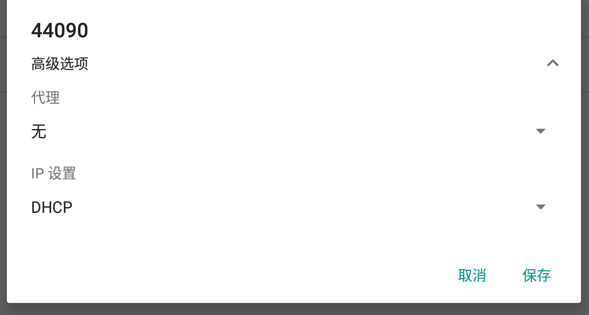
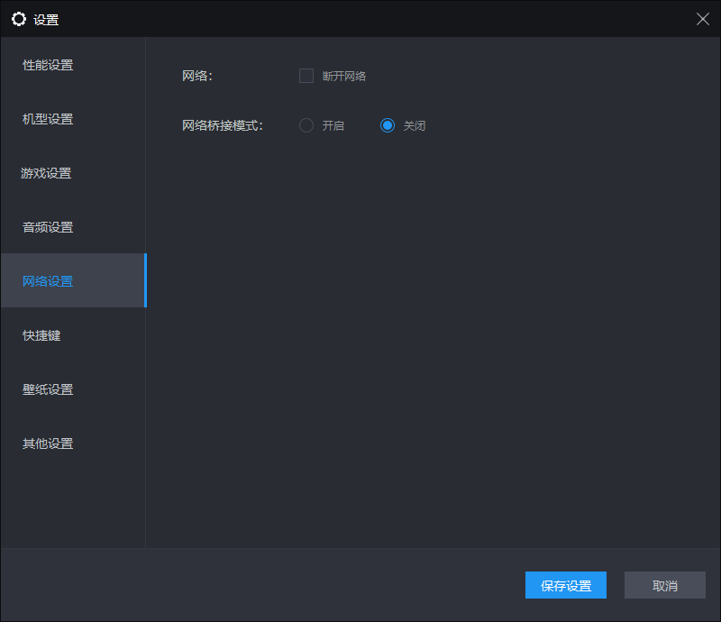

# 雷电模拟器

ldplayer


ldplayer科学上网





```powershell
PS D:\LDPlayer\LDPlayer4.0> .\adb shell settings delete global http_proxy
Deleted 1 rows
PS D:\LDPlayer\LDPlayer4.0> .\adb shell settings delete global global_http_proxy_host
Deleted 1 rows
PS D:\LDPlayer\LDPlayer4.0> .\adb shell settings delete global global_http_proxy_port
Deleted 1 rows
PS D:\LDPlayer\LDPlayer4.0> .\adb shell settings put global http_proxy 192.168.2.204:7890
PS D:\LDPlayer\LDPlayer4.0>  .\adb devices
List of devices attached
127.0.0.1:5555  device
#关闭雷电后上行不出现
```


