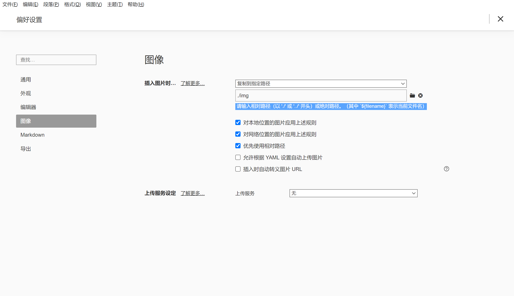

# Typora

- Copy picture config



Typora使用技巧之插入图片及图片上传
<https://zhuanlan.zhihu.com/p/344941041>

## Math

### Math blocks

见latex文件夹中的lshort-zh-cn.pdf
[LaTeX 新手上路指南 \- 知乎](https://zhuanlan.zhihu.com/p/433710726)

<https://support.typora.io/Markdown-Reference/#math-blocks>
[Typora数学公式汇总（Markdown） - 点点星河的文章 - 知乎](https://zhuanlan.zhihu.com/p/261750408)

### Math vector

普通的变量x:`x`:$x$

粗体1：使用`\boldsymbol{}`进行加粗，如：`\boldsymbol{x}`:$\boldsymbol{x}$

粗体2：使用`\mathbf{}`进行加粗，如：`\mathbf{x}`:$\mathbf{x}$

带箭头的向量：使用`\vec{}`使向量带箭头，如`\vec{x}`:$\vec{x}$

## 标题批量降级

[Markdown文件标题全部降一级\_迷雾总会解的博客\-CSDN博客](https://blog.csdn.net/qq_44766883/article/details/122601949)

## Code Block

按住 Ctrl 点击，可以选中当前一个代码块中的多处批量编辑。

## 锚点

注解只能在文本的最后写标注，但是如果想不在最后写，而实现页内跳转至非标题的效果，只能使用锚点。（标题的跳转参考[Links \- Typora Support](https://support.typora.io/Links/#reference-link)，较容易理解）

[Links \- Typora Support](https://support.typora.io/Links/#reference-link) named anchors

[Typora页内跳转，真正能用的方法\_NaraEllen的博客\-CSDN博客\_typora跳转](https://blog.csdn.net/u013502146/article/details/103171825)

### 命名锚 named anchors

如果不想让标签显示则在中间加入空格，如果标签中什么都没有，就会显示出来。离谱的是超链接必须以`#`开头

<a href="#anchor">Link to Anchor. Note that it must be a topic</a>

Empty Line

Empty Line

Empty Line

Empty Line

<a id="anchor"> </a>This line is an Anchor.A tag is hidden in the beginning of this line like this `<a id="anchor"> </a>`, go to the beginning of this line to see it. Remember the space in the middle of tag, or the tag won't be hidden! 

上面的例子是官网给的。

表格中两两都可以。

| 超链接                               | 锚点                          |
| ------------------------------------ | ----------------------------- |
| `[跳转方法1](#way)`                  | `<a name="way">锚点方法1</a>` |
| 不推荐`<a href="#way">跳转方法2</a>` | `<a id="way">锚点方法2</a>`   |

[Typora页内跳转，真正能用的方法\_NaraEllen的博客\-CSDN博客\_typora跳转](https://blog.csdn.net/u013502146/article/details/103171825)

```markdown
操作系统(Operating System, OS) 是指控制和管理整个计算机系统的硬件和软件资源[①](#op_1)，并合理地组织调度计算机的工作和资源的分配；以提供给用户和其他软件方便的接口和环境<a href="#op_2">②</a>；它是计算机系统中最基本的系统软件<a href="#op_3">③</a>。

<a name="op_1">①</a>系统资源的管理者

<a id="op_2">②</a>向上提供方便医用的服务

<a id="op_3">③</a>是最接近硬件的一层软件
```

操作系统(Operating System, OS) 是指控制和管理整个计算机系统的硬件和软件资源[①](#op_1)，并合理地组织调度计算机的工作和资源的分配；以提供给用户和其他软件方便的接口和环境<a href="#op_2">②</a>；它是计算机系统中最基本的系统软件<a href="#op_3">③</a>。

<a id="op_1">①</a>系统资源的管理者

<a id="op_2">②</a>向上提供方便医用的服务

<a id="op_3">③</a>是最接近硬件的一层软件

更换锚点方法：

[跳转方法1](#way1)

<a id="way1">锚点方法2</a>

## 恢复文件

[Typora编辑器恢复未保存的markdown文件_花生啤酒八宝粥的博客-CSDN博客](https://blog.csdn.net/weixin_43823054/article/details/106479470)
