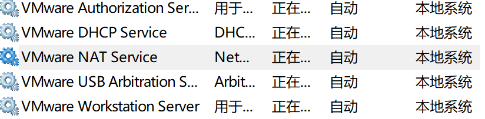
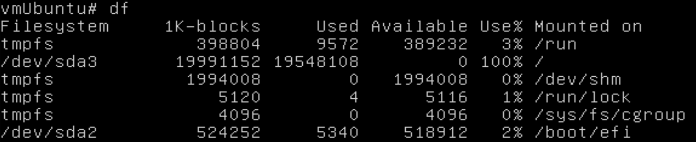

# virtual machine

在 win10 的 vmware 虚拟机中装 win10 虚拟机有感：

## 镜像

[原版软件 (itellyou.cn)](https://next.itellyou.cn/Original/)

| 文件名 （ 显示校验信息 ）                                    |  发布时间  |            ED2K            |             BT             |
| ------------------------------------------------------------ | :--------: | :------------------------: | :------------------------: |
| Windows 10 (business editions), version 21H2 (updated May 2022) (x64) - DVD (Chinese-Simplified) | 2022-05-17 | [复制](javascript:void(0)) | [复制](javascript:void(0)) |
| Windows 10 (consumer editions), version 21H2 (updated May 2022) (x64) - DVD (Chinese-Simplified) | 2022-05-17 | [复制](javascript:void(0)) | [复制](javascript:void(0)) |
| Windows 10 Enterprise LTSC 2021 (x64) - DVD (Chinese-Simplified) | 2021-11-17 | [复制](javascript:void(0)) | [复制](javascript:void(0)) |

最下面的那个。

## 安装

密钥：随便找

win10 vmware没有可用的映像

[VMware中安装系统提示没有可用的映像\(No image available\)\_Vic\.Tang的博客\-CSDN博客\_没有可用的镜像](https://blog.csdn.net/vic0228/article/details/37565035)

[如何解决Vmware安装Windows10提示没有映像文件\-百度经验](https://jingyan.baidu.com/article/e2284b2b3127bfa3e7118d75.html)

密保:全1

### 登录微软账户

可跳过

## 激活

[激活个Windows还不简单？](https://mp.weixin.qq.com/s/gzvo5tFAr7bxwfXJ3bc0aA)

二、zhengfu版windows

## 摄像头

[windows虚拟机中没有摄像头的解决方法+win10开启摄像头方法_A&&K的博客-CSDN博客_win10 虚拟摄像头](https://blog.csdn.net/weixin_46709219/article/details/110099171)

虚拟机 -> 可移动设备 -> integrated camera -> 连接

某个 USB 设备将要从主机拔出并连接到该虚拟机。该设备将先停止以实现安全移除。对于某些设备，主机可能会显示消息“现在可以安全地移除设备。”

## 工具栏配置

[win10右下角天气关闭方法？任务栏下方的天气如何取消 - 知乎 (zhihu.com)](https://zhuanlan.zhihu.com/p/382004738)

搜索 -> 显示搜索图标

## 安装软件

大部分软件主机下载安装包再通过 vmware tools 传到虚拟机中安装。

### vmware tools

[VMware 安装VMware Tools按钮为灰色，无法安装的解决方法_李嘉真的博客-CSDN博客_vm虚拟机安装tools是灰色](https://blog.csdn.net/weixin_45158066/article/details/123268884)

解决方法：

① 打开编辑虚拟机设置

② 将CD/DVD、CD/DVD2、软盘的连接都设置为“使用物理驱动器”，自动检测

VMware Tools 安装程序是 ISO 映像文件。客户机操作系统中的 CD-ROM 会检测 ISO 映像文件。每种类型的客户机操作系统（包括 Windows、Linux 和 Mac OS X）具有一个 ISO 映像文件。在选择命令以安装或升级 VMware Tools 时，虚拟机的第一个虚拟 CD-ROM 磁盘驱动器暂时连接到客户机操作系统的 VMware Tools ISO 文件。
————————————————
版权声明：本文为CSDN博主「李嘉真」的原创文章，遵循CC 4.0 BY-SA版权协议，转载请附上原文出处链接及本声明。
原文链接：https://blog.csdn.net/weixin_45158066/article/details/123268884

精髓在评论中

```shell
如果这么操作之后还是灰色的怎么办
把软盘删掉就好了
```

### 微信

### QQ

### 腾讯会议

### Edge

[Vmware虚拟机中Edge浏览器右键弹出窗口模糊问题\_YuMonster的博客\-CSDN博客\_虚拟机显示模糊](https://blog.csdn.net/YYBHAHAHA/article/details/123836495)

解决方案为：打开虚拟机设置，找到显示器——>加速3D图形，将前面对话框取消勾选

## 网络不能连接

在“服务”中，确认相关服务，右键保证服务已经启动。




## Ubuntu踩坑记

未挂起虚拟机前强制关闭，即关闭电源，出现虚拟机无法启动的情况。

具体表现为只有光标闪动。

只能用如下方法登陆，但是仍无法打开图形界面。

> 解决方法： 黑屏后按Ctrl+ALT+F5（或者Ctrl+ALT+F1~F6）进入命令行界面，输入账号、密码，登陆。

[Ubuntu blank screen with blinking cursor on start after stopping bleachbit process \- Stack Overflow](https://stackoverflow.com/questions/69751468/ubuntu-blank-screen-with-blinking-cursor-on-start-after-stopping-bleachbit-proce#:~:text=This%20can%20be%20resolved%20by,%2F...%22).)



通过这里可以看到是 sda3 已经满了，我们要清理出一些空间，重启即可。

```shell
df -h
```


## 关闭自动更新

[WINDOWS 10 自动更新彻底关闭！](https://aopos.es/pages/windows-10-%E8%87%AA%E5%8A%A8%E6%9B%B4%E6%96%B0%E5%BD%BB%E5%BA%95%E5%85%B3%E9%97%AD)
