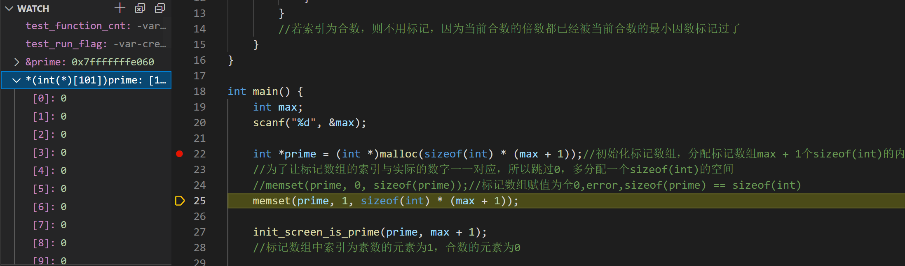
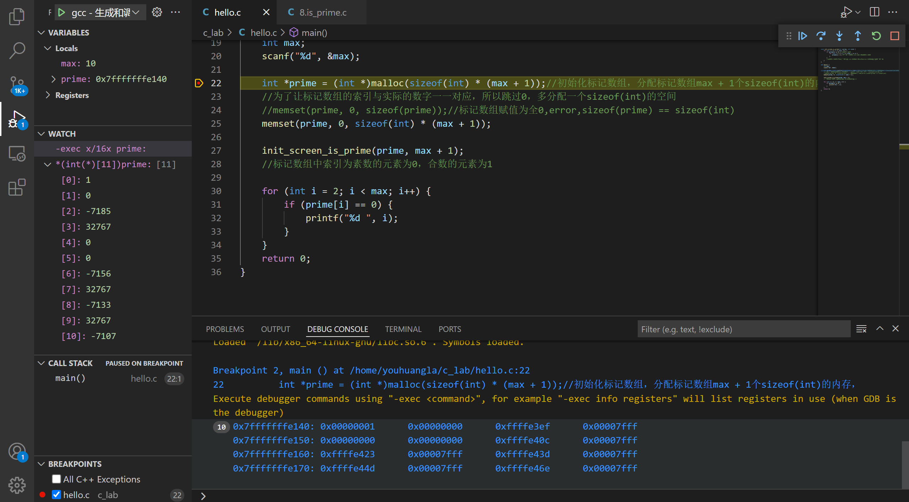
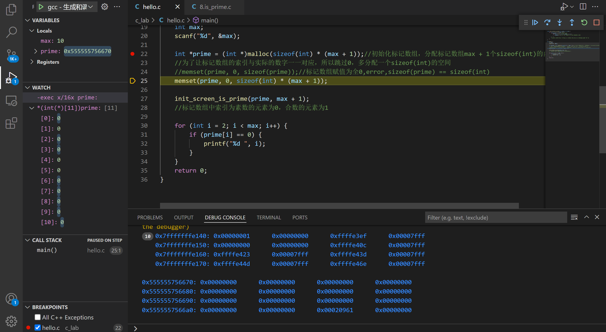

# vscode

## code style

[更改 VS Code C++ 默认代码风格为 Google C++ Style_揭航的博客-CSDN博客](https://blog.csdn.net/weixin_44179485/article/details/113541029)

## debug

[Debugging in Visual Studio Code](https://code.visualstudio.com/docs/editor/debugging)

F5 to run and debug

```c
//素数筛法
//输入一个数，输出这个数内的所有素数
#include <stdio.h>
#include <stdlib.h>
#include <string.h>

void init_screen_is_prime(int *prime, int size) {
    for (int i = 2; i <= size; i++) {
        if (prime[i] == 0) {//若索引为素数
            for (int j = 2 * i; j <= size; j += i) {
                prime[j] = 1;//则标记所有索引为当前i的倍数的索引为偶数
            }
        }
        //若索引为合数，则不用标记，因为当前合数的倍数都已经被当前合数的最小因数标记过了
    }
}

int main() {
    int max;
    scanf("%d", &max);

    int *prime = (int *)malloc(sizeof(int) * (max + 1));//初始化标记数组，分配标记数组max + 1个sizeof(int)的内存，
    //为了让标记数组的索引与实际的数字一一对应，所以跳过0，多分配一个sizeof(int)的空间
    //memset(prime, 0, sizeof(prime));//标记数组赋值为全0,error,sizeof(prime) == sizeof(int)
    memset(prime, 1, sizeof(int) * (max + 1));

    init_screen_is_prime(prime, max + 1);
    //标记数组中索引为素数的元素为1，合数的元素为0

    for (int i = 2; i < max; i++) {
        if (prime[i] == 0) {
            printf("%d ", i);
        }
    }
    return 0;
}
```

### view array

[Vscode 调试 C 语言时数组值无法显示的问题 \- feiffy \- 博客园](https://www.cnblogs.com/feiffy/p/9077882.html)

If we want to see prime with 101 int.

```shell
100#input
```

```c
*(int(*)[101])prime//watch
```



Can also see in memory view.

### in memory view

[vscode调试C/C\+\+如何查看memory？ \- 知乎](https://www.zhihu.com/question/347956605)

[VS code GDB调试 16进制查看内存和表达式](https://www.365seal.com/y/xPnQm6OlnK.html)

```shell
10#input
```






