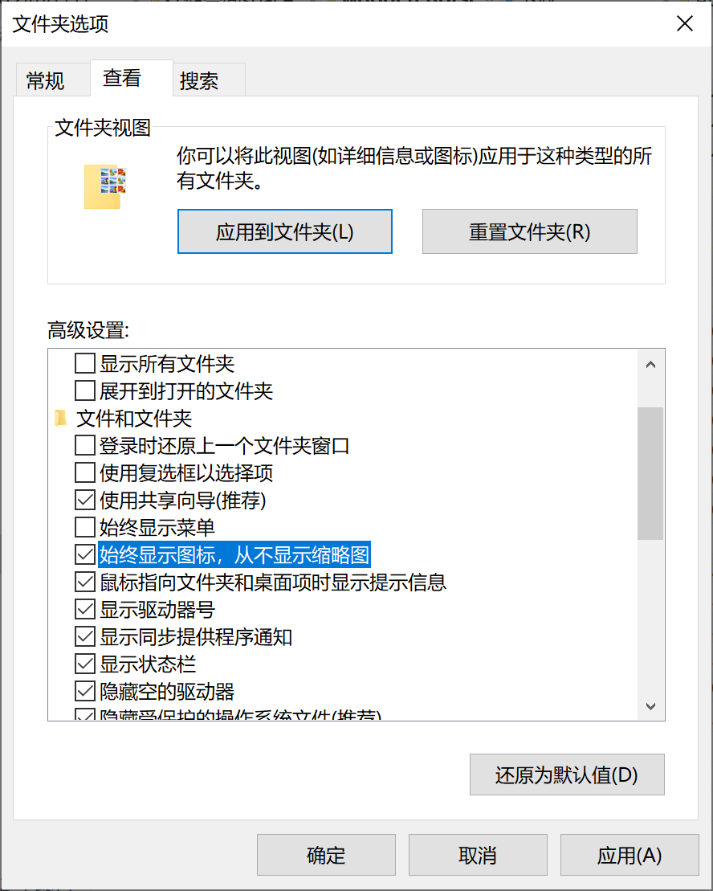
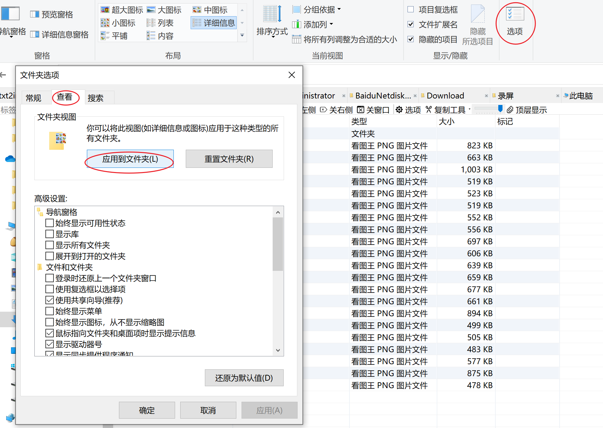

# Windows

## 快捷键

[点鼠标右键的键盘快捷键是什么？\_百度知道](https://zhidao.baidu.com/question/14657851.html)

Shift + F10

## 高级系统设置

[How to: Add Tool Locations to the PATH Environment Variable \| Microsoft Docs](https://docs.microsoft.com/en-us/previous-versions/office/developer/sharepoint-2010/ee537574(v=office.14))

这配完后要重启 vsc 或 shell 。

## 虚拟内存

1. 右键计算机->属性->高级系统设置->高级->性能->设置->高级->虚拟内存->更改


2. 更改虚拟内存后要点击设置才算保存

[如何配置Windows实例的虚拟内存](https://help.aliyun.com/document_detail/40995.htm?spm=a2c4g.11186623.0.0.71af1323T7fTtH)
[Windows虚拟内存不足问题的处理](https://help.aliyun.com/document_detail/41046.html#kzGCz)

## 语言

- win输入法快捷键"Ctrl +　,"、"Ctrl + space"总是与vscode冲突的解决方案


- 现在vscode中'ctrl + space'就可以显示代码补全选项了

## USB

### USB占用后如何弹出

- 提示程序占用USB设备
- 使用[在Windows中，U盘或者移动硬盘关不掉时，怎么知道是被哪个程序占用了呢？ - 张大侠的回答 - 知乎](https://www.zhihu.com/question/22579281/answer/1883600510)的最后一个方法
- 右键左下角win图标，打开事件查看器


- 从上图中可知一个程序HiSuite停止删除或弹出一个USB设备，容易得知该程序为华为手机助手，pid（进程号）为7528
- 从[windows使用命令行杀进程](https://www.cnblogs.com/shindo/p/5959329.html)中，得知应使用taskkill命令，但是直接在cmd中可能拒绝访问

```powershell
PS C:\Users\Administrator> taskkill /pid 7528 -t -f;
错误: 无法终止 PID 7528 (属于 PID 21260 子进程)的进程。
原因: 拒绝访问。
```

- 应右键左下角win图标打开Powershell(管理员)，并成功杀死进程
- 成功拔出！

## Kill-Shift-Space

[Svtter/Kill\-Shift\-Space: 屏蔽掉 win10 的 shift\+space](https://github.com/Svtter/Kill-Shift-Space)

[在 Windows 10 中添加在启动时自动运行的应用](https://support.microsoft.com/zh-cn/windows/%E5%9C%A8-windows-10-%E4%B8%AD%E6%B7%BB%E5%8A%A0%E5%9C%A8%E5%90%AF%E5%8A%A8%E6%97%B6%E8%87%AA%E5%8A%A8%E8%BF%90%E8%A1%8C%E7%9A%84%E5%BA%94%E7%94%A8-150da165-dcd9-7230-517b-cf3c295d89dd)

[Win10 取消百度输入法 Shift\+Space 全角半角切换\_锦夏挽秋的博客\-CSDN博客\_百度输入法shift](https://blog.csdn.net/qq1337715208/article/details/103334455)

## 取消自动更新

[Lenovo Quick Fix 联想智能解决工具-联想知识库](https://iknow.lenovo.com.cn/detail/dc_172545.html)

[**关闭或开启Win10系统自动更新**](https://box.lenovo.com/l/t5dQKH)

## 开机自启动

[Win10怎么设置开机自启动软件 如何打开指定应用-百度经验 (baidu.com)](https://jingyan.baidu.com/article/5d368d1ebfdf1a3f60c057f8.html)

>   在Windows10桌面，右键点击桌面左下角的开始按钮，在弹出的菜单中选择“运行”菜单项。
>
>   这时就会打开Windows10的运行窗口，在窗口中输入命令shell:startup，然后点击确定按钮。
>
>   这时就可以打开Windows10系统的启动文件夹
>
>   把需要开机启动的应用或是程序的快捷方式拖动到该文件夹中，这样以后电脑开机的时候，就会自动启动这些应用。

可以把该文件夹快捷方式发送到桌面

[Win10如何设置一个程序开机启动-腾讯电脑管家官网 (qq.com)](https://guanjia.qq.com/web_clinic/s8/1670.html)

## 桌面

win10桌面空出来一部分

原因:图标过大,可以点击桌面用`Ctrl + 滑轮`缩放图标。

## 空间清理

### SpaceSniffer

### Disc++

如何对Windows系统盘下的Installer文件夹以及WinSxS文件夹进行清理？ - yichya QC的回答 - 知乎 https://www.zhihu.com/question/34964216/answer/60559237

## 缩略图



[windows设置查看文件方式为详细信息\_朝着希望前进的博客\-CSDN博客](https://blog.csdn.net/zl544434558/article/details/21233137)



因为列表显示查找文件非常方便，但是，也习惯了列表视图，但是xp，默认是【平铺】模式，每次都要手动改动每一个文件夹为【详细信息】模式，太麻烦。最近找到一个办法：
第一步：进入C盘（或D、E、F中任一盘符） -->点击 工具栏中【查看】按钮 --> 【详细信息】
第二步：点击菜单栏中的【工具】 --> 【文件夹选项】 --> 选择【查看】选项卡 --> 找到【高级设置】列表内的【记住每个文件夹的视图设置】，将其前面的勾去掉 --> 再点击列表上面【文件夹视图】块中的【应用到所有文件夹】 --> 点击【是】 --> 点击【确定】
————————————————
版权声明：本文为CSDN博主「vebasan」的原创文章，遵循CC 4.0 BY-SA版权协议，转载请附上原文出处链接及本声明。
原文链接：https://blog.csdn.net/vebasan/article/details/5857842
