# 3.栈、队列和数组

## 3.4.数组和特殊矩阵

### 3.4.2.数组的存储结构

#### 一维数组

以一维数组 A【0...n-1】为例，其存储结构关系式为 $LOC(a_i)=LOC(a_0)+i×L (0 \le i \lt n)$

其中，L是每个数组元素所占的存储单元。

#### 多维数组

对多维数组，有两种映射方法：按行优先和按列优先。

##### 行优先

以二维数组为例，按行优先存储的 基本思想是∶先行后列，先存储行号较小的元素，行号相等先存储列号较小的元素。

设二维数组 的行下标与列下标的范围分别为[0，h1]与[0，h2]，则存储结构关系式为 $LOC(a_{i,j})= LOC(a_{0,0})+[i×(h_2+1) + j] \times L$

例如，对于数组 $A_{4x3}$，它按行优先方式在内存中的存储形式如图 3.18所示。

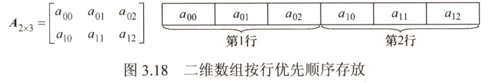

##### 列优先

当以列优先方式存储时，得出存储结构关系式为 $LOC(a_{i,j})=LOC(a_{0,0})+[j×(h_1+1)+i]×L$

例如，对于数组 $A_{4x3}$，它按列优先方式在内存中的存储形式如图3.19所示。

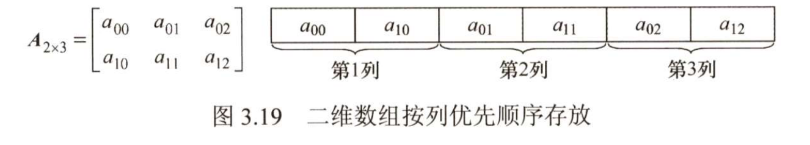

### 3.4.3 特殊矩阵的压缩存储

压缩存储;指为多个值相同的元素只分配一个存储空间，对零元素不分配存储空间。其目的是节省存储空间。

特殊矩阵∶指具有许多相同矩阵元素或零元素，并且这些相同矩阵元素或零元素的分布有一 定规律性的矩阵。常见的特殊矩阵有对称矩阵、上（下）三角矩阵、对角矩阵等。 

特殊矩阵的压缩存储方法;找出特殊矩阵中值相同的矩阵元素的分布规律，把那些呈现规律性分布的、值相同的多个矩阵元素压缩存储到一个存储空间中。

#### 1.对称矩阵

若对一个n阶方阵`A[1...n][1...n]`中的任意一个元素$a_{i,j}$都有$a_{i,j}=a_{j,i} (1 \le i, j \lt n)$，则称其为对称矩阵。对于个n阶方阵，其中的元素可以划分为3个部分，即上三角区、主对角线和下三角区，如图3.20所示。 

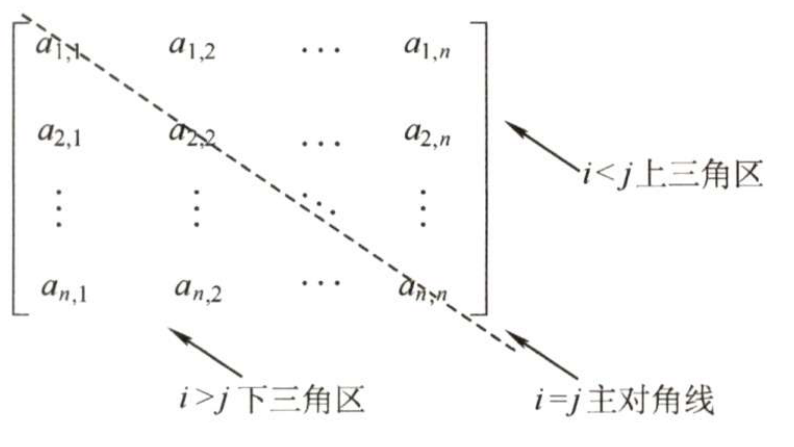

对于n阶对称矩阵，上三角区的所有元素和下三角区的对应元素相同，若仍采用二维数组存放，则会浪费几乎一半的空间，为此将对称矩阵 `A[1...n][1...n]`存放在一维数组`B[n(n + 1) / 2]` 中，即元素a存放在b中。只存放下三角部分（含主对角）的元素。

#### 2.三角矩阵

下三角矩阵【见图3.22（a）】中，上三角区的所有元素均为同一常量。其存储思想与对称矩阵类似，不同之处在于存储完下三角区和主对角线上的元素之后，紧接着存储对角线上方的常量一 次，故可以将下三角矩阵 `A[1...n][1...n]`压缩存储在`B[n(n + 1) / 2 + 1]` 中。

元素下标之间的对应关系为

$k = \{ \begin{array}  { l l  }  { \frac { i ( i - 1 ) } { 2 } + j - 1 , } & { i \geq j (下三角区和主对角线元素)} \\ { \frac { n ( n + 1 ) } { 2 } , } & { i \lt j (上三角区元素)} \end{array}$

下三角矩阵在内存中的压缩存储形式如图 3.21所示。

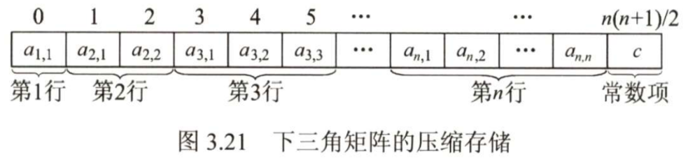

上三角矩阵【见图3.22b】中，下三角区的所有元素均为同一常量。只需存储主对角线、上三角区上的元素和下三角区的常量一次，可将其压缩存储在`B[n(n + 1) / 2 + 1]` 中。

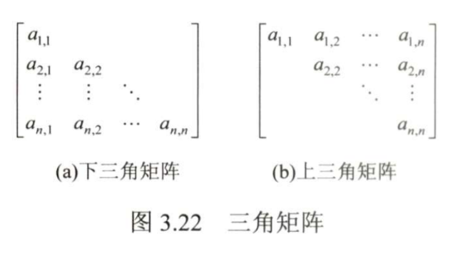

在数组B中，位于元素(z<j)前面的元素个数为

第1行：n个元素

第2行：n - 1个元素

第 i - 1 行∶n - i + 2个元素

......

第 i 行∶ j - i 个元素

因此，元素$a_{i,j}$在数组 B 中的下标$k = n + ( n - 1 ) + \cdots + ( n - i + 2 ) + ( j - i + 1 ) - 1 = ( i - 1 ) ( 2 n - i + 2 ) / 2 + ( j - i )$。

因此，元素下标之间的对应关系如下：

$k = \{ \begin{array}  { l l  }  { \frac { ( i - 1 ) ( 2 n - i + 2 ) } { 2 } + ( j - i ) , } & { i \leq j (上三角区和主对角线元素)} \\ { \frac { n ( n + 1 ) } { 2 } , } & { i \gt j (下三角区元素)} \end{array}$

上三角矩阵在内存中的压缩存储形式如图3.23所示。

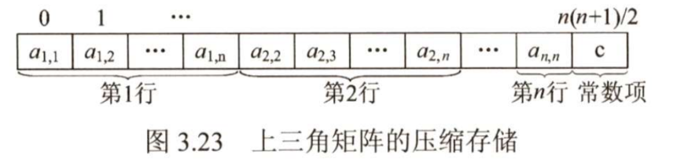

以上推导均假设数组的下标从0开始，若题设有具体要求，则应该灵活应对。

##### 扩展

协方差矩阵的意义及其应用，线性代数和各种应用之间的一个联系 - 老胡说科学的文章 - 知乎 https://zhuanlan.zhihu.com/p/419949293

>   **用例1：[随机建模](https://www.zhihu.com/search?q=随机建模&search_source=Entity&hybrid_search_source=Entity&hybrid_search_extra={"sourceType"%3A"article"%2C"sourceId"%3A"419949293"})**
>
>   协方差矩阵最重要的特点是它是半正定的，那么久可以用**乔里斯基分解**了（**Cholesky decomposition**）：
>
>   简而言之，[乔里斯基分解](https://www.zhihu.com/search?q=乔里斯基分解&search_source=Entity&hybrid_search_source=Entity&hybrid_search_extra={"sourceType"%3A"article"%2C"sourceId"%3A"419949293"})是将一个正定矩阵分解为下三角矩阵与其转置的乘积。在实践中，人们用它来生成相关的随机变量，方法是将协方差矩阵分解成标准正态分布，然后将下三角相乘。此外，[矩阵分解](https://www.zhihu.com/search?q=矩阵分解&search_source=Entity&hybrid_search_source=Entity&hybrid_search_extra={"sourceType"%3A"article"%2C"sourceId"%3A"419949293"})在很多方面都是有帮助的，因为使用隐藏因子来描述矩阵的特征，可以发现一些普遍的属性，而我们并不经常可以明确地进行矩阵计算。
>
>   
>
>   作者：老胡说科学
>   链接：https://zhuanlan.zhihu.com/p/419949293
>   来源：知乎
>   著作权归作者所有。商业转载请联系作者获得授权，非商业转载请注明出处。

#### 3.三对角矩阵

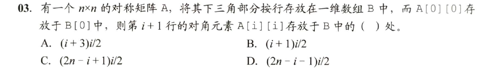

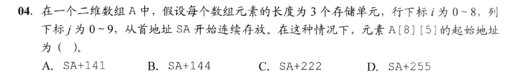

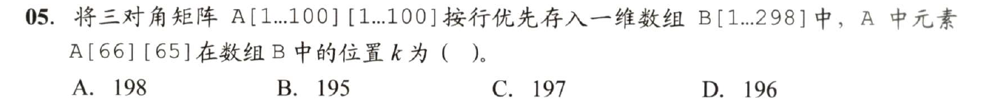

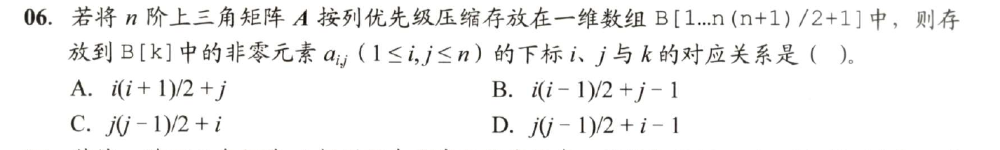

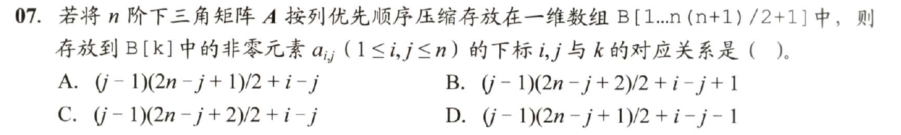

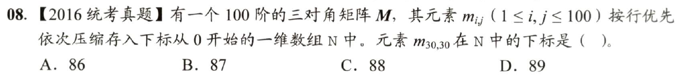

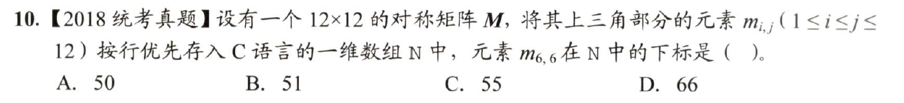

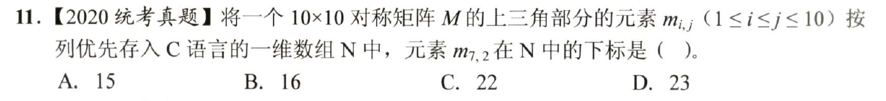

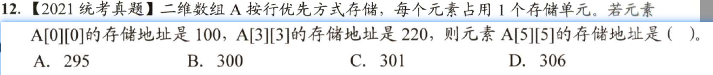