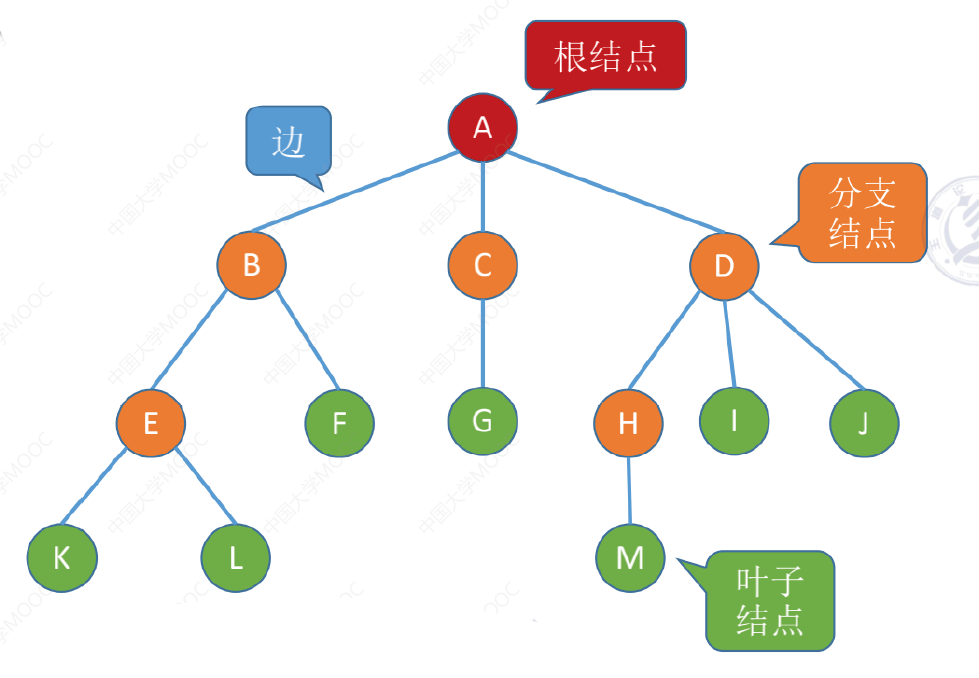
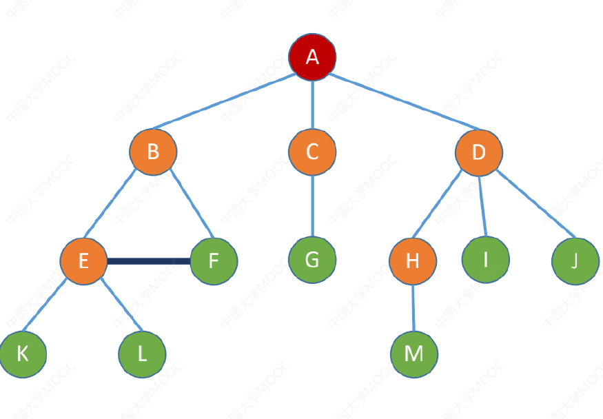
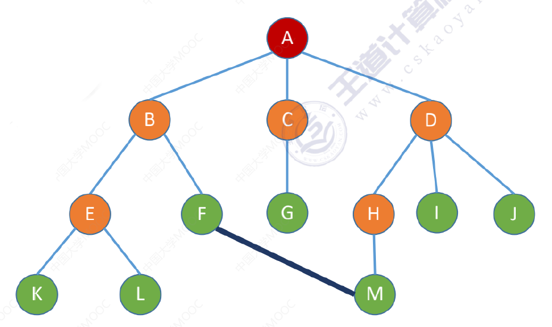
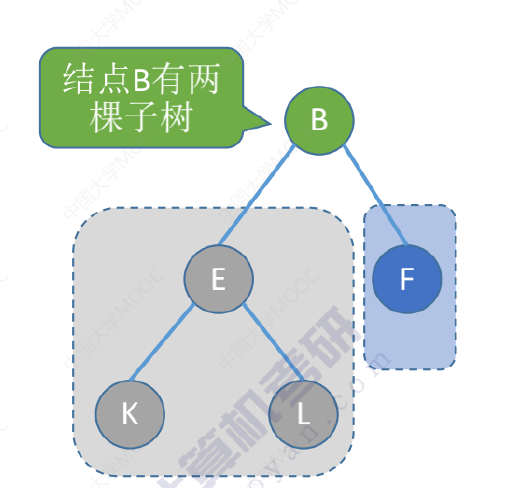
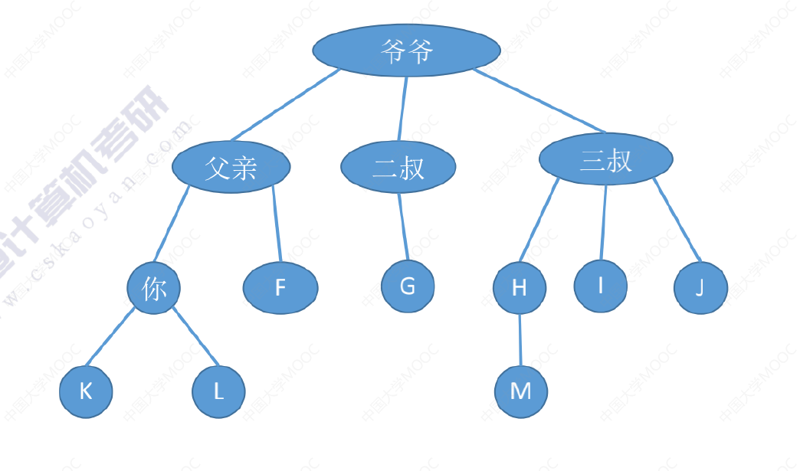
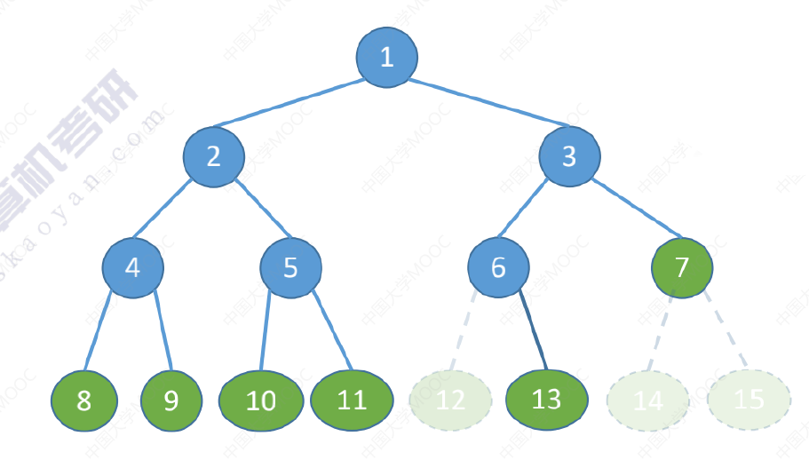
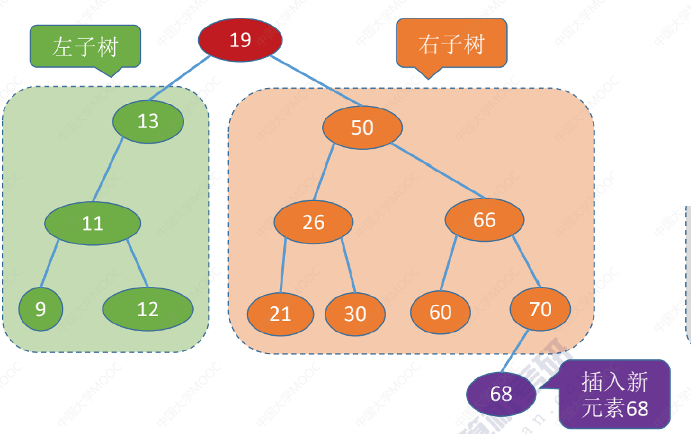
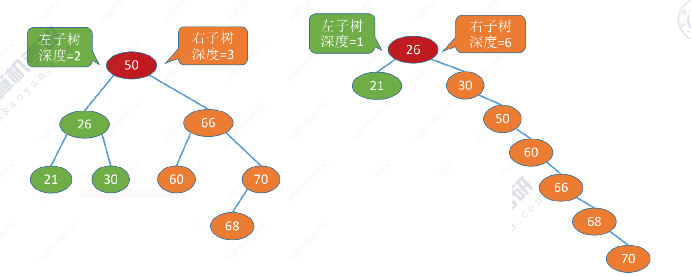

# 5.树

有序树、无序树

森林

## 树的基本概念

### 树的定义

非空树的特性：

1.   且仅有一个根节点
2.   没有后继的结点称为“叶子结点”（或终端结点）
3.   有后继的结点称为“分支结点”（或非终端结点）
4.   除了根节点外，任何一个结点都有且仅有一个前驱
5.   每个结点可以有0个或多个后继

下面的图片都是树吗?为什么?

都不是树

树是一种递归定义的数据结构

树是n（n>=0）个结点的有限集合，n=08时，称为空树，这是一种特殊情况。在任意一棵非空树中应满足：

1.   有且仅有一个特定的称为根的结点。
2.   当n＞1时，其余结点可分为m(m>0)个互不相交的有限集合T1,T2,..,Tm其中每个集合本身又是一棵树，并且称为根结点的子树。

### 结点之间的关系描述

什么是祖先结点?

你的：父亲、爷爷

什么是子孙结点?

父亲的：你、F、K、L

什么是双亲结点(父节点)?

你的：父亲

什么是孩子结点?

父亲的：你

什么是兄弟结点?

父亲的：二叔、三叔

#### 路径

什么是两个结点之间的路径?

两个结点之间所经过的从上到下的结点序列

什么是路径长度?

路径上经过的边的个数

### 结点、树的属性描述

属性：

结点的层次（深度）一一从上往下数，从1开始

结点的高度——从下往上数

树的高度（深度）——总共多少层

结点的度——有几个孩子（分支）

树的度——各结点的度的最大值

### 有序树V.S无序树

有序树——逻辑上看，树中结点的各子树从左至右是有次序的，不能互换

无序树一一逻辑上看，树中结点的各子树从左至右是无次序的，可以互换

<u>有序与无序总结：树中每一层子树从左到右是否有序</u>

具体看你用树存什么，是否需要用结点的左右位置反映某些逻辑关系

### 树V.s森林

森林：m(m≥0)棵互不相交的树的集合

### 树的常考性质

#### 常见考点1：结点数=总度数

常见考点1：结点数=总度数+1

结点的度一一结点有几个孩子(分支)

#### 常见考点2：度为m的树、m叉树的区别

树的度―-各结点的度的最大值

度为m的树——至少有一个度为m的结点

m叉树――每个结点最多只能有m个孩子的树

#### 常见考点3：m度树、m叉树最多结点

度为m的树第 i 层至多有 $m ^ {i - 1}$ 个结点（i≥1）

m叉树第 i 层至多有 $m ^ {i - 1}$ 个结点（i≥1）

#### 常见考点4：高h的m叉树最多结点

高度为 h 的 m 叉树至多有 $\frac { m ^ { n } - 1 } { m - 1 }$ 个结点。

#### 常见考点5：高h的m叉树、m度树最少结点

高度为 h 的 m 叉树至少有 h 个结点。

高度为 h、度为 m 的树至少有 h+m-1 个结点。

#### 常见考点6：具有n个结点的m叉树的最小高度

 $\lceil \log _ { m } ( n ( m - 1 ) + 1 ) \rceil$ 。

高度最小的情况―-所有结点都有m个孩子

## 二叉树

### 基本概念

空二叉树，n（结点数） = 0 。

非空二叉树：由一个根结点和两个互不相交的被称为根的左子树和右子树组成。左子树和右子树又分别是一棵二义树。

二叉树是递归定义的数据结构

#### 特点

1.   每个结点至多只有两棵子树
2.   左右子树不能颠倒（二叉树是有序树）

### 几种特殊的二叉树

#### 满二叉树

棵高度为h,且含有 $2^h - 1$个结点的二叉树

特点：

①只有最后一层有叶子结点

②不存在度为1的结点

③按层序从1开始编号，结点i的左孩子为2i，右孩子为2i＋1；结点i的父节点为 $\lfloor \frac {i} {2} \rfloor$（如果有的话）

#### 完全二叉树

完全二叉树。当且仅当其每个结点都与高度为h的满二叉树中编号为1～n的结点一一对应时，称为完全二叉树

下面的树是完全二叉树吗？

不是，如果某结点只有一个孩子，那么一定是左孩子

特点：

①只有最后两层可能有叶子结点

②最多只有一个度为1的结点

③（同左③）按层序从1开始编号，结点i的左孩子为2i，右孩子为2i＋1；结点i的父节点为 $\lfloor \frac {i} {2} \rfloor$（如果有的话）

④ $ i \le \lfloor \frac {n} {2} \rfloor$ 为分支结点， $ i \gt \lfloor \frac {n} {2} \rfloor$ 为叶子结点

#### 二叉排序树

二叉排序树。一棵二叉树或者是空二叉树，或者是具有如下性质的二叉树：左子树上所有结点的关键字均小于根结点的关键字；

右子树上所有结点的关键字均大于根结点的关键字。左子树和右子树又各是一棵二叉排序树。

二叉排序树可用于元素的排序、搜索

#### 平衡二叉树

树上任一结点的左子树和右子树的深度之差不超过1。

比较“胖”，平衡二叉（排序）树能有更高的搜索效率 。

