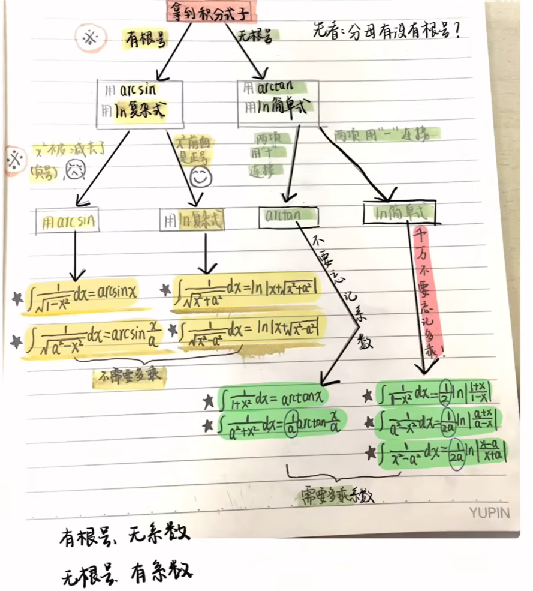

# 不定积分公式

## $a^2$与$x^2$组合的积分公式

### 公式

1.
$$
\int \sqrt { x ^ { 2 } \pm a ^ { 2 } } d x =  \pm \frac { a ^ { 2 } } { 2 } \ln ( x + \sqrt { x ^ { 2 } \pm a ^ { 2 } } ) + \frac { x } { 2 } \sqrt { x ^ { 2 } \pm a ^ { 2 } } + C \quad \text {(|x| > |a|)} \\

\begin{cases}

\int \sqrt { x ^ { 2 } + a ^ { 2 } } d x =  \frac { a ^ { 2 } } { 2 } \ln ( x + \sqrt { x ^ { 2 } + a ^ { 2 } } ) + \frac { x } { 2 } \sqrt { x ^ { 2 } + a ^ { 2 } } + C & \text {由于取和时，原绝对值内一定为正} \\
 & \text {，故绝对值可换为负号} \\
\int \sqrt { x ^ { 2 } - a ^ { 2 } } d x = - \frac { a ^ { 2 } } { 2 } \ln | x + \sqrt { x ^ { 2 } - a ^ { 2 } } | + \frac { x } { 2 } \sqrt { x ^ { 2 } - a ^ { 2 } } + C & \text {(|x| > |a|)}

\end{cases}
$$

2.
$$
\int \sqrt { a ^ { 2 } - x ^ { 2 } } d x = \frac { a ^ { 2 } } { 2 } \arcsin \frac { x } { a } + \frac { x } { 2 } \sqrt { a ^ { 2 } - x ^ { 2 } } + C \quad \text ( a \gt | x | )
$$

3.
$$
\int \frac { 1 } { \sqrt { x ^ { 2 } \pm a ^ { 2 } } } d x = \ln | x + \sqrt { x ^ { 2 } \pm a ^ { 2 } } | + C \quad ( | x | \gt | a | ) \\

\begin{cases}

\int \frac { 1 } { \sqrt { x ^ { 2 } + a ^ { 2 } } } d x = \ln ( x + \sqrt { x ^ { 2 } + a ^ { 2 } } ) + C & \text {由于取和时，原绝对值内一定为正} \\
 & \text {，故绝对值可换为负号} \\
\int \frac { 1 } { \sqrt { x ^ { 2 } - a ^ { 2 } } } d x = \ln | x + \sqrt { x ^ { 2 } - a ^ { 2 } } | + C &  {| x | \gt | a |}

\end{cases}
$$

4.
$$
\int \frac { 1 } { \sqrt { a ^ { 2 } - x ^ { 2 } } } d x = \arcsin \frac { x } { a } + C \quad ( a \gt 0 )
$$

5.
$$
\int \frac { 1 } { a ^ { 2 } + x ^ { 2 } } d x = \frac { 1 } { a } \arctan \frac { x } { a } + C \quad ( a \gt 0 )
$$

6.
$$
\begin {cases}

\int \frac { 1 } { x ^ { 2 } - a ^ { 2 } } d x = \frac { 1 } { 2 a } \ln | \frac { x - a } { x + a } | + C \\
\int \frac { 1 } { a ^ { 2 } - x ^ { 2 } } d x = \frac { 1 } { 2 a } \ln | \frac { a + x } { a - x } | + C

\end {cases}
$$

### tags

数学 考研 不定积分 公式

### 记忆

#### 来源

[不定积分公式记忆方法，再也不会混了！\_哔哩哔哩\_bilibili](https://www.bilibili.com/video/BV1LU4y1H7pa/?spm_id_from=333.788.recommend_more_video.3&vd_source=187217104dfd0bc027cc65f8420627b0)

>   内容：针对分式积分推导
>   结果：分2类4型：1.反三角 arcsinx和arctanx    2.对数 简单和复杂
>   规律：看分母有无根号
>   (1) 无根号时: 无根有系（指最终积分结果前有系数），简单正切（ 选择ln简单和arctanx这2种类型），加(+号)连(连接)就选择反正切函数，减连就杂（ln复杂式）
>   (2) 有根号时: 有根无系，复杂正弦 ( ln复杂和arcsinx），平方（x2）加（平方前+号）简（ln复杂式子），平方减弦
>
>   综合：无根有系，简单正切, 加连就切，减连就简
>            有根无系，复杂正弦, 平方加杂，平方减弦
>
>   ——来自评论

#### 口诀

##### 正文

若是翻身，根系相斥

无根有系，和弹差简

有根无系，加杂减弦

若不翻身，加半未自 

有根有系，加杂减弦

系数半方，正负看常

##### 注解

其中的加减都指的是$x ^ 2$前的符号，注意！！！

###### $\ln$简单式

$\ln | \frac { x - a } { x + a } | , \ln | \frac { a + x } { a - x } |$

其中，真数为方差的逆，而$\frac {1} {x^2 - a ^2}$，先写分母后写分子，刚好是+、-。

###### $\ln$复杂式

$\ln | x + \sqrt { x ^ { 2 } \pm a ^ { 2 } } |$

其中，真数为被积式子本身加上未知数

###### 若不翻身，加半位子

不翻身，占地面积增大，所以加位子 

##### 记忆

加牛杂的面

牛肉面

（无）折耳（根），（有）（细）盐，（和）面有（弹）性，（差）了（碱）

（有）折耳（根），（加）牛（杂），（减）（咸），折耳根味道大，压住了牛杂，也不用那么多盐

牛肉面

没折耳根，有细盐，加牛肉切片，减少碱，使面硬

有折耳根，一律加牛杂，减少咸味，盖住牛杂腥味

不翻身吃的多，折耳根和细盐都有，还吃了个场子
