# 考研

## 时间

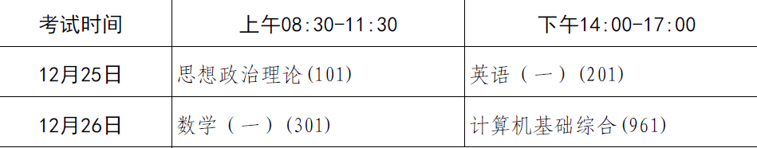

| 科目 | 分数 | 目标 | 时间规划(h) | 实际时间(h) |
| ---- | ---- | ---- | ----------- | ----------- |
| 思政 | 100  | 70   | 2           | 1.5         |
| 英语 | 100  | 80   | 1           | 1           |
| 数学 | 150  | 120  | 4           | 3.5         |
| 408  | 150  | 120  | 3           | 2.5         |
| 总   | 500  | 390  | 10          | 8.5         |

微信：政治、数学老师

[如何将Excel转换成Markdown表格 \- 知乎](https://zhuanlan.zhihu.com/p/59921839)

[Convert Excel to Markdown Table \- Table Convert Online](https://tableconvert.com/excel-to-markdown)

| 上课时间            | 节数     | 星期一                            | 星期二   | 星期三   | 星期四   | 星期五   | 星期六   | 星期日   |
| ------------------- | -------- | --------------------------------- | -------- | -------- | -------- | -------- | -------- | -------- |
| 8:00-8:45           | 第一节   | 高数                              | 更改规划 | 政治     | 政治     | 政治     | 政治     | 政治     |
| 8:50-9:35           |          | 高数                              | 高数     | 高数     | 高数     | 高数     | 高数     | 高数     |
| 9:55-10:40          | 第二节   | 高数                              | 高数     | 高数     | 高数     | 高数     | 高数     | 高数     |
| 10:45-11:30         |          | 高数                              | 高数     | 高数     | 高数     | 高数     | 高数     | 高数     |
| 11:35-13:25         | 午餐午休 |                                   |          |          |          |          |          |          |
| 13:30-14:15         | 第三节   | 高数做题                          | 高数     | 高数直播 | 高数     | 数据结构 | 高数直播 | 数据结构 |
| 14:15-15:05         |          |                                   |          | 高数直播 |          |          | 高数直播 |          |
| 15:20-16:05         | 第四节   | 操作系统                          | 操作系统 | 计组     | 操作系统 | 计组     | 操作系统 | 计组     |
| 16:10-16:55         |          |                                   |          |          |          |          |          |          |
| 17:10-17:55         | 第五节   | 锻炼                              | 锻炼     | 锻炼     | 锻炼     | 锻炼     | 锻炼     | 锻炼     |
| 18:00-18:45         |          |                                   |          |          |          |          |          |          |
| 18:50-19:20         | 晚餐     |                                   |          |          |          |          |          |          |
| 19:30-20:15         | 第六节   | 高数                              | 高数     | 高数     | 高数     | 高数     | 高数     | 高数     |
| 20:20-21:05         |          |                                   |          |          |          |          |          |          |
| 21:30-22:30         | 睡前阅读 | 操作系统                          | 操作系统 | 操作系统 | 操作系统 | 操作系统 | 操作系统 | 操作系统 |
| 日新增任务          |          |                                   |          |          |          |          |          |          |
| 周任务              |          | "1.整理学习思路，规划各科学习时间 |          |          |          |          |          |          |
| 2.保证各科学习时间" |          |                                   |          |          |          |          |          |          |

## 408

袁春风：紫皮书是数据通路那块比白皮书好

[考研王道、李永乐、武忠祥等教材兑换视频——PC倍速播放和快捷键控制指南 - 知乎 (zhihu.com)](https://zhuanlan.zhihu.com/p/389376188?ivk_sa=1024320u)

[看王道408视频的最佳实践(物理上) - 哔哩哔哩 (bilibili.com)](https://www.bilibili.com/read/cv16470164)

[23考研笔记: 自己备考过程中的一些笔记。资料啥的。 - Gitee.com](https://gitee.com/yishen_yishen/kaoyan_notes_23/tree/master/408/数据结构)

## 英语

## 政治

看完导学，看强化

上完课记得打卡

### 作业

真理观思维导图、认识论习题

社会结构论思道

## 数学

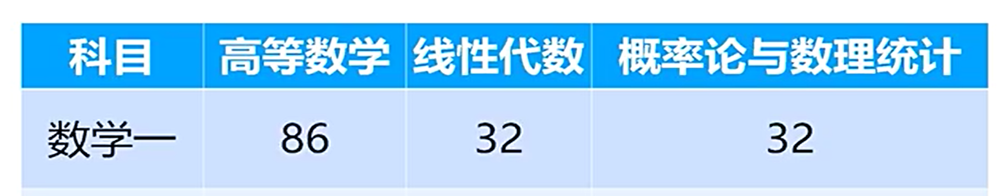

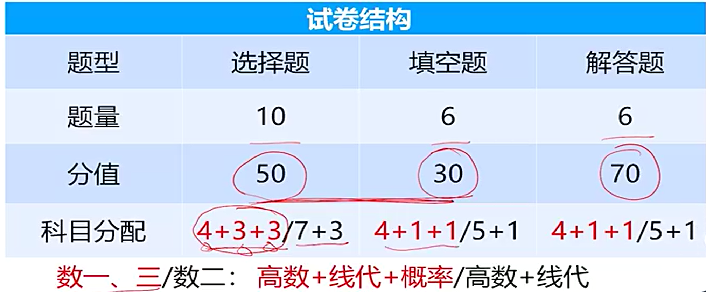

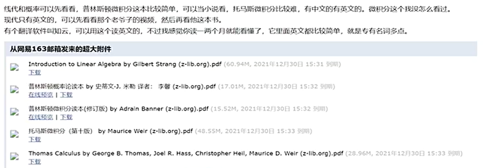

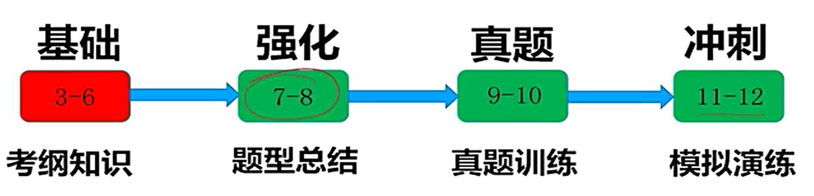

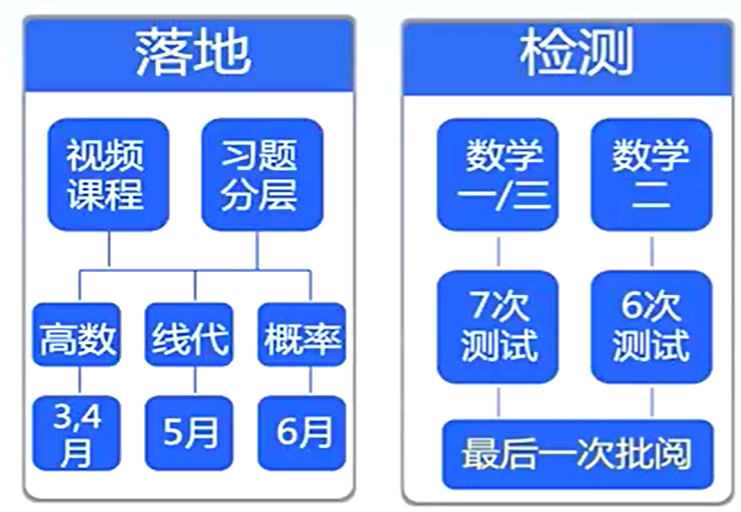

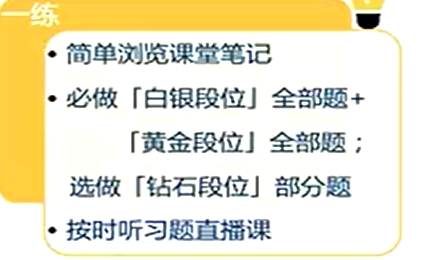

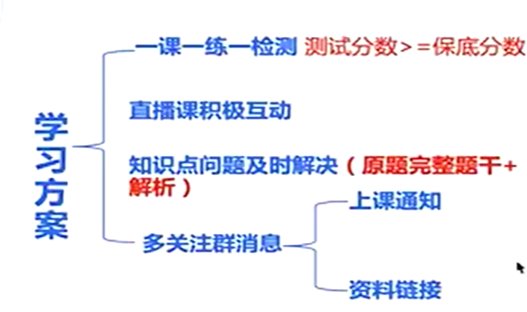

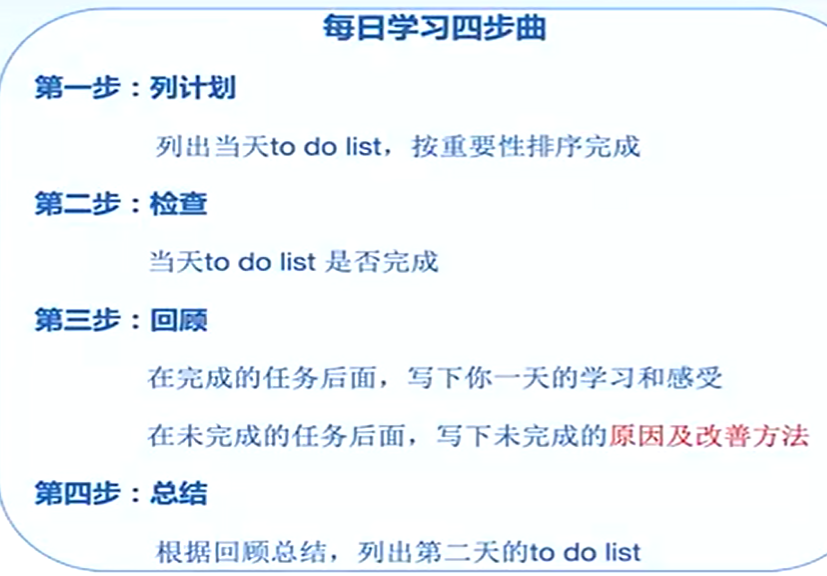

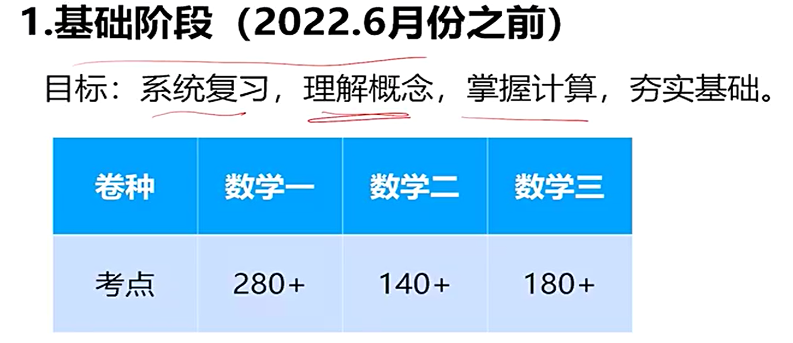

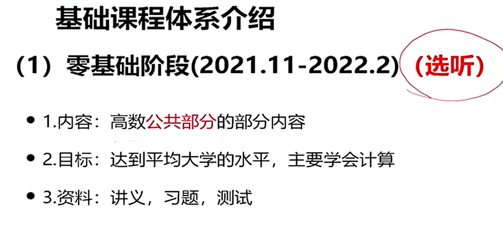

公共部分：不用补

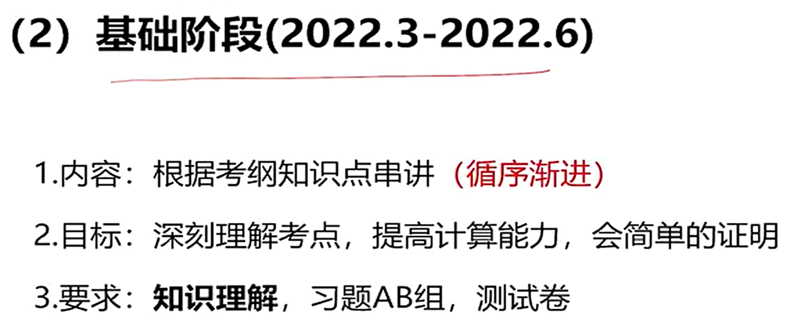

AB组,白银黄金段位

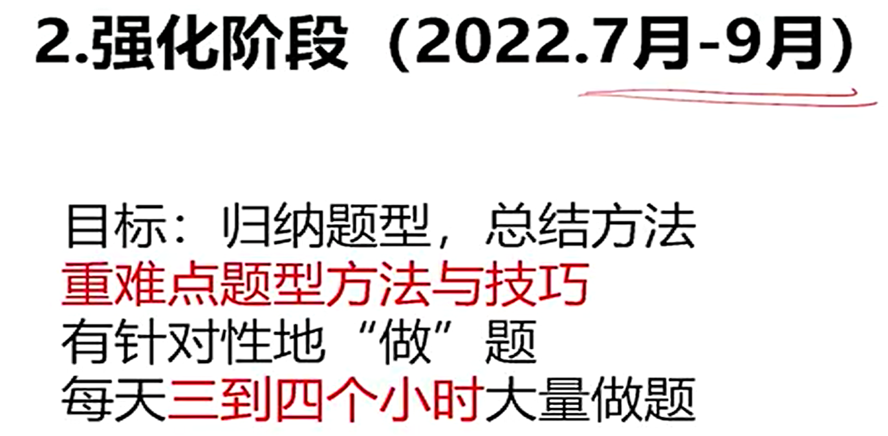

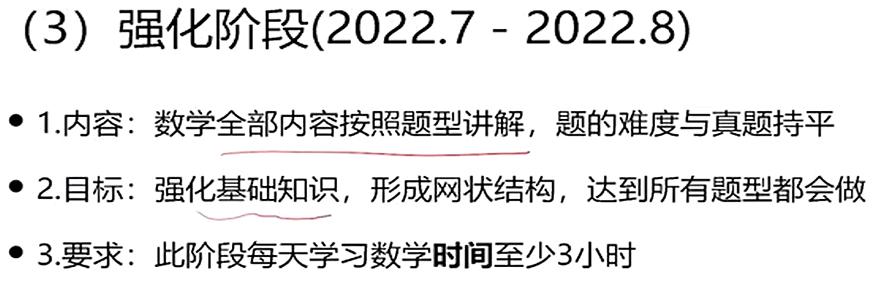

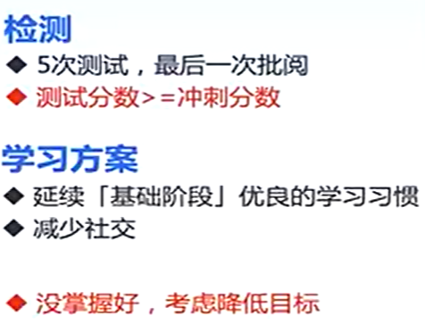

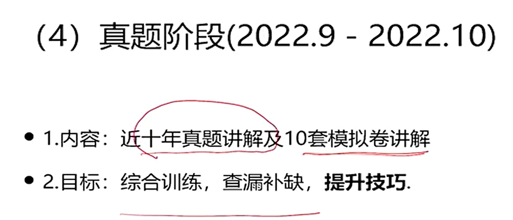

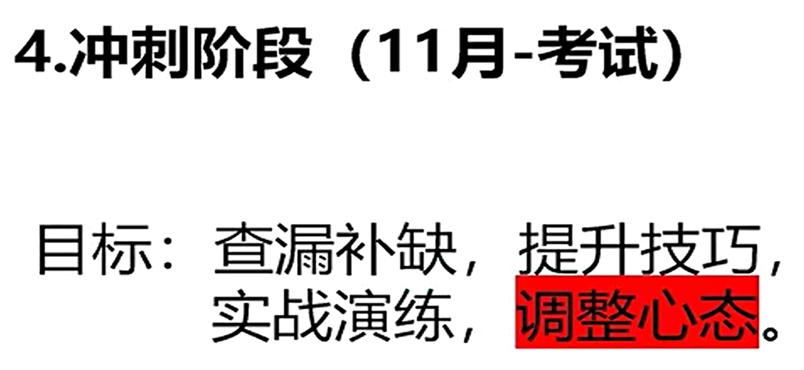

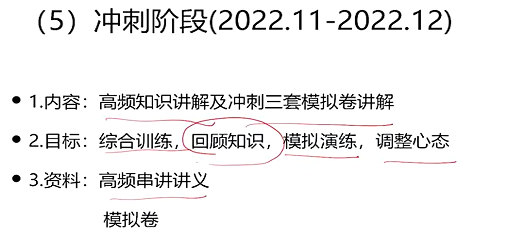

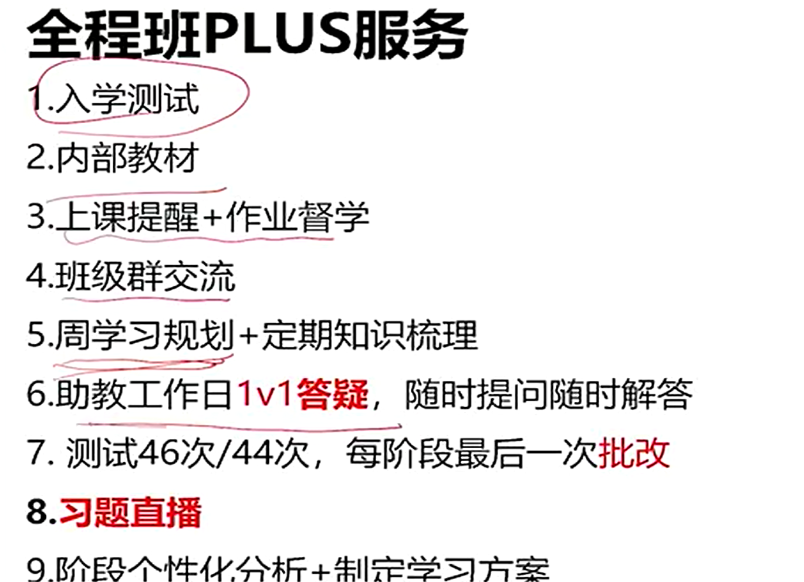

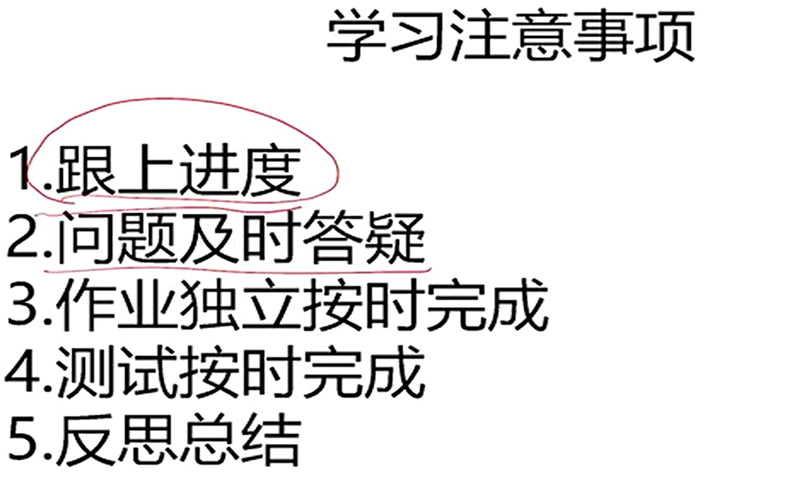

